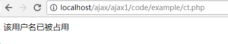
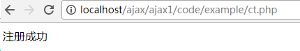
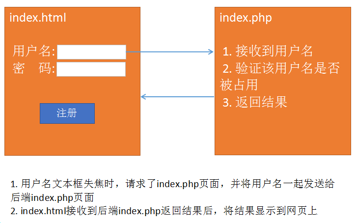

# Ajax技术 #

每日目标：

- 了解什么是Ajax
- 掌握创建XMLHttpRequest对象的方法
- 能够发送Ajax请求并接收到后端返回的数据
- 掌握POST请求和GET请求的区别
- 理解什么是GET缓存并解决缓存问题


## 1. 案例---新用户注册时用户名冲突问题 ##
###   1.1 传统模式解决方案 ###
1) 在注册页面中输入用户名和密码，点击“注册”时，要将表单数据提交给后台


2) 后台PHP页面，接收用户名和密码之后，要去验证用户名是否存在，如果存在则提示用户名存在，再跳转回注册页面，重新输入。

  当用户名存在时，提示用户名已被占用，再跳转回登录页



 当用户名不存在时，正常注册新用户




###   1.2 ajax解决方案 ###

当光标离开用户名文本框时，就已经验证了用户名是否存在，并给予提示了。

  用户名被占用： 


  用户名可用 :


###   1.3 两种模式对比 ###
 传统模式： 

  两个页面 ---  前端注册表单页（index.html）  和  后端数据验证页（index.php）

 

 Ajax模式 :

  两个页面 --- 前端注册表单页（index.html）  和  后端数据验证页（index.php）




  Ajax的优势：

    ajax就是在页面没有刷新或者没有跳转的情况下还能更新页面的某一部分数据


## 2.ajax快速入门 ##
###    2.1 ajax概述  ###
- Ajax:  Asynchronous  javascript  and  xml (异步javascript和xml)。

- **Ajax并不是一种新技术，而是已有技术的集合。JavaScript是核心载体**。
- Ajax优势：在不刷新页面的情况下，更新页面数据，提升用户体验。
- **Ajax就像一个小秘书**，能够实现**异步工作**。


###    2.2 发送Ajax请求 ###

####      2.2.1 ajax核心对象 --- XMLHttpRequest对象 ####

  历史：
	1999年诞生，微软在IE5中集成了XMLHttpRequest对象，但是并没有受到人们重视。
	2005年，google在gtalk即时聊天工具中使用了该对象，从此之后Ajax技术开始受到人们的重视

  创建XMLHTTPRequest对象要分为(低版本) IE和**非IE两种方式(主流)**：

   IE浏览器（IE7之前） :  

```js
var xhr = new ActiveXObject('Msxml2.XMLHTTP');
```

   非IE浏览器（chrome、firefox、safair、搜狗等，包括IE7+之后） (主流浏览器):

```js
var xhr = new XMLHttpRequest();
```

前端向后台发送请求有几种方式？*

> 1、 link标签的href属性
>
> 2、 script标签的src属性
>
> 3、 img标签的src属性
>
> 4、 ajax发送请求
>
> 5、 表单提交发送请求
>
> 6、 a标签的href发送请求
>
> 7、 iframe的src属性发送请求

案例：创建XMLhttpRequest对象，兼容IE7之前和主流浏览器

```js
//创建XMLHttpRequest对象，兼容低版本IE和非IE浏览器
function getXhr () {
    var xmlhttp;
    if (window.XMLHttpRequest) {
        //IE7+ 和 非IE 中都有 XMLHttpRequest对象
        xmlhttp = new XMLHttpRequest();
    } else {
    	//低版本IE浏览器 实例化方式
        xmlhttp = new ActiveXObject('Msxml2.XMLHTTP');
    }
    return xmlhttp;
}
```


####    2.2.2 核心方法

XMLHttpRequest

   XMLHttpRequest对象有了，可以发送Ajax请求了。发送请求需要两个方法:

   open(var1, var2, var3): 准备Ajax请求
     var1: 请求方式  get/post
     var2: 请求的后端程序地址
     var3: 异步(true)/同步(false)，可选参数，默认为true

~~~js
xhr.open('post', './uploadfile.php');
~~~

   示例: xhr.open(‘get’, ‘index.php’);   //准备以get方式请求后端的index.php文件

  send(var): 发送Ajax请求
     var: 分为两种情况。 如果是get请求，则填写null。 如果是post请求，则填写要发送到后端的数据。

   示例: xhr.send(null); 

####    2.2.3 发送请求案例

 在index.html页面上创建按钮，点击该按钮时使用get方式请求后端的index.php页面

 发送Ajax请求流程:

   1) 创建XMLHttpRequest对象

   2) 调用open方法准备ajax请求

   3) 调用send方法发送ajax请求


 代码实现

   1) 创建按钮，绑定点击事件

   2) 创建XMLHttpRequest对象

   3) 调用open方法准备ajax请求

​   4) 调用send方法发送ajax请求


访问结果:


###    2.3 接收后端响应结果 ###

####      2.3.1 核心属性 --- readyState ####

- jQuery的$.ajax方法响应数据类型有如下几种：xml、html、script、json、jsonp、text 
- 本质上原生ajax响应数据格式只有2种：**xml**和**text**，分别对应**xhr.responseText**和**xhr.responseXML** 
- Ajax的整个过程有5个状态，对应readyState的5个值：0-4

    《Pragmatic Ajax A Web 2.0 Primer 》 中对readyStae状态的介绍 

   0: (Uninitialized) the send( ) method has not yet been invoked.  

   1: (Loading) the send( ) method has been invoked, request in progress.  

   2: (Loaded) the send( ) method has completed, entire response received. 

   3: (Interactive) the response is being parsed. 

   4: (Completed) the response has been parsed, is ready for harvesting.  

   0 － （未初始化）还没有调用send()方法 

   1 － （载入）已调用send()方法，正在发送请求 

   2 － （载入完成）send()方法执行完成，已经接收到全部响应内容 

   3 － （交互）正在解析响应内容 

   4 － （完成）响应内容解析完成，可以在客户端调用了 


百度百科: 

  0 （未初始化） 	对象已建立，但是尚未初始化（尚未调用open方法）               
  1 （初始化）  	已调用send()方法，正在发送请求                      
  2 （发送数据） 	send方法调用完成，但是当前的状态及http头未知              
  3 （数据传送中）  已接收部分数据，因为响应及http头不全，这时通过responseBody和responseText获取部分数据会出现错误，
  4 （完成）   	数据接收完毕，此时可以通过通过responseBody和responseText获取完整的回应数据

 

**最核心的重点：   4 ,  后端返回的数据已经可以在浏览器中使用了。**


####      2.3.2  核心事件 --- onreadystatechange ####
```js
onreadystatechange事件:  readyState的值每次发生变化都会触发该事件。
    0-->1    1-->2    2-->3    3-->4 总共触发4次
```


####     2.3.3  其他重要属性

```js
 responseText：以字符串形式接收后端程序的返回值。

 以PHP为例: PHP程序最终会被解释程序一段字符串，responseText接收的就是这段字符串

 responseXML：以XML格式接收后端程序返回值
```


####      2.3.4 响应案例 --- index.php ####
```js
 index.php：返回字符串“Hello Ajax”给前端 --- 就是  echo "Hello Ajax"

 index.html： 将Hello Wrold 显示在页面的div中
```


 1) index.php 返回一个字符串（Hello Ajax！！）


 2) 在index.html中检测readyState的状态，当readyState状态等于4的时候，使用responseText来接收后端返回的数据

 


responseText本质是接收后端返回的字符串。


###   2.4 Ajax程序一般流程

  一般我们编写Ajax程序时需要两个页面，三大步骤:


#### 两个页面:

   前端静态html页面 (php页面也行)，用来发送ajax请求，将结果渲染到页面上

   后端php页面 (jsp、asp也行)，用来接收前端请求，处理数据，并将结果返回给前端页面

   jsp: Java Server Page

   asp: Active Server Page


#### 三大步骤:

  1) 前端静态页面发送ajax请求。

```js
1、创建 XMLHttpRequest 对象

2、调用open方法准备ajax请求

3、调用send方法发送ajax请求

4、调用onreadystatechange事件，判断readyState=4时，使用responseText接收后端返回数据		
```

  2) 后端php页面，处理请求并返回结果

  3) 前端页面接收结果，显示在网页指定位置


###   2.5 综合案例

 点击按钮，从student表中随机取出一条学生信息，显示在网页上。

 思路分析:
 1) 两个页面
   前端静态页面: student/index.html
   后端php页面: student/index.php

 


2) 三大步骤
① index.html 页面设置一个按钮，用来触发ajax请求
② index.php 随机取出一条学生数据，并返回给index.html页面

~~~mysql
$sql = "select * from student order by rand() limit 0,1";
// 随机排序  order by rand()
// 条件约束只从表第o位取一行信息
~~~

③ index.html 接收到后显示在页面上

 代码实现:

① index.html 页面设置一个按钮，用来触发ajax请求


② index.php 随机取出一条学生数据，并返回给index.html页面


③ index.html 接收到后显示在页面上


 关键点总结:

1) index.html 通过点击事件发送ajax请求
 ① 创建XMLHttpRequest对象
 ② 调用open方法准备ajax请求
 ③ 调用send方法发送ajax请求


**此时不要着急将数据渲染到网页上**。

 2) index.php 随机取出一条学生数据，并返回给index.html页面
  ① mysqli操作MySQL服务器的6步骤
  ② 核心SQL:  select * from student order by rand() limit 0,1 
  ③ 将结果拼接成字符串再输出，因为前端是以字符串形式接收的

 3) index.html接收到后显示在页面上
  ① 创建一个div标签，用来显示接收到数据
  ② 获取div对象，再将数据显示到该标签中


## 3. POST和GET ##

~~~php
a标签   location.href   header('refresh:2;url=eidt.php?sno=' . $sno);
~~~

###    3.1 GET方式实现新用户注册---用户名检测 ###
 思路分析:


 步骤:

1. get.html

   1) 在用户名文本框上绑定失焦事件(onblur)
   2) 失焦事件函数
        ① 获取用户名文本框内已填写的用户名

  ​          ② 发送ajax请求，并将已填写的用户名一起发送给后端php页面


2. get.php

    1) 接收前端发送过来的用户名
    2) 拼接SQL语句
    3) 链接MySQL服务器并执行SQL语句 -->  空(0条数据，用户名可用)   一维数组(1条数据，用户名被占用)
    4) 将结果返回给前端。 返回1 或者 2


3. get.html

    接收后端返回的数据，判断是1还是2。

    如果等于1，则提示用户名可用；如果等于2，提示用户名被占用


代码实现:

1. get.html

   1) 在用户名文本框上绑定失焦事件(onblur)
   2) 失焦事件函数
        ① 获取用户名文本框内已填写的用户名
        ② 发送ajax请求，并将已填写的用户名一起发送给后端php页面


2. get.php

   1) 接收前端发送过来的用户名
   2) 模拟用户被占用的情况
   3) 将结果返回给前端（1用户名可用   2用户名被占用）


3. get.html

    1) 接收后端返回的数据，判断是1还是2。

    2) 如果等于1，则提示用户名可用；如果等于2，提示用户名被占用


关键点总结:

1. 用户名文本框绑定失焦事件

2. 发送ajax请求基本属于流程化操作

   1) 实例化XMLHttpRequest对象
   2) 调用open方法准备请求，**get方式发送将数据拼接在url地址之后即可**
    ~~~	
   3) 调用send方法发送请求，**get方式只需要将 null  作为参数传入即可**
   4) 调用onreadystatechange事件，在readyState=4时使用responseText接收返回值。此步使用alert或者console.log先输出接收的结果即可，**不要着急将结果显示在网页上**。
    ~~~

3. 创建后端php程序，接收用户名进行验证

   核心SQL:  select * from ali_admin where admin_email = '$name';

   该SQL语句的执行结果只可能是两种： 0条数据    1条数据(因为admin_email字段唯一)

     0条数据: 说明没有该用户名 （没有被占用）

     1条数据: 说明已存在该用户名 （已被占用）

   根据SQL执行结果返回1或者2，1代表未被占用，2代表已被占用

4. 修改get.html文件，将结果显示在网页上

    获取用来显示结果的span标签，判断接收的结果为1还是2。如果为1，则将用户名可用写入span标签；反之，则将用户名已被占用写入span标签


###    3.2 POST方式实现新用户注册---用户名检测 ###
post和get两种方式的整体思路一致，只是细节上有所差别

 1) 使用open准备请求时，参数1需要设置为post，参数2只需要设置后端程序地址。
 2) 将需要传递到后端的数据拼接成一个独立的字符串，字符串的格式为
 **var str = ‘key=value&key=value&....’;**    （内部结构跟get传参时的结构一致）

 3) 调用setRequestHeader方法将数据格式转为 application/x-www-form-urlencoded
 4) 将拼接好的数据字符串作为参数传入send方法
 5) 后端的php程序需要使用 $_POST来接收数据


get和post的区别:


关键点总结:
 1) 发送程序时，参数1设置为post，参数2只用设置请求的后端文件路径
​    xhr.open('post', 'post.php');
 2) 将需要传递到后端的数据拼接成一个独立的字符串
​    var str = 'name='+name; 
 3) 调用setRequestHeader方法将数据格式转为 application/x-www-form-urlencoded
​    xhr.setRequestHeader('content-type', 'application/x-www-form-urlencoded');
 4) 发送请求时，要将之前拼接好的字符串作为参数放入send方法中
​    xhr.send(str);


## 4. GET缓存 ##
###    4.1 什么是缓存？ ###
   浏览器的请求需要从服务器获得许多 css、img、js 等相关的文件，如果每次请求都把相关的资源文件加载一次，对 带宽、服务器资源、用户等待时间 都有严重的损耗。如果浏览器将css、img、js等文件在第一次请求成功后就保存在本机上，以后的每次请求就在本机获得相关的资源文件，那么就可以明显地加快用户的访问速度，同时可以节省各种资源(带宽、服务器资源、用户等待时间)。


###   4.2 GET缓存测试 ###
 ajax方式，get会有缓存问题。post没有缓存问题

 案例:
   index.html页面中创建一个按钮，点击该按钮时发送ajax请求，得到后端php程序返回的当前时间戳并显示。


1. index.html


2. getTime.php --- 输出当前时间戳即可。

  


使用IE访问结果:

  


永远弹出的都是一个时间戳，说明已经被缓存了。


###   4.3 解决方法 ###
 解决方法有两种:
  1) 前端方案:  在open准备ajax请求时，为请求的地址增加随机后缀。相当于每次请求都是新的地址

  2) 后端方案:  后端程序设置不允许缓存的头信息，php程序固定使用如下3句即可。
    header('cache-controller:no-cache');
    header('Pragam:no-cache');
    header('Expires:-1');

1) 前端方案:

​     随机后缀一般是 随机数或者时间戳


2) 后端解决方案:

```php
header('cache-controller:no-cache');
header('Pragam:no-cache');
header('Expires:-1');
```


​	

## 5. 同步和异步 ##

###  5.1 同步/异步概念

  同步: ==顺序执行==  第一步---> 第二步 ---> 第三步 ....

  异步:  甲在完成一系列工作时，自己完成主工作。将一些分支工作交给乙，甲此时一直在完成自己的工作，并等待乙完成的结果。乙完成后将结果返回给甲。


### 5.2 案例

  同时显示图片和弹出框

~~~php+HTML
<body>
    <script src="../AJax-1/student/Xhr.js"></script>
    <script>
        var xhr = getXhr();
        xhr.onreadystatechange = function () {
            if (xhr.readyState == 4) {
                alert(xhr.responseText);
            }
        }
        xhr.open('get', './cache.php', false);  // false 表示同步
        xhr.send();
    </script>
    
</body>
~~~


当参数3为 false时，执行同步。 ajax请求会等待后端返回的数据，等拿到数据之后，才开始渲染1.png图片

当参数3为 true时，执行异步。ajax发送请求之后，浏览器会继续执行，先渲染1.png图片，当ajax接收到后端返回数据时再弹出时间戳。


## 6. XMLHttpRequest2.0新特性

### 2.1 timeout 和 ontimeout

timeout： 请求超时设置。属性，用来设置等待响应时长，如果超过指定时长，则会结束本次请求，并触发ontimeout事件

```
xhr.timeout = 3000;    // 设置等待时长为3秒
```

  ontimeout： 事件，用来设置超过等待时长后的动作

```
xhr.ontimeout = function () {
	alert('请求超时');
}
```

在创建xhr对象之后，来设置timeout属性；如果设置了timeout属性，那么就建议设置ontimeout事件。

~~~php+HTML
<body>
    <script src="../AJax-1/student/Xhr.js"></script>
    <script>
        var xhr = getXhr();
        xhr.timeout = 3000;
        xhr.ontimeout = function () {
            alert('请求超时！');
        }
        xhr.onreadystatechange = function () {
            if (xhr.readyState == 4 && xhr.status == 200) {
                alert(xhr.responseText);
            }
        }
        xhr.open('get', './cache.php');
        xhr.send();
    </script>
    
</body>
~~~

index.html 发送Ajax请求

   此处设置了 等待响应的时间， 并且设置了未接到响应的处理方式


index.php


###  2.1 问题

1、信息验证： 如果遇到有很多input框的问题，可以用事件委托给所有的表单添加onblur事件吗？ 还是把要把这段验证代码封装起来，而且对应的php页面又该怎么修改？

如果是每个input框都再新建一个php或者再写一段代码，那岂不是代码量很大？

答案：用内置对象formData对象


## 7、FormData表单对象

小案例:  点击button按钮时，将表单的用户名和密码值通过ajax发送到后端php页面

DOM+Ajax方式：

表单中： form标签和input标签中的name都没用了。

​                submit按钮改为button


发送请求时需要将用户名和密码拼接到地址之后


缺点：  当表单域太多时，获取表单域的数据和拼接传递数据的字符串都会变得很麻烦。

FormData对象优势就是能够一次性将表单中的所有数据全部取出，包括文件域的文件对象。

1) 创建表单 
    ① 必须有form标签， method和action不重要
    ② 每个表单域需要设置name值


 2)发送ajax请求

① 将表单数据取出 --- FormData 
i.获取form表单对象: var fm = document.getElementById(‘mainForm’);  //DOM对象
ii.实例化FormData对象:  var fd = new FormData(fm);

```
② 发送ajax请求
```

   使用FormData对象以后，必须使用post方式来发送ajax请求。
   将FormData对象，作为参数传入 send方法中  xhr.send(fd);

​    ③ 使用FormData对象提交表单时，不需要设置 setRequestHeader方法


3) 在formdata.php页面，使用`$_POST`接收数据，文件数据要用`$_FILES`


注意点: 

> ① form标签要给id值，方便获取form标签的DOM对象

> ② 每个域都要给 name值

> ③ 提交按钮必须用 button 不能用submit，因为submit有跳转功能

> ④ 使用formdata对象时，先获取form的DOM对象，再实例化FormData，并将form的DOM对象作为参数传入

> ⑤ 必须使用post方式来发送Ajax请求

> ⑥ 需要将fd对象作为参数传入send

问题：提交过去的数据，用print_r($_post),php页面显示的是空数组Array ( ) Array ( ) 

html获取的返回的数据则是一个字符串，需要用json来转换

~~~js
<body>
    <form id="forminfo">
        用户名：<input type="text" name="username"><br>
        密码：  <input type="text" name="userpwd"><br>
        年龄：  <input type="text" name="userage"><br>
        上传文件：<input type="file" name="userpic"><br>
        <input type="button" value="提交" id="btn">
    </form>
	// 输出之后为字符串
    <div class="box">
        Array
            (
            [username] => QWE
            [userpwd] => 123456
            [userage] => 23
            )
            Array
            (
            [userpic] => Array
            (
            [name] => 
            [type] => 
            [tmp_name] => 
            [error] => 4
            [size] => 0
            )
        )
	</div>
    <script>
        var box = document.querySelector('.box');
        document.getElementById('btn').onclick = function () {
            var fm = document.getElementById('forminfo');
            var fd = new FormData(fm);
            var xhr = new XMLHttpRequest();
            xhr.onreadystatechange = function () {
                if(xhr.readyState == 4) {
                    box.innerText = xhr.responseText;
    / 接收响应的内容是字符串：xhr.responseText[0]是A【Array的首字母】
                }
            }
            xhr.open('post', 'formdata.php');
            xhr.send(fd);
        }
    </script>
</body>
~~~

响应的结果可以在这里看到


formdata.php页面

~~~php
<?php
    print_r($_POST);
    print_r($_FILES);
?>
~~~


## 8、文件上传进度条案例

1) 完成Ajax文件上传

核心: Ajax方式上传文件必须使用FormData对象

**提示**：一般上传大文件效果明显，20M以下基本看不出效果。

  关键点:  
    ① 表单使用提交按钮，一定是button
    ② 获取文件对象 ---- FormData
        i. 根据id获取form表单对象 ---- DOM
        ii. 实例化 FormData对象，将表单对象作为参数传入
        iii. 因为使用了FormData，所以一定要用post方式发送请求，将fd作为参数传入send方法

~~~js
<body>
<span id="pro-text"></span>
<div id="outer" style="width: 300px; height: 30px; border: 1px red solid">
    <div id="jdt" style="height: 30px; background-color: red; width: 0px"></div>
</div>
<form id="form">
选择文件: <input type="file" name="pic">
<input id="btn" type="button" value="上传">
</form>
<script type="text/javascript">
//1. 按钮上注册点击事件
//2. 事件函数
//  1) 获取文件对象 --- FormData
//    ① 获取form标签的DOM对象
//    ② 实例化FormData对象，并将form的DOM对象传入
//  2) 发送Ajax请求并将文件对象一起发送给后端
//    ① 创建xhr对象
//    ② 调用open方法
//    ③ 调用send方法
document.getElementById('btn').onclick = function () {
    //1) 获取文件对象 --- FormData
    var fm = document.getElementById('form');
    var fd = new FormData(fm);

    //2) 发送Ajax请求并将文件对象一起发送给后端
    var xhr = new XMLHttpRequest();
    xhr.onreadystatechange = function () {
        if (xhr.readyState == 4) {
            if (xhr.responseText == 1) {
                alert('上传成功');
            } else {
                alert('上传失败');
            }
        }
    }
    //console.log(xhr);
    //获取进度条对象
    var jdt_obj = document.getElementById('jdt');
    var span = document.querySelector('#pro-text');
    //重新绘制进度条的宽度
    xhr.upload.onprogress = function (evt) {
        //console.log(evt.loaded / evt.total); //0.347164736347364
        var percent = parseInt((evt.loaded / evt.total) * 100);
        jdt_obj.style.width = percent + '%';
        span.innerText = percent + '%';
    }
    xhr.open('post', 'upload.php');
    xhr.send(fd);
}
</script>
</body>

~~~

2) 调整PHP配置文件（php.ini），能够支持大文件上传

 ① PHP配置文件中的两个配置项
     **post_max_size**: 设置post表单能够上传数据的最大值
     **upload_max_filesize**:  设置能够上传文件的最大值
 ② **重启apache**

3) 编写进度条

   ① 设置进度条所需的div
   ② 文件上传的核心事件  **xhr.upload.onprogress**
	onprogress事件大约每100ms触发一次，该事件对象中有 loaded和total两个重要属性
        loaded：已上传文件大小
        total：文件总大小
   ③ 计算上传进度，修改进度条样式

~~~js
//获取进度条对象
  var jdt_obj = document.getElementById('jdt');
  var span = document.querySelector('#pro-text');
//重新绘制进度条的宽度
  xhr.upload.onprogress = function (evt) {
      //console.log(evt.loaded / evt.total); //0.347164736347364
      var percent = parseInt((evt.loaded / evt.total) * 100);
      jdt_obj.style.width = percent + '%';
      span.innerText = percent + '%';
  }
~~~

代码实现:

 1) 完成Ajax文件上传     -----   FormData
    静态文件(upload.html) ----  文件上传表单

​       ① 表单 


​      ② 获取文件对象，发送ajax请求并将文件对象一起发送给后端


​      ③ 创建upload.php文件  --- 将上传文件从临时路径移动到目标路径


 2) 调整PHP配置文件，能够支持大文件上传  --- php.ini

   ① 调整表单可以上传的总数据大小


   ② 调整允许上传的单个文件最大大小


③ 重启apache


 3) 编写进度条

 ① 使用两个div来制作进度条


外层的div是 进度条的边框

内层才是真正的进度条，该进度条的宽会随着文件上传的大小而改变

② 通过onprogress事件的 **loaded** 和 **total**可以计算上传百分比，再* 300 就是进度条的宽度

xhr.upload.onprogress:  大约每100ms执行一次，该事件对象中有 loaded和total两个属性


## 9、 JSON

### 1 、什么是JSON？

JSON:  JavaScript Object Notation 是一种**轻量级数据交互格式**。 

数据交互: 每一种语言的编码都不一样，它们之间互不认识。但是现在的情况是不同的语言开发出的系统也需要进行数据交互，这时候就需要一种大家都认识的语言或者技术来实现。

重量级 ：XML、 数据库

### 2、 JSON数据的声明和使用

声明:  var json_obj = {"key1":"value1", "key2":"value2", ...};
key: **双引号包含的字符串（单引号不行）**
value: 数据--数值型、字符串、数组、json

~~~js
<script type="text/javascript">
var json = {"name":"zs", "age":20};
alert(json.name + json.age); // zs20
var obj = {name:"zs", age:20};
alert(obj.name + obj.age); // zs20

var json = {
    "team":"IG",
    "num": 5,
    "member": ['上', '中', '下', '野', '辅'],
    "ceo": {"name":"王思聪", "age":38, "gender":"男"}
}
alert(json.member[1]) // 中
alert(json.ceo.age); // 38

//数组，内部每个单元都是json
var arr = [
    {"name":"zs", "age":20},
    {"name":"ls", "age":21},
    {"name":"ww", "age":25}
];
alert(arr[1].name); //ls

//在声明和调用时都正常，但是别用
var json = {'a':"hello", 'b':'world'};
alert(json.a + json.b);  // helloworld
</script>
~~~


JSON的本质:  JSON 是 JS 对象的字符串表示法，它使用文本表示一个 JS 对象的信息，本质是一个字符串。

~~~json
var obj = {a:"hello", b:"world"};       //  js对象
var obj = {"a":"hello", "b":"world"};  // json格式的js对象，也可以叫json对象 (JSON才是真正的JSON对象)
var str = '{"a":"hello", "b":"world"}';   // json，也叫json格式的字符串
必须外层单引号，内层双引
~~~

var str = "{'a':'Hello', 'b':'world'}";  //错误，不能这样写，会影响到其他程序的执行
var str = {'a':"Hello", 'b':"world"};  alert(str.a);  //虽然声明和调用都没问题，但是别用，因为在大段的程序中可能会发生数据转换错误。


### 3、PHP中json与对象或数组互转

 php提供了函数： **json_encode($arr) ** ==> json字符串

​                                **json  dncode($str)**   ==>  json数组

#### PHP数组转JSON格式的字符串

案例1: 索引数组转JSON  --->  数组字符串

~~~~json
//索引数组
$arr = ['aaa', 'bbb', 'ccc'];
//使用json_encode将索引数组转为数组字符串
echo json_encode($arr);  // '["aaa", "bbb", "ccc"]'
~~~~

案例2: 关联数组转 JSON  --->  json’对象字符串‘

~~~json
//关联数组
$info = ["name"=>"于谦", "age"=>60, "hobby"=>"抽烟、喝酒、烫头"];
//使用json_encode将关联数组转为 json字符串
echo json_encode($info); // '{"name":"于谦", "age":60, "hobby":"抽烟、喝酒、烫头"}'
~~~

案例3: 二维数组转JSON  --->  一维数组，每个单元都是一个json对象

~~~json
//二维数组
$list = [
    0=>["name"=>"于谦", "age"=>60, "hobby"=>"抽烟、喝酒、烫头"],
    1=>["name"=>"老郭", "age"=>50, "hobby"=>"调戏柳岩"]
];
echo json_encode($list);
//'[{"name":"于谦", "age":60, "hobby":"抽烟、喝酒、烫头"}, {"name":"老郭", "age":50, "hobby":"调戏柳岩"}]'
~~~

### 4、JS中json与对象或数组互转

JSON字符串转JSON对象 --- javascript代码

前端的ajax请求，最后接收到的都是字符串 --- responseText，以字符串形式接收后端返回的数据

~~~js
var a = '[{"id":10001,"name":"zs","age":20},{"id":10002,"name":"ls","age":21},{"id":10003,"name":"ww","age":19}]'
~~~

json格式的字符串转为json对象:  **JSON.parse(json_str);** 

json格式的数组、对象转为json对象:  **JSON.stingify(json_arr);** 

参数: json格式的字符串

~~~json
/**
 * JSON.parse(var)
 * 将json字符串转为json对象
 * var能够使用 数组字符串  json字符串   数组，内部是json对象的字符串
 */
var str = '["aaa","bbb","ccc"]';  //数组字符串
console.log(JSON.parse(str));  //转化之后为：数组["aaa","bbb","ccc"]

var json = '{"name":"\u4e8e\u8c26","age":60,"hobby":"\u62bd\u70df\u3001\u559d\u9152\u3001\u70eb\u5934"}';
console.log(JSON.parse(json));   //json字符串转化之后为对象{name: "于谦", age: 60, hobby: "抽烟、喝酒、烫头"}

var arr_str = '[{"name":"\u4e8e\u8c26","age":60,"hobby":"\u62bd\u70df\u3001\u559d\u9152\u3001\u70eb\u5934"},{"name":"\u8001\u90ed","age":50,"hobby":"\u8c03\u620f\u67f3\u5ca9"}]';  //数组，内部是json对象的字符串
console.log(JSON.parse(arr_str));  
// 转化之后为(2) 
// [
//  {name: "于谦", age: 60, hobby: "抽烟、喝酒、烫头"},
//  {name: "老郭", age: 50, hobby: "调戏柳岩"}
// ];
~~~


### 5、案例 --- 搜索用户名，显示用户列表信息

 思路:
1) 创建一个搜索页面，定义好搜索框，表头。在搜索按钮上绑定点击事件。
2) 点击事件能够发送ajax请求，并将用户名文本框中的内容一起发送到后端php程序
3) 后端php程序接收用户名，链接MySQL进行模糊查询，再将数组返回给前端
4) 前端接收到后端php返回值之后，循环显示出来


代码实现 : 

1) 创建一个搜索页面，定义好搜索框，表头。在搜索按钮上绑定点击事件。

2) 点击事件能够发送ajax请求，并将用户名文本框中的内容一起发送到后端php程序

在搜索按钮上绑定点击事件 --- 获取文本框中的用户名，发送ajax请求

3) 后端php程序接收用户名，链接MySQL进行模糊查询，再将数组返回给前端

4) 前端接收到后端php返回值之后，循环显示出来

html页面

1. 1)  设置搜索表单 和  表格

   2)  搜索按钮上绑定点击事件，获取关键词并发送Ajax请求


~~~php+HTML

    <style>
        .box {
                width: 260px;
                height: 40px;
            }   
            form {
                display: block;
                font-size: 0;
            }
            form input {
                height: 30px;
            }
            form input:first-child {
                width: 200px;
            }   
            form input:last-child {
                height: 36px;
                border: none;
                vertical-align: top;
            }   
            .datable table {
                width: 600px;
                border: 1px solid black;
                border-collapse: collapse;
            }   
            .datable td,
            .datable th {
                border: 1px solid black;
            }
        </style>
<body>
    <div class="box">
        <form id="searchbox">
            <input id="searchtext" type="text">
            <input id='btn' type="button" value="搜索">
        </form>

        <div class="datable">
            <table>
                <thead>
                    <tr>
                        <th>id</th>
                        <th>姓名</th>
                        <th>年龄</th>
                        <th>性别</th>
                        <th>邮箱</th>
                        <th>密码</th>
                        <th>手机</th>
                    </tr>
                </thead>
                <tbody id="tb">
                </tbody>
            </table>
        </div>
    </div>
    <script src="../Xhr.js"></script>
    <script type="text/javascript">
        document.getElementById('btn').onclick = function () {
            var xhr = getXhr();
            var key = document.getElementById('searchtext').value;
            if( key.trim() == '') {
                return false;
            }
            xhr.onreadystatechange = function () {
                if (xhr.readyState == 4 && xhr.status == 200) {
                    var arr = JSON.parse(xhr.responseText);
                    // 遍历传回来之后json转化的数组，拼接字符串，添加进tbody中
                    var str = '';
                    arr.forEach(function (item , index) {
                        str += '<tr> '+ 
                            '<td>'+ item.sno +'</td>'+
                            '<td>'+ item.sname +'</td>'+
                            '<td>'+ item.sage +'</td>'+
                            '<td>'+ item.sgender +'</td>'+
                            '<td>'+ item.semail +'</td>'+
                            '<td>'+ item.spwd +'</td>'+
                            '<td>'+ item.stel +'</td>'+
                            '</tr>'; 
                        document.getElementById('tb').innerHTML = str;
                    });
                }
            }
            // 将获取表单的value提交给后台页面
            xhr.open('get', './searchdb2.php?key=' + key + '&_=' + Math.random());
            xhr.send();
        }
    </script>
</body>

~~~

php页面

1. search.php

   1) 接收关键词

   2) 拼接SQL语句

   3) 链接MySQL服务器并执行SQL语句

   4) 将查询结果返回给前端


~~~php
<?php
   // 获得前端传输来的数据
   $key =  $_GET['key'];
   // 编写MySQL语句
   $str = "select * from student where semail like '%$key%'";
   // 链接数据库，设置字符集，执行语句获得结果
   $conn = mysqli_connect('localhost', 'root', 'root', 'study');
   mysqli_query($conn, 'set names utf8');
   $result = mysqli_query($conn, $str);
   // 结果是一个二维数组，所以需要循环接收到一个数组里
   $arr = [];
   while($row = mysqli_fetch_assoc($result)) {
       $arr[] = $row;
   }
   echo json_encode($arr);
?>
~~~

1. search.html

   1) 接收后端返回结果

   2) 将结果拼接成tr-td的字符串，并写回tbody标签中


## 10、jQuery提供的Ajax方法

 jQuery提供了4个ajax方法:  `$.get()  $.post()  $.ajax()  $.getJSON()`

 前三个常用

### 1、$.get     

 $.get(var1, var2, var3, var4);
  参数1: 请求的后端程序的地址
  参数2: 要发送到后端程序的数据，json对象/js对象（推荐）或者 字符串
  参数3: 当readyState==4时的回调函数，该函数中有一个参数，就是后端程序返回的数据
  参数4: 设置返回数据的类型:  text(默认)  、json  、 xml等


案例1 在get.html文件中发送一个ajax请求，去请求后端的getData.php页面，同时将id=1数据发送给后端

原生js写法：


使用$.get方法：


案例2 使用$.get改造用户名搜索案例

~~~~json
<body>
    <div class="box">
        <form id="searchbox">
            <input id="searchtext" type="text">
            <input id='btn' type="button" value="搜索">
        </form>
        <div class="datable">
            <table>
                <thead>
                    <tr>
                        <th>id</th>
                        <th>姓名</th>
                        <th>年龄</th>
                        <th>性别</th>
                        <th>邮箱</th>
                        <th>密码</th>
                        <th>手机</th>
                    </tr>
                </thead>
                <tbody id="tb">
                </tbody>
            </table>
        </div>
    </div>
    <script src="./jquery-1.8.3.min.js"></script>
    <script src="./Xhr.js"></script>
    <script>
        $('#btn').click(function () {
            var key = $('#searchtext').val();
            if( key.trim() == '') {
                return false;
            }
            $.get('./get.php', {'key': key}, function (data) {
                console.log(data);
                var str = '';
                data.forEach(function (item) {
                    str += '<tr>'+ 
                           '<td>'+ item.sno +'</td>'+
                           '<td>'+ item.sname +'</td>'+
                           '<td>'+ item.sage +'</td>'+
                           '<td>'+ item.sgender +'</td>'+
                           '<td>'+ item.semail +'</td>'+
                           '<td>'+ item.spwd +'</td>'+
                           '<td>'+ item.stel +'</td>'+
                           '</tr>';                  
                })
                $('#tb').html(str);
            }, 'json');         
        })
    </script>
</body>
~~~~


### 2、$.post

`$.post`函数的用法和`$.get`一模一样，只是发送请求方式变为post

 $.post(var1, var2, var3 , var4);    //最标准的写法
  参数1: 请求的后端程序的地址
  参数2: 要发送到后端程序的数据，json对象/js对象（推荐） 或者 字符串
  参数3: 当readyState=4时的回调函数，该函数中有一个参数，就是后端程序返回的数据
  参数4: 设置返回数据的类型:  text(默认)  json     xml


案例: 在post.html文件中发送一个ajax请求，去请求后端的postData.php页面，同时将id=1数据发送给后端


### 3、案例 --- 搜索框下拉列表

.png)


数据表设计:

.png)

key_id: 主键

key_name: 关键词


 思路分析:

1. index.html  ---  在搜索框上绑定keyup事件，获取搜索框内容并发送ajax请求

   1) 在搜索文本框上绑定键盘弹起事件

   2) 事件函数

      ① 获取搜索框内容

      ② 发送ajax请求

1. getKeys.php ---  接收关键词，并根据关键词从数据表中查出相关的其他关键词，返回给前端

   1) 接收关键词

   2) 编写SQL语句 --- 模糊查询

   3) 链接MySQL服务器并执行SQL语句

   4) 将查询结果返回给前端

1. index.html --- 将接收到关键词循环显示到下拉列表（tips）中

   1) 制作下拉列表

   2) 将后端返回的每条关键词都填充到下拉列表中，并注册相关的 鼠标进入、离开、点击事件

   3) 完善下拉列表

     ① 在循环向下拉菜单添加数据之前要情况下拉菜单中已有的数据

     ② 文本框限制不能有空格关键词，关键词长度大于0才能触发ajax请求

     ③  当关键词为空时，隐藏下拉菜单

   

代码实现:

1. index.html  ---  在搜索框上绑定keyup事件，获取搜索框内容并发送ajax请求


1. getKeys.php ---  接收关键词，并根据关键词从数据表中查出相关的其他关键词，返回给前端


1、index.html --- 将接收到关键词循环显示到下拉列表（tips）中

① 设置下拉列表


② 循环接收到后端数据，将得到的关键词写入tips中


~~~js
// 给搜索框添加oninput,或者onkeydown事件事件
var value;
$('.txt').keyup(function () {
    // 点击按钮后获取value值，去掉两边空格
    value = $('.txt').val().trim();
    // 首先判断是否为空，为空则不能向下执行
    if(value == '') {
        return false;
    }
    // 向后台发送数据【关键字】
    $.post('./php/keydata.php', { "k": value }, function (data) {
        // 判断返回的数据是否为空，为空则不能向下执行，下拉列表隐藏
        if (data == '[]') {
            $('.key-list').hide();
            return false;
        }
        var arr = JSON.parse(data);
        $('.key-list').show().empty();  // 接收并清空原来的下拉列表
        arr.forEach(function (item) {   // 循环数据数组打印数据在下拉列表中
            if(item.key_name == $('.txt').val()) {  // 当鼠标移开之后，再次进入搜索栏区域，
                $('.key-list').hide();  // 重新判断要输入下拉列表的值和input搜索框中的值是否相等，相等则不打印div
                return false;
            }
            var $div = $('<div></div>');
            $div.html(item.key_name);
            $('.key-list').append($div);
        });
    })
})
$('.search').mouseleave(function () {
    $('.key-list').hide();  // 鼠标离开搜索框区域，隐藏下拉列表
}).mouseenter(function () {
    $('.txt').keyup();     // 鼠标移上搜索框区域，重新调用keyup事件进行发送验证数据。
})
// 选中下拉选项后，把内容赋值给input搜索框，并隐藏下拉列表
$('.key-list').on('click', 'div', function () {
    $('.txt').val($(this).text());
    $('.key-list').hide();
})
~~~


关键点总结:

1) 使用键盘弹起事件来触发ajax请求

   ① 获取搜索框中的内容

   ② 发送ajax请求，并将搜索框中的内容一起发送给后端

2) 接收到的数据需要循环显示在下拉菜单中

   ① 将返回的字符串转为数组（内部是json对象）

   ② 循环数组，取出每一个相似关键词

   ③ 在循环中创建div对象，将关键词加入div对象

   ④ 在div上绑定鼠标悬浮事件，修改背景和字体颜色

   ⑤ 在div上绑定鼠标移出事件，修改背景和字体颜色为初始颜色

   ⑥ 在div上绑定点击事件，将内容写在搜索框中，并隐藏下拉列表

   ⑦ 将div追加到下拉列表中，然后再将下拉列表显示出来

   ⑧ 在循环显示下拉列表之前先清空下拉列表中已有内容

   ⑨ 当关键词长度为0时，不能发送ajax请求，同时还要将tips隐藏

   ⑩ 获取关键词时，要将左右两侧的空格去掉

   11 如果后端返回的数据为空时，就不能循环显示结果


### 4、$.ajax

 `$.ajax`使用JS对象来配置ajax请求  ---  $.ajax(obj);

 必须配置项：
 **url:**         要请求的后台程序地址
 **data:**      要发送到后台程序的数据 (可以使用字符串、js、json、fd)
 **type:**      请求类型  post和get 两种  （还有put和delete）
 **dataType:**  返回值类型  text(默认) 、 json 、xml 、 jsonp(跨域使用) 
 **success:**   成功完成ajax请求之后的回调函数，其参数是后端程序的返回数据


简单案例: 在ajax.html文件中发送一个ajax请求，去请求后端的ajaxData.php页面，同时将id=1数据发送给后端

~~~js
<script src="./jquery-1.8.3.min.js"></script>
<script type="text/javascript">
$.ajax({
    url: './ajaxData.php',    // './ajaxData.php?id=1'
    data: 'id=1', //{id:1} {"id":1}
    type: 'post',  //默认 get
    dataType: 'json',  //默认  text
    //cache: false, // false不缓存  true缓存
    async: true,   // true 异步 默认   false同步
    timeout: 1000,  //1秒内没有接收到后端返回的数据，则结束当前ajax请求
    beforeSend: function () {
        //发送Ajax之前执行方法
        console.log('发送ajax前执行beforeSend');
    },
    success: function (data) {
        alert(data);
    },
    //一旦Ajax请求失败，就会进入该方法
    error: function (xhr, errMsg) {
        console.log(errMsg);
    },
    complete: function () {
        //ajax请求完成之后触发的回调函数,不论成功还是失败都执行
        console.log('complete run');
    }
})
</script> 
~~~


其他配置项：

**cache**: 是否进行缓存(true缓存/fasle不缓存)，如果设置type为get，一般设置该项为false(不缓存)。
**async:** 同步/异步设置，true(异步、默认)  false(同步)。
**timeout:** 超时设置，多少ms之后扔未接收到后端返回数据，则结束本次请求。--- 进入error方法中
**error:** 请求失败时的回调函数，该函数有三个参数。参数1是xhr对象，参数2是错误信息（错误信息通常是 "null", "timeout", "error", "notmodified" 和 "parsererror"），参数3是异常对象。
**complete:** Ajax完成时的回调函数。
**beforeSend:** 发送Ajax之前执行的回调函数。

程序执行函数顺序：beforeSend --->  success/error  ---> complete

**contentType:**  头信息设置，使用FormData对象时设置该值为false，其他情况会自动设置，不需要手动设置。

**processData:**  处理数据方式，使用FormData对象时设置该值为false，其他情况会自动设置，不需要手动设置。

**注意:** contentType和processData只有在发送到后端的数据为FormData是才设置为false，其余情况均不用设置


案例: 使用 $.ajax方法完成添加新学生的操作

   student.html

​	1) 设置表单

​        2) 在添加按钮上注册点击事件，获取表单数据(FormData)，发送ajax请求

​	3) 接收后端返回的结果，提示添加成功/添加失败

~~~js
<body>
    <form id="fada">
        <h3>学生信息</h3><br>
        姓名：<input id="sname" type="text" name="sname"><br>
        年龄：<input type="text" name="sage"><br>
        性别：<input type="text" name="sgender"><br>
        邮箱：<input type="text" name="semail"><br>
        密码：<input type="text" name="spwd"><br>
        手机：<input type="text" name="stel"><br>
        <input id="btn" type="button" value="提交">
    </form>
    <script src="../jquery-1.8.3.min.js"></script>
    <script type="text/javascript">
        $('#btn').click(function () {
            var fm = $('#fada')[0];
            var fd = new FormData(fm);
            $.ajax({
                url: './$ajax-stutab.php',
                data: fd,
                type: 'post',
                contentType: false,
                processData: false,
                dataType: 'json',
                beforeSend: function () {
                    if ($('#sname').val().trim().length == 0) {
                        alert('用户名不能为空！');
                        return false;
                    }
                },
                success: function (data) {
                    if(data == 1) {
                        alert('添加成功！');
                    } else if(data == 2) {
                        alert('添加失败！');
                    }
                },
                error: function (xhr, errMsg) {
                    if (errMsg == 'timeout') {
                        alert('服务器无响应');
                    } else {
                        alert('服务器端出错');
                    }
        		},
                complete: function () {
                    alert('结束');
                },
            })
        })
    </script>
</body>
~~~

  

   

 

   student.php

​         1) 接收前端提交的数据

​         2) 拼接SQL语句 --- insert into

​         3) 链接MySQL服务器并执行SQL语句

​         4) 返回执行结果

~~~php
<?php
    $name = $_POST['sname'];
    $age = $_POST['sage'];
    $gender = $_POST['sgender'];
    $email = $_POST['semail'];
    $pwd = $_POST['spwd'];
    $tel = $_POST['stel'];
    
    $str = "insert into student 
            values(null, '$name', $age, '$gender', '$email', '$pwd', '$tel')";
    $conn = mysqli_connect('localhost', 'root', 'root', 'study');
    mysqli_query($conn, 'set names utf8');
    if(mysqli_query($conn, $str)) {
        echo 1;
    } else {
        echo 2;
    }
?>
~~~

### 5、$("form").serialize()

简介：

serialize（）和new FormDate（）javascript序列化表单的方法，所谓序列化表单就是讲form表单中所有name属性序列化成KEY-VALUE的形式，提交到后台，后台以对象相应的字段接收。实现表单的异步提交。

区别：

1，new FormDate（）支持表单中文件二进制流形式提交，也就是支持上传文件，serialize（）不支持文件二进制流提交。

 2，seriaLize()是jquery方法

代码实例：

1，var form = new FormData(document.getElementByIdx_x("add_form"));

 2，$("#add_form").serialize()；

3，html部分

注意事项：

1，注意中文乱码

 2，如果form表单中不含文件二进制形式尽量使用serialize（）方法，避免一些浏览器不兼容的解码错误。遇到过一次IE浏览器死活不兼容在不包含文件的form表单使用new formdata序列化的事情，最后换serialize（）解决了问题


## 11、自己封装Ajax --- 和jQuery一样

从一般到通用。
从一个具体的案例，完善成一个兼容相同功能函数
  1) 编写一个具体案例
  2) 分析其中的缺陷
  3) 完善缺陷

### 2.1 封装 $.get方法

 1) 编写一个具体的案例
     具体案例:  封装一个get方法，能够发送ajax请求，请求1.php文件，并且能接收到1.php的返回数据


 2) 分析缺陷

​   ① 在创建XMLHttpRequest对象时，没有处理浏览器兼容性
   ② 只能访问1.php程序
   ③ 无法灵活向后台的页面发送参数
   ④ 接收到的数据只能输出到终端，不够灵活
   ⑤ 返回值类型单一，只能使用字符串 

~~~~js
var $ = {
    get: function (url, value, success, dataType) {
        var xhr = this.getXhr();
        xhr.onreadystatechange = function () {
            if(xhr.readyState == 4 && xhr.status == 200) {
                var data = xhr.responseText;
                if( dataType == 'json') {
                    data = JSON.parse(data);
                }
                success(data);
            }
        }
        if( typeof value == 'object') {
            value = this.params(value);
        }
        url = url + '?' + value;
        xhr.open('get', url);
        xhr.send();
    },
    getXhr: function () {
        var xhr = '';
        if(window.XMLHttpRequest) {
            xhr = new XMLHttpRequest();
        } else {
            xhr = new ActiveXObject('Msxml2.XMLHTTP');
        }
        return xhr;
    },
    params: function (object) {
        var value = '';
        for (var key in object) {
            value += key + '=' + object[key] + '&';
        }
        return value;
    }
}

~~~~

 3) 完善缺陷

   ① 在创建XMLHttpRequest对象时，没有处理浏览器兼容性


   ② 只能访问1.php程序


   ③ 无法灵活向后台的页面发送参数  

​     i. 编写params方法用来将js/json对象转为字符串

​       {id:1, name:"zs"}  ====> 'id=1&name=zs'


​    ii. 在get方法中判断data的数据类型，如果是对象(object)则调用 params方法将对象转为字符串，再将字符串拼接到url地址当中


​    iii. 调用get方法的时候，可是用字符串和js/json对象来测试


测试结果:


   ④ 接收到的数据只能输出到终端，不够灵活

​    i. 在get方法中定义参数3， 在if程序块中做成函数调用，并将后端返回的数据作为参数传入


   ii. 在调用get方式时，传一个函数，该函数中定义一个参数，用来接收后端返回的数据。 接收到的数据就能够在函数中随意使用


   ⑤ 返回值类型单一，只能使用字符串

  i. 在get方法中增加参数4，在接收数据的程序块中判断参数4是否为json，如果等于json则执行JSON.parse


   ii. 调用get方法时，要增加参数4


### 2.2 封装 $.post方法

 1) 编写一个具体的案例
     具体案例:  封装一个post方法，能够发送ajax请求，请求1.php文件，并且能接收到1.php的返回数据

 2) 分析缺陷

​   ① 在创建XMLHttpRequest对象时，没有处理浏览器兼容性
   ② 只能访问1.php程序
   ③ 无法灵活向后台的1.php程序发送参数
   ④ 前端无法灵活接收后端返回的数据
   ⑤ 返回值类型单一，只能使用字符串 

 3) 完善缺陷

~~~js
var $ = {
    post: function (url, data, success, dataType) {
        var xhr = this.getXhr();
        xhr.onreadystatechange = function () {
            if(xhr.readyState == 4 && xhr.status == 200) {
                var data = xhr.responseText;
                if (dataType == 'json') {
                    data = JSON.parse(data);
                }
                success(data);
            }
        }
        xhr.open('post', url);

        if(typeof data == 'object') {
            data = this.params(data);
        }
        xhr.setRequestHeader('content-type', 'application/x-www-form-urlencoded');
        xhr.send(data);
    },
    getXhr: function () {
        var xhr = '';
        if(window.XMLHttpRequest) {
            xhr = new XMLHttpRequest();
        } else {
            xhr = new ActiveXObject('Msxml2.XMLHTTP');
        }
        return xhr;
    },
    params: function (object) {
        var data = '';
        for (var key in object) {
            data += key + '=' + object[key] + '&';
        }
        return data;
    },
~~~

### 2. 3封装$.ajax方法

  核心思路： 判断type的值，如果type=get,则调用`$.get`方法；如果type=post，则调用`$.post`方法

  $.ajax({
	url:
    	data: 
    	type:  get/post
	dataType:
	success:
   })

~~~js
ajax: function (obj) {
        var url = obj.url;
        var data = obj.data || '';
        var type = obj.type || 'get';
        var dataType = obj.dataType || 'text';
        var success = obj.success;
        
        if(type == 'get') {
            this.get(url, data, success, dataType);
        } else {
            this.post(url, data, success, dataType);
        }
}
~~~


## 12、模板引擎

### 1.1 为什么要使用模板引擎

通过搜索用户例我们发现，要渲染到网页上的数据是使用js循环拼接字符串，再将拼接好的字符串填入tbody标签中的。

   这种方式可读性差，出错不容易查找。

   模板引擎技术就是为了解决字符串拼接问题的。**模板引擎技术本质就是拼接字符串**

   传统模式有两种拼接显示字符串的方式:

- 在后端程序中拼接好，然后以字符串形式返回
- 后端程序返回json对象，前端程序接收了之后，解析json进行拼接

模板引擎方式：
    模板引擎属于前端程序拼接字符串
    提前定义好要显示格式，所有数据位置以特殊标记表示出来。模板引擎会自动分析，并将数据填写到对应的位置。


### 1.2 常见模板引擎

☆  ArtTemplate：https://github.com/aui/artTemplate
☆  velocity.js：https://github.com/shepherdwind/velocity.js
☆  Handlebars：http://handlebarsjs.com


### 1.3 artTemplate快速上手

基本使用步骤:
  1) 使用script标签引入arttemplate库文件 (template-web.js)
  2) 定义标签，用来显示最终结果数据
  3) 定义模板和模板中所需数据。
      ① 定义要显示在模板中的数据，必须是 json 对象
      ② 使用script标签定义模板，type="text/template"  id="tpl"，并且使用 {{}}  将所有数据位置标记出来
  4) 调用template函数，解析模板
  5) 将解析好的模板字符串填充到事先定义好的标签中(显示到网页上)


简单案例：拼接模板字符串 “我叫张三，今年20岁”，并输出在网页的div中


关键点：

1) 在定义模板时使用 script 标签， **type=“text/template”**  id="tpl"
2) 定义json对象，json对象中的key一定要和模板中的 {{key}}一致
3) 调用template函数进行解析
    参数1: 模板的id值
    参数2: json对象
    返回值:解析好的字符串


### 1.4 循环结构 --- each

  关键点: 
1) template函数需要的参数是一个json对象，所以需要声明json对象，里面是数组

2) 在定义模板时使用each进行循环

  each结构:   

```
{{each data value}}
	输出内容
{{/each}}
```

  data: 要循环的数组

  value: 循环取出的单元值

  注意: 使用 {{/each}} 结束循环 


  1) 引入template-web.js文件

  2) 定义显示最终结果的标签 --- 此处是tbody

  


   3) 定义数据和模板

​    数据： 最初是一个数组，内部是json。 要包裹成json


   模板: 使用each来循环


​	

  4) 调用template函数将模板和数组组装到一起

  5) 将组装好的字符串显示到 tbody 中


### 1.5 选择结构 --- if else

  关键点: 定义模板时使用 

```
{{if  判断条件}}
	程序块1
{{else}}
	程序块2
{{/if}}

```


~~~js
<script src="../Xhr.js"></script>
    <script src="./template-web.js"></script>
    <script type="text/template" id="tem">
    {{if list.length != 0}}
        {{each list value}}
        <tr>
            <td>{{value.sno}}</td>
            <td>{{value.sname}}</td>
            <td>{{value.sage}}</td>
            <td>{{value.sgender}}</td>
            <td>{{value.semail}}</td>
            <td>{{value.spwd}}</td>
            <td>{{value.stel}}</td>
        </tr>
        {{/each}}
    {{else}}
        <tr>
            <td colspan="7" align="center">没有相关数据</td>
        </tr>
    {{/if}}
    </script>
    <script type="text/javascript">
        document.getElementById('btn').onclick = function () {
            var xhr = getXhr();
            var key = document.getElementById('searchtext').value;
            if( key.trim() == '') {
                return false;
            }
            xhr.onreadystatechange = function () {
                if (xhr.readyState == 4 && xhr.status == 200) {
                    var arr = JSON.parse(xhr.responseText);
                    // 遍历传回来之后json转化的数组，拼接字符串，添加进tbody中
                    var json = {"list": arr};
                    var str = template('tem', json);
                    document.getElementById('tb').innerHTML = str;
                }
            }
            xhr.open('get', './searchdb3.php?key=' + key + '&_=' + Math.random());
            xhr.send();
        }
</script>
~~~


### 1.6 使用模板引擎改造搜索用户名案例

 目标: 使用模板引擎来代替原来的字符串拼接

  1) 引入template-web.js文件

  2) 定义显示最终结果的标签


3) 定义 数据 和 模板

数据:


​ 模板:


​    4) 调用template函数将数据和模板组装到一起

​    5) 将组装好的字符串写入到tbody中


### 1.7 选项卡案例


 数据表:

.png)


   goods_name: 商品名称

   goods_price: 商品价格

   goods_small_logo: 商品图片

   goods_cateid: 商品所属类别

   goods_brandid: 商品所属品牌

   goods_tj: 是否是推荐商品  1推荐  2不推荐


整体思路:

1) index.html页面

   ① 在每个选项卡上都注册鼠标进入事件

   ② 事件函数，获取选项卡的名称，发送ajax请求，并将选项卡名称一起发送给后端php页面

~~~js
$.ajax({
    url: 'getGoods.php',
    data: {n: "推荐商品"},
    type: 'post',
    dataType: 'json',
    success: function (data) {
        console.log(data);       
        //包装成json对象
        var json = {"goodsList": data};
        var str = template('tpl', json);
        $('.goodslist_wrap div').html(str).show();
    }
});
//1. 每个选项卡注册鼠标进入事件
//2. 事件函数 --- 获取选项卡的文字，发送Ajax请求并将文字一起发送给后端
$('.goodslist h2 span').mouseenter(function () {
    var name = $(this).text();
    $.ajax({
        url: 'getGoods.php',
        data: {n: name},
        type: 'post',
        dataType: 'json',
        success: function (data) {
            console.log(data); //数组，内部是json对象          
            //包装成json对象
            var json = {"goodsList": data};
            var str = template('tpl', json);
            $('.goodslist_wrap div').html(str).show();
        }
    });
})
~~~


2) getGoods.php

   ① 接收选项卡名称

   ② 不同的选项卡名称要设置不同的sql语句

   ③ 执行SQL查询结果

   ④ 将查询结果返回给前端

~~~php+HTML
<?php 
//接收选项卡名称
$name = $_POST['n'];
//不同的选项卡名称要设置不同的sql语句
switch ($name) {
    case '推荐商品':
        $sql = 'select * from sp_goods where goods_tj=1';
        break;
    case '电脑整机':
        $sql = 'select * from sp_goods where goods_id>15';
        break;
    case '电脑配件':
        $sql = 'select * from sp_goods where goods_cateid=1';
        break;
    case '办公打印':
        $sql = 'select * from sp_goods where goods_brandid in (1,2)';
        break;
    case '网络产品':
        $sql = 'select * from sp_goods where goods_cateid in (2,3,4)';
        break;
}
//链接MySQL并执行SQL查询
$conn = mysqli_connect('localhost', 'root', 'root', 'study');
mysqli_query($conn, 'set names utf8');
$result_obj = mysqli_query($conn, $sql);
//将查询结果返回给前端
// 结果对象 --->  二维数组 --->  json  ---> 返回给前端
$arr = [];
while ($row = mysqli_fetch_assoc($result_obj)) {
    $arr[] = $row;
}
echo json_encode($arr);
?>
~~~

3) index.html页面

​   ① 接收后端的返回数据

   ② 使用模板引擎将数据显示到网页上 

~~~jsx
<script type="text/javascript" src="js/template-web.js"></script>
<script type="text/template" id="goodinfo">
    <ul>
        {{each list value}}
        <li>
            <dl>
            <dt><a href=""></a></dt>
            <dd><a href="">{{value.goods_name}}</a></dd>
            <dd><span>售价：</span> <strong>￥{{value.goods_price}}</strong></dd>
            </dl>
        </li>
        {{/each}}
    </ul>
</script>
<script src="./js/data.js"></script>
~~~


代码实现:

 1) index.html页面


2) getGoods.php

   ① 接收选项卡名称

   ② 不同的选项卡名称要设置不同的sql语句

   ③ 执行SQL查询结果

   ④ 将查询结果返回给前端	


3) index.html页面

  ①  分页  选项卡标签结构

​       5个选项卡对应5个div，删除其中的4个，只留第一个div

​       一个div中又使用 ul + li 来显示所有商品，每个li显示一个商品


​     ②  使用模板引擎来显示数据

​      i. 引入template-web.js

​      ii. 定义显示最终结果的标签


​      iii. 定义数据 和 模板

​       数据: 


​     模板:


iv. 调用 template 函数，将模板和数据组装到一起

v. 将组装好的字符串写入第二步定义好的标签中，注意：要让div一直显示


完善： 页面第一次加载时，要显示推荐商品选项卡中的数据。

   提前执行一次Ajax请求，并将name指定为“推荐商品”


### 1.8 模板引擎原理简介(了解)

 核心原理: 使用正则替换模板引擎中的标记

 例如: 我叫{{name}}，今年{{age}}岁
  使用正则表达式找到模板字符串中的{{name}}和{{age}},再用真实的数据进行替换。

 核心方法:  
  ① reg.exec(str);
  reg: 正则表达式
  str:  字符串
  函数作用: 从str字符串中找到复合reg正则表达式的对象，如果没有则返回null

  ② str.replace(str1, str2);
  函数作用: 在str字符串中找到str1字符串，然后用str2字符串进行替换
  例如:
  str = “abcdefg”;
  str1 = “bc”;
  str2 = “zs”;
  console.log(str.replace(str1, str2)); //  azsdefg

  **核心：掌控每一步中变量的值**


## 13、虚拟主机配置

### 3.1 什么是虚拟主机

虚拟主机，也叫“网站空间”，就是把一台运行在互联网上的物理服务器划分成多个“虚拟”服务器，每一个虚拟服务器都能独立运行一个网站

.png)


### 3.2 虚拟主机配置3步骤

目标: 创建  www.study.com  和  www.demo.com 两个网站

案例: 配置 www.study.com  虚拟主机

1) 修改apache配置文件(httpd.conf)，引入apache的虚拟主机配置文件(httpd-vhost.conf)去掉该句前的 # 号

.png)


2) 修改虚拟主机配置文件
d:\phpstudy\Apache\conf\extra\httpd-vhosts.conf


3) 修改hosts文件 (使用管理员权限修改)
c:/windows/system32/drivers/etc/hosts

.png)


```
www.demo.com
```

**重启Apche服务器**

注意：  www.study.com 指向  d:/phpstudy/WWW/study 目录


## 4、 ajax跨域

### 4.1 什么是ajax跨域

简单来说，就是网站A去调用网站B的数据。
常见案例： hao123.com的天气预报。


但是Ajax跨域存在一个问题 --- 浏览器的同源策略，该策略会阻止ajax跨域访问
同源策略（Same origin policy）是一种约定，它是浏览器的一种安全功能。 
同源:  同协议，同域名，同端口；   不同源则为跨域

.png)


同源限制案例:
www.study.com/origin/index.html使用ajax，请求www.demo.com/1.php文件中的数据

1) 创建 www.study.com/origin/index.html 文件


2) 创建 www.demo.com/1.php


访问结果:


解决跨域问题有三种方式：

- 服务器代理
- cors （跨域资源共享）
- jsonp


### 4.2 代理实现ajax跨域

#### file_get_contents(url)

核心思想:  php中有一个函数 **file_get_contents**。 该函数能够获取到其他网站的数据。

  file_get_contents('http://www.baidu.com/index.html');

.png)

案例: 
www.study.com/proxy/index.html发送ajax请求，请求www.study.com/proxy/proxy.php文件
proxy.php文件使用file_get_contents函数读取www.demo.com/1.php文件中的内容，再返回给index.html文件中的ajax请求

1)创建  www.study.com/proxy/index.html

   在该文件中发送ajax请求，请求同服务器(www.study.com)下的 proxy.php文件


2)创建  www.study.com/proxy/proxy.php 

  在该文件中使用 file_get_contents函数，读取远程服务器1.php中的内容


3)创建  www.demo.com/1.php


### 4.3 cors跨域

#### header('Access-Control-Allow-origin: url || *')

 cors: 跨域资源共享。
 **同源策略是浏览器的策略**。但是如果服务器允许其他网站的页面进行跨域访问，那么浏览器就不会对返回的数据进行限制了。

**核心方法: 在服务器端(PHP文件中)声明不用进行同源限制**

如果设置为 * 则是所有外部网站都可以获取数据
**header('Access-Control-Allow-origin: *');** 

只允许www.study.com网站访问并获取数据
header('Access-Control-Allow-origin: http://www.study.com'); 

案例:
www.study.com/cors/index.html发送ajax请求，请求www.demo.com/cors.php文件的数据	
1)创建 www.study.com/cors/index.html文件 发送ajax请求


2)创建 www.demo.com/cors.php


### 4.4 jsonp跨域

JSONP(JSON with Padding) : 是一种解决ajax跨域访问的方案。

核心思想:
   浏览器虽然有同源策略，但是 src 和 href 两个属性却可以跨域访问。 可以利用这一“漏洞”来请求另一个网站的页面。

案例: 
www.study.com/jsonp/index.html文件中通过script标签的src属性，跨域访问www.demo.com/jsonp.php文件中的数据

1) 创建 www.study.com/jsonp/index.html ,使用 script标签引入了  www.demo.com/jsonp.php文件


2) 创建 www.demo.com/jsonp.php文件 输出个 aaa()


访问结果:


此时, 


3) 在www.study.com/jsonp/index.html文件中定义 aaa() 函数


4) 后端 www.demo.com/jsonp.php 可以在输出函数名时，将要返回给前端的数据拼接到形参的位置


同时，在www.study.com/jsonp/index.html 文件中，定义aaa函数时增加形参


www.study.com下的index.html

~~~json
<script>
// 在本页面中定义一个函数接收echo回来的函数字符串，参数是数据，就可以进行数据传输
function aaa(data) {
    console.log(data)
}
</script>
// script标签中会有php页面echo回来的值
<script type="text/javascript" src="http://www.demo.com/jsonp.php">echo</script>
~~~

www.demo.com下的jsonp.php文件

~~~php
<?php
header('content-type: text/html; charset=utf-8');
echo 'document.write("这里是demo")';  // index页面会打印这里是demo
echo "aaa('这里的山路十八弯！')"; // 这句话作为实参传递给index页面中的函数形参进行调用
?>
~~~

### 4.5 $.ajax方法跨域操作 --- jsonp方式

`$.post  $.get $.ajax都能发送跨域请求。但是，$.post和$.get是要依靠cors方式的，只有$.ajax能使用jsonp方式`

核心: 
    必须设置请求类型为get  ===》  type: ‘get’
    必须设置dataType为jsonp ===》 dataType: ‘jsonp’
    必须额外设置一个jsonp参数，该参数值可以是任何英文字符串，常用callback。

 **jsonp: 'callback'**
           **该参数会产生一个随机字符串**
           **前端使用该字符串创建一个函数**
           **后端接收该字符串作为返回函数的名称**

示例:

1) 使用jsonp发送跨域请求

```js
$.ajax({
    url: 'http://www.study.com/test/3.php',
    data: {},
    type: 'get',   
    dataType: 'jsonp',   
    jsonp: 'callback',  //解决前后端函数名统一的问题   
    success: function(data){
        alert(data);  // 输出参数是普通字符串的结果
        alert(data.name);   // 输出参数是对象字符串的结果
        alert(data[index])   // 输出参数是数组字符串的结构 
    }
})
```


2) 后端拼接函数字符串

```php
<?php 
// 函数名
$callback = $_GET['callback'];
$str = "$.ajax--->jsonp";
echo $callback . "('$str')";
?>
    
<?php
格式：
$func = $_GET['callback']; //接收函数名
echo "$func(data)";  //data就是要返回给前端的数据
例子：
$result = $_GET['callback'];
传对象
$str = "{'name': 'zs', 'age': 18}"; 
传数组
$str = "['zs', 18]";  
echo "$result($str)";
?>
```


案例:
www.study.com/jsonp/ajax.html跨域访问www.demo.com/jsonp_jq.php文件中的内容

1)　创建 www.study.com/jsonp/ajax.html 发送ajax请求


2)　创建www.demo.com/jsonp_jq.php 返回数据


关键点: callback会向后端发送一个以 jQuery开头的随机字符串，该字符串就是函数名


总结:

前端: (三个配置项)

​      type：'get'

​      dataType：'jsonp'

​      jsonp：'callbakc'	

后端：（核心两步）


### 4.6 调用网上接口 --- 天气预报

http://t.weather.sojson.com/api/weather/city/101030100   （天津的城市信息）


api说明:


注册，购买后可在“我的api”中看到


1） 发送ajax请求


2) 将取得数据筛选后显示到网页上


http://t.weather.sojson.com/api/weather/city/101030100   （天津的城市信息）

1) 使用代理方式请求天气预报的接口地址【经过不断的常会cors和jsonp两个方法之后，不行】


getWeather.php 中使用 get_file_contents获取远程接口提供的数据


访问结果:


2） 以表格形式将forecast中的数据显示出来 --- 模板引擎

  ① 引入 template-web.js

  ② 定义显示最终结果的标签


  ③ 定义数据和模板字符串


 ④ 调用 template 方法时，注意传入的对象


   **重点**： 参数2和each中的参数1配合 能找到数组