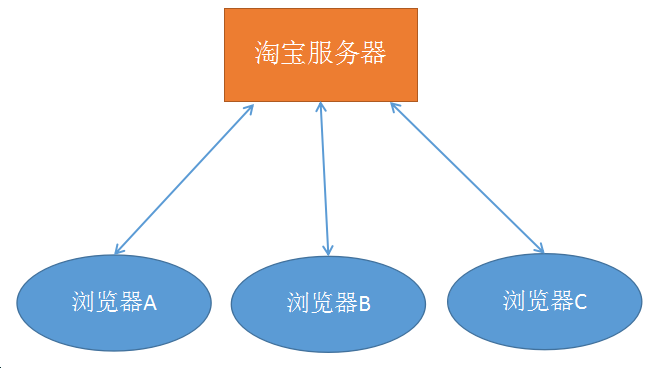
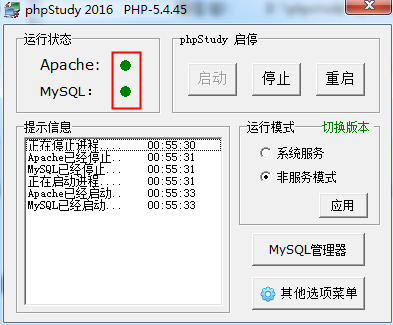
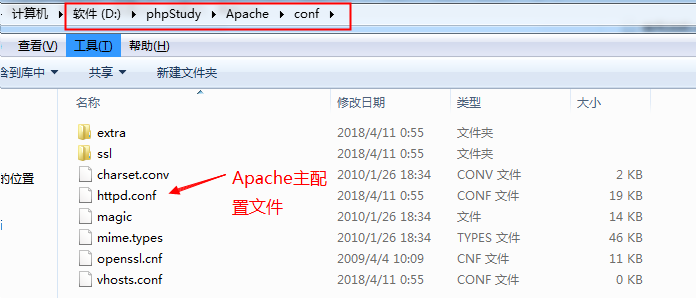
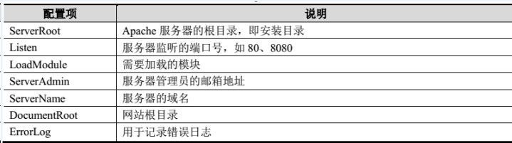
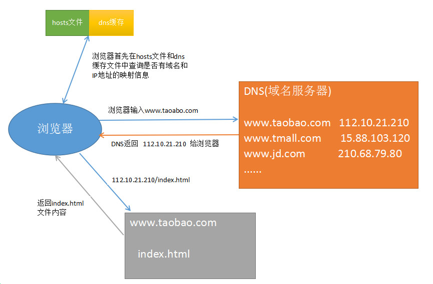
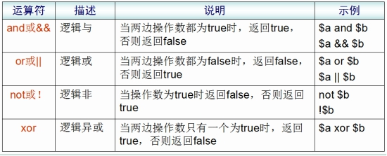
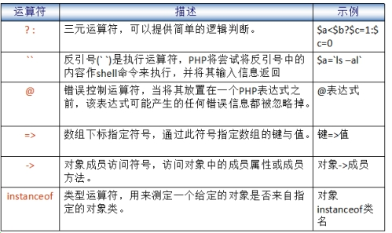

# PHP核心编程 #


## 1. web服务器 ##
   问题: 当我们写好一个html文件，放在桌面上时，别人能不能通过浏览器访问？
   答: 不行。 必须将我们的html文件放入==web服务器==，其他人通过网络才能访问。


###   1.1 什么是服务器？ ###
   服务器可以从硬件、软件(系统软件、应用软件)两个角度描述。

   按硬件描述： 服务器就是一台超级计算机。
   按系统划分： 在硬件上安装了什么操作系统，就可以称为该系统的服务器
	                   例如:  linux服务器、windows服务器、unix服务器等。
   按软件划分： 在操作系统中安装了什么软件，就可以称作该软件的服务器
	                   例如:  ==web服务器、数据库服务器==、邮件服务器等。


###   1.2 Web服务器 ###
  Web服务器就是安装了Web服务软件，能够提供网站服务的服务器。淘宝、京东、新浪等等

  常见的Web软件：
    ==Apache==、Nginx、IIS、Tomcat、Node等。
    Apache服务器、Nginx服务器、IIS服务器、Tomcat服务器、Node服务器

    Apache是世界使用排名第一的Web服务器软件。我们将编写好的html、css、js等文件存入apache，就能够通过网络来访问这些文件了。
    
    PS: web服务器又叫做http/httpd服务器


## 2. PHP概述 ##
###    2.1 PHP简介 ###
​    PHP（外文名:PHP: Hypertext Preprocessor，中文名：“超文本预处理器”）是一种通用开源脚本语言。主要适用于==Web领域的开发==，能够完成==动态网页==的制作。


php   asp   jsp


例如：淘宝的搜索功能，不同的关键词能够动态产生不同的网页。


###    2.2 PHP特点 ###

- PHP是目前最流行的网站开发语言（B/S结构）之一。

- PHP是一种在服务器端执行的嵌入HTML文档的脚本语言。

- PHP 独特的语法混合了 C、Java、Perl 以及 PHP 自创新的语法。

- PHP是一种解释型弱类型语言(解释执行)

- 支持几乎所有流行的==数据库==以及操作系统。

- 源码开放、免费（free）


 弱类型: 在声明变量时，不需要指定数据类型

​      var  a = 123;   a = 'abc';

 强类型: 在声明变量时，必须指定数据类型

​      int  a = 123;  a = 'abc';  //强类型会报错


###    2.3 B/S结构和C/S结构 ###
  C/S软件体系结构，即Client/Server (客户机/服务器)结构。
     核心特点：==要下载一个客户端==，例如：QQ、微信、LOL、王者荣耀、绝地求生等。   

  C/S结构的软件，服务器主要做==数据转发==工作。以QQ聊天为例：
     任何两个人聊天的内容都会发送到QQ服务器上，然后再由QQ服务器进行转发

     王小贱和小仙女聊天
        唐小贱发送一句话，这句话会先发送到QQ服务器，再由QQ服务器转发到小仙女的客户端。


   B/S软件体系结构，即Browser/Server （浏览器/服务器）结构。
       核心特点：==使用浏览器（Chrome、Firefox等）进行操作==，例如：淘宝、京东、新浪等。

   B/S结构软件，服务器承担了所有业务，浏览器只是用来显示最终内容的。

  




思考问题： B/S的优势和劣势， C/S的优势和劣势。

 B/S的优势: 部署方便，容易维护。用户使用方便（一个浏览器即可）。
 B/S的劣势: 客户端功能简单

 C/S的优势: 功能强大
 C/S的劣势: 必须下载客户端非常麻烦，升级维护麻烦


## 3. 安装环境 （phpstudy） ##

        phpstudy是一个集成环境，集成了Apache（IIS和nginx）、PHP、MySQL。 安装该软件后，PHP开发的程序就能运行了。

###   3.1 准备工作 ###
   解压phpstudy包


   解压后:


###   3.2 安装 ###

   双击安装文件即开始安装

   特别注意: **==phpstudy的安装路径中不允许出现中文==**，今后安装所有开发相关的软件时也都安装在英文路径下


    此处选择“是”


   设置防火墙允许访问， Apache和MySQL都要允许


 

 开启Apache和MySQL服务： ==绿色圆圈表示启动， 红色方块表示停止==




  测试:  开启任意浏览器，输入下列地址

  127.0.0.1  、  127.0.0.1:80

  localhost  、  localhost:80


看到上图说明已经安装成功


###   3.3 phpstudy目录结构 ###


phpstudy集成了 Apache、IIS、nginx三种最常见的web服务器软件和多个版本的PHP，并且通过图形化控制面板（phpstudy.exe）可以自由切换


切换服务器和php版本：  默认使用的是  ==Apache + php-5.4.45==


### 3.4 Apache目录结构





配置文件中带 # 的都是注释项，不带的是有效的配置项


  

主要配置项：




重点:

  Listen: Apache默认使用的是80端口。如果报80端口被占用可以修改为其他值，例如：8088


DocumentRoot: 配置html、css、js、php等文件保存的路径。

浏览器中输入localhost或者127.0.0.1，系统就会去DocumentRoot指定的目录去寻找对应的文件。


DirectoryIndex:  默认访问文件配置


localhost =>  localhost/index.html

localhost : 首先在www目录下找 index.html；如果没有index.html，找index.php；如果没有Index.php找index.htm；没有则找 l.php。  如果连 l.php都没有，则会将 www 目录下的所有文件和文件夹以列表形式显示出来


### 3.5 PHP目录结构


1. php.ini: php配置文件。  进入到 php-5.4.45目录


带 ； 是注释，不带的是有效配置项

2.VScode 端配置
	安装php-Debug 插件
	在file-首选项-setting 右侧的用户设置中添加 php.exe 文件路径
`"php.validate.executablePath": "E:\\study\\Web\\php\\php70n\\php.exe", `
在需要的位置打断点，按F5 运行（launch.json 默认不用修改）
在浏览器中输入对应的链接

看吧，断点成功。


###  3.6 WWW目录

   我们今后编写的所有网页文件（html、css、js、php）和网页所需要的资源文件（图片、音频、视频） 都需要保存在该目录下。


从今天开始的19天课程中，当我们通过浏览器访问任意页面时，都需要在浏览器的url地址栏输入类似地址来进行访问，不论是php文件还是html文件。


localhost /  127.0.0.1  都指向  d:/phpstudy/WWW 目录


**==localhost/index.html       localhost/admin/showlist.php==**


## 4. 初识PHP

### 4.1 第一个程序 --- Hello World

  1) 在WWW目录下创建如下目录结构： php-1/code/

  2) 在code目录下创建  01-hello.php 文件

  3) 使用sublime（或其他编辑器）打开01-hello.php，编写如下代码

  4) 访问测试 

     在浏览器中输入：localhost/php-1/code/01-hello.php

 


访问结果:


### 4.2 程序解析

  1) ==php文件不能使用中文进行命名， 浏览器地址栏不允许出现中文== ----  在实际开发中摒弃中文

  2) **==从今天开始的19天，在浏览器中查看任何文件（不管是html还是php）都必须使用localhost开头==**

  3) localhost /127.0.0.1 默认指向 d:/phpStudy/WWW 目录下。

  4) localhost/php-1/code/01-hello.php 指向 d:/phpStudy/WWW/php-1/code/01-hello.php文件

  5) PHP程序可以和HTML进行混编，可以写在HTML中的任何位置，head、body，任何标签，任何属性均可

  6) php语言的标记
     ==**<?php**  php代码  **?>**          标准标记==
     <?  php代码  ?>           短标记（需要修改php.ini文件打开）

~~~php+HTML
<?php 
	echo '<h1>Hello World</h1>';
?>
~~~

  7) 指令分隔符：
     PHP语句使用 ‘;’  结束     ==必须==

  8) echo相当于js的 document.write 能够在页面上输出内容，包括输出标签、css样式代码等

  9) php文件中可以编写html、css、js代码，但是html文件中不能编写php代码。也就是说==后缀是php的文件才能编写php代码==


## 5. URL解析 ##

###    5.1 URL地址说明 ###
   URL: uniform resource locator  统一资源定位器

       localhost  <==>  http://localhost:80/index.html （全URL）

- http: 超文本传输协议

- localhost: 域名。（一般域名：www.taobao.com，www.sina.com.cn） localhost是特殊域名，每一台电脑都有，并且指向当前使用的电脑

- 80: 端口号。 apache的默认端口号为80，所以可以省略不写  (tips:很多web服务器默认端口都是80 Nginx IIS)

- index.html: 访问的文件的路径 (localhost指向了 d:/phpstudy/WWW)，所以该url地址访问的是  d:/phpstudy/WWW/index.html文件

- 如果没有指定访问的文件，则默认会访问index.html文件；如果没有index.html文件，则会以列表形式显示当前目录下的所有文件夹和文件

  localhost:  D:\phpStudy\WWW


###    5.2 IP ###
   IP: Internet Protocol  互联网协议，是为计算机网络相互连接进行通信而设计的协议。

    处于网络（互联网、局域网）上的任何一台计算机都有一个独立的ip地址。
    ip地址由4段3位长度的数字组成， 3位数字的取值范围 0-255。如： 102.15.201.10

   特殊ip:
    127.0.0.1 : 回环地址，每一台电脑都有该ip，指向当前使用的电脑
    192.168.**.* *: 该网段是专门用于做==局域网==的ip段。

###  5.3 域名

   域名（Domain Name）： 每个网站都有一个自己的域名。人们可以在浏览器中输入域名来访问对应的网站。

   淘宝: www.taobao.com

   百度: www.baidu.com

   特殊域名：
          localhost: 本地主机。在浏览器中输入localhost就会访问当前操作的这台电脑的web服务器。

###    5.4 DNS ###
   DNS: Domain Name System  域名系统。在DNS服务器中保存了域名和IP的映射关系。主要工作是将域名转换为IP地址，因为我们通过浏览器访问网站时，实际上是去找对应的IP地址。

   域名: 网站的名称，就相当于人名。
   IP: 网站在网络上的实际地址，就相当于人的住址。

   一般访问网站时都是输入域名的(例如： www.tmall.com  www.163.com)，但是在实际访问时域名会被DNS转换为IP地址。

   DNS工作机制图:




 hosts文件可以手动设置域名和IP的映射关系

 dns缓存可以保存曾经访问过的域名和IP的映射关系


工作步骤:

1)  在浏览器中输入  www.taobao.com，按下回车

2)  浏览器首先在本机中的 hosts文件和dns缓存中查询，www.taobao.com的IP地址。如果有，则获取该IP地址，然后去访问淘宝服务器。 如果没有，则向dns服务器发送解析请求。

3) dns服务器获取到浏览器请求信息之后， 将域名转换为IP地址，再将IP地址返回给浏览器。

4) 浏览器获取到IP地址，然后通过IP地址访问淘宝服务器。 


 windows下查看dns缓存:
    ipconfig  /displaydns
    ipconfig  /displaydns > c:/dnscache.txt   将dns缓存导入到c:/dnscache.txt文件

 windows下清除dns缓存
    ipconfig  /flushdns


###    5.5 端口 ###
    端口是英文port的意译。端口可以理解为区分服务器上服务的标号

   已被占用的著名端口号：
    80:   Web端口号， Apache、Nginx、IIS
    21:   FTP端口号， FTP软件
    22:   SSH端口号
    25:   sendmail端口号
    3306: MySQL端口号
     ......

  因为Web服务的默认端口号是80，所以在地址栏可以不输入，但是如果将端口号改为其他的（如：8088），那就必须输入端口号，才能正常访问。


## 6. PHP运行原理 ##

### 6.1 HTML运行原理 ###


1) 在浏览器的URL地址栏中输入 www.baidu.com/index.html 地址，点回车。请求就发送给百度服务器。
2) 百度服务器找到index.html文件，并将文件的内容返回给浏览器
3) 浏览器接收到index.html中的内容，渲染到页面上。

同理: localhost/a.html ,  则会返回 本机web服务器根目录下 a.html文件的内容。浏览器拿到内容后进行渲染。


### 6.2 PHP运行原理 ###
 ==apache不认识php==
 ==浏览器也不认识php==

 

 1) 在浏览器地址栏中输入 localhost/index.php ,点回车之后。将请求发送给apache服务器。
 2) 服务器找到 index.php文件之后，转发给php解释器
 3) php解释器将index.php文件中的php代码全部转为html，再返回给apache
 4) apache将处理好的html返回给浏览器，浏览器渲染后就可以看到页面

## 7、PHP语法

###  》php默认内置有4种错误： 

#### notice： 通知错误


通知: 未定义得变量str，在 d:/phpStudy/WWW/php-1/code/07-error.php的第2行

####  Warning error： 警告错误


警告: strsub()期望至少2个参数，现在只有1个参数， 在 ...  的第6行

####  Parse error： 解析错误


解析错误: 语法错误，

####  Fatal error： 致命错误


致命错误: 调用了未定义的函数add() 在 .... 第13行

### 》PHP的数据类型 ###

 PHP数据类型一共有8种:

-  基本类型(标量):

     整型:     整数， 例如: 10, 234, -20, -35 
     浮点型:  小数,  例如: 3.1415, 2.13, 35.123
     布尔值:  true/false
     字符串:  使用单引号/双引号包含的内容, 例如: ‘abc’, “王者荣耀”

-  复合类型:

     数组
     对象

-  特殊类型:

     资源 、 null (空)

 整型、浮点型、布尔型、字符串、数组、资源、null

### 》变量 ###
变量命名规则：

-  由字母、数字、下划线组成，必须以字母或者下划线起头
-  变量的长度可以是任意的，但不能超过255个字符
-  最前面需要加 $
-  变量名最好有意义，能够做到见名知意
-  当变量名由多单词组成时，最好使用下划线分割或者使用驼峰命名法
-  PHP变量区分大小写

```php+HTML
<?php 
// 正确的变量名
$int = 123;
$str = 'abc';
$str1 = "def";

// 变量名区分大小写
$INT = 234;

echo $int;
echo $INT;

// 推荐的变量名
$goods_name = "华为 保时捷";
$goodsPrice = 10888;

$a = 'big';
$big = 123;
echo $a;
?>
```


以下变量名哪些是正确的：

```
$a、  $var、  $_123、  $1b、  $_#abc、  $b1c2  
```


#### 双引号和单引号的区别

双引号中的变量会被解释为值，单引号中的变量会被解释为字符串

~~~php
<?php
header('content-type:text/html;charset=utf-8');
	$str =  '凯';
	// 在双引号中变量会被解释为值
	echo "$str 是个战士";   结果：凯 是个战士
	echo '<br>';
	// 在单引号中变量会被解释为字符串
	echo '$str 是个战士';   结果：$str 是个战士
?>
~~~

单引号的执行速度会快于双引号的速度

### 》常量

#### define(var1,var2,true || false)

保存不会发生改变的数据(如：3.1415， 路径等)时，最好使用常量。

常量的使用方法：

   1) 声明:  define(var1,  var2,  var3);

```php
参数1: 常量名
参数2: 常量值
参数3: 常量名是否区分大小写 ， true（不区分）/false（区分/默认）;
    <?php
        // 定义一个常量不区分大小写
        define('PI', 3.1415, true);
        echo PI;	  结果：3.1415
        echo "<br>";  
        echo pi;	  结果：3.1415
        echo "<br>";
	   // 定义一个常量区分大小写
        define('AI', 100, false);
        echo AI;	  结果：100
        echo "<br>";
        echo ai;	  结果：报错 Notice: ...
	?>
```

 

### 》运算符 ###
####    运算符种类 ####
- 算术运算符

- 字符串运算符
- 赋值运算符
- 比较运算符
- 逻辑运算符
- 其他运算符

#####  算术运算符：


在PHP中，+号只能进行加运算。

特殊案例:

```php
$str = "abc";
$int = 20;
// 加运算中，普通字符串会被转为0
echo $str + $int;  // 结果： 20 

$str = "5";
$int = 20;
// 加运算中，数值型字符串会自动转为数值
echo $str + $int;
```


#####  赋值运算符：


`$a += $b   $a = $a + $b`


#####  比较运算符：


#####  逻辑运算符：



  异或: (了解)
     true   xor   true   =  false
     true   xor   false  =  true
     false  xor   true   =  true
     false  xor   false  =  false


#####   其他运算符：



#####    三元运算符:   判断表达式？值1：值2 

@不能屏蔽掉所有的错误。 也不建议在实际开发中使用该符号。

```php
<?php 
// 语法错误是不能被屏蔽掉的
@$books = "JavaScript"
echo $books;

// 大多数其他错误是可以被屏蔽掉的
@abc();
?>
```


####   字符串链接运算符 ####
   字符串拼接:   “.”

```php
$int = 123;
$str = 'abc';
echo $int . $str;  // 123abc;

$str1 = 'hello ';
$str2 = 'world';
echo $str1 . $str2; // hello world

$str1 .= $str2;  // $str1 = $str1 . $str2;
echo $str1; // hello world
```

-> : 对象->属性    对象->方法

### 》流程控制 ###
####   选择结构  (if...else) ####
```php
if(判断表达式){
	程序块1;
} else {
	程序块2;
}

if(判断表达式){
	程序块;
} elseif(判断表达式) {
	程序块;
} ...{
} else {
	程序块;
}
```

 

案例1: 判断三个变量中的最大值

```php
header('content-type:text/html;charset=utf-8');
$a = 50;
$b = 20;
$c = 30;

if ($a > $b) {
    if ($a > $c) {
        echo '最大值是：$a';
    } else {
        echo '最大值是：$c';
    }
} else {
    if ($b > $c) {
        echo '最大值是：$b';
    } else {
        echo '最大值是：$c';
    }
}
```


案例2: 判断时间，提示不同的问候语

```php
header('content-type:text/html;charset=utf-8');
$time = 10; //此处应该动态获取当前时间（小时）。因为没有学过动态获取时间，先固定成某个值

if ($time >= 0 && $time < 6) {
    echo "凌晨好";
} else if ($time >= 6 && $time < 12) {
    echo "上午好";
} else if ($time >= 12 && $time < 18) {
    echo "下午好";
} else if ($time >= 18 && $time < 24) {
    echo "晚上好";
} else {
    echo "时间有误";
}
```


####   循环结构  (while / for / do...while) ####
```php
while(判断表达式){
	程序块;
}

for(赋值表达式; 判断表达式; 步进表达式){
	程序块;
}

do{
	程序块
} while(判断表达式)

下面循环执行几次?
for($i = 1; $i == 1; $i++){}  //1次循环
for($i = 1; $i = 1; $i++){}   //死循环
```


案例1: 输出1-100之间的偶数

```php
for ($i = 1; $i <= 100; $i++) {
    if ($i % 2 == 0) {
        echo $i . "<br>";
    }
}
```


案例2: 输出九九乘法口诀表

```php
for ($i = 1; $i <= 9; $i++) {
    for ($j = 1; $j <= $i; $j++) {
        echo $i * $j . "&nbsp;";
    }
    echo "<br>";
}
```


####   分支结构  (switch) ####

```php
switch(变量){
	case 值1:
		程序块1；
		break;
	case 值2:
		程序块2；
		break;
	...
	default:
		程序块
}
   
变量一般使用 : 整型  字符  字符串
```


案例:  不同语言的"我爱你"

```php
header('content-type:text/html;charset=utf-8');
$lang = 'de-de';

switch ($lang) {
    case 'zh-cn':
    	echo "我爱你";
    	break;
    case 'en-us':
    	echo "I love you";
    	break;
    case 'de-de':
    	echo "Ich liebe dich";
    	break;
    case 'ja-jp':
    	echo "あなたのことが好きです";
    	break;
    case 'fr-fr':
    	echo "Je t'aime!";
    	break;
    default:
    	echo "语种错误";
    	break;
}
```


####   特殊语句  (continue、 break) ####
```php
continue: 结束当前循环，直接跳入下一次循环
break: 结束整个循环
```


```php
$i = 1;
while ($i < 10) {
    if ($i == 5) {
        contiune;
    }
    echo $i++;
}

1  2  3  4  死循环
```


### 》数组

#### 数组声明

   PHP的数组分为索引数组和关联数组两类:
     索引数组: ==下标是数字==的数组就是索引数组
     关联数组: ==下标是字符串==的数组就是关联数组 (重点)

   格式:

```php
$arr = array();
$arr = [];
```

案例：

```php
//声明索引数组
索引              0         1         2
$arr1 = array('福禄娃', '海绵宝宝', '猪猪侠');
$arr2 = array(3=>'蜘蛛侠', 6=>'钢铁侠', 10=>'煎饼侠');
$arr3 = ['张无忌', '赵敏', '灭绝师太'];

//声明关联数组 -- 下标是字符串
$info = ['name'=>'张二狗', 'age'=>20, 'gender'=>'男'];
$goods_info = ['goods_name'=>'小米 8', 'goods_price'=>1999];
```

#### 数组读写

   不管是索引还是关联数组，都是通过下标来进行读写控制的。

```php
echo $arr2[6];
//下标是字符串，一定要加引号
// 如果不加引号就会变为常量
echo $info['name'];
$goods_info['goods_name'] = '小米 note 3';

实例：
    header('content-type: text/html; charset=utf-8');
	$arr = ['李白', '杜甫', '苏轼'];
	$inf = [0 => '吃饭', 2 => '睡觉', 3 => '走路'];
	$inf[1] = '洗碗';  // 没有1的单元，这里为 添加单元，下标为1
	$arr[1] = '杜牧';  // 有1的单元，这里为 改变 小标为1的单元   “杜甫” 变为 “杜牧”

	foreach($inf as $key => $value) {
		echo $inf[$key];
		echo $key;    结果：吃饭0睡觉2走路3洗碗1 
	}

	foreach($arr as $key => $value) {
		echo $arr[$key];
		echo $key;    结果：李白0杜牧1苏轼2
	}
	// 数组不能直接输出，会报错
	echo $inf;   
```

#### 数组遍历

```php
foreach 语句结构，用来遍历数组(关联数组和索引数组均可)。

格式: 
  // 遍历数组下标及单元值
  foreach($arr as $key=>$value){程序体}
  // 遍历数组单元值
  foreach($arr as $value){程序体}
  
  $arr : 要遍历的数组      
  $key: 单元的下标，可以是任意变量名  如：定义为 $index
  $value: 单元的值，可以是任意变量名  如：定义为 $content
  // 语法位置固定，不一定是 $key, $value, 接受变量名可以自定义
实例：
  <?php
	header('content-type: text/html; charset=utf-8');
	$arr = ['李白', '杜甫', '苏轼'];
	$inf = [0 => '吃饭', 2 => '睡觉', 3 => '走路'];
	foreach($arr as $key => $value) {
		echo $arr[$key];  结果：李白杜甫苏轼
		echo '<br>';
		echo $key;  结果： 0 1 2
	} 
	// 变量名自定为： $index, $value
	foreach($inf as $index => $value) {
		echo $inf[$index];  结果：吃饭睡觉走路
		echo '<br>';
		echo $index;  结果： 0 2 3
	} 
	// as 后只跟一个变量，则只遍历的是数组内容，而不是下标，跟命名的变量值无关
	foreach($inf as $value) {
		echo $value;  // 结果：吃饭睡觉走路
	}
  ?>
```

### 》二维数组和多维数组

- 一维数组的单元中，保存了一个数组，那么该数组就是二维数组
- 二维数组可以想象成一个表格
- 二维数组同样也用下标来进行控制
- 二维数组常用来存储一组相似/相关的数据
- 二维数组的每个单元都保存一个一维数组，就是三维数组；三维数组的每个单元都保存一个数组就是四维数组； 依次类推，可以到n维。在一般开发中，最常用的是一维和二维数组，三维极少使用。


二维数组可以想象为一个表格


~~~php
echo $arr[0]['name'];    //钢铁侠    必须先找第一维下标，再找第二维下标
echo $arr[1]['gender'];  //人妖
~~~

~~~php
//同质数据
$list = [
  0=>['name'=>'zs', 'age'=>20, 'gender'=>'男'],
  1=>['name'=>'ls', 'age'=>21, 'gender'=>'女'],
  2=>['name'=>'ww', 'age'=>19, 'gender'=>'女'],
];

$list[0]['name'];   //zs
$list[1]['gender']; //女
$list[2]['age'];    //19
~~~

#### 遍历二维数组

 核心思想： 使用foreach取出第一维的数据（数组），第二层通过下标输出

~~~php
$list = [
  0=>['id'=>1, 'name'=>'zs', 'age'=>20, 'gender'=>'男'],
  1=>['id'=>2, 'name'=>'ls', 'age'=>21, 'gender'=>'女'],
  2=>['id'=>3, 'name'=>'ww', 'age'=>19, 'gender'=>'女'],
];

foreach($arr1 as $key => $value) {
	echo $str = $value['name'] . $value['age'] . $value['gender'] . '<br>';
}
结果：1zs20男 2ls21女 3ww19女
~~~

将数组输出为一个表格

~~~php+HTML
<?php 
//同质数据
$list = [
  0=>['id'=>1, 'name'=>'zs', 'age'=>20, 'gender'=>'男'],
  1=>['id'=>2, 'name'=>'ls', 'age'=>21, 'gender'=>'女'],
  2=>['id'=>3, 'name'=>'ww', 'age'=>19, 'gender'=>'女'],
];
?>
<table border="1" width="600" class="a">
    <thead style="color:red">
        <tr>
            <th>编号</th>
            <th>姓名</th>
            <th>年龄</th>
            <th>性别</th>
        </tr>
    </thead>
    <tbody>
        <?php foreach ($list as $value) { ?>
        <tr>
            <td><?php echo $value['id']; ?></td>
            <td><?php echo $value['name']; ?></td>
            <td><?php echo $value['age']; ?></td>
            <td><?php echo $value['gender']; ?></td>
        </tr>
        <?php } ?>
    </tbody>
</table>
~~~

#### print_r函数

 该函数不但能够输出基本类型，还能够输出数组，在项目开发时经常使用该函数查看数组中的所有数据

~~~php
<?php 
	$list = [
 	 	0=>['id'=>1, 'name'=>'zs', 'age'=>20, 'gender'=>'男'],
 	 	1=>['id'=>2, 'name'=>'ls', 'age'=>21, 'gender'=>'女'],
  		2=>['id'=>3, 'name'=>'ww', 'age'=>19, 'gender'=>'女'],
	];
	print_r($list);
?>
结果：
    Array ( [0] => Array ( [id] => 1 [name] => zs [age] => 20 [gender] => 男 ) 
            [1] => Array ( [id] => 2 [name] => ls [age] => 21 [gender] => 女 ) 
            [2] => Array ( [id] => 3 [name] => ww [age] => 19 [gender] => 女 )
          )
~~~

 使用 echo  来输出数组，则会得到以下错误


###  》超全局变量(预定义数组)

超全局变量是PHP内置的变量，在每一个php文件中都可以直接使用。

特点: 
   1） 在每个PHP页面都能直接使用
   2） 内部都是关联数组结构

```php
非常重要: $_GET、$_POST、$_SESSION、$_COOKIE、$_FILES
知道: $_SERVER、$_REQUEST、$GLOBALS
```

#### $_SERVER

$_SERVER记录了服务器和客户端的主要信息，和当前页面的信息

~~~php+HTML
<?php 
	print_r($_SERVER);
?>
~~~

重点记住的内容:

  **REQURES_URI** ： 访问的文件地址

  **SCRIPT_NAME**： 脚本名称（路径）

  **PHP_SELF**： 自身文件名

  访问的文件的绝对路径。 此处的绝对路径是和域名绝对

​    ==/php2/code/server.php  -->  localhost/php2/code/server.php==


### 》form表单提交接收

##### 1、get/post方式接收表单数据

 表单处理通常需要两个页面：

```
  1)  form.html: 表单页，用户可以在表单页上填写相关数据
  2)  form.php : 数据接收处理页， 接收用户在表单填写的数据，然后做进一步处理
```


代码实现：

###### 表单i页面代码结构

form.html

~~~php+HTML
<!DOCTYPE html>
<html lang="en">
<head>
	<meta charset="UTF-8">
	<title>Document</title>
</head>
<body>
	<form action="./form.php" method="post">
		用户名：<input type="text" name="username"><br>
		密  码：<input type="password" name="password"><br>
		<!-- 提交按钮 -->
		<input type="submit" value="提交">
	</form>
</body>
</html>
~~~

form.php

~~~php+HTML
<meta charset="UTF-8">
<?php
	// 接收数据
	print_r($_POST); 
?>
~~~

###### 表单提交关键点总结:

表单页面form.html

 1) 、必须有form表单标签，form必须有action 和 method 两个属性

 		action: 指定表单数据提交的位置 ---  php/jsp/asp文件的路径
		method: 表单提交的方式， post 、get(默认)	

2) 、每个表单域都要有name属性    input   select   textarea

3) 、必须有submit类型的按钮 ---> submit按钮有页面跳转的功能

提交页面form.html

 1) 、method=post时，使用$_POST接收数据    

​ 2) 、method=get时，使用$_GET接收数据

​ 3) 、不管是`$_POST`还是`$_GET`，都是一个关联数组，数组的下标就是表单域中 name 属性的值  

##### 2、每种域和类型的提交方式

 表单标签： form 、 **input** 、 **select** 、 **textarea**

  ==表单提交的实际上是每个域的value值==

  1) 、input  type= text/password/hidden/email  **提交的就是value属性中的值**

  2) 、input  **type=radio**  提交的是选中项的value值。**value必须设置，否则后端会接收 on**

  3) 、input  **type=checkbox ** 在name的值后**增加[] 转换成数组结构**，后端才能接收到所有的已勾选项

  4) 、**select**  name  值需要定义在select标签中； 

​		 value  定义在option中，每条option都有自己的value
		 如果不定义option中的value，则会将option中间的内容发送到后端页面中

  5) 、**textarea**  name值定义在textarea标签中，value没有显式的表示出来，就是开始标签和结束标签之间的内容

代码：

~~~php+HTML
<!DOCTYPE html>
<html lang="en">
<head>
	<meta charset="UTF-8">
	<title>Document</title>
</head>
<body>
	<form action="./form.php" method="post">
        <!-- 输入框 -->
		用户名：<input type="text" name="username"><br>
		密  码：<input type="password" name="password"><br>
		<!-- 单选框 value必须设置，否则后端会接收 on-->
		性  别：<input type="radio" name="age" value="男">男
			   <input type="radio" name="age" value="女">女<br>
		<!-- 复选框 在name的值后增加[] 转换成数组结构，后端才能接收到所有的已勾选项-->
		爱  好：<input type="checkbox" name="hobby[]" value="乒乓球">乒乓球
			   <input type="checkbox" name="hobby[]" value="乒乓球">篮球
			   <input type="checkbox" name="hobby[]" value="乒乓球">羽毛球<br>
         <!-- 下拉菜单 name值需要定义在select标签中 -->
		城  市：<select name="city" id="chengshi">
        			 <!--value  定义在option中，每条option都有自己的value -->
					<option value="北京">北京</option>
					<option value="上海">上海</option>
					<option value="天津">天津</option>
				</select><br>
         <!-- 文本域 -->
         <!--name值定义在textarea标签中，value没有显式的表示出来，就是开始标签和结束标签之间的内容-->
		个人简介：<textarea name="txt" id="" cols="30" rows="10"></textarea><br>
		<!-- 提交按钮 -->
		<input type="submit" value="提交">
	</form>
</body>
</html>
~~~

##### 3、post和get的区别 (非常重要)

**通过URL地址栏来区分post和get**

get将提交数据拼接成字符串显示在URL地址栏中


post不显示


1) 、提交方式

- get会将数据显式的拼接到url地址栏中  (字符串)

  例如： form.php==?==id=10001==&==username=heiheihei==&==passwd=123456&key=value....

  ？前，url地址

  ？后，数据拼接的字符串

  key=value方式传参，多个参数之间使用&符号隔开

  ```php+HTML
     id、username、passwd等等（键/key）都是表单域的name值
     1、heiheihei、123456等等（值/value）都是表单域的value值
  ```

- post不会显示出来

2) 、传递数据量大小

- post最小值是2M，默认8M，可以通过修改php配置文件来修改大小，理论上没有上限的。
- get会受到浏览器的地址栏的限制。有的是2k（IE6），有的是8K(chrome)

3) 、应用范围不一样

- post在绝大多数情况下都使用在表单提交中。
- get的应用范围比较广，只要能进行页面跳转，就能传递数据。在a标签的href中，location.href中等都能使用get方式。

~~~php+HTML
<body>
	<!-- get方式传递数据 -->
    <a href="06-get.php?id=1&name=zs&a=hello&b=world">跳转</a>
    <input id="btn" type="button" value="跳转">
    <script type="text/javascript">
        // 通过window的location方法将a标签中存储的数据进行传递数据
        document.getElementById('btn').onclick = function () {
            location.href = '06-get.php?color=red&gbcolor=blue';
        }
    </script>
</body>
~~~

###### $_REQUEST

   $_REQUEST 即可以接收get方式提交的数据，也能接收post方式提交的数据。但是因为速度比较慢，所以现在被弃用。

##### 4、文件上传

文件上传属于一种特殊的表单提交，也需要两个页面 ---  表单页  和   数据处理页。


代码实例：

upload.html

~~~php+HTML
<body>
文件上传<br>
<!-- 文件上传的method只能用post -->
<!-- 文件上传时，form标签中必须设置 enctype="multipart/form-data" 属性 -->
enctype="multipart/form-data"
    <form action="07-upload.php" method="post" enctype="multipart/form-data">
    选择文件: <input type="file" name="pic">
    		<input type="submit" value="上传">
    </form>
</body>
~~~

upload.php

~~~php
// 显示提交的文件内容信息
print_r($_FILES);

Array ( 
    [userfile] => Array 
    	( 
            [name] => 1514970585030.jpg 
            [type] => image/jpeg 
            [tmp_name] => C:\Users\Administrator\AppData\Local\Temp\php571.tmp 
            [error] => 0 
            [size] => 53955
        ) 
)
~~~


###### 文件上传核心点总结:

upload.html
 **核心点一：表单设计**

~~~php
1) 表单标签form中必须额外增加 enctype属性，必须使用post提交表单
2) 文件域必须有name属性和值 
~~~

###### **$_FILES**

**核心点二 : $_FILES**

$_FILES是一个二维数组，保存了上传文件的相关信息：
 第一维下标是 文件域的name值
 第二维有5个固定单元
> name: 上传的文件名
> type: 上传的文件类型
> tmp_name: 上传文件在服务器临时存储的路径
> error:  错误码，错误码有0-4  5个值。 等于0时，代表文件正常上传
>  	0：代表正常上传，没有错误
>   	1：代表上传文件大小超过了 php.ini中 upload_max_filesize 定义的大小
>   	2：代表上传文件大小超过了 php.ini中 post_max_size 定义的表单最大值
>   	3：文件只有部分被上传 
>   	4：没有文件被上传 
>
> size: 上传文件的大小  bit

###### **move_uploaded_file**

**核心点三 :  move_uploaded_file**
将上传文件从临时保存路径移动到目标存放路径

~~~php
move_uploaded_file (参数1， 参数2)；
   参数1: 临时路径  --->  $_FILES['pic']['tmp_name']
   参数2: 目标路径  --->  使用相对路径或者绝对路径都能移动文件，注意需要给文件名
   返回值: true上传成功   false上传失败
// 共用一个文件，通过字符串拼接，可以在文件中重复存放数据
move_uploaded_file($_FILES['pic']['tmp_name'], './img/' . $_FILES['pic']['name']);
~~~

### 》函数

什么是函数？
函数（function）是一段完成指定任务的已命名代码块
PHP函数包括内置函数（系统函数）和自定义函数两类

函数的格式

 PHP声明函数的方式和Javascript一致。

~~~javascript
function  函数名称（[参数1 [,参数2 [,…]]]）
{
	函数体;
	//如需函数有返回值时使用
	[return 返回值;]
} 
~~~

封装函数案例

~~~php+HTML
<meta charset="utf-8">
<?php 
// 计算加减乘除运算的函数
// 声明函数
// 参数3: 运算符  +  -   *  / 其中之一
function cal ($num1, $num2, $op) {
    $result = null;
    //判断$op值
    switch ($op) {
        case '+':
            $result = $num1 + $num2;
            break;
        case '-':
            $result = $num1 - $num2;
            break;
        case '*':
            $result = $num1 * $num2;
            break;
        case '/':
            if ($num2 == 0) {
                return '0不能作为除数';
            }
            $result = $num1 / $num2;
            break;
        default:
            return '运算符不正确';
            break;
    }
    return $result;
}
echo cal(10, 0, '///');
?>
~~~

##### ※  变量的作用域

核心概念: 在函数体外定义的变量，在函数体内无效
 	  	 在函数体内定义的变量，在函数体外无效

~~~php+HTML
<?php 
//变量作用域
$name = 'zs';
function getName () {
    //函数体外定义的变量在函数体内无效
    echo $name;
}
getName();

function setName () {
    $name = 'ls';
}
setName();
//函数体内定义的变量，在函数体外无效
echo $name;
?>
~~~

**全局变量 和 局部变量:**
	局部变量:  函数体内的变量，该变量只在函数范围内有效。
	全局变量:  函数体外的变量，在整个php文件中都有效（除了函数）。

##### **※  文件包含**

文件包含一共有4个函数:   

###### √  include          

###### √  require

###### √  include_once

###### √  require_once

**区别：**

PHP中引用文件的方法有两种：require和include 他们的用途是完全一样的。

require：require("########");这个函数一般放在PHP文件的**最前面**，程序在执行前就会先导入要引用的文件。

include：include("############");这个函数一般放在程序的**流程控制里边**。只有程序在执行**碰到**才会引用。可以简化程序的执行流程。

最根本的**区别**在于遇到错误的处理方式还有require没有返回值而include有**返回值**。

require：一个文件存在错误时，执行就会中断。并返回一个**致命错误**。

include：一个文件存在错误，程序不会中断执行。**会弹出一个警告**。

  **文件A中包含文件B，那么文件B就相当于文件A的一部分。**

~~~php+HTML
文件include_a.php:
<?php 
//include_a和include_b都声明了$str，会发生覆盖
$str = 'bcd';
include './02-include_b.php';
//声明同名函数时，会报致命错误
function aaa () {
    echo 'include_a.php-->aaa()';
}
echo $str;
aaa();
?>

文件include_b.php:
<?php 
$str = 'abc';
function aaa () {
    echo 'aaa()';
}
?>
~~~

  **注意事项:** 
    如果文件A和文件B定义了相同的**变量**，则会发生覆盖。
    如果文件A和文件B定义了相同的**函数**，则会发生致命错误。

| 函数         | 作用                                                         |
| ------------ | ------------------------------------------------------------ |
| include      | 载入文件时。如果未找到文件，则产生 E_WARNING 级别的警告错误，**脚本继续运行**。 |
| include_once | 与include 语句作用相同，区别只是如果该文件已经被包含过，则不会再次包含。 |
| require      | 载入文件时。如果未找到文件，则产生 E_COMPILE_ERROR级别的致命错误，**脚本中止执行**。 |
| require_once | 与require 语句作用相同，区别只是如果该文件已经被包含过，则不会再次包含。 |

 ~~~php+HTML
<?php 
// 没有a.php文件，所以会报警告错误，但是脚本继续执行，会输出123
include 'a.php';

// 没有a.php文件，所以会报致命错误，脚本终止执行，不会输出123
require 'a.php';

// 多次包含同一个文件，就会包含多次
include '03-include.html';
echo 123;
include '03-include.html';

// 多次包含同一个文件，只会包含一次
include_once '03-include.html';
echo 123;
include_once '03-include.html';
?>
 ~~~

注：一般来讲，只会使用 include_once / require_once

##### ※  static静态变量

 当一个变量使用static进行修饰时，该变量在整个php函数运行过程中只有一份。


~~~php
function aaa () {
    $i = 1;
    echo $i++;
}
//三次调用开辟了三块不同的内存来处理，三块内存互不干扰
aaa();
aaa();
aaa();
//所以输出的是 1 1 1

用static声明
function aaa () {
    //使用static修饰了$i之后，$i就只有一份了
    static $i = 1;
    echo $i++;
}
//在执行aaa()函数时，首先要去静态内存中查找是否有$i，此时没有$i
//所以会创建$i并赋值为1
aaa();
//第二次调用aaa()函数时，也要先去静态内存中查找是否有$i,此时已经有$i
//所以就直接调用该$i, 而不会去创建新的$i了
aaa();
aaa();
~~~

##### ※  global 全局变量

如果在一个函数体内想强行使用函数体外定义的变量，可以使用global关键词来声明。

~~~php+HTML
<?php 
//全局变量
$name = 'zs';
function getName () {
    //告诉系统现在要使用函数体外定义的$name变量了
    global $name;
    echo $name;
}
getName();
?>

注： 必须在当前作用域中使用global，在其他地方包括函数外使用无效。
~~~

### 》常用函数

##### ※  日期函数

**int time():  **
	获取当前时间点的时间戳 -- 1970.1.1 00:00:00 到现在的秒数   unix纪元
返回值：为 int 整形数
**string date**(format $str, timestamp $int): 
	可以将时间戳转为年月日时分秒的形式
返回值：为字符串

~~~
date函数说明：

参数1: 要显示的时间格式
参数2: 时间戳, 可选参数, 如果不指定则为当前时间戳
返回值: 格式化好的时间字符串

时间格式参数:
    Y: 4位年
    m: 带前导0的2位月
    d: 带前导0的2位日
    H: 带前导0的2位时
    i: 带前导0的2位分
    s: 带前导0的2位秒

修改时区有两种方法:
1)  使用函数 ---- date_default_timezone_set();      临时修改
2)  修改php配置文件 php.ini                         永久修改
北京时间: PRC (中国人民共和国)  或者  asia/shanghai (亚洲/上海)
~~~

~~~php+HTML
<?php 
    echo time();
    echo '<br>';
    echo date('Y-m-d H:i:s', 243232234235);
?>
暂时修改时间
	date_default_timezone_set();
~~~


重启apache服务器，才能使最新的配置项生效。 （只要修改过Apache或者php的配置文件，就都需要重启Apache服务器才能生效。Apache配置文件 httpd.conf）

##### ※  变量函数

###### **empty($var)【bool】 ** 
判断变量是否为空。如果为空返回 true；反之，则返回false
###### **isset($var)【bool】** 
判断一个变量是否被设置。 如果已设置返回true，反之，返回false
###### **unset($var)【void】 ** 
删除变量，无返回值

void 表示无返回值

~~~php+HTML
<?php 
$str = ''; //空
$str = null; //空
$str = 0; //空
$str = 'abc';  // true
//(int) 将结果强制转换为整型
echo (int)empty($str);

//未声明变量，所以此时输出为false (0)
echo (int)isset($str);
$str = 123;  // 1
$str = '';	 // 1
$str = null; // 空
$str = 0;    // 1
echo (int)isset($str);

$str = 'aaa';
echo $str;
unset($str);
echo $str;
?>
~~~

##### ※ 数学运算函数

###### rand(min, max)

~~~php
rand(100000, 999999)  // 取一个随机数
~~~


##### ※  数组函数

###### in_array(mixed, arr)【bool 】    

检查一个值是否存在于一个数组当中，存在返回true，不存在返回false

######  explode(delimiter, str)【array 】 

使用一个字符串【**另一个字符串中存在的字符串**】将另一个字符串分割为数组。

如果第一个字符串在第二个字符串中并不存在，那么返回的是一个只有一项单元的数组。

###### implode(str, arr)【string 】    

使用一个字符串将一个数组链接为字符串

###### count( arr ) 

获得数组的长度

~~~php
in_array(mixed, arr)
    $arr = ['aaa', 123, 'abc'];
    echo (int)in_array('a', $arr);
    // 结果 0
    echo (int)in_array('a', $arr);
    // 结果 1
explode(delimiter, str)
    $str = 'ab3cd3453454345345';
    $char = '3';
    print_r(explode($char, $str));
    // 结果：Array ( [0] => ab [1] => cd [2] => 45 [3] => 454 [4] => 45 [5] => 45 )
implode(str, arr)
    $arr1 = ['aaa', 123, 'abc', 456,];
    $char1 = '-';
    echo implode($char1, $arr1);
	// 结果：aaa-123-abc-456
	$arr = ['aaa', 'bbb', 'ccc', 'ddd'];
	echo implode('/', $arr);  
	// 结果：aaa/bbb/ccc/ddd
count( arr ) 
     $arr1 = ['aaa', 123, 'abc', 456,];
	count($arr1); // 4
~~~

##### ※  字符串函数

######  strlen(str) 【int】  

获取字符串长度

~~~php
   $str = 'abcdekdec';
   echo strlen($str); // 结果：9
~~~

###### strpos/strrpos(\$str, $char)【int 】 

查询\$char字符串在$str字符串中的第一次/最后一次出现的下标

~~~php
   $str = 'abcdekdec';
   echo strpos($str, 'd'); // 结果：3
   echo strrpos($str, 'd'); // 结果：6
~~~

###### substr（str, start[, length]）【string 】  

字符串截取
	参数1: 要被截取的字符串
	参数2: 截取起始下标
 	参数3: 截取长度（可选参数），如果没有该参数则截取到最后
  	返回值: 截取好的字符串

~~~php
$str = 'abcdefg';
echo substr($str, 2); // 结果：cdefg
echo substr($str, 2, 3); // 结果：cde
~~~

###### str_replace（search, replace, str）【string 】  

字符串替换
	参数1: 要被替换的字符串
 	参数2: 用来替换参数1的字符串
 	参数3: 在该字符串中进行替换
	返回值: 替换好的字符串

~~~php
echo (str_replace('o', 'a', 'hello World'));  // 结果：hella Warld
~~~

###### trim（str）【string 】  

删除字符串左右两边的空格

~~~php
$str = ' wer werewrwe  ';
echo trim($str);   // 'wer werewrwe'
echo strlen($str);   // 15
echo strlen(trim($str));   //12
~~~

###### void die/exit([str]): 

结束当前脚本

~~~php
<?php 
header('content-type:text/html;charset=utf-8');
$str = 'abcdefg';
echo strlen($str);

die('程序到此结束'); //用于程序调试
加上die，此处函数不再往下执行。--------------
//在gb2312和gbk字符集下，一个中文字符占2位长度
//在utf-8字符集下，一个中文字符占3位长度
$str = '诺克萨斯之手';
echo strlen($str);

$str = 'abcdefbg';
echo strpos($str, 'b'); //1
echo strrpos($str, 'b'); //6
~~~

###### 获取文件后缀名

~~~php
获取文件后缀 --->  a.txt  bcd.php  10ab.jpg  aaa.bbb.jpg ...
//1) 找文件名中最后一个 . 的下标
//2) 使用substr从.下标位置截取到最后
$filename = 'abfdsafc.fdas-dasd.rmvb';
$pos = strrpos($filename, '.');
echo substr($filename, $pos);
~~~

##### ※  文件读写函数

######file_get_contents
string  file_get_contents(string $path);
	参数: 文件路径，可以是本地文件的路径，也可以是网络地址
	返回值: 文件内容

~~~php
<?php 
//获取文件内容
//参数: 文件路径，可以是本地文件路径，也可以是网络文件路径
echo file_get_contents('./data.txt');
//网络地址需要添加协议
echo file_get_contents('http://www.xiachufang.com/');
?>
~~~

######file_put_contents
int file_put_contents(string \$path, string $data[, constants flag]);
	参数1: 文件路径
	参数2: 要写入文件的字符串(整型和浮点型是可以自动转为字符串的)
	参数3: 可选参数，默认不写，新内容覆盖原文件中的内容；FILE_APPEND是向文件中追加内容
	返回值: 写入文件的字符串长度

~~~php
<?php 
//参数3: 可选参数，如果不设置则会发生覆盖写入；如果设置为 FILE_APPEND，则会发生追加写入
echo file_put_contents('./data.txt', '我是你爸爸', FILE_APPEND);
?>
~~~

##### ※  获取表单上传文件案例


form-biaodan.html页面

~~~html
<body>
    <form action="./form-biaodan.php" method="POST" enctype="multipart/form-data">
        <input type="text" name="username"><br>
        <input type="text" name="pwd"><br>
        <input type="file" name="userpic"><br>
        <input type="submit" value="提交">
    </form>
</body>
~~~

form-biaodan.php页面

~~~php+HTML
<?php 
header('content-type:text/html;charset=utf-8');
//1. 处理上传文件
//  1) 判断文件上传是否正确 --->  error==0 正常上传
//  2) 判断上传文件的类型是否是 jpg png gif 之一
//  3) 修改文件名，防止文件名冲突覆盖
//  4) 将上传文件从临时路径移动到目标路径

//在该程序中，任何一个变量在任何位置里面保存的是什么，如果你心知肚明那么程序就在你的
//掌控之下；如果你不知道，那么就是在瞎写

if ($_FILES['userpic']['error'] == 0) {
    //文件上传成功 ---> 判断上传文件的类型是否是 jpg png gif 之一
    //截取上传文件的后缀，再和jpg png gif 进行比较
    $pos = strrpos($_FILES['userpic']['name'], '.'); //找文件名的最后一个 . 的下标
    $ext = substr($_FILES['userpic']['name'], $pos); //截取出文件后缀
    
    $type = ['.jpg', '.png', '.gif'];
    if (in_array($ext, $type)) {
        //文件类型正确  --->  修改文件名，防止文件名冲突覆盖
        //1537443712746352.jpg
        $new_file = time() . rand(100000, 999999) . $ext;
        move_uploaded_file($_FILES['userpic']['tmp_name'], './img/' . $new_file);
    } else {
        //文件类型错误
        //2秒后跳转到./form-biaodan.html页面
        header('refresh:2;url=./form-biaodan.html');
        die('文件类型错误，请重新上传文件');
    }
} else {
    //文件上传失败
    //2秒后跳转到./form-biaodan.html页面
    header('refresh:2;url=./form-biaodan.html');
    die('文件上传失败，请重新上传文件');
}

//2. 接收用户名和密码
$name = $_POST['username'];
$pwd  = $_POST['userpwd'];

//拼接要写入文件的字符串
$data = $name . '-' . $pwd . '-' . './img/' . $new_file . ';';
//die($data);

//3. 将用户名、密码、头像路径写入到data.txt文件中
/**
 * 功能: 将字符串写入文件
 * 参数1: 文件路径，此处我们需要 data.txt文件的路径
 * 参数2: 要写入的字符串，此处需要 用户名-密码-头像路径
 * 参数3: 不写就是覆盖写入，设置为FILE_APPEND就是追加写入
 * 返回值: 写入文件的字符串的长度
 */
file_put_contents('./data.txt', $data, FILE_APPEND);
echo '添加新信息成功';
header('refresh:2;url=./form-biaodan.html');
?>
~~~

data.txt文件

~~~tex
张三-23432-15401263973345348.jpg;李四-2wer2-154012639345318.jpg;王五-565462-154012639767867788.jpg;
~~~

移动到img问价夹中的图片

~~~
15401263973345348.jpg    154012639345318.jpg    154012639767867788.jpg
~~~

将收集好的用户信息输出为表格形式

~~~php+HTML
<body>
<?php 
//1. 获取文件内容 --->  字符串
$str = file_get_contents('./data.txt');
//echo $str;

//2. 使用 ; 将字符串分割为数组
$arr = explode(';', $str);
//print_r($arr);
//获取数组长度
$len = count($arr);
unset($arr[$len - 1]);
print_r($arr);

//3. 循环显示数组
?>
<table border="1" width="500">
    <thead>
        <tr>
            <th>名字</th>
            <th>密码</th>
            <th>图片</th>
        </tr>
    </thead>

    <tbody>
        <?php 
        foreach ($arr as $value) { 
            //使用 - 将 $value分割为数组
            $tmp = explode('-', $value);
        ?>
        <tr>
            <td><?php echo $tmp[0]; ?></td>
            <td><?php echo $tmp[1]; ?></td>
            <td>" width="50"></td>
        </tr>
        <?php } ?>
    </tbody>
</table>
</body>
~~~

### 》HTTP协议

##### 1.1 Http协议概述

协议: 就是事先的一种约定、规则、规范、标准。（租房合同、工作合同）。

HTTP协议：HyperText Transfer Protocol 超文本传输协议，客户端（浏览器端）与WEB服务器端之间的交互协议。当浏览器和服务器进行数据交换时，html文件、图片、CSS、JS等都是基于HTTP协议进行传输的。

HTTP协议有两个版本: 1.0 和 1.1，目前使用的基本都是1.1

###### 3个特点: 

​	通常是基于 B/S 结构软件的。
	无连接: 浏览器向服务器发送一次请求，服务器响应一次，链接即结束。
	无状态: 无记忆。 服务器不能记住哪个浏览器访问过。

无连接 -- 没有持久化链接

当浏览器地址栏输入 www.baidu.com/index.html，按下回车时。浏览器向服务器发送请求，服务器找到index.html文件返回给浏览器之后，本次链接断开。

如果在点击该页面中任何一个链接，则重新建立一次链接。客户端发送请求，服务器响应。之后又断开链接。


##### 1.2 请求和响应

HTTP协议主要分为两大部分: 
	请求:  访问服务器的任何一个文件都是一次请求
	响应:  服务器处理请求，将结果返回给浏览器。

1) 请求 / 请求报文 / 请求协议 (==request== / http request)
	客户端(浏览器)向服务器索要数据时遵循的协议

 **请求报文分为3个部分:  请求行   请求头   请求主体**

| 部分      | 解释                                                         |
| --------- | ------------------------------------------------------------ |
| 请求行:   | 请求方式、请求URL地址、协议版本号                            |
| 请求头:   | 主机域名，客户端(浏览器)的信息等                             |
| 请求主体: | 发送给服务器的数据，get和post都会通过请求主体将数据发送给服务器 |

&  可以使用Chrome tools 或者 firebug 来查看请求和响应的信息（F12）

~~~
主要请求项:
  host： 主机名和端口号，80端口默认不显示
  accept：可接受的程序类型
  accept-encoding： 可接受的压缩类型
  accept-language： 可接受的语言类型
  cache-control： 缓存控制
~~~

案例1:  访问 localhost/php-4/code/http/index.html 文件


请求方式主要是get和post两种

案例2:  index.html表单数据提交到index.php文件


案例3:  index.html页面中a标签跳转到get.php文件


**响应 / 响应报文  (==response== / http response)**

响应报文也分为3部分:  响应行   响应头   响应主体

| 部分      | 解析                           |
| --------- | ------------------------------ |
| 响应行:   | 协议版本号、响应结果状态码     |
| 响应头:   | 主要是服务器端的信息           |
| 响应主体: | 就是从服务器返回给客户端的数据 |

~~~
主要响应项：
 content-type： 响应内容类型， content-type:text/html，服务器告诉浏览器，返回的这部分数据是文本类型，使用				  html方式来解析即可。
 content-length： 响应内容的长度 ，content-length:336, 从服务器返回给浏览器的数据总长度为336字节
~~~

案例1: 访问 localhost/php-4/code/http/index.html 文件时的响应信息


案例2: index.html表单数据提交到index.php文件的响应信息


##### 1.3 状态码

常见的状态码如下:

AjaxObject.status = 200;


| 状态名 | 解释                                                         |
| ------ | ------------------------------------------------------------ |
| 200    | ok   -----   请求成功                                        |
| 302    | redirect\|Found  ----- 重定向                                |
| 304    | not modified ----- 未修改                                    |
| 403    | forbidden   -----  禁止访问 （没有权限访问）                 |
| 404    | Not Found  -----  未找到页面                                 |
| 500    | internal server error  ----- 服务器内部错误 (可能是服务器本身有问题，或者代码错的太离谱) |

##### 1.4 多次请求和响应


4次请求，4次响应

##### 1.5 header 响应头设置

###### 1) 设置响应类型

浏览器发起请求的方式是多样的，当发起请求后服务端会有对应的内容响应过来，浏览器会根据响应头==Content-Type==来对响应的内容进行解析

content-type主要的响应类型是  text/html   （默认）
其他常见类型 :  text/css   text/javascript   image/png  image/jpeg  image/gif ...

案例1: php绘制的验证码 verify.php


设置content-type的类型为 image/png

显示效果:


当设置为  text/html时，访问结果:


案例2: link标签发送请求 


  link不管你请求什么文件，都会发送请求。


###### 2) 指定字符集

  中文字符集: utf-8   gb2312   gbk

```php
 header(‘Content-Type:text/html;charset=utf-8’);
 header(‘Content-Type:text/html;charset=gb2312’);
```

windows的默认编码是gb2312，所以在windows下创建的文件也是 gb2312编码的。（ANSI）

 页面乱码问题处理方式：
     页面乱码是因为==文件编码==和==页面指定编码==不一致，所以解决该问题就是要统一文件编码和页面指定编码
- 在页面中设置 header ，编码指定为 utf-8
- 将文件的编码格式，指定为utf-8 (使用sublime，将保存格式设置为 utf-8 或者 使用editplus另存为文件时，设置utf-8)
- 如果 header设置为  utf-8，则文件编码格式也要设置为 utf-8
- 如果 header设置为 gbk/gb2312，则文件编码格式要设置为 ANSI 
- 在windows下直接创建文件，默认格式是ANSI，那么页面字符集就要用 gbk或者gb2312
- 在sublime下创建文件，是utf-8格式，那么页面字符集也指定为utf-8

###### 3) 页面重定向 ---> 页面跳转

~~~php
 header('location:页面地址');        //立即跳转
 header('refresh:2;url=页面地址');   //延迟2秒后跳转
~~~

## 8、PHP操作MySQL

### 1、学生信息管理系统

**目标: 通过PHP网页来管理数据库，对数据表的数据进行增删改查**

  数据表设计:

```
sno： 学号  整型  无符号  主键  自增长
sname： 姓名  字符串
sage： 年龄 无符号 微整型
sgender： 性别 枚举
semail： 邮箱
stel： 电话
```

数据表数据

```mysql
create table student(
  sno int UNSIGNED auto_increment PRIMARY key,
  sname VARCHAR(30) unique not null,
  sage tinyint UNSIGNED not null,
  sgender enum('男', '女') DEFAULT '男',
  semail varchar(30),
  spwd char(32) not null,
  stel   char(11),
) engine=myisam DEFAULT charset=utf8;

数据库数据:
INSERT INTO student VALUES ('1', '赵老四', '30', '男', 'zls@a.com', '13512345678');
INSERT INTO student VALUES ('2', '王翠花', '28', '女', 'wch@b.com', '13612345678');
INSERT INTO student VALUES ('3', '孙狗剩', '32', '男', 'sgs@c.com', '13712345678');

```

#### 1.1  学生信息列表

 目标: 将student表中的数据全部取出，并以表格形式显示在网页上

##### select  *  from  student

 核心SQL:  select  *  from  student

**注意：**数据库操作的字符串如果有变量，整个SQL语句必须用双引号包裹，变量用单引号包裹，php语言中双引号才会区分变量和字符串。


 核心: mysqli_fetch_assoc函数的原理


1) 将数据从数据表中取出


  2) 循环显示数据 

​    核心: mysqli_fetch_assoc的用法


 


#### 1.2  添加学生信息

##### insert into student values(null, '路飞');

核心SQL:  insert into student values(null, '路飞', 10, '男', 'lf@dasd.com', 18012345678);


代码实现:

add.html


add_deal.php

三个步骤:

   1） 接收表单数据，此时可以验证数据是否符合规则

   2） 拼接SQL语句，此时一定是一个  insert into

   3） 链接MySQL执行SQL语句  ---- 6步


 小完善:  在index.php页面有跳转到 add.html的链接

 


#### 1.3 删除学生

##### delete from student

 核心SQL:  **delete from student where sno=5**


步骤: 
   1) 在学生信息列表页(list.php)，为每一行都添加一个删除按钮，删除按钮可以跳转到另一个php(del.php)页面，在跳转时，将当前行的sno一起传递到del.php页面。

 添加删除按钮， 跳转并将sno一起发送del.php


   2) del.php页面，接收sno，拼接删除的sql语句，再执行该SQL。再根据删除结果提示删除成功/删除失败。跳转回学生列表页。

  ① 接收学号 sno

  ② 拼接删除的SQL语句

  ③ 链接MySQL服务器并执行SQL语句

 


小完善:  删除时，要先提示一下

 


#### 1.4 修改学生信息

##### update student set sname='', sage=''..

核心：构造一条修改数据的SQL语句   

   **update student set sname='', sage=''..  where sno=6**


步骤:

 1) 在学生列表页(index.php)为每一行都添加一个“编辑”按钮，跳转到编辑表单页(edit.php)，并且要将当前行的sno一起传递到edit.php页面。


 2) 创建edit.php页面(和add.html页面结构一样)，接收sno，拼接SQL语句并执行，得到一个一维数组，将该数组的值填充到表单中。

  ① 接收sno

```php
<?php
   //1. 接收sno -- get方式
   $sno = $_GET['sno'];
?>
```

  ② 根据sno 拼接SQL语句

```php
//2. 拼接SQL语句 --- select * from student where sno=...
$sql = "select * from student where sno=$sno";
```

  ③ 链接MySQL并执行SQL语句 --- 得到一个一维关联数组

```php
//3. 链接MySQL服务器并执行SQL语句 --- 6步
$conn = mysqli_connect('localhost', 'root', 'root', 'study');
mysqli_query($conn, 'set names utf8');

//执行查询，得到结果对象，该对象中必然只有一条数据
$result_obj = mysqli_query($conn, $sql);

//一次mysqli_fetch_assoc将对象中的数据取出一个一维关联数组
$arr = mysqli_fetch_assoc($result_obj);
```

  ④ 将数组的数据填入到表单中

```php+html
//关闭链接
mysqli_close($conn);
//4. 将查询结果写入表单
?> 
<form action="modify.php" method="post">
学号: <input type="text" name="sno" readonly value="<?php echo $arr['sno']; ?>"><br>
姓名: <input type="text" name="sname" value="<?php echo $arr['sname']; ?>"><br>
年龄: <input type="text" name="sage" value="<?php echo $arr['sage']; ?>"><br>
性别: <input type="text" name="sgender" value="<?php echo $arr['sgender']; ?>"><br>
邮箱: <input type="text" name="semail" value="<?php echo $arr['semail']; ?>"><br>
电话: <input type="text" name="stel" value="<?php echo $arr['stel']; ?>"><br>
<input type="submit" value="修改">
</form>
```


 3) 创建一个修改页面(modify.php)，接收edit.php页面表单中的值，拼接一个修改的SQL语句，执行该SQL语句。根据修改结果提示修改成功/修改失败，再跳转

 ① 接收表单提交的数据

 ② 编写修改的SQL语句 --- update

 ③ 链接MySQL服务器并执行SQL语句


### 2. mysql 函数组

#### 2.1 mysql函数组操作数据库

  mysql函数组的用法和mysqli的用法一样，只是参数略有不同。

  1) 链接MySQL服务器 --- mysql_connect()

  2) 选择数据库  ---  mysql_select_db()

  3) 设置字符集 --- mysql_query('set names utf8')

  4) 执行SQL语句  ---  mysql_query()

  5) 处理SQL执行结果

  6) 关闭链接资源  --- mysql_close()

```php
<?php 
//1. 链接MySQL服务器
//没有参数4
$conn = mysql_connect('localhost', 'root', 'root');

//2. 选择数据库
//参数1: 要选择的数据库名称
//参数2: 链接资源，可选参数
mysql_select_db('study', $conn);

//3. 设置字符集
//参数1: 要执行的SQL语句
//参数2: 链接资源，可选参数
mysql_query('set names utf8', $conn);

//4. 执行SQL语句
//执行增删改得到布尔值
//执行查询得到 结果集资源
$sql = 'insert into student values(null, "www", 20, "女", "www@dsad.com", "18612341234")';
$result_bool = mysql_query($sql, $conn);

//5. 处理SQL执行结果
if ($result_bool) {
    echo "ok";
} else {
    echo "faild";
}

//6. 关闭链接资源
mysql_close($conn);
?>
```

#### 2.2 其他相关函数

```
array mysql_fetch_row($resource)     功能同mysql_fetch_assoc，但取出的索引数组
array mysql_fetch_array($resource)   功能同mysql_fetch_assoc，但取出关联和索引的混合数组

int  mysql_num_rows($resource)  获取查询结果集中的行数
int  mysql_num_fields($resource)  获取查询结果集中的字段数
```

```php
<meta charset="utf-8">
<?php 
//1. 链接MySQL服务器
//没有参数4
$conn = mysql_connect('localhost', 'root', 'root');

//2. 选择数据库
//参数1: 要选择的数据库名称
//参数2: 链接资源，可选参数
mysql_select_db('study', $conn);

//3. 设置字符集
//参数1: 要执行的SQL语句
//参数2: 链接资源，可选参数
mysql_query('set names utf8', $conn);

//4. 执行SQL语句
//执行增删改得到布尔值
//执行查询得到 结果集资源
$sql = 'select sno,sname from student';
$result_resource = mysql_query($sql, $conn);

//5. 处理SQL执行结果
//将结果集资源中的数组取出成一个关联数组
$arr = mysql_fetch_assoc($result_resource);
print_r($arr);

echo '<hr>';

//将结果集资源中的数组取出成一个索引数组
$arr = mysql_fetch_row($result_resource);
print_r($arr);

echo '<hr>';

//将结果集资源中的数组取出成一个索引和关联的混合数组
$arr = mysql_fetch_array($result_resource);
print_r($arr);

echo '<hr>';

echo mysql_num_rows($result_resource);
echo mysql_num_fields($result_resource);

//6. 关闭链接资源
mysql_close($conn);
?>
```

## 9、学生登录信息验证

### 1. 登录

 

验证逻辑:

 1) 根据用户名从ali_admin表中查询数据。如果有结果，则说明用户名正确；反之，说明用户名错误。

 2) 登录表单提交密码和上一步查询出的密码进行比对，两者相等说明密码正确；反之，密码错误。

 代码实现:

1) 创建login.html 登录表单页


2)  创建check.php文件

  ① 接收表单提交的数据

  ② 验证用户名是否正确

```mysql
核心思路:  根据接收的用户名查询ali_admin表，如果能够查询到数据，说明用户名正确；反之，查询不到数据说明用户名错误。

核心SQL: select * from ali_admin where admin_email='$email'

该SQL语句的执行结果，只能是0条数据 或者 1条数据	
```

  ③ 验证密码是否正确

```
核心思路:  验证从数据表中查询出的数据中的密码和表单提交的密码是否一致。如果一致，则说明密码正确，可以正常登录；反之，说明密码错误，跳转到login.html页面
```

login.html  登录页面

~~~php+HTML
<body>
    <form action="./check.php" method="POST">
        户名：<input type="text" name="sno">
        密码：<input type="text" name="pwd">
        <input type="submit">
    </form>
</body>
~~~

check.php 验证页面

~~~php
<?php 
header('content-type:text/html;charset=utf-8');
//1. 接收用户名和密码
$email = $_POST['username'];
$pwd   = $_POST['userpwd'];

//2. 验证用户名是否正确 --- select * from ali_admin where admin_email='$email';
// 1) 拼接核心SQL语句
$sql = "select * from ali_admin where admin_email='$email'";
// 2) 链接MySQL服务器并执行SQL语句
$conn = mysqli_connect('localhost', 'root', 'root', 'study');
mysqli_query($conn, 'set names utf8');

//执行SQL语句，得到一个对象。该对象中要么只有一条数据要么0条数据
$result_obj = mysqli_query($conn, $sql);
//将对象转为数组。 如果是一条数据，$arr就是一个一维关联数组; 如果是0条数据，$arr是空
$arr = mysqli_fetch_assoc($result_obj);

//判断$arr是否为空
if (empty($arr)) {
    //为空，说明用户名错误
    echo "用户名错误";
    header('refresh:2;url=login.html');
    die();
} else {
    //不为空，说明用户名正确 ---> 3. 验证密码是否正确
    //核心: 比对 表单提交的密码  和  上一步从数据表取出密码是否相等
    // print_r($arr);  //print_r($arr['admin_pwd'])
    if (md5($pwd) == $arr['admin_pwd']) {
        //相等说明密码正确
        echo "登录成功";
        //设置session
        session_start();
        //保存一些用户的重要信息
        $_SESSION['id'] = $arr['admin_id'];
        $_SESSION['email'] = $arr['admin_email'];
        $_SESSION['nickname'] = $arr['admin_nickname'];
		// 2秒后跳转到首页
        header('refresh:2;url=index.php');
        die();
    } else {
        //不相等说明密码错误
        echo "密码错误";  
        // 2秒后跳转到首页
        header('refresh:2;url=login.html');
        die();
    }
}
?>
~~~


## 10、会话控制概述

### 1) http协议的缺陷

```
无状态，就是无记忆，不能让同一浏览器和服务器进行多次数据交换时，产生业务的连续性。
```

### 2) 什么是会话控制

​	 会话控制就是解决http无记忆的缺陷的。能够==将数据持久化的保存在客户端(浏览器)或者服务器端==，从而让浏览器和服务器进行多次数据交换时，产生连续性。

### 3) 会话控制的分类

**分为两种: cookie（客户端）  和  session（服务器端）**

cookie应用实例 --- 千人千面（猜你喜欢）


不同的用户访问优酷服务器所看的视频类型不一样。 服务器会将浏览器观看过的视频的关键词保存到浏览器的cookie中（文件、内存）。当浏览器再次访问优酷服务器时，服务器会从cookie中读取关键词，再根据关键词推荐视频。

抖音   今日头条  --->   画像算法  分发算法   --->   字节跳动公司         微视频

session应用实例 --- 支付宝


每个用户访问支付宝进行登录时，用的是同一套程序。服务器会为每一个浏览器进行编号(sessionid)，当用户登录成功后，服务器会创建一个区域(文件、内存服务器)用来保存用户信息。等浏览器下一次访问服务器时，服务器先拿到浏览器的编号，再和已有的编号进行比较，找到相同的区域（文件、内存服务器）。

## 11、 cookie技术

### 1 、什么是cookie？

   cookie是将数据持久化存储到客户端的一种技术。
   网站可以将数据写到浏览器中， 一个网站最多能在一个浏览器写20个cookie。
   一个浏览器能够设置的总cookie数最多为300个，每个不能超过4kb。
   cookie既能保存在文件中，也能保存在内存中。

### 2、 设置/读取/删除cookie

####  1、设置cookie

   setcookie(var1 , var2, var3);
   var1: cookie的名称
   var2: 名称对应的值， 可选参数
   var3: cookie的有效期， 可选参数

~~~php
<?php
    header('content-type: text/html; charset=utf8');
    setcookie('id', 12 ,time() + 5);  // 5秒后过期
    setcookie('name', '张三', time() + 1000);  // 1000秒后过期
    setcookie('pwd', 123456);
?>
~~~


#### 2、 读取cookie信息

   使用php的超全局变量 $_COOKIE进行读取

~~~php+HTML
<?php
    header('content-type: text/html; charset=utf-8');
    print_r($_COOKIE);
    echo '<br>';
    echo $_COOKIE['id'];
    echo $_COOKIE['name'];
    echo $_COOKIE['pwd'];
?>
~~~


#### 3、cookie有效期

  setcookie函数的参数3可以控制cookie有效期
	参数3设置为-1 或者 不设置，关闭浏览器即失效
	参数3设置为 time()+秒数，则在当前时间点的多少秒之后失效


id有效期: 浏览器关闭时失效


name有效期:


age的有效期:


cookie能保存在客户端的文件中，或者内存中。
如果设置了有效期，则保存在文件中；如果没有设置有效期，则保存在内存中。

#### 4、cookie的有效范围

setcookie函数还有参数4、5，可以用来控制cookie的有效访问，但是**一般不用**只需要记住下面的情况即可：  

​    在不使用参数4和5的情况下，cookie在当前目录及子目录中有效，在上层目录中无效。


#### 5、cookie删除

```php
setcookie函数第二个参数设置为null，就可以删除cookie
setcookie('name', null);
```


#### 6、js控制cookie

cookie是将数据保存在客户端的，所以可以使用javascript来读取/设置cookie。 

​   设置cookie:   document.cookie = “名称=值;expires=时间”
​   读取cookie:   document.cookie


## 12、session技术

### 1 、session介绍

因为cookie是保存在客户端的数据，不够安全，所以出现了session。
session会将数据保存到服务器端（保存在文件、内存服务器或数据表中），安全性就可以得到保证。

### 2、 设置/读取session

#### $_SESSION

   重点:
	php使用session时，首先要使用session_start()函数来开启session。
	$_SESSION 超全局变量就能设置和读取session中的内容

##### 1) 设置session

~~~php
<?php 
//设置session
session_start();
// 设置单个session
$_SESSION['color'] = 'red';
$_SESSION['bgcolor'] = 'blue';
// session 也可以设置数组
$_SESSION['a'] = ['aaa', 'bbb', 'ccc'];
?>
~~~


##### 2) 读取session

~~~~php+HTML
<?php
    header('content-type:text/html;charset=utf-8');
    session_start();
    print_r($_SESSION);
	// 读取输出单个session内容
    echo $_SESSION['color'];
    echo $_SESSION['bgcolor'];
    echo $_SESSION['name'];
	// 读取数组中的元素
    echo $_SESSION['a'][0];
?>
~~~~


### 3 、session作用范围

   在当前网站的任何一个页面设置过session，则该网站的所有页面都能得到该session的数据
   例如: 在 www.jd.com 的某个页面中设置session，那么在jd网站的任何一个页面都能找到该session
   同理，在localhost的某个页面中设置session，那么在localhost的任何一个php页面都能找到


### 4、 session的有效期

   浏览器关闭时，session消失

### 5 、删除session

   unset($_SESSION[‘name’]);    //删除单个session
   session_destroy();                   //删除所有session

~~~php
<?php
    session_start();
	// 删除单个session
    unset($_SESSION['name']);
	// 删除单个数组型session中的第一项
    unset($_SESSION['a'][0]);
    // 删除所有session
    session_destroy();
?>
~~~


### 6、 登录功能完善

   核心思想: 
 	1) 登录成功时将用户重要信息写入session
	2) 在其他每个页面中都进行session是否存在的验证

1) 登录成功时，设置session


2) 在index.php页面中检测session是否存在 

3) 将检测session 的代码复制到每个页面中，除了 login.html 和 check.php

 add.php(add.html改后缀名)、 add_deal.php、 del.php等等都需要增加检测session的代码

session基本上只用在登录，其他地方几乎不用。

6. 会话控制小结

### 7、cookie原理

使用浏览器访问设置cookie的页面时，cookie信息会随着响应头返回给浏览器，并保存在浏览器中

第一次:  访问带有设置cookie功能的网页时，cookie信息会随着响应头返回给浏览器。浏览器接收到cookie信息之后，保存到浏览器中。  setc.php页面


第二次（之后的每一次访问）： 访问任何一个页面时，cookie信息会随着请求头发送给服务器，所以php页面可以使用$_COOKIE将cookie信息读取出来。    getc.php


服务器接收到cookie信息之后，就保存到$_COOKIE中了。

### 8、session和cookie的联系

1) session原理

  当浏览器访问带有session设置功能的网页时，服务器会随机产生一个ID号（session_id）。

  该session_id有两个作用:

​	① 在服务器端产生一个以该id命名的文件，用来保存数据。该文件默认保存在 c:/windows/temp下。但是phpstudy集成环境，默认保存在   phpstudy/tmp/tmp 目录下

​	② 将该session_id通过cookie返回给浏览器，浏览器将session_id保存在cookie中


  当浏览器再次访问服务器的某个文件时，session_id会随着请求头发送给服务器，服务器就能接收到该session_id，并找到该session_id所对应的文件。


2) cookie和session的联系

```
 当浏览器访问一个设置session的页面时，服务器会随机自动生成一个session_id（字符串）。返回给浏览器，并保存在浏览器的cookie当中，同时服务器中也会生成一个以该session_id为名称的文件，用来记录信息。

 之后每次访问该网站时，都会携带cookie中的session_id，来和服务器中的session文件名进行比对。当文件名和cookie中的session_id一致时，则说明使用的是该session文件，可以从该session文件中读取数据。
```


案例:

 1) 02-form.html页面  ---> 设置表单


2) 02-form.php   --->  将表单提交的数据保存到session中


3) 02-show.php  --->  读取session中的数据


第一次访问： 02-form.html，填写数据，并提交，会将数据提交 02-form.php文件中


浏览器接收到cookie信息之后，保存到cookie中


再访问 02-show.php时， session_id会随着请求头发送给服务器


服务器接收到 session_id，再去 d:/phpStudy/tmp/tmp 中查找对应的文件。找到该文件后，就将文件中保存的数据读取出来


### 9、session和cookie总结

 cookie小结:

  1） 将数据保存在客户端，安全性不好，但是可以保存的数据量较大。
  2） 设置cookie使用  setcookie(var1, var2, var3)；
	var1： cookie名称
	var2： 名称对应的值
	var3： 有效期。 可选参数，如果不设置该值或者设置为-1，浏览器关闭则cookie消失；time() + 3600
  3） 使用$_COOKIE 预定义数组来读取cookie
  4） cookie的有效范围： 当前目录及子目录；上级目录无效
  5） 删除cookie:  setcookie(‘name’, null);

 

 session小结:

  1) 将数据保存在服务器端，安全性高，但是不能保存大量的数据。一般来讲session当中保存的都是用户信息。
  2) 使用session时，首先要使用 session_start函数开启session
  3) 设置和读取session时，都是用`  $_SESSION['name'] = 'zs';  $_SESSION['name'];`
  4) session的有效范围，在一个域名下设置session，在整个域名范围内都有效
  5) session有效期： 关闭浏览器，session就消失
  6) 删除session
	unset($_SESSION[‘name’]);    //删除单个session
	session_destroy();                   //删除所有session

如果没有cookie的支持，session是用不了的。

cookie中只能存字符串类型的数据，session中可以存各种类型数据。


