# 一、认识网页
### 网页组成

```html
  组成：  文字，图片，按钮，输入框，多媒体。。。。元素组成。
```
### 网页规范

```html
  ☞ 结构标准   （HTML）:   HTML就是用来搭建网页结构
  ☞ 表现标准   （CSS）： 美化网页
  ☞ 行为标准   （js） ： 实现网页中的一些动态效果
```
<!-- more -->
### ※ 浏览器介绍

#### 主流浏览器



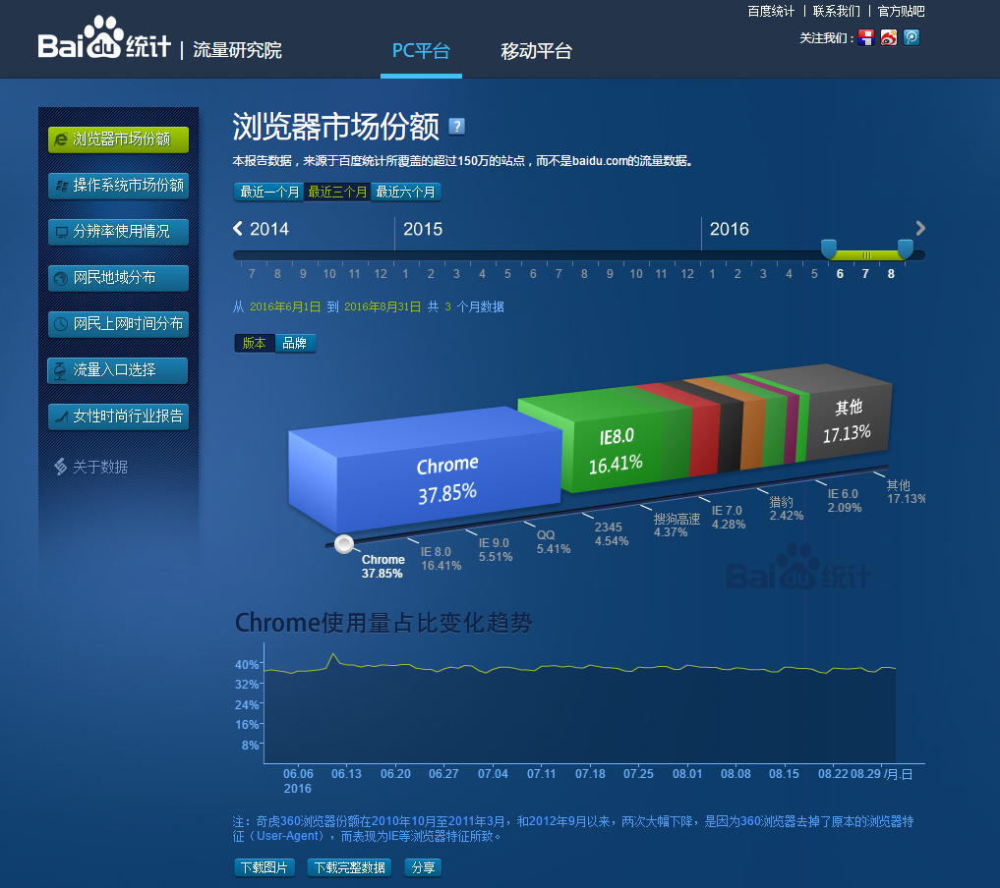

#### 内核（渲染引擎）

```html
 Trident(IE内核)： 
	IE、傲游、世界之窗浏览器、Avant、腾讯TT、猎豹安全浏览器、360极速浏览器、百度浏览器等

 Gecko(firefox)：
     Gecko(Firefox 内核)： Mozilla FireFox(火狐浏览器) 采用该内核，Gecko 的特点是代码完全公开，因此，其可开发程度很高

 webkit(Safari):
	Safari 是苹果公司开发的浏览器，所用浏览器内核的名称是大名鼎鼎的 WebKit。傲游浏览器3、 Apple Safari (Win/Mac/iPhone/iPad)、Symbian手机浏览器、Android 默认浏览器。

 Blink：
	大部分国产浏览器最新版都采用Blink内核。二次开发。谷歌浏览器。Blink 其实是 WebKit 的分支。 

 Presto(Opera) ：
	  Presto（已经废弃） 是挪威产浏览器 opera 的 "前任" 内核，为何说是 "前任"，因为最新的 opera 浏览器早已将之抛弃从而投入到了谷歌怀抱了。  
```

#### 浏览器请求过程【网页显示过程】

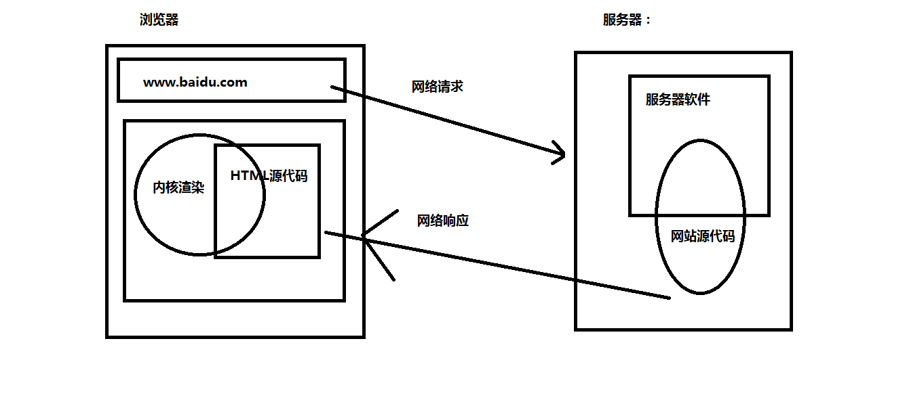

# 二、HTML知识讲解

## 概念

```html
  ☞ HTML：  Hyper   Text  Markup  Language.[  超文本标记语言 ]
	
	◆超文本：
	      在网页中能够实现页面跳转的文本
	 本质：
		 就是将普通文字放到了超链接标签中

     ◆标记： 记号 

	 本质： 就是指HTMl中的各种标签
	 
  ☞ 总结作用：  用来搭建网页结构，制作网页的基础。
```

## 结构

```html
<!doctype  html>
<html>
  
    <head>
         <title>标题</title>
    </head>
    
    <body>
        
    </body>
</html>
```

## 结构详解

```html
☞  <!doctype  html>      ----- 声明文档类型
注意：
	1. 标签必须写
	2. 如果不写，浏览器会以一种怪异模式渲染网页


☞  <html></html>  根标签


☞  <head></head>  表示网页的头部

     ◆在head标签中可以设置当前网页的标题  <title>网页的标题 </title>


☞ <body> </body>  主体标签
	 ◆在浏览器中去除地址栏部分，所有的图文信息都要放到body标签中设置
```

## 1、语法规范

随着 Web 技术的更新，HTML也先后经历了 HTML4.01、XHTML 1.0、HTML5 几个重要的版本，在版本的演变过程中新增或废弃了一些属性，同时对语法规范也做了一些调整，为了能够保证浏览器可以兼容不同版本语法规范的，我们可以使用 <!DOCTYPE> 指示浏览器应该如何处理我们的 HTML。

```html
<!DOCTYPE HTML PUBLIC "-//W3C//DTD HTML 4.01//EN" "http://www.w3.org/TR/html4/strict.dtd">
<html lang="en">
<head>
	<meta http-equiv="Content-Type" content="text/html;charset=UTF-8">
	<title>Document</title>
</head>
<body>
	<!-- 这是HTML4.01的文档规范 -->
</body>
</html>
```

```html
<!DOCTYPE html PUBLIC "-//W3C//DTD XHTML 1.0 Strict//EN" "http://www.w3.org/TR/xhtml1/DTD/xhtml1-strict.dtd">
<html xmlns="http://www.w3.org/1999/xhtml" xml:lang="en">
<head>
	<meta http-equiv="Content-Type" content="text/html;charset=UTF-8">
	<title>Document</title>
</head>
<body>
	<!-- 这是XHTML1.0的文档规范 -->
</body>
</html>
```

HTML5在语法规范上也做了比较大的调整，去除了许多冗余的内容，书写规则更加简洁、清晰。

```html
<!DOCTYPE html>
<html lang="en">
<head>
	<meta charset="UTF-8">
	<title>Document</title>
</head>
<body>
	<!-- HTML5的规范 -->
</body>
</html>
```

可以通过[W3C](https://validator.w3.org/)验证HTML语法的合法性。

## 2、语义化

> 所谓语义化是要使HTML标签具备很好的可读性，可以清晰传达每个标签所要表达的意义，以方便其被友好的处理和解析。

### 语义化标签

对于语义化标签我们并不陌生，如 `<p>` (paragraph) 表示一个段落、`<ul>` (unordered list)表示一个无序列表`<h1>` (headline) ~ `<h6>`表示一系列标题等，在此基础上 HTML5 增加了更多的语义化标签，有利于搜索引擎或辅助设备来理解HTML页面内容。

| 标签        | 语义   |
| ----------- | ------ |
| `<header>`  | 页眉   |
| `<nav>`     | 导航   |
| `<aside>`   | 侧边栏 |
| `<footer>`  | 页脚   |
| `<article>` | 文章   |
| `<section>` | 区域   |
| ......      | 更多   |

本质上新语义标签与 `<div>`、`<span>` 没有区别，只是其具有语义性，使用时除了在HTML结构上需要注意外，其它和普通标签的使用无任何差别，可以理解成 `<div class="nav">` 相当于` <nav>`。

### 兼容处理

在不支持 HTML5 新语议标签的浏览器里，会将这些新的标签解析成行内元素 (inline) 对待，所以我们只需要将其转换成块元素 (block) 即可使用，但是在 IE9 版本以下，并不能正常解析这些新标签，但是却可以识别通过document.createElement('tagName') 创建的自定义标签，于是我们的解决方案就是将HTML5的新标签全部通过document.createElement('tagName') 来创建一遍，这样IE低版本也能正常解析HTML5新标签了。

```html
<!DOCTYPE html>
<html lang="en">
<head>
	<meta charset="UTF-8">
	<title>兼容处理</title>
	<style>
		/* IE8中选择器不能选中新语义标签 header */
		header {
			width: 100%;
			height: 60px;
			background-color: pink;
		}
	</style>
	<script>
		// 通过 document.createElement 可以解决新语义标签的
		// 在IE8以下浏览器的兼容问题
		document.createElement('header');
	</script>
</head>
<body>
	<header>在 IE8中不能正常识别这个新语义标签！</header>
</body>
</html>
```

但在实际开发中我们更多采用的是通过检测IE浏览器的版本来加载第三方的一个 JS 库来解决兼容问题。

谷歌本身就支持html5，所以需要选择性的加载插件，优化性能。

> 利用注释ie浏览器自带的语句
>
> <!--[if lte IE 8]>
> 		<script src="./libs/html5shiv.min.js"></script>
> <![endif]-->
>
> 快捷方式：cc:ie6 ,7,8 .......Tab

```html
<!DOCTYPE html>
<html lang="en">
<head>
	<meta charset="UTF-8">
	<title>兼容处理</title>
	<style>
		/* IE8中选择器不能选中新语义标签 header */
		header {
			width: 100%;
			height: 60px;
			background-color: pink;
		}
	</style>
    <!--[if lte IE 7]>
		<style>
			body {
				background-color: red;
			}
		</style>
	<![endif]-->
	<!--[if lte IE 8]>
		<script src="./libs/html5shiv.min.js"></script>
	<![endif]-->
    /*
    *	解释：lte
    *	拆分：lt 就相当于 转义符 &lt; => “<”
    *         e  就相当于 转义符 &equal; => “=”
    *	总结：就是当if ie浏览器版本小于等于 IE某个版本的时候
    */
</head>
<body>
	<header>在 IE8中不能正常识别这个新语义标签！</header>
</body>
</html>
```

3、表单

### 标签之间的关系

```html
  ☞ 嵌套关系
	  存在子元素和父元素

  ☞ 并列关系
	  元素之间并列存在，没有包含关系
```

### 标签写法分类

```html
☞ 双标签（闭合标签）： 有开始标签和结束标签

☞  单标签（空标签）： 只有开始的标签

注意：
	 1. 所有的双标签都可以包含其他的双标签或者单标签

	 2. 单标签只能单独使用或者单标签只能作为子元素使用
```

### sublime第一个网页

```html
  1. 首先要针对每天的内容单独创建一个文件夹

  2. 使用开发工具打开当天的文件夹

  3. 创建HTML文件
		☞ 选择一个文件夹（点击鼠标右键）-----》新建文件-----》输入文件名+后缀名".html"

		☞  快速生成html结构（必须是一个html文件）  
			  !+tab   或者   HTML:5 +tab

		☞注意：
			 在所有的计算机语言中，遇到所有的特殊符号（；  ""  '' : ...）都是必须是英文输入法下的符号
		
  		☞ 预览：

		   点击鼠标右键----》在浏览器中查看

  4. 创建文件夹
	       选中文件夹（点击鼠标右键）------新建文件夹

  5. 开发工具中提供的快速生成html结构的写法：

		☞快速生成重复的标签
	       例如：   p*10+tab

	    ☞快速生成标签中的内容

	       例如：  p{内容}+tab

		☞ 快速生成重复的标签和内容
		  例如：   p{内容}*10+tab

		☞ 生成嵌套结构写法：
		 例如：    p>span+tab

	    ☞ 生成并列结构：
		  例如：  p+span +tab

```

### 单标签

```html
☞ 换行标签：  <br>
  	例如：俄2名女子被骗至义乌夜店工作 中国警方成<br>功解救
☞ 横线标签：  <hr>
☞ 图片标签：  
☞ 注释标签： <!--注释 横线标签 -->    ctrl+/
```

### 双标签

```html
 ☞ 标题标签
	<h1> ~ <h6>
        
    注意：
	 1. 网页中的标题只能从h1到h6之间获取
        <h1>俄2名女子被骗至义乌夜店工作 中国警方成功解救</h1>
        <h2>俄2名女子被骗至义乌夜店工作 中国警方成功解救</h2>
        <h3>俄2名女子被骗至义乌夜店工作 中国警方成功解救</h3>
        <h4>俄2名女子被骗至义乌夜店工作 中国警方成功解救</h4>
        <h5>俄2名女子被骗至义乌夜店工作 中国警方成功解救</h5>
        <h6>俄2名女子被骗至义乌夜店工作 中国警方成功解救</h6>
        
     2. 在一个网页中，一号标题最好只出现一次（从网页优化角度）

 ☞  段落标签：  <p> </p> 
```

### 格式化（修饰）标签[双标签]

```html
 ☞ 文字加粗
	<strong>我是加粗的文字</strong>  或者 <b>我是加粗的文字</b>

☞ 文字斜体
	<em>我是斜体文字</em>   或者  <i>我是斜体文字</i>

☞ 文字下划线标签：
	<ins>我是带有下划线的文字</ins>  或者  <u>我是带有下划线的文字</u>

☞  删除线：
	<del>不要原价998</del>  或者  <s>998</s>	

☞ 改变文字颜色和大小：
	<font>  </font>
	属性： 写到标签内部，用来描述特定的信息特点
	<font  color="red"  size="9">我是红色文字，有文字大小的效果</font>
	color: 用来改变文字颜色
	size：用来改变文字大小

```

### 图片标签【多媒体标签】

```html
  ☞ 写法：
	 
  ☞ 属性：
	 1. src: 设置图片路径
	 2. 设置宽度   width
	 3. 设置高度   height

	 4. alt属性： 图片无法显示的时候，用来设置图片的描述信息
	    

	 5.  title属性： 设置鼠标悬停时候的文字提示
	   
```

### 路径

```html
☞ 绝对路径：

    1. 凡是带有磁盘目录的路径：    d:\img\1.jpg
    2. 凡是带有具体的网址的路径
	https://ss1.baidu.com/6ONXsjip0QIZ8tyhnq/it/u=1352549854,3370258501&fm=173&app=25&f=JPEG?w=218&h=146&s=FAB22EC514C6054312093B280300F057

☞ 相对路径：（相对当前根目录）

1. 如果一个网页和一个要被访问的资源（图片）在同一个文件夹中，src="文件名称";


2. 如果一个网页和一个被访问的资源（图片），不在同一个文件夹中，如果页面在图片的上一级目录中，src="资源所在的文件夹名/文件名称"


3. 如果一个网页和一个被访问的资源（图片），不在同一个文件夹中，如果页面在图片的下一级目录中，src="../文件名称"


总结：
1. 相对路径使用于所有能够设置文件路径的标签
2. 一个“./”代表当前本文件夹下
3. 一个“../”代表返回一层上级文件
4. 如果“/admin/index.html” 这种代表网站的域名根目录下
```

### 超链接

```html
☞ 本质： 从一个页面跳转到另外一个页面

☞ 写法：
	 <a  href="目标页面的路径">文字</a>

☞ 属性介绍：
	  1. href属性设置目标页面路径
	  2. target属性： 设置打开页面的方式（默认在当前窗口中打开， _self） ， 如果希望在新窗口中打开，设置 _blank
```

### 锚链接

```html
 ☞ 本质：
	  在本页面内部的跳转

 ☞ 写法：
	  <a href="#标签的id值"></a>
```


### link标签

```html
  ☞ 作用：
	 设置网页图标
	 <link rel="icon"  href="favicon.ico">

  ☞ 注意：
		1. 设置网页图标，必须使用link标签，并且 rel属性必须是 icon
	    2. link标签必须放到head标签中
	    3. 网页图标最好直接放到项目的根目录下
		4. 网页图标的格式（后缀名）最好是ico,也可以设置其他图片格式（png,jpg）【不推荐】
```

### ※ href和src和url三个属性的区别

**url 统一资源定位符， src 是引入， href是引用**

#### **href**:

**href**是Hypertext Reference的缩写，表示超文本引用。用来建立当前元素和文档之间的链接。常用的有：link、a。例如：

`<link href="reset.css" rel=”stylesheet“/>`

浏览器会识别该文档为css文档，**并行下载该文档**，并且不会停止对当前文档的处理。这也是建议使用link，而不采用@import加载css的原因。

#### **src**:

**src**是source的缩写，src的内容是页面必不可少的一部分，是引入。src指向的**内容会嵌入到文档中**当前标签所在的位置。常用的有：img、script、iframe。例如：


`<script src="script.js"></script>`

当浏览器解析到该元素时，会暂停浏览器的渲染，知道该资源加载完毕。这也是将js脚本放在底部而不是头部得原因。

**简而言之，src用于替换当前元素；href用于在当前文档和引用资源之间建立联系**

#### url:

URL(Uniform Resource Locator)统一资源定位符是对可以从互联网上得到的资源的位置和访问方法的一种简洁的表示，是互联网上标准资源的地址。互联网上的每个文件都有一个唯一的URL，它包含的信息指出文件的位置以及浏览器应该怎么处理它。

##### 结构

基本URL包含模式（或称协议）、服务器名称（或IP地址）、路径和文件名，如“协议://授权/路径?查询”。完整的、带有授权部分的普通统一资源标志符语法看上去如下：协议://用户名:密码@子域名.域名.顶级域名:端口号/目录/文件名.文件后缀?参数=值#标志

第一部分：

模式/协议（scheme）：它告诉浏览器如何处理将要打开的文件。最常用的模式是超文本传输协议（Hypertext Transfer Protocol，缩写为HTTP），这个协议可以用来访问网络。[1](http://reference.sitepoint.com/css/replacedelements) 其他协议如下：

- http——超文本传输协议资源
- https——用安全套接字层传送的超文本传输协议
- ftp——文件传输协议
- mailto——电子邮件地址
- ldap——轻型目录访问协议搜索
- file——当地电脑或网上分享的文件
- news——Usenet新闻组
- gopher——Gopher协议
- telnet——Telnet协议

第二部分：

文件所在的服务器的名称或IP地址，后面是到达这个文件的路径和文件本身的名称。服务器的名称或IP地址后面有时还跟一个冒号和一个端口号。它也可以包含接触服务器必须的用户名称和密码。路径部分包含等级结构的路径定义，一般来说不同部分之间以斜线（/）分隔。询问部分一般用来传送对服务器上的数据库进行动态询问时所需要的参数。

##### 分类

1、绝对URL【路径】

绝对URL（absolute URL）显示文件的完整路径，这意味着绝对URL本身所在的位置与被引用的实际文件的位置无关。

2、相对URL【路径】

相对URL（relative URL）以包含URL本身的文件夹的位置为参考点，描述目标文件夹的位置。如果目标文件与当前页面（也就是包含URL的页面）在同一个目录，那么这个文件的相对URL仅仅是文件名和扩展名，如果目标文件在当前目录的子目录中，那么它的相对URL是子目录名，后面是斜杠，然后是目标文件的文件名和扩展名。

如果要引用文件层次结构中更高层目录中的文件，那么使用两个句点和一条斜杠。可以组合和重复使用两个句点和一条斜杠，从而引用当前文件所在的硬盘上的任何文件，一般来说，对于同一服务器上的文件，应该总是使用相对URL，它们更容易输入，而且在将页面从本地系统转移到服务器上时更方便，只要每个文件的相对位置保持不变，链接就仍然是有效地。

补充看路径

### meta标签

```html
 <meta charset="UTF-8">   作用： 防止网页出现乱码问题
```

### 列表

```html
 ☞ 作用：
	  1. 将页面中的元素按照一定的顺序显示

 ☞ 无序列表

	<ul>
		<li> 
		   其他标签
		</li>
	</ul>

	注意：
		1. 无序列表中的列表项li可以包含其他标签
		2. ul标签中只能包含li标签

☞ 有序列表
	<ol>
        <li></li>
	</ol>	

	总结：
		1. 有序和无序列表在语义的表现上有区别（一个是按照顺序显示，一个是没有按照顺序显示）
		2. 在用法上没有任何区别

☞ 自定义列表
	<dl>
        <dt> 列表项的一个标题 </dt>
        <dd> </dd>
        <dd> </dd>
    </dl>

    总结：
		1. 自定义列表一般在网页的结尾处使用
```


### 表格

```html
☞ 作用：
1. 在没有css之前，用表格进行网页布局
2. 展示数据

☞ 表格的写法：
◆ 组成
✔ 行    	      <tr></tr>
✔ 单元格（列）  <td></td>
✔ 表格 		 <table></table>

◆ 写法：
<table>
    <tr>
        <td></td>
    </tr>
</table>

◆表格中属性及其他标签的介绍：
✔ border  设置边框
✔ width   设置宽度
✔ height  设置高度
✔ cellspacing  设置单元格和单元格之间的距离 默认距离是2
✔ 设置表格的表头使用th标签
<tr>
    <th> 姓名 </th>
    <th> 年龄 </th>
    <th> 性别 </th>
    <th> 职业 </th>
</tr>

✔ 设置对齐方式： align属性： left  |  center  | right
    ◆如果将align属性设置给tr或者td，那么代表的是改变内容的对齐方式
    ◆如果将align属性设置给table,那么代表的是改变整个标签的对齐方式，对内容没有影响

✔ 设置表格中的标题：
<caption></caption>
例如：
<table border="1"  width="400" height="400" cellspacing="0" align="center">
    // 表格标题
    <caption>人员信息表</caption>
    <tr>
        <th> 姓名 </th>
        <th> 年龄 </th>
        <th> 性别 </th>
        <th> 职业 </th>
    </tr>
</table>
✔ 设置背景色：  bgcolor

☞表格其他部分（了解）
1.  表格的最规范的书写结构
<table>
    // 表头
    <thead> 
        <tr>
            <th> </th>
        </tr>	
    </thead>
    // 表体
    <tbody>
        <tr>
            <td> </td>
        </tr>
    </tbody>
	// 表尾
    <tfoot>
        <tr>
            <td></td>
        </tr>
    </tfoot>
</table>

2. 为什么不按照规范的写法去写？
    ◆这中规范的写法在其他低版本浏览器中会出现兼容性问题
    ◆在高版本浏览器中，会默认自动添加该结构
```

### ※ 表格合并

#### colspan="4"

~~~html
◆横向合并
    <td colspan="4"></td>
~~~

#### rowspan="4"

~~~html
◆ 纵向合并
	<td rowspan="4"></td>
~~~

总结：
**◆  单元格合并后，一定要将多余列删掉**

### ※ 表单

```html
☞ 作用：
用来收集信息-----通过各种表单控件实现收集信息

☞  表单写法：
◆组成：
✔ 表单域 form
✔ 提示信息
✔ 表单控件

☞ 体会表单
◆ action="1.js"      指定一个用来处理数据的后台程序文件
◆ method="post"      设置一种提交数据的方式 get | post

```

### ※ 表单控件

| 表单控件type | 实例                                  | 说明                 |
| ------------ | ------------------------------------- | -------------------- |
| text         | `<input type="text">`                 | 普通输入框           |
| password     | `<input type="password">`             | 特殊密码隐藏输入 *** |
| checkbox     | `<input type="checkbox">`             | 复选框按钮           |
| radio        | `<input type="radio" name="abc">`     | 单选框按钮           |
| file         | `<input type="file">`                 | 上传文件表单         |
| submit       | `<input type="submit">`               | 提交按钮             |
| reset        | `<input type="reset" >`               | 重置按钮             |
| image        | `<input type="image" src="按钮.jpg">` | 图片按钮             |

#### h5新出表单控件

| 类型   | 示例                    | 含义                    |
| ------ | ----------------------- | ----------------------- |
| email  | `<input type="email">`  | 输入一个合法的邮箱地址  |
| tel    | `<input type="tel">`    | 输入一个手机号码        |
| url    | `<input type="url">`    | 输入一个合法的 url 地址 |
| number | `<input type="number">` | 输入一个数值            |
| range  | `<input type="range">`  | 可以拖动的滑块          |
| time   | `<input type="time">`   | 输入一个时间            |
| date   | `<input type="date">`   | 输入一个日期            |

~~~html
☞ 表单控件介绍：
1。 输入框：  <input type="text">

属性：
maxlength  设置最多能输入的字符个数
value      设置默认值
name 	   设置控件名称
readonly="readonly"   设置控件为只读模式（不能输入）
disabled="disabled"   当前控件未被激活（不能输入）

2. 密码输入框： <input type="password">

属性： 与文本输入框的属性一致

3. 复选框： <input type="checkbox">
属性： checked="checked"  实现默认选中项
例如： <input type="checkbox" checked="checked" name="xuan">吃
	  <input type="checkbox" name="xuan">喝
* name 的值需要设置一样，提交数据后，后台需要用到

4.单选控件： <input type="radio" name="abc">男

注意：
1. 如果要实现单选效果必须设置相同的name值
2. 设置单选控件默认选中项  checked="checked"

5. 上传控件：<input type="file">

6. 文本域： <textarea></textarea>  【富文本编辑器插件】

7. 按钮：

☞ 表单数据提交按钮
<input type="submit">
<input type="image" src="按钮.jpg">

☞ 重置按钮： 将表单控件恢复到默认值
<input type="reset" name="">

☞ 普通按钮（和js配合使用）： 
<input type="button" name="" value="按钮">
~~~

#### H5控件演示

~~~html
<form action="">
    邮箱：<input type="email"><br>   <!-- 点击提交后提示必须包含@标识, or @后边输入不完整 -->
    手机: <input type="tel"><br>	   <!-- 点击提交后提示必须输入数字 -->
    url地址：<input type="url"><br>  <!-- 提示请输入网址 -->
    数值：<input type="number"><br>  <!-- 输入框右侧出现上下箭头，可以调整数值 -->
    滑块：<input type="range"><br>   <!-- 输入框变为可以拖动的滑块 -->
    时间：<input type="time"><br>    <!-- 输入框中有可以调节的时分数值：00:00 -->
    年月：<input type="date"><br>    <!-- 可以选择年月日：年/月/日 -->
    <input type="submit">
</form>
~~~

#### 表单属性

| 属性         | 用法                                        | 含义             |
| ------------ | ------------------------------------------- | ---------------- |
| placeholder  | `<input type="text" placeholder="">`        | 提示占位符       |
| autocomplete | `<form autocomplete="off">`  off关闭 on开启 | 自动补充输入内容 |
| autofocus    | `<input type="text" autofocus>`             | 自动获得焦点     |
| multiple     | `<input type="file" multiple>`              | 支持多选         |
| novalidate   | `<form novalidate></form>`                  | 关闭表单默认验证 |
| required     | `<input type="text" required>`              | 表单不能为空     |
| pattern      | `<input type="text" pattern="\d">`          | 正则验证表单     |

placeholder：默认文本提示语句。

autocomplete: 例如：浏览器自带的，当输入的内容之前有过，那就会自动弹出下拉框，显示补全的内容。

multiple：文件上传多选案例。

### 表单下拉列表

~~~html
5. 下拉列表框：
<select>
    <option value="河北省">河北</option>
    <option>河南</option>
    <option>山东</option>
    <option>山西</option>
</select>
或者
<select>
    <optgroup label="河北省">
        <option>保定</option>
        <option>邯郸</option>
        <option>张家口</option>
        <option>唐山</option>
    </optgroup>
</select>

属性：
设置默认选中项： selected="selected"
其中： select的value值就是<option>的value值
~~~

### HTML 中有用的字符实体

注释：实体名称对大小写敏感！

| 显示结果 | 描述              | 实体名称          | 实体编号 |
| -------- | ----------------- | ----------------- | -------- |
|          | 空格              | &nbsp;            | &#160;   |
| <        | 小于号            | &lt;              | &#60;    |
| >        | 大于号            | &gt;              | &#62;    |
| &        | 和号              | &amp;             | &#38;    |
| "        | 引号              | &quot;            | &#34;    |
| '        | 撇号              | &apos; (IE不支持) | &#39;    |
| ￠       | 分（cent）        | &cent;            | &#162;   |
| £        | 镑（pound）       | &pound;           | &#163;   |
| ¥        | 元（yen）         | &yen;             | &#165;   |
| €        | 欧元（euro）      | &euro;            | &#8364;  |
| §        | 小节              | &sect;            | &#167;   |
| ©        | 版权（copyright） | &copy;            | &#169;   |
| ®        | 注册商标          | &reg;             | &#174;   |
| ™        | 商标              | &trade;           | &#8482;  |
| ×        | 乘号              | &times;           | &#215;   |
| ÷        | 除号              | &divide;          | &#247;   |

如需完整的实体符号参考，请访问我们的 [HTML 实体符号参考手册](http://www.w3school.com.cn/tags/html_ref_entities.html)。

### div标签和span标签介绍

```html
 ☞ div:
	 1. 使用div布局，会独占一行显示

 ☞ span：
	 1. 使用span布局，会在一行上显示

  ☞ 注意：
		1. div和span之间可以相互嵌套，但是最好用div包含span。
		2. 行内元素不能嵌套块级元素
```

### 行内元素与块级元素

**块级元素列表**

| 常用块标签                                 | 标签示意                       |
| ------------------------------------------ | ------------------------------ |
| `<div>`                                    | 定义文档中的分区或节           |
| `<dl>`                                     | 定义列表                       |
| `<dt>`                                     | 定义列表中的项目               |
| `<dd>`                                     | 定义列表中定义条目             |
| `<h1> ~ <h6>`                              | 定义标题大小                   |
| `<form>`                                   | 创建 HTML 表单                 |
| `<hr>`                                     | 创建一条水平线                 |
| `<ul>`                                     | 定义无序列表                   |
| `<ol>`                                     | 定义有序列表                   |
| `<li>`                                     | 标签定义列表项目               |
| `<p>`                                      | 标签定义段落                   |
| `<table><thead><th><tbody><tr><td><tfoot>` | 表格各个标签                   |
| `<noscript>`                               | 定义在脚本未被执行时的替代内容 |
| `<caption>`                                | 定义表格标题                   |

**行内元素列表**

| 常用行内标签 | 标签示意                          |
| ------------ | --------------------------------- |
| `<span>`     | 组合文档中的行内元素【常用】      |
| `<a>`        | 标签可定义锚                      |
| `<b>`        | 字体加粗                          |
| `<br>`       | 换行                              |
| `<i>`        | 斜体文本效果                      |
| ``      | 向网页中嵌入一幅图像              |
| `<input>`    | 输入框                            |
| `<label>`    | 标签为 input 元素定义标注（标记） |
| `<select>`   | 创建单选或多选菜单                |
| `<strong>`   | 加粗                              |
| `<textarea>` | 多行的文本输入控件                |
| `<em>`       | 定义为强调的内容                  |

**可变元素素列表**
可变元素为根据上下文语境决定该元素为块元素或者内联元素

| 常用标签   | 标签示意                                     |
| ---------- | -------------------------------------------- |
| `<button>` | 按钮                                         |
| `<iframe>` | 创建包含另外一个文档的内联框架（即行内框架） |
| `<map>`    | 客户端图像映射（即热区）                     |
| `<object>` | object对象                                   |
| `<script>` | 客户端脚本                                   |

二、行内元素与块级函数的三个区别
1、行内元素与块级元素直观上的区别

- 行内元素会在一条直线上排列，都是同一行的，水平方向排列
- 块级元素各占据一行，垂直方向排列。块级元素从新行开始结束接着一个断行。

2、块级元素可以包含行内元素和块级元素。行内元素不能包含块级元素。

3、行内元素与块级元素属性的不同，主要是盒模型属性上

行内元素设置width无效，height无效(可以设置line-height)，margin上下无效，padding上下无效

三、行内元素转换为块级元素

display:block  转换为块级

display:inline  转换为行内

display:inline-block  转换为行内块级

# 三、CSS知识讲解

### CSS概念

☞ 层叠样式表或者叫级联样式表(英文全称：Cascading  Style  Sheets)。

☞ 层叠： 指的是css一个特性。

### CSS语法

☞ 选择器： 就是在网页中能够选中对应标签的工具

☞ 语法结构

```css
选择器 {
    属性: 值;
    属性: 值；
    。。。
}
例子：
div {
	width:200px; // 宽200像素
	height: 200px;  // 高200像素
}

☞总结一部分常见的简单的属性和值：
    width：  改变宽度
    height:  改变高度
    color： 前景色【 文字颜色 】
    background-color: 背景色
    font-size: 设置文字大小
    text-align:  设置内容对齐方式    left | center | right
    text-indent:  设置首行缩进效果   em
```
### CSS书写位置

 ☞ CSS书写位置： 确定CSS代码要写到哪。

```css
1. 可以将CSS代码直接写到html页面中  （内嵌式写法）
例如：
<head>
    <meta charset="UTF-8">
    <title>Document</title>
    <style type="text/css">
        CSS语法写css代码
	</style>
</head>

2. 可以将CSS代码单独放到一个css文件中。后缀名是.css  (外联式写法)
◆ 首先新建一个CSS文件
◆ 将CSS文件引入到html页面中
例如：
<head>
    <meta charset="UTF-8">
    <title>Document</title>
    <!-- 引用外部样式标签 -->
    <link rel="stylesheet" type="text/css" href="1.css">
</head>
注意：
	一个网页中可以通过link标签引用多个外部样式表

3. 行内式写法： 将CSS代码写到标签内部
例如：
	<p style="color: red; font-size: 100px;">大发发大幅度</p>
注意：
1。行内样式写法，必须将CSS代码放到style属性中设置。
```

### ※ CSS基础选择器

#### 标签选择器

~~~css
☞ 语法：
    div {
        width:200px;
        属性: 值；
        。。。
    }
 ☞ 注意：
	1. 标签选择器，必须是HTML标签名
	2. 标签选择器选中的就是对应的标签，与html结构无关。
~~~

#### ◆ 类选择器

~~~html
☞ 语法：
    .自定义类名 {
        属性: 值;
        属性：值;
        ...
    }
☞ 实例：
◆ 先定义一个类样式
    .abc {
        color: red;
     }
◆ 标签通过class属性调用类样式即可
<span class="abc">我是有颜色的文字</span>
~~~

##### 类选择器命名规范

☞ 不能使用数字或者以数字开头定义类名

☞ 不能使用特殊符号或者以特殊符号开头定义类名

☞ 不推荐使用汉字

>
> 1. 推荐设置的类名：
>    ✔ 可以使用拼音
>    ✔ 最好的方式是使用单词

##### 类选择器特点

 ☞ 一个类样式可以被多个标签同时调用

 ☞ 一个标签可以同时调用多个类样式

~~~html
<p class="public size">文字1</p>
<p class="public">文字2</p>
<div class="public size">文字3</div>
<span class="size public">文字4</span>
~~~

#### ID选择器

~~~html
☞ 语法：
    #自定义ID名  {
        属性: 值;
        属性: 值;
    }

☞ 用法：
例如：
1 => 先定义ID样式
    #one {
    	color: red;
    }

2 => 标签通过ID属性调用
<p id="one">adsfafd</p>

☞ 与类选择器的区别：
    ◆ 不推荐让多个标签同时调用一个ID样式（不符合编程规则，导致唯一标识不唯一）
    ◆ 一个标签一次只能调用一个ID样式
~~~

#### 通配符选择器

~~~html
☞ 语法：
    * {
        属性： 值;
        ...
    }
☞ 案例：
	* {
       margin: 0;
       padding: 0;
    }
☞ 特点：
1. 将页面中所有的标签都选中，设置统一的样式
~~~

#### 后代选择器

~~~
☞  后代选择器只适用于嵌套结构的标签。
☞  语法：
    ul li {
		float:left;
    }
☞ 总结:
	1. 后代选择器只适用于嵌套结构的标签
	2. 后代选择器只能选中后代元素（直接子元素和间接子元素），不能选中父元素。
~~~

#### 子代选择器

~~~html
☞ 只适用于嵌套结构中

☞ 语法：
    li>a {
	 // 直接的a
    }
☞ 实例：
	<ul>
		<li>
			<a href=""></a> // 被选中的a元素
			<div>
				<ul>
					<li><span><a href=""></a></span></li>
				</ul>
			</div>
		</li>
	</ul>
☞ 总结：
   1. 子代选择器只能选中直接子元素。
~~~

#### 交集选择器

标签指定式选择器

~~~css
 ☞ 语法：
	 例如：
     /* 标签指定式选择器 
     既是p标签又拥有one类名
     也叫交集选择器
     */
     p.one {
     color: red;
     }
~~~

#### 并集选择器

~~~
☞ 语法：
    选择器，选择器, 选择器 {

    }
☞ 实例：
	body, dl, dd, h1, h2, h3, h4, h5, h6, p, form{
        margin:0;
        padding:0;
	} 
☞ 总结：
	1. 并集选择器一般用来设置一些标签公共的样式（统一的样式）	
	2. 并集选择器与html结构无关
~~~

#### 伪类选择器

需要通过用户的动作实现选中标签。

~~~css
☞ 语法：
：link {}  设置链接的样式【不推荐使用，有兼容性】	

/* 设置标签被访问过后的样式 */    
【该选择器中只能设置与颜色相关的属性，存在缓存问题】
:visited { color: yellow; }

:hover {}  	设置鼠标悬停时候的样式
:active {}  设置标签被激活时候的样式
:focus {}   设置控件获取到鼠标焦点的时候，触发该选择器
~~~

### ※ CSS3选择器

> CSS3新增了许多灵活查找元素的方法，极大的提高了查找元素的效率和精准度。

#### 属性选择器

通过属性来选择元素，具体有以下5种形式：

| 选择器       | 示例                       | 含义                                |
| ------------ | -------------------------- | ----------------------------------- |
| E[attr]      | input[value]               | 存在attr属性即可                    |
| E[attr=val]  | a[href="http://itcast.cn"] | 属性值完全等于val                   |
| E[attr*=val] | img[src*="img"]            | 属性值里包含val字符并且在“任意”位置 |
| E[attr^=val] | span[class^="icon-"]       | 属性值里包含val字符并且在“开始”位置 |
| E[attr$=val] | img[src$=".png"]           | 属性值里包含val字符并且在“结束”位置 |

#### ◆ 伪类选择器

除了以前学过的`:link、:active、:visited、:hover`，CSS3又新增了其它的伪类选择器。

##### 结构伪类

以某元素（E）相对于其父元素或兄弟元素的位置来获取无素:

| 选择器              | 示例                 | 含义                            |
| ------------------- | -------------------- | ------------------------------- |
| E:first-child       | li:first-child       | 其父元素的第1个子元素           |
| E:last-child        | li:last-child        | 其父元素的最后1个子元素         |
| E:nth-child(n)      | li:nth-child(2)      | 其父元素的第n个子元素           |
| E:nth-last-child(n) | li:nth-last-child(3) | 其父元素的第n个子元素（倒着数） |

n遵循线性变化，其取值0、1、2、3、4、... 

n可是多种形式：nth-child(2n+0)、nth-child(2n+1)、nth-child(-1n+3)等。

##### 空伪类

```css
/** E:empty 选中没有任何子节点的E元素；（使用不是非常广泛）**/
a:empty {
    display: none;
}
```

##### 排除伪类

```css
/** E:not(selector) 除selector（任意选择器）外的元素会被选中 **/
li:not('.special') {
    background-color: blue;
}
```

##### ◆ 伪元素

###### E::first-letter

E::first-letter文本的第一个单词或字（如中文、日文、韩文等）

```css
/*伪元素选择器语法格式为 ::*/
li::first-letter {
    color: red;
}
```

###### E::first-line

E::first-line 文本第一行

```css
p::first-line {
    color: red;
}
```

###### E::selection

E::selection 可改变选中文本的外观样式

```css
p::selection {
    background-color: pink;
    color: red;
}
```

###### E::before和E::after

```css
.demo::before {content: '1';}
.demo::after {content: '';}
```

案例：

```js
/* before 和 after 在css2.1中称为伪类 */
/* before 和 after 在css3中称为伪元素 */

.box:before {
    /* 1. 必须要配合 content 属性使用 */
    /* 哪怕 content 值为空 */
    content: '11111';
    color: red;
    /* 2. 默认为行内元素 */
    display: block;
    width: 100px;
    height: 100px;
    background-color: pink;
}

.box:after {
    content: '2222';
    display: block;
    width: 100px;
    height: 100px;
    background-color: pink;
}

/* 3. before 和 after 不影原来的真实 DOM */
/* before 创建在了父元素开始标签后 */
/* after 创建在了父元素结束标签前 */

在现实开发中建议使用 : 来设置 before 和 after
```

在E元素内部的开始位置和结束位创建一个元素，该元素为行内元素，且必须要结合content属性使用。

注：E:after、E:before 在旧版本里是伪元素，CSS3的规范里“:”用来表示伪类，“::”用来表示伪元素，但是在高版本浏览器下E:after、E:before会被自动识别为E::after、E::before，这样做的目的是用来做兼容处理。

**常用初始化页面样式**

```css
body, dl, dd, h1, h2, h3, h4, h5, h6, p, form{
	margin:0;
    padding:0;
} 
ol,li，ul{
	margin:0; padding:0;
}
body {
    line-height:1;
}
:focus {
    outline: 1;
}
article,aside,canvas,details,figcaption,figure,
footer,header,hgroup,menu,nav,section,summary { 
    display:block;
}

nav ul {
    list-style:none;
}

blockquote, q {
    quotes:none;
}

blockquote:before, blockquote:after,
q:before, q:after {
    content:'';
    content:none;
}

a {
    margin:0;
    padding:0;
    border:0;
    font-size:100%;
    vertical-align:baseline;
    background:transparent;
}

ins {
    background-color:#ff9;
    color:#000;
    text-decoration:none;
}

mark {
    background-color:#ff9;
    color:#000; 
    font-style:italic;
    font-weight:bold;
}

del {
    text-decoration: line-through;
}

abbr[title], dfn[title] {
    border-bottom:1px dotted #000;
    cursor:help;
}

table {
    border-collapse:collapse;
    border-spacing:0;
}

hr {
    display:block;
    height:1px;
    border:0;   
    border-top:1px solid #cccccc;
    margin:1em 0;
    padding:0;
}

input, select {
    vertical-align:middle;
```

### ※ CSS特性

#### 层叠性

```css
☞ 层叠性：
1. 必须使用同一类的选择器选中同一个标签。
2. 最后定义的样式会将前面定义的样式重复部分覆盖掉
```



#### 继承性

```css
☞ 继承性：
    1. 首先在嵌套结构中，如果子元素默认没有设置样式
    2. 如果给父元素设置了样式，子元素也随之发生样式的改变

☞可以被继承的属性：
    color
    font
    属性都可以继承

☞ 哪些属性不能被继承：
    1. width
    2. height
    3. 背景颜色
```



#### 优先级

```css
 ☞ 优先级：
	  如果使用不同的选择器指向同一个标签

 ☞ 排序：
	标签选择器 < 类选择器 <ID选择器 < 行内样式 <!important
	   10		 100		1000    10000     100000+

	✔  继承的权重为0

	✔  权重可以叠加  （当使用不同选择器指向同一个标签的时候）
```

### ※ 颜色表示方式

#### 预定义表示颜色

预定义表示颜色   （red,green,blue,yellow....）

#### rgb()

#### rgba()

Red、Green、Blue、Alpha即RGBA

> R (red) 红色：取值范围 0 ~ 255
> 
> G (green) 绿色：取值范围 0 ~ 255
> 
> B (blue) 蓝色：取值范围 0 ~ 255
>
> Alpha	    0-1	

~~~css
rgb()表示颜色(三原色)
	background-color: rgb(100,255,0);
rgba()背景色透明
.box {
    background-color: rgba(0, 0, 0, 0.5)
}
~~~

#### 十六进制颜色

```css
取值范围十六进制：#0-9(a-f)
例如：
·background-color: #0acfde;
常用：
	白色：#fff
	黑色：#000
	中灰：#ccc
```

####  hlsa()H5颜色

Hue、Saturation、Lightness、Alpha 即 HSLA

> H 色调：取值范围 0~360，0/360 表示红色、120表示绿色、240表示蓝色
>
> S 饱和度：取值范围 0%~100%
>
> L 亮度：取值范围 0%~100%
>
> A 透明度：取值范围 0~1

~~~css
.box {
    background-color: hsla(120, 50%, 40%, 0.4)
}
~~~

注：RGBA、HSLA可应用于所有使用颜色的地方。

### ※ 文本

#### font复合属性介绍

font属性可以用来设置与文字相关的样式。

```css
◆ 文字大小
	font-size

◆ 文字字体
	font-family
✔ 可以设置中文的字体
✔ 可以设置英文的字体
例如：
	font-family: "黑体";

✔ 可以设置对应unicode编码
	font-family: "\5B8B\4F53";

总结:
1. 设置文字字体可以使用以上三种方式
2. 可以一次设置多个字体，中间使用逗号隔开
	font-family: "宋体 ,微软雅黑, 黑体";

◆ 设置文字是否加粗显示
	font-weight: normal(正常显示) =400 | bold （加粗显示）=700
备注： 设置具体值的时候不需要带单位。

◆ 文字是否斜体显示
	font-style: normal(正常显示)  | italic （斜体显示）

◆ 设置文字的行高： 可以按照文字的高度去理解
	line-height: 本质就是通过行高设置文字的上下间距

◆ font合写：
	font: 700 italic 30px/30px "宋体";

◆注意：
1. 在font合写中，必须设置font-size和font-family
2. 在font合写中，font-size必须在font-family之前设置
3. 在font合写中，如果五个属性都要设置，请按照font: 700  italic   30px/30px  "宋体";顺序去设置
```

#### 文字阴影

> 第一个值： 代表阴影在水平方向的位置（正数从左向右，负数从右向左）
> 第二个值： 代表阴影在垂直方向的位置（正数从上向下，负数从下往上走）
> 第三个值： 代阴影的模糊度 （不能设置负数）
> 第四个值： 代表阴影颜色

~~~css
单个阴影
	text-shadow: 1px  1px  10px red;
可以给文字同时设置多个阴影效果，使用逗号隔开。
	text-shadow: 1px  1px  10px red,
				-3px  -3px  10px blue;
~~~

#### 文字垂直居中

~~~css
☞ line-height的使用：
1. 通过line-height改变文字的上下间距
2. 通过line-height属性可以实现文字垂直居中（设置行高=容器的高度）

☞ 为什么line-height可以实现文字垂直居中
行高=文字大小+上间距+下间距
1. 行高的本质就是改变文字的上下间距
2. 文字的大小可以影响行高值（没有设置行高的情况下）

注意：
1. line-height只能让文字垂直居中，不能让标签垂直居中
~~~



#### 文字溢出

当父盒子大小无法承载内部文字的时候，文字会溢出。css提供了强制换行和溢出隐藏的方法

~~~css
css3专门提供了一个处理文字溢出的一个属性
/*text-overflow*/
	text-overflow: ellipsis;

text-overflow必须配合其它属性使用,以下为实现条件
/*1. 强制文本不换行(css3)*/
	white-space: nowrap;
/*2. overflow:hidden*/
	overflow: hidden;

/*强制文字换行,也包括英文无空格*/
	word-break: break-all;
~~~

### ※ 文字解决默认间距问题

#### 表单（inline-block元素）输入框之间的默认间距：去除

#### 常见出现问题元素：

1、`\<input />`标签之间

2、div ，a 块级标签水平转换为display: inline-block; 的时候；

#### 解决方法:

##### 1、去除a标签的之间的空格，一行不可取。

（1）、可以用标签拆开换行的形式书写。

```html
<div>
	<a href="" >文字<
	/a><a href="" >文字<
	/a><a href="" >文字<
	/a>
</div>
```

（2）、可以使用注释的形式书写。

```html
<div>
	<a href="" >文字</a><!-- 
	--!><a href="" >文字</a><!-- 
	--!><a href="" >文字</a><!-- 
	--!>
</div>
```

##### 2、使用margin取负值

```css
.space a {
  display:inline-block;
  margin-right: -3px;
}

*marginfu负值的大小与上下文的字体和文字大小相关。
```

##### 3、使用font-size: 0;

```css
.space {
  font-size: 0;
}
.space a {
  font-size: 12px;
}

Chrome兼容模式 
.space {
  font-size: 0;
  -webkit-text-size-adjust:none;
}
```

##### 4、使用letter-spacing  字符间距

```css
.space {
  letter-spacing: -3px;
}
.space a {
  letter-spacing: 0;
}
* Opera浏览器UI小间距1像素，letter-spacing再小点可以还原
```

##### 5、使用word-spacing   单词间距

```css
.space {
  word-spacing: -6px;
}
.space {
  word-spacing: 0;
}

* 负值越大越好
* 谷歌浏览器Chrome兼容的问题
.space {
  display:inline-table;
  或display:table;
  word-spacing: -6px;
}
```

###※ 盒子模型

> 盒子： 装东西的一个容器
>
> 网页中盒子： 指的就是各种标签，一般都特指 div 和 span
>
>  网页中的盒子有什么作用？
> 		就是用来网页布局

~~~css
☞ 盒子的组成：
		1. 边框     border
		2. 内边距   padding  内容区域和边框之间的距离， 改变的是盒子中内容的位置
		3. 外边距   margin   设置盒子与盒子之间的距离， 改变的是盒子整体的位置
		4. 内容区域 content   盒子十几内容区域
~~~

#### 内边距(padding)

~~~css
☞ 内边距： 内容区域和边框之间的距离 （内边距是用来改变内容区域的位置，不能改变当前容器的位置）

☞ 内边距设置：
    padding-left: 20px;
    padding-top: 20px;
    padding-right: 20px;
    padding-bottom: 20px;

☞ 内边距合写：
1. 当设置一个值，代表上，右，下，左四个方向的距离
2. 设置两个值，第一个值代表上下，第二值代表左右
3. 设置三个值， 第一个值代表上， 第二值代表左右 ， 第三值代表下
4. 设置四个值， 上， 右， 下 ，左
~~~

#### 外边距(margin)

~~~css
☞ 外边距： 设置盒子与盒子之间的距离（  外边距改变的是盒子整体的位置，不能改变内容的位置  ）
☞ 外边距不能改变盒子大小。
☞ 外边距使用和内边距一样。

☞ 外边距合写与内边距合写一样的顺序。

☞ 外边距特殊问题：
1. 外边距塌陷（当子元素使用margin-top往下移动的时候，父元素也跟着移动）
◆  给父元素设置边框
◆  给父元素设置overflow:hidden;

2. 外边距合并效果（设置上下外边距的时候，取最大值）。
~~~

 **总结盒子十几大小的计算：**
	 如果在写代码过程中，设置完宽度和高度后，要设置边框或者内边距的时候，要考虑盒子**实际大小问题**

CSS3 中可以通过 box-sizing 来指定盒模型，指定为 content-box、border-box时计算盒子大小的方式有所不同

可以分成两种情况：

#### content-box

说明：在内容宽度和高度**之外**绘制内边距和边框

#### border-box

说明：在已设定的宽度和高度**之内**绘制设定元素的边框及内边距

~~~css
以整体为准，不会被内容或padding撑开
/** 盒子内容区域 content = width - padding - border **/ 
box-sizing: border-box;

以整体为准，会被padding撑开
/** 盒子内容区域 content = width **/
box-sizing: content-box;

--------------------- 
.content-box{
    width: 100px;
    height: 100px;
    border: 1px solid;
    padding: 0px 10px;
    box-sizing: content-box;
}
.border-box{
    box-sizing: border-box;
}
<div class="content-box">content-box</div>
<div class="content-box border-box">border-box</div>

~~~

结果截图

content-box截图 
盒子宽度：1×2（border×2）+10×2（padding×2）+100(content-width)=122 
盒子高度：1×2（border×2）+0×2（padding×2）+100(content-height)=102




border-box截图 
盒子宽度：1×2（border×2）+10×2（padding×2）+78(content-width)=100 
盒子高度：1×2（border×2）+0×2（padding×2）+98(content-height)=100



### ※ 边框

~~~css

1. 设置边框颜色   border-color

2. 设置边框样式   border-style: none(没有边框) | solid (实线边框)  | dashed(虚线边框) | dotted (点线边框)

3. 设置边框宽度   border-width

☞ 边框合写方式：
1. border: pink  solid  10px;
◆ 必须设置border-style
◆ 没有顺序的限制

2. 可以为每一个边框设置样式：
border-top: red solid 1px;
border-left: blue solid 5px;
border-right: yellowgreen dotted 5px;
border-bottom: orange dashed 5px;

☞ 边框其他部分：
1. 去掉边框  border: 0px none; | border-style: none;
2./* 轮廓线 */
outline-style: none;
~~~

### ※ 边框圆角C3

#### 圆角


为了方便表述，我们将四个角标记成1、2、3、4，如2代表右上角，CSS里提供了 border-radius 来设置圆角横纵轴半径值。

分别设置横纵轴半径，以“/”进行分隔，遵循“1，2，3，4”规则，“/” 前面的1~4个用来设置横轴半径（分别对应横轴1、2、3、4位置 ），“/” 后面1~4个参数用来设置纵轴半径（分别对应纵轴1、2、3、4位置 ）。

```css
1、支持简写模式，具体如下：
/** 表示四个角的横纵轴半径都为10px **/
border-radius: 10px; 

/** 表示1和3角横纵轴半径都为10px，2和4角横纵轴半径为5px **/
border-radius: 10px 5px; 

/** 表示1角模纵轴半径都为10px，2和4角横纵轴半径都为8px，3角的横纵轴半径都为8px **/
border-radius: 10px 5px 8px; 

/** 表示1角横纵轴半径都为10px，表示2角横纵轴半径都为8px，表示3角横纵轴半径都为6px，表示4角横纵轴半径都为6px **/
border-radius: 10px 8px 6px 4px; 

2、圆的半径可以有两个，即完整写法，两组分别对应每个角的x轴半径和y轴半径
border-radius: 50px/20px;
border-radius: 10px 20px 30px 40px / 50px 60px 70px 80px;
border-radius: 10px 20px/20px 40px;

3、百分比指的是盒子的宽和高/* 包括padding和border */，如果设置数值需要算入padding和border
border-radius: 50%/50%;

4、table中的合并边框问题【推荐使用css】
border-collapse: collapse;  /* 该属性只能合并表格中的边框 */
```

#### 阴影

与文字阴影类似，可分别设置盒子阴影偏移量、模糊度、颜色（可设透明度）。

```css
语法：
.box {
    box-shadow: 5px 5px 5px #CCC;
}
box-shadow: 1px   2px   10px   red;

☞ 盒子阴影设置多个：
box-shadow: 3px 3px 10px blue,
-3px -3px 10px yellowgreen;

☞ 设置内阴影：
box-shadow:inset 3px 3px 10px blue;

/**
    1、水平偏移量 正值向右 负值向左；
    2、垂直偏移量 正值向下 负值向上；
    3、模糊度是不能为负值；
    4、inset可以设置内阴影；
**/
```

### ※ 背景

#### background背景

#### background-position

~~~css
1. 设置背景颜色
background-color: red；

2. 设置背景图片
background-image: url(2.png);   

3. 默认背景图片在容器中要平铺
background-repeat: repeat |  no-repeat  |  repeat-y  |  repeat-x
分别对应值	===>  /* 平铺 |   不平铺    |   y轴平铺   |  x轴平铺 */

4. 设置背景图片位置：
background-position: center center;
✔  可以给该属性设置具体的方位名称  
left | right |  top | bottom | center
✔ 可以给该属性设置具体数字
background-position: 50px 10px;
注意：
1. 如果该属性中出现具体数值，第一个值表示水平方向，第二个值代表垂直方向
2. 如果只设置一个值，第二个值默认代表center

☞ background合写方式：
background: red  url(2.png) no-repeat center;
1. 没有属性个数的要求
2. 没有顺序的要求
3. 默认背景颜色为透明色 
background-color: transparent;

~~~

#### 多背景: 

一个容器可以同时设置多张背景图片。

设置多背景，只要在背景图片后使用逗号隔开即可

```css
◆ 使用背景合写的方式设置
例如：
	background:  url(img/bg1.png) no-repeat left top,
				url(img/bg2.png) no-repeat right top,
				url(img/bg3.png) no-repeat right bottom,
				url(img/bg4.png) no-repeat left bottom,
				url(img/bg5.png) no-repeat center;
```

> 背景在CSS3中也得到很大程度的增强，比如背景图片尺寸、背景裁切区域、背景定位参照点、多重背景等。

#### background-size

通过 background-size 设置背景图片的尺寸，就像我们设置 img 的尺寸一样，在移动Web开发中做屏幕适配应用非常广泛。

其参数设置如下：

- 可以设置长度单位(px)或百分比（设置百分比时，参照盒子的宽高）
- 设置为cover时，会自动调整缩放比例，保证图片始终填充满背景区域，如有溢出部分则会被隐藏
- 设置为contain会自动调整缩放比例，保证图片始终完整显示在背景区域

```css
.box {
    width: 200px;
    height: 200px;
    border: 1px solid #CCC;
    background-image: url(./xxx.jpg);
    background-size: cover;
}

.demo {
    width: 200px;
    height: 200px;
    border: 1px solid #CCC;
    background-image: url(./xxx.jpg);
    background-size: contain;
}

.test {
    width: 200px;
    height: 200px;
    border: 1px solid #CCC;
    background-image: url(./xxx.jpg);
    background-size: 100% auto;
}
```

#### background-origin

通过 background-origin 可以设置背景图片定位(background-position)的参照原点。

其参数设置如下：

- border-box以边框做为参考原点
- padding-box以内边距做为参考原点
- content-box以内容区做为参考点

```css
.box {
    width: 200px;
    height: 200px;
    border: 10px solid red;
    padding: 40px;
    background-image: url(./xxx.jpg);
    background-position: 0 0;
    background-origin: border-box;
}

.demo {
    width: 200px;
    height: 200px;
    border: 10px solid red;
    padding: 40px;
    background-image: url(./xxx.jpg);
    background-position: 0 0;
    background-origin: padding-box;
}

.test {
    width: 200px;
    height: 200px;
    border: 10px solid red;
    padding: 40px;
    background-image: url(./xxx.jpg);
    background-position: 0 0;
    background-origin: content-box;
}
```

#### background-clip

通过background-clip，可以设置对背景区域进行裁切，即改变背景区域的大小。

其参数设置如下：

- border-box裁切边框以内为背景区域
- padding-box裁切内边距以内为背景区域
- content-box裁切内容区做为背景区域

```css
.box {
    width: 200px;
    height: 200px;
    border: 10px solid red;
    padding: 40px;
    background-color: pink;
    background-clip: border-box;
}

.demo {
    width: 200px;
    height: 200px;
    border: 10px solid red;
    padding: 40px;
    background-color: pink;
    background-clip: padding-box;
}

.test {
    width: 200px;
    height: 200px;
    border: 10px solid red;
    padding: 40px;
    background-color: pink;
    background-clip: content-box;
}
```

### ※ 背景渐变

#### 渐变

> 渐变是CSS3当中比较丰富多彩的一个特性，通过渐变我们可以实现许多炫丽的效果，有效的减少图片的使用数量，并且具有很强的适应性和可扩展性。

线性渐变

linear-gradient线性渐变指沿着某条直线朝一个方向产生渐变效果，如下图是从黄色渐变到绿色。

```css
<div id="line"></div>
#line {
    width: 600px;
    height: 40px;
    /* 1、可以写成这样一个方向的，后边是颜色和其所在的位置，可以设置多个 */
    background-image: linear-gradient(to right, pin 20%, yellow 40%);
    /* 2、也可以写成这样用角度表示的，后边是颜色值，浏览器会自动过渡颜色*/
    background-image: linear-gradient(135deg, #000, #FFF);
}
```

线性渐变案例：

~~~html
<style type="text/css">
    .line {
        width: 600px;
        height: 40px;
    }
/* 渐变目前是配合背景图来使用： 方向，开始颜色 百分比位置， 结束颜色 百分比位置 */
    .one { background-image: linear-gradient(to right ,pink 20% ,yellow 40%); }
/* 还可以直接用颜色值表示 */
    .two { background-image: linear-gradient(to right, #000, #FFF); }
/* 方向用角度表示 */
    .three { background-image: linear-gradient(135deg, #000, #FFF); }
/* 多个颜色渐变 */
    .four { background-image: linear-gradient(to right, red, orange, yellow); }
/* 后边的百分比为对应的颜色的渐变位置 */
    .five { background-image: linear-gradient(to right, red 30%, green 60%, yellow 90%); }
/* 可以通过设置背景渐变色的位置来设置出不同效果的背景颜色 */
    .six {
        background-image: linear-gradient(
            to right, 
            red 200px, 
            orange 200px, 
            orange 400px, 
            yellow 400px
        );
    }
/* 通过百分比来设置，与ps中有很好的对应 */
    .seven {
        background-image: linear-gradient(
            to right,
            yellow 25%,
            green 25%,
            green 50%,
            cyan 50%,
            cyan 75%,
            blue 75%
        );
    }
    .eight {
        background-image: linear-gradient(
            135deg,
            blue 25%,
            purple 25%,
            purple 50%,
            pink 50%,
            pink 75%,
            red 75%
        );
    }
</style>
<body>
	<div class="line one"></div>
	<div class="line two"></div>
	<div class="line three"></div>
	<div class="line four"></div>
	<div class="line five"></div>
	<div class="line six"></div>
	<div class="line seven"></div>
	<div class="line eight"></div>
</body>
~~~

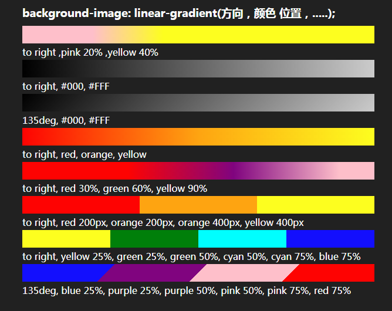

#### 径向渐变

radial-gradient径向渐变指从一个中心点开始沿着四周产生渐变效果。

```css
语法：
	第一个值：表示整体渐变辐射距离；
	第二个值：表示渐变圆点在 x , y 这个坐标；
	第三个及以后的值：表示渐变的颜色和颜色位置，可以说是多个
.radial {
    width: 300px;
    height: 300px;
    background-image: radial-gradient(100px at 0 0, yellow 20%, green 50%);
}
```

径向渐变案例：

~~~html
<style type="text/css">
    ul, li {
        list-style: none;
        margin: 0;
        padding: 0;
    }
    .box li {
        float: left;
        width: 200px;
        height: 200px;
        margin: 50px 10px;
        border: 1px solid #CCC;
        border-radius: 50%;	
    }
/* 总渐变辐射距离100px，圆点坐标x=50px，y=50px，开始黄色，结束橙色 */
.a { background-image: radial-gradient(100px at 50px 50px, yellow, orange); }
/* 总渐变辐射距离100px，圆点坐标x=50px，y=50px，开始黄色位置20%，结束橙色位置100%【相对于总辐射距离100px来说的】 */
.b { background-image: radial-gradient(100px at 50px 50px, yellow 20%, orange 100%); }
.c { background-image: radial-gradient(100px at 50px 50px, yellow 20%, orange 200%); }
.d { background-image: radial-gradient(200px at 50px 50px, yellow 10%, orange 100%); }
/* 可以多个颜色进行渐变 */
.e {background-image: radial-gradient(200px at 50px 50px, red 10%, yellow 50%, green 100%);}
/* 这种方法可以让效果发生改变 */
.f {
    background-image: radial-gradient(
        100px at 100px 100px,
        yellow 25%,
        green 25%,
        green 50%,
        blue 50%,
        blue 75%,
        red 75%);
    }
</style>
<body>
	<div class="box">
		<ul>
			<li class="a"></li>
			<li class="b"></li>
			<li class="c"></li>
			<li class="d"></li>
			<li class="e"></li>
			<li class="f"></li>
		</ul>
	</div>
</body>
~~~



### ※ 浮动（float）

#### 标准流（normal  flow）

**标准流**（规范）： 在网页中标签的默认显示方式
**脱标**：在网页中元素的显示方式和位置不符合标准流规范，即为脱标

#### 浮动

```css
☞ 浮动：
	float: left |  right;

☞ 总结浮动：
    1. 浮动的元素不占位置 （ 脱离标准流 ）
    2. 浮动可以实现块级元素在一行上显示  （ 脱离标准流 ）

☞ 什么时候用浮动？
    1. 在网页中，设置网页导航的时候必须使用浮动（必须用列表）
    2. 在网页布局中，如果块级元素在一行上显示就使用浮动
```

### ※ 清除浮动

> 清除浮动： 将浮动元素对后面元素的**影响**消除掉
>
> 因为浮动的元素不占位置，所以之后的元素会补充上来，会影响布局

#### 使用clear属性清除浮动

```css
☞ 写法：
	clear: left | right | both

☞  步骤：
    1. 在浮动元素后面添加一个空div标签
    2. 选中该标签设置clear: both;
```

#### 使用overflow属性清除浮动

```css
☞ 给浮动的元素父元素设置 overflow: hidden;

☞注意：
    1. 如果父元素中存在一个超出父元素的标签，那么不能使用该属性。
```

#### 使用伪元素清除浮动(推荐的方式)

```css
 ☞ 普通写法：
	  .clearfix::after {
			content: "";
			display: block;
			clear: both;
	 }

 ☞ 完整的写法：
		.clearfix::after {
			content: "";
			display: block;
			clear: both;

			height: 0px;
			line-height: 0px;
			/* 隐藏 */
			visibility: hidden;
		}
		.clearfix {
			/* 兼容IE */
			zoom: 1;
		}
```

#### 什么时候用清除浮动

> 满足如下条件可以考虑清除浮动：   
>
> 1.  父元素没有设置高度。
> 2.  该父元素中所有子元素都设置浮动。


### ※ 定位（position）

```css
 定位：   与元素的位置有关  【可以改变元素位置】
```

#### 静态定位(static)

```css
 ☞ 语法：
	  	position: static;
	    left  |  right  |  top  | bottom: 值;

 ☞ 总结：
	  1. 不能通过静态定位的方式改变元素位置
	  2. 静态定位的元素就标准流的元素
```

#### 绝对定位(absolute)

```css
 ☞ 语法：
	   position: absolute;	
	   left  |  right  | top | bottom:  值;


  ☞ 总结：
	    1. 一个绝对定位的元素本质上是参照父元素改变位置的，但是如果父元素是一个标准流的元素，那么绝对定位的元素会继续往上找上一级的父元素，如果父元素是一个非静态定位的元素，那么绝对定位的元素就会参照当前父元素
		2.  绝对定位的元素也是一个脱标不占位置的元素


  ☞ 在网页中绝对定位的使用场景：
```



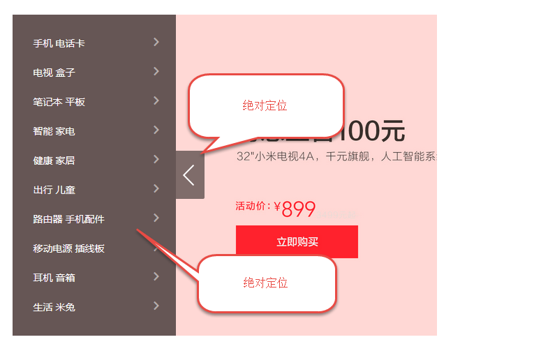

#### 相对定位(relative)

```css
☞ 语法：
	 position: relative;
 	 left | right |  top | bottom: 值;
☞ 总结：
	   1. 相对定位的元素是相对元素自己原来的位置【与父元素是否是定位的元素无关】
	   2. 相对定位没有脱标，占位置

☞相对定位的使用场景：
	  1. 如果一个元素是绝对定位，那么其父元素一般都是相对定位
	  2. 子绝父相 （子元素绝对定位，父元素相对定位）
```

#### 固定定位(fixed)

```css
☞语法：
	  position: fixed;  
☞总结：
	  1. 固定定位始终是以body（浏览器）左上角为参照
	  2. 固定定位的元素也是一个脱标元素，不占位置
```

#### 绝对定位居中

```css
☞ margin: 0 auto;  只能让标准流的盒子居中。

☞ 绝对定位脱标居中？
    position: absolute;
    /* 移动了父元素宽度一半 */
    left: 50%;
    /* 移动元素自己宽度一半 */
    margin-left: -40px;
☞ 完美的居中写法
	position: absolute;
    /* 移动了父元素宽度一半 */
    left: 50%;
    /* 移动元素自己宽度一半 */
    tansform: tanslateX(-50%);

☞ 总结：
1. margin-left设置自己宽度一半的时候，不能设置百分比。
```

#### 定位层级关系

~~~css
☞ 定位的层级关系： 在网页中一个元素压着另外一个元素，【只有绝对定位，相对定位，固定定位才能设置层级关系 】

☞ 通过 z-index 属性 可以改变元素的层级关系【 元素必须是非静态定位的元素 】

☞ 总结：
1. 如果希望改变元素额层级，使用z-index属性
2. 一个定位的元素，默认z-index值是auto 【 可以人为的理解auto 是数字 0 】
3. 如果z-index值相同，那么最后的定位元素会压着前面的定位的元素【后来居上原则】
4. 如果z-index值不相同，那么z-index值越大，层级越高
5. 拼爹原则（如果父元都有z-index值，子元素也有层级z-index. 父元素z-index值越大，对应的层级越高）
6. z-index可以设置负或者0 
~~~

#### vertical-align属性

1. 文字默认在图片底部对齐一行显示
2. 当移动图片的时候，文字也发生了位置的改变
3. 在页面中默认图片底部会有**3像素空白**

~~~css
☞ 由于图片（行内块元素）有一个默认属性vertical-align：baseline; 导致的以上网页效果。

☞ vertical-align总结使用：
1.  该属性只能用在行内块元素身上
2.  解决图标底部3像素空白
◆ 设置vertical-align的值不是baseline即可 （top | bottom | middle）
◆ 将图片转换为块级元素

3. 可以通过该属性实现图片垂直居中。
◆ 设置行高等于容器的高度（让文字垂直居中，让文字中线居中显示）
◆ 给图片设置vertical-align: middle; （让图片和文字中线对齐）
~~~

#### 元素隐藏

```css
元素整体隐藏 
	display： none;      隐藏元素,不占位置
	display： block;     显示元素
	visibility: hidden;  隐藏元素，占位置
部分隐藏（溢出隐藏）
	overflow: hidden;  溢出隐藏  [ 1. 外边距塌陷   2. 清除浮动 ]
溢出部分可见
	overflow: visible;
添加滚动条
	overflow: scroll;
超出添加滚动条，不超出不添加
	overflow: auto;
```
#### 精灵图

```css
 ☞ 精灵图： 本质上就是一种图片，用来做元素的背景图 【 background 】

 ☞ 使用：
    1. 先将精灵图作为背景图给到元素身上
    2. 通过background-position改变背景图片位置（向左或向上移动，设置的值是负数）
```

#### 字体图标iconFont

> 字体图标是指将网页中的图片以文字形式呈现，与传统的精灵图作用一致。
>
> 使用字体图标能够减少请求、具有矢量性，可保证清晰度、使用灵活，便于维护。

开发中可以使用第三方字体图标库，也可以根据需求自定义图标。

常用两个图标网站[icomoon](https://icomoon.io/) 和 [iconfont](http://iconfont.cn/)

```css
☞ 图标字体： 显示效果像图片，但是本质上是文字。

☞ 使用：
    1. 使用第三方资源实现。
    2. 资源地址： http://www.iconfont.cn/
    			https://icomoon.io/

☞ 使用 font-awesome
<!DOCTYPE html>
<html lang="en">
<head>
	<meta charset="UTF-8">
	<title>字体图标</title>
	<!-- 1. 引入 font-awesome -->
	<link rel="stylesheet" href="./css/font-awesome.min.css">
	<link rel="stylesheet" type="text/css" href="iconfont/iconfont.css">
	<style>
		span.fa {
			font-size: 40px;
			color: red;
		}
	</style>
</head>
<body>
	<!-- 2. 使用字体图标 -->
	<span class="fa fa-user"></span>
	<button><i class="iconfont icon-sousuo"></i></button>
</body>
</html>
```

一般是将整个图标库文件夹 放到网站根目录或者css文件夹下

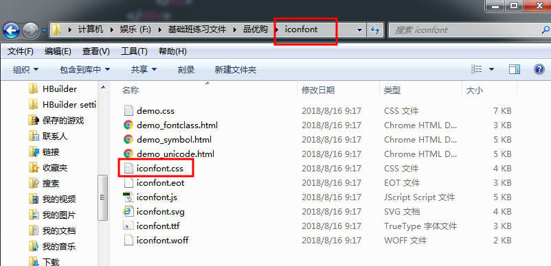

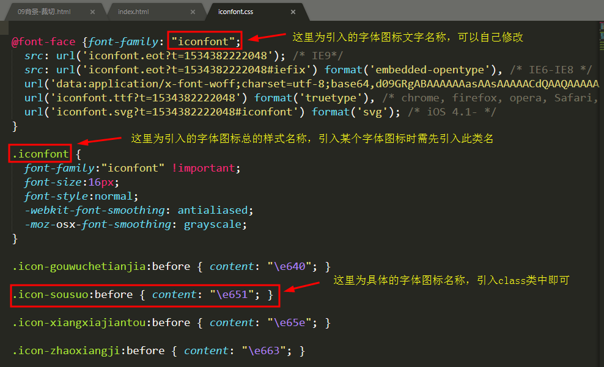

自定义图标，一般需要准备 svg 格式的图片素材，然后通过第三方服务生成字体图标。

#### 网页优化标签

> 网页标签优化有助于SEO优化和网络搜索，从而提高网站浏览量；描述了网站的相关信息

```css
☞ 网页优化标签：
◆ title     设置网页标题

◆ 关键字：   实现网站推广
<meta name="keywords" content="老马拉面,面条,米饭">

◆ 网页描述： 对当前网页的描述信息
<meta name="description" content="描述信息">

官方术语： T D K （Title Description Keywords)

实例：
<head>
	<meta charset="UTF-8">
	<title>品优购-正品低价、品质保障、配送及时、轻松购物！</title>
	<meta name="keywords" content="网上购物,网上商城,手机,笔记本,电脑,MP3,CD,VCD,DV,相机,数码,配件,手表,存储卡,京东">
	<meta name="description" content="品优购-专业的综合网上购物商城,销售家电、数码通讯、电脑、家居百货、服装服饰、母婴、图书、食品等数万个品牌优质商品.便捷、诚信的服务，为您提供愉悦的网上购物体验!">

	<link rel="icon" href="favicon.ico">  网页title图标
	/* 引入的iconfont图标库 */
	<link rel="stylesheet" type="text/css" href="iconfont/iconfont.css">
</head>
```

#### 滑动门案例

微信登陆页面案例

~~~~html
<style>
	* {
        padding: 0;
        margin: 0;
        list-style: none;
        text-decoration: none;
    }

    .main {
        width: 1366px;
        height: 499px;
        background: url(imgs/weixin_bg1d20af.jpg) repeat-x;
    }
    .content {
        width: 900px;
        overflow: hidden;
        margin: 0 auto;
    }

    .content li {
        line-height: 74px;
        float: left;
    }

    .content a {
        height: 33px;
        line-height: 33px;
        display: inline-block;
        color: #fff;
        padding-left: 16px;
        margin-right: 16px;
        background: url(imgs/bg.png) no-repeat left -192px;
    }

    .content span {
        height: 33px;
        padding-right: 16px;
        display: inline-block;
        background: url(imgs/bg.png) no-repeat right -192px;
    }
	/* 重点是hover钱需要加上.content类名 */
    .content a:hover {
        background: url(imgs/bg.png) no-repeat left -144px;
    }		
    .content a:hover span {
        background: url(imgs/bg.png) no-repeat right -144px;
    }
</style>

</head>
<body>
	<div class="main">
		<div class="content">
			<ul>
				<li>
					<a href=""><span>首页</span></a> /* 样式写法 */
				</li>
				<li>
					<a href=""><span>下载吧</span></a>
				</li>
				<li>
					<a href=""><span>公共平台</span></a>
				</li>
			</ul>
		</div>
	</div>
</body>
~~~~


## 四、多媒体动画

### ※ 多媒体

#### ◆  音频

#### `<audio>`

HTML5通过\<audio>标签来解决音频播放的问题。

```html
<audio src="./music/See You Again.mp3"></audio>
```

通过附加属性可以更友好控制音频的播放

```html
<audio src="./music/See You Again.mp3" controls autoplay loop></audio>
<!--
	autoplay 自动播放(失效了)
	controls 显示播放控件，如暂停、音量等
	loop 循环播放
-->
```

由于版权等原因，不同的浏览器可支持播放的格式是不一样的，通过为 audio 指定多种音频格式兼容更多浏览器。

```html
<audio controls>
	<source src="./music/See You Again.mp3">
    <source src="./music/See You Again.wav">
    <source src="./music/See You Again.ogg">
    您的浏览器不支持 audio 音频播放
</audio>
```

#### ◆  视频

#### `<video>`

HTML5通过\<video>标签来解决音频播放的问题。

```html
<video src="./video/movie.mp4"></video>
```

通过附加属性可以更友好控制音频的播放

```html
<video src="./video/movie.mp3" controls autoplay loop></video>
<!--
	autoplay 自动播放
	controls 显示播放控件，如暂停、音量等
	loop 循环播放
	width 视频宽度
	height 视频高度
-->
```

由于版权等原因，不同的浏览器可支持播放的格式是不一样的，通过为 audio 指定多种音频格式兼容更多浏览器。

```html
<video controls>
	<source src="./music/movie.mp4">
    <source src="./music/movie.ogg">
    您的浏览器不支持 video 视频播放
</video>
```

#### ◆  方法

##### .[play()](av_met_play.asp.htm)

开始播放视频/音频

##### .[pause()](av_met_pause.asp.htm)

暂停当前播放的音频/视频 

```js
// 切换状态
var video = $('video')[0]
if(video.paused) {
	video.play();
} else {
	video.pause();
}
```

#### ◆  属性

##### .[paused](av_prop_paused.asp.htm)

设置或返回音频/视频是否暂停 

> video.paused   返回值为暂停：ture；播放着：false

##### [controls](av_prop_controls.asp.htm)

设置或返回音频/视频是否显示控件（比如播放/暂停等） 



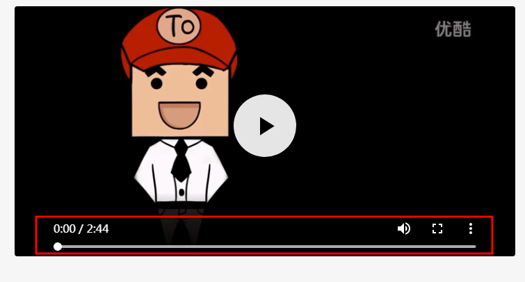

##### .[duration](av_prop_duration.asp.htm)

返回当前音频/视频的长度（以秒计） 

```css
语法：
	audio|video.duration
返回值：
	数字值，表示音频/视频的长度，以秒计。
```

##### .[currentTime](av_prop_currenttime.asp.htm)

设置或返回音频/视频中的当前播放位置（以秒计） 

设置 currentTime 属性：

```css
audio|video.currentTime="seconds"
```

返回 currentTime 属性：

```css
语法：
	audio|video.currentTime
返回值：
	数字值，表示音频/视频的当前播放长度，以秒计。
```

#### ◆  事件

##### .[oncanplay](av_event_canplay.asp.htm)

当浏览器可以播放音频/视频时 

在 HTML 中：

```js
<audio|video oncanplay="SomeJavaScriptCode">
```

在 JavaScript 中：

```js
audio|video.oncanplay=SomeJavaScriptCode;
```

使用 addEventListener()：

```js
audio|video.addEventListener("canplay", function()
  {
  //SomeJavaScriptCode
  }
);
```

##### .ontimeupdate

当目前的播放位置已更改时 

```js
video.ontimeupdate = function () {处理代码}
```

##### .onplay

当音频/视频已开始或不再暂停时 

```js
video.onplay = function () {处理代码}
```

##### .onpause

当音频/视频已暂停时 

```js
video.onpause  = function () {处理代码}
```

##### .onended

当目前的播放列表已结束时 

```js
video.onended  = function () {处理代码}
```

案例：设置自定义控件

```html
<body>
	<figure>
		<figcaption>视频播放器</figcaption>
		<div class="player">
			<video src="./video/fun.mp4" id="vide"></video>
			<div class="controls">
				<!-- 播放/暂停 -->
				<a href="javascript:;" class="switch fa fa-play"></a>
				<!-- 全屏 -->
				<a href="javascript:;" class="expand fa fa-expand"></a>
				<!-- 进度条 -->
				<div class="progress">
					<div class="line"></div>
					<div class="bar"></div>
				</div>
				<!-- 时间 -->
				<div class="timer">
					<span class="current">00:00:00</span>
					<span class="total">00:00:00</span>
				</div>
				<!-- 声音 -->
			</div>
		</div>
	</figure>
	<script src="./js/jquery.min.js"></script>
	<script>
		var video = $('video')[0], current;
        // 检测加载可以播放的时候，让视频显现出来show， 
		video.addEventListener('canplay', function() {
			$(this).show();             
             // duration获得总时长调用封装函数转化事件格式
			var time = video.duration;
			$('.total').text(getTime(time));
		})
		// 点击开始按钮，切换样式，改变播放状态
		$('.switch').on('click', function() {
			$(this).toggleClass('fa-play fa-pause');
			if(video.paused) {   // 检测是否暂停
				video.play();	// 开始播放
			} else {
				video.pause();	// 结束播放
			}
		})
		// 运用timeupdate事件实时获取视频时长变化
		video.ontimeupdate = function() {
			var time = video.currentTime;
			$('.current').text(getTime(time));
			// 获得时长，进行转换成百分比
			current = time / video.duration * 100;
			$('.line').width(current + '%');
		}
		// 跳跃播放  offsetX获得鼠标事件对象的位置
		$('.bar').on('click', function(e) {
			video.currentTime = e.offsetX / $(this).width() * video.duration;
		})
		// 通过ended事件获取视频播放完毕，初始化控件
		video.onended = function() {
			$('.switch').removeClass('fa-pause').addClass('fa-play');
			$('.line').width(0);
			$('.current').text('00:00:00');
			video.currentTime = 0;
		}
		// 点击全屏按钮设置
		$('.expand').on('click',function () {
			video.webkitRequestFullScreen();
		});
		// 封装求得00:00:00格式的视频格式，以字符串形式返回
		function getTime(time) {
            var h, m, s;
            h = Math.floor(time / 3600 / 60);
            h = h > 9? h : '0' + h;
            
            m = Math.floor(time / 60);
            m = m > 9? m : '0' + m;
            
            s = Math.floor(time % 60);
            s = s > 9? s : '0' + s;
            
            var str = h + ':' + m + ':' + s;
            return str;
		}
	</script>
```

#### ◆  canvas【画布】

```html
	实现：标签 + js + API  = 实现各种效果， 	

	例如：手游【 2048，水果忍者，连连看，打飞机 】
```

### ※ 动画介绍

转换属性介绍transform,transition

#### ◆  过渡属性transition

下面的表格列出了所有的转换属性：

| 属性                                                         | 描述                                         | CSS  |
| ------------------------------------------------------------ | -------------------------------------------- | ---- |
| [transition](../cssref/pr_transition.asp.htm)                | 简写属性，用于在一个属性中设置四个过渡属性。 | 3    |
| [transition-property](../cssref/pr_transition-property.asp.htm) | 规定应用过渡的 CSS 属性的名称。              | 3    |
| [transition-duration](../cssref/pr_transition-duration.asp.htm) | 定义过渡效果花费的时间。默认是 0。           | 3    |
| [transition-timing-function](../cssref/pr_transition-timing-function.asp.htm) | 规定过渡效果的时间曲线。默认是 "ease"。      | 3    |
| [transition-delay](../cssref/pr_transition-delay.asp.htm)    | 规定过渡效果何时开始。默认是 0。             | 3    |

##### ☞ [transition-delay](../cssref/pr_transition-delay.asp.htm)

实例：在过渡效果开始前等待 2 秒：

```css
div {
    transition-delay: 2s;
    -moz-transition-delay: 2s;  /* Firefox 4 */
    -webkit-transition-delay: 2s;  /* Safari 和 Chrome */
    -o-transition-delay: 2s;  /* Opera */
}
```

##### ☞ [transition-property](../cssref/pr_transition-property.asp.htm)

语法

```
transition-property: none|all|property;
```

| 值                | 描述                                                  |
| ----------------- | ----------------------------------------------------- |
| none              | 没有属性会获得过渡效果。                              |
| all               | 所有属性都将获得过渡效果。                            |
| property          | 定义应用过渡效果的 CSS 属性名称列表，列表以逗号分隔。 |
| JavaScript 语法： | object.style.transitionProperty="width,height"        |

##### ☞ [transition-duration](../cssref/pr_transition-duration.asp.htm)

```css
transition-duration: time; 

JavaScript 语法：
object.style.transitionDuration="5s"
```

##### ☞ [transition-timing-function](../cssref/pr_transition-timing-function.asp.htm)

定义和用法

transition-timing-function 属性规定过渡效果的速度曲线。

语法

```
transition-timing-function: linear|ease|ease-in|ease-out|ease-in-out|cubic-
bezier(n,n,n,n);
```

| 值                            | 描述                                                         |
| ----------------------------- | ------------------------------------------------------------ |
| linear                        | 规定以相同速度开始至结束的过渡效果（等于 cubic-bezier(0,0,1,1)）。 |
| ease                          | 规定慢速开始，然后变快，然后慢速结束的过渡效果（cubic-bezier(0.25,0.1,0.25,1)）。 |
| ease-in                       | 规定以慢速开始的过渡效果（等于 cubic-bezier(0.42,0,1,1)）。  |
| ease-out                      | 规定以慢速结束的过渡效果（等于 cubic-bezier(0,0,0.58,1)）。  |
| ease-in-out                   | 规定以慢速开始和结束的过渡效果（等于 cubic-bezier(0.42,0,0.58,1)）。 |
| cubic-bezier(*n*,*n*,*n*,*n*) | 在 cubic-bezier 函数中定义自己的值。可能的值是 0 至 1 之间的数值。 |

##### ☞ transition合写

语法

```css
transition: property duration timing-function delay;
/*第1个值表示需要过渡的属性*/
/*第2个值表示过渡需要的时长*/
/*第3个值表示过渡的延时*/
transition: width 1s 1s linear;
JavaScript 语法：
object.style.transition="width 2s"
```

####◆  2D转换( transform复合属性 )

| 转换方式  | 含义                                 |
| --------- | ------------------------------------ |
| translate | 元素位置移动                         |
| rotate    | 元素旋转                             |
| scale     | 元素缩放                             |
| skew      | 缩放： 缩小 \| 放大 【 参数为倍数 】 |
| origin    | 设置旋转中心                         |

##### 位移：transfrom: translate(x,y);

translate 设置元素的位置（x/y坐标）

- 移动的位置相对于自身原来位置
- y 轴正方向朝下
- 可以像素值，也可以是百分比（参照自身的宽度或高度）

```css
☞ 位移
语法：
transfrom: translate(x,y);
3D写法：transform: translateX();
◆ 绝对居中
    1. 设置一个值，代表元素沿着水平方向移动 （正数向右移动，反之）
    2. 设置两个值，第一个值代表水平方向，第二值代表垂直方向
    3. 改变元素位置的时候相对元素本身。【 百分比 】
    4. 可以实现绝对定位盒子居中
    position: absolute;
    left: 50%;
    top: 50%;
    transform: translate(-50%,-50%);

<style>
    .box {
        width: 400px;
        height: 400px;
        border: 1px solid #CCC;
    }
    .t {
        width: 100px;
        height: 100px;
        background-color: blue;
        /* 配合过渡效果更好 */ 
        transition: all 1s;
    }
    .box:hover .t {
        /* 位置移动 */
        transform: translate(200px, 200px);
    }
</style>
```

##### 旋转：transform: rotate(角度);

rotate() 指的是对元素实行旋转转换

~~~css
.box {
    width: 200px;
    height: 200px;
    background-color: blue;
    /*transition: transform 1s;*/
    transition: all 1s;
}
.box:hover {
    /*transform用来设置元素转换*/
    /*旋转时传入一个角度，可为正可为负*/
    /*如果正值顺时针旋转，如果负值逆时针旋转*/
    transform: rotate(45deg);
}
~~~

##### 动画参照中心：transform-origin: left top

◆ 总结：
	 1、 如果设置的是正角度，顺时针旋转反之逆时针

​	 2、 元素默认是在中间位置旋转  center 

​	 3、改变旋转中心【倾斜】的位置 

```css
设置动画参照的中心位置
✔ 可以设置方位名：transform-origin: left top;
✔ 可以设置具体值：transform-origin: 20px 50px;
```

##### 缩放： transform: scale(x,y);

◆总结：

1. 该属性中设置的值表示的是**倍数关系**
   1. 如果设置一个值，代表宽度和高度同时扩大或者缩小对应的倍数
   2. 如果希望放大效果，设置的值是大于1
   3. 如果希望缩小效果，大于0小于1
   4. 设置两个值，第一个值代表水平（宽度），第二值代表垂直（高度）
   5. 不能设置负数

   ~~~css
   .wrap {
       width: 200px;
       height: 200px;
       border: 1px solid #CCC;
       margin: 100px auto;
   }
   
   .box {
       width: 200px;
       height: 200px;
       background-color: blue;
       transition: all 1s;
   }
   
   .wrap:hover .box {
       /* 第1个表示水平放大1.5倍 */
       /* 第2个表示垂直缩小0.5倍 */
       transform: scale(1.5, 0.5);
   }
   ~~~

##### 倾斜：transform: skew(30deg, 30deg);

```css
◆ 第一个代表沿着水平方向倾斜
◆ 第二个代表沿着垂直方向倾斜

通过 skew() 方法，元素翻转给定的角度，根据给定的水平线（X 轴）和垂直线（Y 轴）参数：
实例
div {
    transform: skew(30deg,20deg);
    -ms-transform: skew(30deg,20deg);	/* IE 9 */
    -webkit-transform: skew(30deg,20deg);	/* Safari and Chrome */
    -o-transform: skew(30deg,20deg);	/* Opera */
    -moz-transform: skew(30deg,20deg);	/* Firefox */
}

```

◆  **多个动画综合写法**

~~~
可以直接在后边添加动画值，不可以写两个transform叠加，否则会覆盖
transform：translateX() rotateX() scale();
~~~

注：同一元素设置多种转换方式，其格式为：transform: translate() rotate() scale() ...等，没有顺序要求，但是顺序不同会影转换的效果。

#### ◆  3D转换（ transform复合属性 ）

> 3d转换与2d转换转换方式相同，也有位移、旋转、缩放等。

1. 坐标轴

2. 用X、Y、Z分别表示空间的3个维度，三条轴互相垂直。如下图：

   

   #### 位移

```css
☞  transform: translateX()  translateY()  translateZ();
    transform: translate3d(x,y,z,度数)
✔ 总计：
    1. 当页面中要实现近大远小的效果，需要给设置了transfrom元素的父元素设置	
    perspective:1000px
	2. 相对元素自己改变位置（百分比）

```

##### 旋转

```css
transform：rotateX()  rotateY()   rotateZ();
☞ 左手法则：
    1. 用左手握着坐标轴
    2. 大拇指指向坐标轴方向
    3. 剩下的手指弯曲的方向就是旋转的方向
```

##### 缩放

```
transform: scaleX()  scaleY()   scaleZ();
```

##### 倾斜（了解）

```css
 transfrom: skewX()  skewY();

<style>
body {
    margin: 0;
    padding: 0;
    font-family: '微软雅黑';
    background-color: #F7F7F7;
}

.text-box {
    margin-top: 100px;
    text-align: center;
    line-height: 1;
    font-size: 100px;
    /*color: #065DAC;*/
}

.text-box span {
    display: inline-block;
    position: relative;
}

.text-box span::before,
.text-box span::after {
    content: attr(data-text);
    position: absolute;
    left: 0;
    top: 0;
    transition: all 1s;
    transform-origin: left center;
}

.text-box span::before {
    z-index: 3;
    color: #FFF;
    transform: rotateY(-15deg);
}

.text-box span::after {
    z-index: 2;
    color: rgba(0, 0, 0, 0.3);
}

.text-box:hover span::before {
    transform: rotateY(-40deg) skew(0, 5deg);
}

.text-box:hover span::after {
    transform: skew(0, 20deg);
    /* .text-box:hover span::after { */
}
</style>
</head>
<body>
	<div class="text-box">
		<span data-text="传">传</span>
		<span data-text="智">智</span>
		<span data-text="播">播</span>
		<span data-text="客">客</span>
	</div>
</body>
```

##### ☞ perspective

电脑显示屏是一个2D平面，图像之所以具有立体感（3D效果），其实只是一种视觉呈现 ，通过透视可以让一个2D平面呈现3D效果。


```html
<!DOCTYPE html>
<html lang="en">
<head>
	<meta charset="UTF-8">
	<title>缩放</title>
	<style>
		.box {
            /* 为父盒子设置透视，其子元素以3d形式呈现 */
			perspective: 1000px;
		}

		.p {
			width: 200px;
			height: 200px;
			margin: 100px auto 0;
			background-color: blue;
			transition: all 1s;
		}

		.p:hover {
			transform: translateZ(200px);
		}
	</style>
</head>
<body>
	<div class="box">
		<div class="p"></div>
	</div>
</body>
</html>
```

##### 

##### ☞ preserve-3d

让父元素转化为3D模型

```css
transform-style: preserve-3d;  /* 元素转化为3d模式 */
```

##### ☞ backface-visibility

设置一个盒子的背面是否可见，隐藏被旋转的 div 元素的背面： 

```css
backface-visibility: visible|hidden;   visible可见|hidden隐藏
兼容写法：
div {
    backface-visibility:hidden;
    -webkit-backface-visibility:hidden;	/* Chrome 和 Safari */
    -moz-backface-visibility:hidden; 	/* Firefox */
    -ms-backface-visibility:hidden; 	/* Internet Explorer */
}
```

翻转卡片案例：

```css
.box {
    width: 160px;
    height: 160px;
    border: 1px solid #ccc;
    position: relative;
    margin: 100px auto;
    transform-style: preserve-3d;
    transition: all 1s;
    /* 翻转效果图片必须用backface-visibility属性，当转到元素背面时隐藏 */
    backface-visibility: hidden;
}

.box:before,
.box:after {
    content: '';
    display: block;
    position: absolute;
    left: 0;
    right: 0;
    top: 0;
    bottom: 0;
    background-repeat: no-repeat;
}

.box:before {
    background-image: url('./商品列表图片.jpg');
}

.box:after {
    background-image: url('./商品精选图片.jpg');
    transform: rotateY(-180deg);
}

.box:hover {
	transform: rotateY(-180deg);
}
</style>
</head>
<body>
	<div class="box">	
	</div>
</body>
```

#### ◆  动画属性介绍animation

动画是CSS3中具有颠覆性的特征之一，通过设置多个节点来精确控制一个或一组动画，常用来实现复杂的动画效果。

- 特征
  1. 通过@keyframes指定动画序列；
  2. 通过百分比将动画序列分割成多个节点；
  3. 在各节点中分别定义各属性
  4. 通过animation将动画应用于相应元素；

**关键属性**

| 属性                      | 含义                                      |
| ------------------------- | ----------------------------------------- |
| animation-name            | 动画序列名称                              |
| animation-duration        | 动画持续时间                              |
| animation-delay           | 动画延时时间                              |
| animation-timing-function | 动画执行速度，linear、ease等              |
| animation-play-state      | 动画播放状态，running、paused等           |
| animation-direction       | 动画逆播，alternate等                     |
| animation-fill-mode       | 动画执行完毕后状态，forwards、backwards等 |
| animation-iteration-count | t动画执行次数，inifinate等                |
| steps(60)                 | 动画分成60步完成                          |

##### 1、动画 animation复合属性

```css
◆ transition [过渡]：必须要有用户的动作（ hover , click(点击) ）
◆ animation： 只要调用动画就立即执行
```

##### 2、animation使用：

```css
 ☞ 定义动画集（动画序列）
	 	@keyframes  自定义动画名称  {}
 ☞ 定义开始状态和结束状态
	    @keyframes  自定义动画名称  {
	    	 from {	    	 
	    	 }
	    	 to {
	    	 }
	    }
    例如：
	    /* 动画集 */
		@keyframes  rotate {		
		/* 开始状态 */
			from {
				transform: rotate(0deg);
			}
		/* 结束状态 */
			to {
			   transform: rotate(360deg);
			} 
		}

    ☞ 执行动画 （通过动画集名称调用即可）
```

##### 3、animation属性介绍：

```css
	/* 动画名称 */
		animation-name: rotate;

	/* 设置动画时间 */
		animation-duration: 1s;
			
	/* 动画默认执行次数为 1，infinite 无限次执行*/
		animation-iteration-count: infinite;

	/* 设置速度类型 */
		ease		/* 先快后慢再快 */
		ease-in		
		ease-out
		ease-in-out
		linear	
		animation-timing-function: linear;  /* 匀速运动 */
			
	/* 设置动画延时执行 */
		animation-delay: 2s;

	/* 暂停动画 */
		animation-play-state: paused|running;
		paused 规定动画已暂停。
		running 规定动画正在播放。

	/* 设置动画停止是否在最终状态*/
		animation-fill-mode: forwards;

```

##### 4、animation-fill-mode

```css
animation-fill-mode : none | forwards | backwards | both;
```

| 值        | 描述                                                         |
| --------- | ------------------------------------------------------------ |
| none      | 不改变默认行为。                                             |
| forwards  | 当动画完成后，保持最后一个属性值（在最后一个关键帧中定义）。 |
| backwards | 在 animation-delay 所指定的一段时间内，在动画显示之前，应用开始属性值（在第一个关键帧中定义）。 |
| both      | 向前和向后填充模式都被应用。                                 |

动画实例：

```css
#box {
	width: 300px;
	height: 200px;
	background-color: red;
	position: absolute;
	top: 0;
	left : 0;
	border-radius: 50%;
    /* 合写样式 */
	animation: translate infinite 2s
    /* 分写样式 */
	animation-name: translate;
	animation-duration: 2s;
	animation-timing-function: linear;
	animation-delay: 2s;
	animation-iteration-count: infinite;
	}

	#box:hover {
		animation-play-state: paused;
	}

	@keyframes translate {
		0%{
			left : 0;
		}
		50% {
			left : 300px;
		}
		100% {
			left : 0px;
		}
	}

	.box2 {
		width: 600px;
		height: 50px;
		border: 1px solid red;
		position: relative;
	}

	.box2 span {
		width: 50px;
		height: 50px;
		display: block;
		position: absolute;
		left: 0;
		background-color: black;
	}
	@keyframes aaa {
		form{
			left: 0px;
		}
		to {
			left: 500px;
		}
	}
	.box2:hover span {
		animation: aaa linear 1s 0.2s forwards;
	}
	</style>	
	<div id="box">	
	</div>
	<div class="box2">
		<span></span>
	</div>

```

## 五、弹性布局display：flex

> 2009年，W3C提出了一种新的方案—-Flex布局，可以简便、完整、响应式地实现各种页面布局。使得我们对块级元素的布局排列变得十分灵活，适应性非常强，其强大的伸缩性，在响应式开中可以发挥极大的作用。目前，它已经得到了所有浏览器的支持，这意味着，现在就能很安全地使用这项功能。

#### ◆  Flex布局是什么？

Flex是Flexible Box的缩写，意为”弹性布局”，用来为盒状模型提供最大的灵活性。

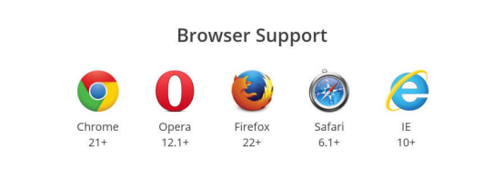

#### ◆  Flex容器分析

任何一个容器都可以指定为Flex布局。采用Flex布局的元素，称为Flex容器（flex container），简称”容器”。它的所有子元素自动成为容器成员，称为Flex项目（flex item），简称”项目”。

##### ☞ display：flex

语法：给父容器加display：flex或者display: inline-flex;

~~~css
/* 1、块级元素 */
.box{
  display: flex;
}
/* 2、行内元素也可以使用Flex布局。 */
.box{
  display: inline-flex;
}
/* 3、Webkit内核的浏览器，必须加上-webkit前缀。 */
.box{
  display: -webkit-flex; /* Safari */
  display: flex;
}
注意，设为Flex布局以后，子元素的float、clear和vertical-align属性将失效。
~~~

**伸缩盒子：**

容器默认存在两根轴：水平的主轴（main axis）和垂直的交叉轴（cross axis）。主轴的开始位置（与边框的交叉点）叫做main start，结束位置叫做main end；交叉轴的开始位置叫做cross start，结束位置叫做cross end。

项目默认沿主轴排列。单个项目占据的主轴空间叫做main size，占据的交叉轴空间叫做cross size。

- 主轴：Flex容器的主轴主要用来配置 Flex 的主轴，默认是水平方向
- 侧轴：与主轴垂直的轴称作侧轴，默认是垂直方向的
- 方向：默认主轴从左向右，侧轴默认从上到下

注：主轴和侧轴并不是固定不变的，通过 flex-direction 可以互换



#### ◆  Flex容器的属性

| 属性            | 含义                                        |
| --------------- | ------------------------------------------- |
| flex-direction  | 调整主轴方向（默认为水平方向）              |
| justify-content | 调整主轴对齐                                |
| align-items     | 调整侧轴对齐                                |
| flex-wrap       | 控制是否换行                                |
| align-content   | 堆栈（由flex-wrap产生的独立行）对齐         |
| flex-flow       | flex-direction属性和flex-wrap属性的简写形式 |

##### ☞ flex-direction

flex-direction属性决定主轴的方向（即项目的排列方向）。

~~~css
可以设置以下四个属性：
.box {
  	flex-direction: row | row-reverse | column | column-reverse;
}
取值：
row（默认值）：主轴为水平方向，起点在左端。
row-reverse：主轴为水平方向，起点在右端。
column：主轴为垂直方向，起点在上沿。
column-reverse：主轴为垂直方向，起点在下沿。

~~~



##### ☞ justify-content

justify-content属性定义了项目在主轴上的对齐方式。

~~~css
.box {
  justify-content: flex-start | flex-end | center | space-between | space-around;
}
取值：
flex-start（默认值）：左对齐
flex-end：右对齐
center：居中
space-between：两端对齐，项目之间的间隔都相等。
space-around：每个项目两侧的间隔相等。所以，项目之间的间隔比项目与边框的间隔大一倍。
~~~

它可能取5个值，具体对齐方式与轴的方向有关。下面假设主轴为从左到右。











##### ☞ align-items

align-items属性定义项目在交叉轴上如何对齐。

~~~~css
.box {
  align-items: flex-start | flex-end | center | baseline | stretch;
}

取值：具体的对齐方式与交叉轴的方向有关，下面假设交叉轴从上到下。
flex-start：交叉轴的起点对齐。
flex-end：交叉轴的终点对齐。
center：交叉轴的中点对齐。
baseline: 项目的第一行文字的基线对齐。
stretch（默认值）：如果项目未设置高度或设为auto，将占满整个容器的高度。
~~~~

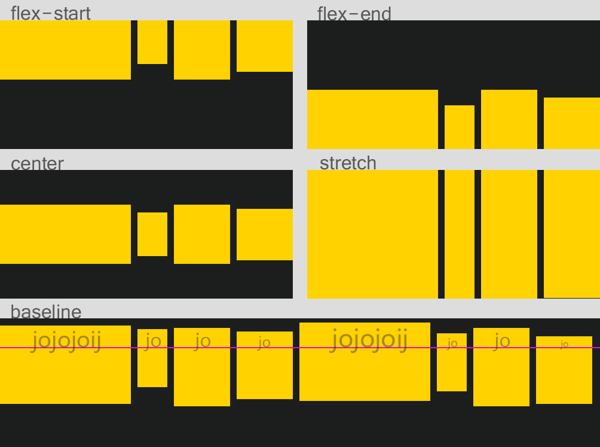

##### ☞ flex-wrap

默认情况下，项目都排在一条线（又称”轴线”）上。flex-wrap属性定义，如果一条轴线排不下，如何换行。

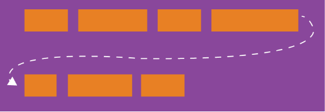

~~~css
.box {
  flex-wrap: nowrap | wrap | wrap-reverse;
}
取值：
nowrap（默认）：不换行。
wrap：换行，第一行在上方。
wrap-reverse：换行，第一行在下方。
~~~







##### flex-flow

flex-flow属性是flex-direction属性和flex-wrap属性的简写形式，默认值为row nowrap。

~~~~css
.box {
  flex-flow: <flex-direction> || <flex-wrap>;
}

.box {
  flex-flow: row nowrap;
}
~~~~

##### align-content

align-content属性定义了多根轴线的对齐方式。如果项目只有一根轴线，该属性不起作用。

~~~css
.box {
  align-content: flex-start | flex-end | center | space-between | space-around | stretch;
}
取值：
flex-start：与交叉轴的起点对齐。
flex-end：与交叉轴的终点对齐。
center：与交叉轴的中点对齐。
space-between：与交叉轴两端对齐，轴线之间的间隔平均分布。
space-around：每根轴线两侧的间隔都相等。所以，轴线之间的间隔比轴线与边框的间隔大一倍。
stretch（默认值）：轴线占满整个交叉轴。
~~~

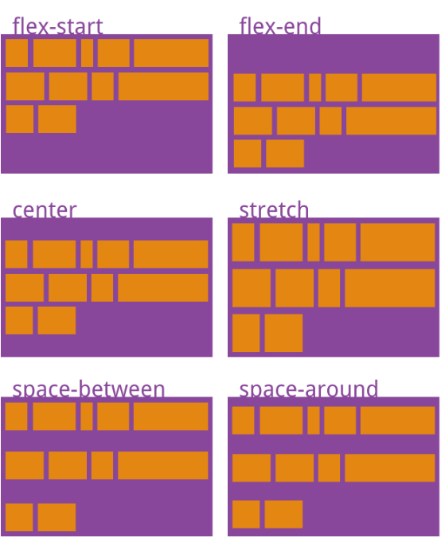

#### ◆  Flex子元素的属性

| 属性        | 解释                                                         |
| ----------- | ------------------------------------------------------------ |
| order       | 控制子项目的排列顺序，正序方式排序，从小到大                 |
| flex        | 子项目在主轴的缩放比例，不指定flex属性，则不参与伸缩分配     |
| flex-shrink | 定义项目的放大比例，默认为0，即如果存在剩余空间，也不放大。  |
| flex-basis  | 定义了在分配多余空间之前，项目占据的主轴空间（main size）。  |
| flex-grow   | 定义项目的放大比例，默认为0，即如果存在剩余空间，也不放大。  |
| align-self  | 允许单个项目有与其他项目不一样的对齐方式，可覆盖align-items属性。 |

##### ☞ ordert

order属性定义项目的排列顺序。数值越小，排列越靠前，默认为0。

~~~~css
.item {
  order: <number>;
}
~~~~



##### ☞ flex-grow

flex-grow属性定义项目的放大比例，默认为0，即如果存在剩余空间，也不放大。

~~~css
.item {
  flex-grow: <number>; /* default 0 */
}
~~~



如果所有项目的flex-grow属性都为1，则它们将等分剩余空间（如果有的话）。如果一个项目的flex-grow属性为2，其他项目都为1，则前者占据的剩余空间将比其他项多一倍。

##### flex-shrink

flex-shrink属性定义了项目的缩小比例，默认为1，即如果空间不足，该项目将缩小。

~~~css
.item {
  flex-shrink: <number>; /* default 1 */
} 
~~~

**flex-basis**

flex-basis属性定义了在分配多余空间之前，项目占据的主轴空间（main size）。浏览器根据这个属性，计算主轴是否有多余空间。它的默认值为auto，即项目的本来大小。

~~~css
.item {
  flex-basis: <length> | auto; /* default auto */
}
~~~

它可以设为跟width或height属性一样的值（比如350px），则项目将占据固定空间。

##### ☞ flex

flex属性是flex-grow, flex-shrink 和 flex-basis的简写，默认值为0 1 auto。后两个属性可选。

~~~css
.item {
  flex: none | [ <'flex-grow'> <'flex-shrink'>? || <'flex-basis'> ]
}
~~~

该属性有两个快捷值：auto (1 1 auto) 和 none (0 0 auto)。

建议优先使用这个属性，而不是单独写三个分离的属性，因为浏览器会推算相关值。

##### align-self

align-self属性允许单个项目有与其他项目不一样的对齐方式，可覆盖align-items属性。默认值为auto，表示继承父元素的align-items属性，如果没有父元素，则等同于stretch。

~~~css
.item {
  align-self: auto | flex-start | flex-end | center | baseline | stretch;
}
~~~

该属性可能取6个值，除了auto，其他都与align-items属性完全一致。

