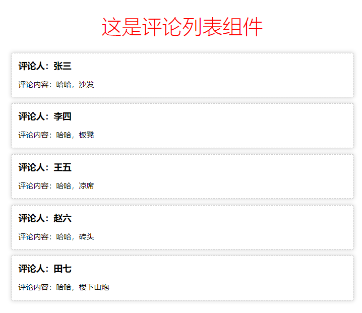

## 一、React基础介绍

## 1. React简介

> AngularJS     2009年（谷歌）
>
> React.js      2013年5月（Facebook）
>
> Vue.js        2014年2月（尤雨溪 ）
>
> Angular2      2016年9月（谷歌）

+ React 起源于 Facebook 的内部项目，因为该公司对市场上所有 JavaScript MVC 框架，都不满意，就决定自己写一套，用来架设 Instagram（照片交友） 的网站。做出来以后，发现这套东西很好用，**就在2013年5月开源了**。
+ 由于 React 的**设计思想极其独特**，属于革命性创新，性能出众，代码逻辑却非常简单。所以，越来越多的人开始关注和使用，认为它可能是将来 Web 开发的主流工具。
+ 清楚两个概念：
  + library（库）：小而巧的库，只提供了特定的API；
  + Framework（框架）：大而全的是框架；框架提供了一整套的解决方案；


## 2. 前端三大主流框架

> 三大框架一大抄

+ Angular.js：出来**较早**的前端框架，学习曲线比较陡，NG1学起来比较麻烦，NG2 ~ NG5开始，进行了一系列的改革，也提供了组件化开发的概念；从NG2开始，也支持使用TS（TypeScript）进行编程；
+ Vue.js：**最火**（关注的人比较多）的一门前端框架，它是中国人开发的，对我我们来说，文档要友好一些；
+ React.js：**最流行**（用的人比较多）的一门框架，因为它的设计很优秀；


## 3. React与vue的对比
### 组件化方面
1. **什么是模块化：**是从 **代码** 的角度来进行分析的；把一些可复用的代码，抽离为单个的模块；便于代码的维护和开发；
2. **什么是组件化：** 是从 **UI 界面** 的角度 来进行分析的；把一些可复用的UI元素，抽离为单独的组件；便于项目的维护和开发；
3. **组件化的好处：**随着项目规模的增大，手里的组件越来越多；很方便就能把现有的组件，拼接为一个完整的页面；
4. **Vue是如何实现组件化的：** 主要通过 `.vue` 文件，来创建组件
   + template 结构
   + script       行为
   + style         样式


5. **React如何实现组件化**：在 React 中，并没有像 `.vue` 类似的组件文件；在React中，组件是通过 Javascript 表示的；

   + 大家可以认为，在 React 中，每一个 `.js` 文件，都是一个 组件；

   + React 中，每一个组件的 结构、样式、行为，都是由 Javascript 来表示；
   + 所以学习React，对 Javascript 和 ES6 的基本功要求，比较高一些！
   + 注意： React 中一个比较痛苦的点，就是 没有提供指令的概念；一些的操作，都需要程序员使用JS来实现；   
     + Array.map()       //  map 方法，有返回值；【在React中，只要涉及到数组的渲染，必然会用到 map 方法】
     + Array.forEach()  // forEach 方法，没有返回值；

6. 学习React的技术要求：

   + Node.js
   + Webpack
   + Javascript 面向对象
   + ES6 高级语法     `class`    `WePY`
### 开发团队方面
+ React是由FaceBook前端官方团队进行维护和更新的；因此，React的维护开发团队，技术实力比较雄厚；
+ Vue：第一版，主要是有作者 尤雨溪 专门进行维护的，当 Vue更新到 2.x 版本后，也有了一个以 尤雨溪 为主导的开源小团队，进行相关的开发和维护；

### 社区方面
+ 在社区方面，React由于诞生的较早，所以社区比较强大，一些常见的问题、坑、最优解决方案，文档、博客在社区中都是可以很方便就能找到的；
+ Vue是近两年才火起来的，所以，它的社区相对于React来说，要小一些，可能有的一些坑，没人踩过；

### 移动APP开发体验方面
+ Vue，结合 Weex 这门技术，提供了 迁移到 移动端App开发的体验（Weex，目前只是一个 小的玩具， 并没有很成功的 大案例）
+ React，结合 ReactNative，也提供了无缝迁移到 移动App的开发体验（RN用的最多，也是最火最流行的）；


## 4. 为什么要学习React
1. 和Angular1相比，React设计很优秀，一切基于JS并且实现了组件化开发的思想；
2. 开发团队实力强悍，不必担心断更的情况；
3. 社区强大，很多问题都能找到对应的解决方案；
4. 提供了无缝转到 ReactNative 上的开发体验，让我们技术能力得到了拓展；增强了我们的核心竞争力；
5. 很多企业中，前端项目的技术选型采用的是React.js；


## 5. React中几个核心的概念
### 虚拟DOM（Virtual Document Object Model）
 + **DOM和虚拟DOM的区别**：

    + **DOM：**浏览器中，提供的概念；用JS对象，表示页面上的元素，并提供了操作元素的API；

    + **虚拟DOM：**是框架中的概念；而是开发框架的程序员，手动用JS对象来模拟DOM元素和嵌套关系；

      + 本质： 用JS对象，来模拟DOM元素和嵌套关系；
      + 目的：就是为了实现页面元素的高效更新；

      
      
### Diff算法
 - **tree diff:**在页面中的每一层节点，都需要对比，整颗DOM树从上到下，对比一遍以后，所有需要 被按需更新的元素，必然能够被查找出来！

 - **component diff：**在对比DOM树种每一层的时候，会对每个 组件，进行对比；

    - 如果对比前后，组件的类型相同，则 暂时 认为 组件不需要被更新；
    - 如果对比前后，组件的类型不同，则 移除 旧组件，创建新组件，并把 新组件替换到原来的位置；

 - **element diff:**组件中，元素级别的对比，叫做 Element Diff；

   
    
## 6. 创建基本的webpack4.x项目

1. 运行`npm init -y` 快速初始化项目

2. 在项目根目录创建`src`源代码目录和`dist`产品目录

3. 在 src 目录下创建 `index.html`

4. 使用 cnpm 安装 webpack ，运行`cnpm i webpack webpack-cli -D`
   + 如何安装 `cnpm`: 全局运行 `npm i cnpm -g`

5. 注意：webpack 4.x 提供了 约定大于配置的概念；目的是为了尽量减少 配置文件的体积；

   + 在项目根目录，新建 `webpack.config.js` 配置文件

   + 默认约定了：
   + 打包的入口是`src` -> `index.js`
   + 打包的输出文件是`dist` -> `main.js`
   + 4.x 中 新增了 `mode` 选项(为必选项)，可选的值为：`development` 和 `production`;


## 7. 在项目中使用 react

1. 运行 `cnpm i react react-dom -S` 安装包

   + react： 专门用于创建组件和虚拟DOM的，同时组件的生命周期都在这个包中
   + react-dom： 专门进行DOM操作的，最主要的应用场景，就是`ReactDOM.render()`

2. 在`index.html`页面中，创建容器：

   ```html
   <!-- 容器，将来，使用 React 创建的虚拟DOM元素，都会被渲染到这个指定的容器中 -->
   <div id="app"></div>
   ```

3. 导入 包：

   ```js
   import React from 'react'
   import ReactDOM from 'react-dom'
   ```

4. 创建虚拟DOM元素：

   ```jsx
   // 这是 创建虚拟DOM元素的 API    <h1 title="啊，五环" id="myh1">你比四环多一环</h1>
   //  第一个参数： 字符串类型的参数，表示要创建的标签的名称
   //  第二个参数：对象类型的参数， 表示 创建的元素的属性节点
   //  第三个参数： 子节点
   const myh1 = React.createElement('h1', { title: '啊，五环', id: 'myh1' }, '你比四环多一环')
   ```


5. 渲染：

   ```js
   // 3. 渲染虚拟DOM元素
   // 参数1： 表示要渲染的虚拟DOM对象
   // 参数2： 指定容器,注意：这里不能直接放 容器元素的Id字符串，需要放一个容器的DOM对象
   ReactDOM.render(myh1, document.getElementById('app'))
   ```

   

## 8. JSX语法

> 什么是JSX语法：就是符合 xml 规范的 JS 语法；（语法格式相对来说，要比HTML严谨很多）

1. **如何启用 jsx 语法？**
   + 安装 `babel` 插件

     - 运行`cnpm i babel-core babel-loader babel-plugin-transform-runtime -D`
     - 运行`cnpm i babel-preset-env babel-preset-stage-0 -D`

   + 安装能够识别转换jsx语法的包 `babel-preset-react` 

     + 运行`cnpm i babel-preset-react -D`

   + 添加 `.babelrc` 配置文件

     ```json
     {
       "presets": ["env", "stage-0", "react"],
       "plugins": ["transform-runtime"]
     }
     ```

   + 添加babel-loader配置项：

     ```js
     module: { //要打包的第三方模块
         rules: [
           { test: /\.js|jsx$/, use: 'babel-loader', exclude: /node_modules/ }
         ]
     }
     ```

     

2. **jsx 语法的本质：**并不是直接把 jsx 渲染到页面上，而是 内部先转换成了 createElement 形式，再渲染的；

3. **在 jsx 中混合写入 js 表达式**：在 jsx 语法中，要把 JS代码写到 `{ }` 中

   + 渲染数字
   + 渲染字符串
   + 布尔值实现三元表达式
   + 为属性绑定值 (不需要用引号)
   + 渲染jsx元素（直接渲另一个jsx）
   + 渲染jsx元素数组
   + 将普通字符串数组，转为jsx数组并渲染到页面上【两种方案】

4. **在 jsx 中 写注释**：推荐使用`{ /* 这是注释 */ }`

5. **为 jsx 中的元素添加class类名**：需要使用`className` 来替代 `class`；`htmlFor`替换label的`for`属性

6. 在JSX创建DOM的时候，所有的节点，必须有唯一的根元素进行包裹；

7. 在 jsx 语法中，标签必须 成对出现，如果是单标签，则必须自闭和！

> 当 编译引擎，在编译JSX代码的时候，如果遇到了`<`那么就把它当作 HTML代码去编译，如果遇到了 `{}` 就把 花括号内部的代码当作 普通JS代码去编译；


> (React 谷歌调试工具) https://chrome.google.com/webstore/category/extensions?hl=zh-CN


## 9. React中创建组件

### 第1种 - 创建组件的方式

> **使用构造函数来创建组件**，如果要接收外界传递的数据，需要在 构造函数的参数列表中使用`props`来接收；
>
> 必须要向外return一个合法的JSX创建的虚拟DOM；

+ 创建组件：

  ```jsx
  function Hello () { 
  	// return null 
  	return <div>Hello 组件</div>
  }
  ```

+ 为组件传递数据：

  ```jsx
  // 使用组件并 为组件传递 props 数据
  <Hello name={dog.name} age={dog.age} gender={dog.gender}></Hello>
  
  // 在构造函数中，使用 props 形参，接收外界 传递过来的数据
  function Hello(props) {
    // props.name = 'zs'
    console.log(props)
    // 结论：不论是 Vue 还是 React，组件中的 props 永远都是只读的；不能被重新赋值；
  
    return <div>这是 Hello 组件 --- {props.name} --- {props.age} --- {props.gender}</div>
  }
  ```


1. 父组件向子组件传递数据

2. 使用{...obj}展开运算符传递数据

3. 将组件封装到单独的文件中

4. 注意：组件的名称首字母必须是大写

5. 在导入组件的时候，如何省略组件的`.jsx`后缀名：

   ```js
   // 打开 webpack.config.js ，并在导出的配置对象中，新增 如下节点：
   resolve: {
       extensions: ['.js', '.jsx', '.json'], // 表示，这几个文件的后缀名，可以省略不写
       alias: {
           '@': path.join(__dirname, './src')
       }
     }
   ```

6. 在导入组件的时候，配置和使用`@`路径符号

### 第2种 - 创建组件的方式

> 使用 class 关键字来创建组件
>
> ES6 中 class 关键字，是实现面向对象编程的新形式；

#### 了解ES6中 class 关键字的使用

1. class 中 `constructor` 的基本使用
2. 实例属性和实例方法
3. 静态属性和静态方法
4. 使用 `extends` 关键字实现继承

#### 基于class关键字创建组件

1. 最基本的组件结构：

   ```jsx
   // 如果要使用 class 定义组件，必须 让自己的组件，继承自 React.Component
   class 组件名称 extends React.Component {
       // 构造函数中声明组件私有变量
       constructor(props) {
           super(props)
           // state中放状态值(既组件数据)
           this.state = {
               
           }
       }
       // render函数负责渲染DOM部分
       render(){
           // render 函数中，必须 返回合法的 JSX 虚拟DOM结构
           return <div>这是 class 创建的组件</div>
       }
   }
   ```


## 10. 两种创建组件方式的对比

1. 用**函数**创建出来的组件：无状态组件；
2. 用**class关键字**创建出来的组件：有状态组件；
3. 什么情况下使用有状态组件？什么情况下使用无状态组件？
   - 如果组件内，不需要有私有的数据，此时，使用构造函数创建无状态组件比较合适；
   - 如果组件内，需要有自己私有的数据，则，使用 class 关键字 创建有状态组件比较合适；
4. 组件中的 `props` 和 `state` 之间的区别
   - props 中存储的数据，都是外界传递到组件中的；
   - props 中的数据，都是只读的；
   - state 中的数据，都是组件内私有的；
   - state 中的数据，都是可读可写的；
   - props 在有状态组件 和 无状态组件中，都有；
   - state 只有在有状态组件中才能使用；无状态组件中，没有 state；
   - 在有状态组件中拥有 生命周期函数，无状组件不存在

### 通过for循环生成多个组件
1. 数据：
```js
CommentList: [
    { id: 1, user: '张三', content: '哈哈，沙发' },
    { id: 2, user: '李四', content: '哈哈，板凳' },
    { id: 3, user: '王五', content: '哈哈，凉席' },
    { id: 4, user: '赵六', content: '哈哈，砖头' },
    { id: 5, user: '田七', content: '哈哈，楼下山炮' }
]
```



jsx代码实现：

~~~jsx
const React = require('react');
const ReactDOM = require('react-dom');
// 基础渲染
// class Comment extends React.Component {
// 	constructor(props) {
// 		super(props);
// 		this.state = {
// 			CommentList: [
// 				{ id: 1, user: '张三', content: '哈哈，沙发' },
// 				{ id: 2, user: '李四', content: '哈哈，板凳' },
// 				{ id: 3, user: '王五', content: '哈哈，凉席' },
// 				{ id: 4, user: '赵六', content: '哈哈，砖头' },
// 				{ id: 5, user: '田七', content: '哈哈，楼下山炮' }
// 			]
// 		};
// 	}
// 	render() {
// 		return (
// 			this.state.CommentList.map(item => {
// 				return (
// 					<div key="item.id">
// 						<h4>评论人：{item.user}</h4>
// 						<p>评论内容：{item.content}</p>
// 					</div>
// 				)
// 			})
// 		);
// 	}
// }
// 分离组件渲染
function Item(props) {
  console.log(props)
  return (
    <div>
      <h3>评论人：{props.data.user}</h3>
      <p>评论内容：{props.data.content}</p>
    </div>
  )
}
class Comment extends React.Component {
  constructor(props) {
    super(props)
    this.state = {
      CommentList: [
        { id: 1, user: '张三', content: '哈哈，沙发' },
        { id: 2, user: '李四', content: '哈哈，板凳' },
        { id: 3, user: '王五', content: '哈哈，凉席' },
        { id: 4, user: '赵六', content: '哈哈，砖头' },
        { id: 5, user: '田七', content: '哈哈，楼下山炮' }
      ]
    }
  }
  render() {
    return (
      this.state.CommentList.map(val => <Item key={val.id} data={val}/>)
    )
  }
}
ReactDOM.render(< Comment />, document.getElementById('app'))
~~~


## 11. 设置样式

- style-loader
- css-loader
- babel-plugin-react-html-attrs

1. 使用普通的 `style` 样式

   ```jsx
   <h1 style={ {color: 'red', fontWeight: 200} }></h1>
   ```

2. 安装loader包

   ~~~js
   npm install style-loader css-loader -D
   
   // 单纯使用loader解析css样式表配置
   { test: /\.css$/, use: ['style-loader', 'css-loader'] } 
   ~~~

3. 启用 css-modules

   1. 修改 `webpack.config.js`这个配置文件，为 `css-loader` 添加参数：

      ```js
      // 启用 CSS 模块化配置
      module: {
          rules: [
              {
                  test: /\.css$/,
                  exclude: /node_modules/,
                  use: [
                      { 
                          loader: 'style-loader' 
                      },
                      { 
                          loader: 'css-loader' ,
                          // 配置css-loader
                          options: {
                              // 开启css模块化
                              module: true,
                          }
                      },
                  ]
              }
          ]
      },
      
      ```

   2. 在需要的组件中，`import`导入样式表，并接收模块化的 CSS 样式对象：

      ```js
      非模块化使用，样式全局有效
      import '@/React/index.css';
      模块化使用每个.css文件中的样式 唯一（即使同名但是在不同.css文件中）
      import cssObj from '../css/CmtList.css'
      ```

   3. 在需要的HTML标签上，使用`className`指定模块化的样式：

      ```jsx
      <h1 className={cssObj.title}>评论列表组件</h1>
      ```

4. 模块化配置及使用说明

   >1、那个组件使用在那个组件中使用；
   >
   >2、拓展插件：babel-plugin-react-html-attrs
   >
   >```js
   ># For Babel 6
   >npm install --save-dev babel-plugin-react-html-attrs
   ># For Babel 5
   >npm install --save-dev babel-plugin-react-html-attrs@1.0.0
   >
   >// 配置
   >在项目根目录下的.babelrc文件中粘贴代码
   >{
   >  "plugins": [
   >    "react-html-attrs"
   >  ]
   >}
   >```

5. 使用`localIdentName`自定义生成的类名格式，可选的参数有：

   - [path]  表示样式表 `相对于项目根目录` 所在路径

   - [name]  表示 样式表文件名称

   - [local]  表示样式的类名定义名称

   - [hash:length]  表示32位的hash值

   - 例子：

     ~~~json
     // 连起来写
     { 
         test: /\.css$/, 
         use: [
             'style-loader', 
             'css-loader?modules&localIdentName=[path][name]-[local]-[hash:5]'
         ] 
     }
     // 分开来写
     { 
         test: /\.css$/, 
         use: [
             {
                 loader: 'style-loader'
             }, 
             {
                 loader: 'css-loader',
                 options: {
                     modules: true,
                 	localIdentName: '[path][name]-[local]-[hash:5]'
                 }
             }
         ] 
     }
     ~~~

     

6. 使用 `:local()` 和 `:global()`

   - `:local()`包裹的类名，是被模块化的类名，只能通过`className={cssObj.类名}`来使用

     同时，`:local`默认可以不写，这样，默认在样式表中定义的类名，都是被模块化的类名；

   - `:global()`包裹的类名，是全局生效的，不会被 `css-modules` 控制，定义的类名是什么，就是使用定义的类名`className="类名"`

   - 例如：

     ~~~js
     :local(title){
         color: red;
     }
     ~~~

     

7. 注意：只有`.title`这样的类样式选择器，才会被模块化控制，类似于`body`这样的标签选择器，不会被模块化控制；

#### 》在项目中启用模块化并同时使用bootstrap

1、先安装bootstrap，less库

`npm install bootstrap@3.3.7 --save`

`npm install less --save`

1. 需要安装loader

   - url-loader 

   - file-loader

   - less-loader

   - scss-loader

     安装：`npm install url-loader file-loader --save`

2. 把 自己的样式表，定义为 `.scss`  文件

3. 第三方的 样式表，还是 以 `.css` 结尾

4. 我们只需要为自己的 `.scss` 文件，启用模块化即可；

5. 运行`cnpm i sass-loader node-sass -D` 安装能够解析`scss`文件的loader

6. 添加loader规则：

   ```json
   // 打包处理 scss 文件的 loader
   { 
       test: /\.scss$/, 
    	use: [
           'style-loader', 
           'css-loader?modules&localIdentName=[path][name]-[local]-[hash:5]', 
           'sass-loader'
        ] 
   }
   ```

>**由于第三方 UI 样式库一般不建议模块化，但是自定义样式表又希望模块化，所以定义为不同的样式类型文件，比如：第三方为.css结尾，自定义则为.scss或者.less**

2、遇坑解决方法

webpack官方文档及百度配置，但是**最新版本v3.2.0会报错**

~~~json
{
    test: /\.less$/,
    use: [
        {
            loader: 'style-loader',
        },
        {
            loader: 'css-loader',
            // 配置css-loader
            options: {
                // 开启css模块化
                modules: true,
                localIdentName: '[local]-[hash:base64:5]',
            }
        },
        {
            loader: 'less-loader',
        }
    ]
},
~~~



看过GitHub上文档之后，配置如下

~~~json
{
    test: /\.less$/,
    use: [
        {
            loader: 'style-loader',
        },
        {
            loader: 'css-loader',
            // 配置css-loader
            options: {
                // 开启css模块化
                modules: {
                    mode: 'local',
                    localIdentName: '[local]-[hash:base64:5]',
                },
            }
        },
        {
            loader: 'less-loader',
        }
    ]
},
~~~

> `localIdentName`需要写在modules里边

# 二、 React 中绑定事件

1. 事件的名称都是React提供的，因此名称的首字母必须大写`onClick`、`onMouseOver`、`onMouseEnter`、`onChange`

2. 为事件提供的处理函数，必须是如下格式

   ```
   onClick = { function }
   ```

3. 用的最多的事件绑定形式为：

   ```jsx
   <button onClick={ () => this.show('传参') }>按钮</button>
   
   // 事件的处理函数，需要定义为 一个箭头函数，然后赋值给 函数名称
   show = (arg1) => {
       console.log('show方法' + arg1)
   }
   ```

4. 在React中，如果想要修改 state 中的数据，推荐使用 `this.setState({ })`

**重点注意：**函数中的this问题，解决方法可以用**箭头函数**，官方建议是在constructor中通过bind或者call改变函数的this指向

### 1. 绑定文本框与state中的值（单向数据流|双向数据流）

> 像原生一样通过给input框绑定onChange等事件监听value值得变化，再通过事件对象**event.target**获取并改变dom对象的value值

~~~jsx
export default class Btn extends React.Component {
  constructor(props) {
    super(props)
    this.state = {
      number: 1
    }
    // 这里可以改变this的指向
    this.add = this.add.bind(this);
    this.setnum = this.setnum.bind(this);
  }
  # 单向数据流
  add() {
    // console.log(this.state.number++);
    this.setState({
      number: this.state.number + 1
    })
  }
  # 双向数据流
  setnum(ev) {
    this.setState({
      number: Number(ev.target.value)
    })
  }
  render() {
    return (
      <div>
        <button onClick={this.add}>点击</button>
        <input type="text" value={this.state.number} onChange={this.setnum}/>
        <p>{this.state.number}</p>
      </div>
    )
  }
}
~~~

# 三、使用ref获取DOM元素引用

和 Vue 中差不多，vue 为页面上的元素提供了 `ref` 的属性，如果想要获取 元素引用，则需要使用`this.$refs.引用名称`

在 React 中，也有 `ref`, 如果要获取元素的引用`this.refs.引用名称`

~~~jsx
render() {
    return (
        <div>
            <p ref="p">我要变色</p>
            <button onClick={this.handle}>变色</button>
        </div>
    )
}
handle() {
    this.refs.p.style.color = 'red';
}
~~~

# 四、 组件的生命周期

- 生命周期的概念：每个组件的实例，从 创建、到运行、直到销毁，在这个过程中，会出发一些列 事件，这些事件就叫做组件的生命周期函数；

- React组件生命周期分为三部分：

  - **组件创建阶段**：特点：一辈子只执行一次

  > componentWillMount: 
  > render：
  > componentDidMount: 

  - **组件运行阶段**：按需，根据 props 属性 或 state 状态的改变，有选择性的 执行 0 到多次

  > componentWillReceiveProps:
  > shouldComponentUpdate:
  > componentWillUpdate: 
  > render: 
  > componentDidUpdate: 

  - **组件销毁阶段**：一辈子只执行一次

  > componentWillUnmount: 

[React Native 中组件的生命周期](http://www.race604.com/react-native-component-lifecycle/)



React生命周期的回调函数总结成表格如下：


组件生命周期的执行顺序：

1. **Mounting：**
   - constructor()
   - componentWillMount()
   - render()
   - componentDidMount()
2. **Updating：**
   - componentWillReceiveProps(nextProps)
   - shouldComponentUpdate(nextProps, nextState)
   - componentWillUpdate(nextProps, nextState)
   - render()
   - componentDidUpdate(prevProps, prevState)
3. **Unmounting：**
   - componentWillUnmount()

# 五、React组件参数及传参

## 1、属性介绍

react通过绑定组件的属性来传递参数props

无状态组件传值：

~~~jsx
const React = require('react');
const ReactDOM = require('react-dom');
// 组件传值
function Son(props) {
    return (
        <div>
            <span>我是子组件的内容</span>
            <br></br>
            <span>{props.name}</span>
        </div>
    )
}
function Parent(props) {
    return (
        <div>
            <Son name={props.name}></Son>
            <h1>{ props.name }</h1>
        </div>
    )
}
ReactDOM.render(
    <Parent name="传值" />,
    document.getElementById('app')
)
~~~

有状态组件传值

~~~jsx
const React = require('react'); // 引入方式不做要求，require和import均可
const ReactDOM = require('react-dom');
export default class List extends React.Component {
  constructor(props) { // 从这里可以接收到组件属性传递的数据
    super(props)
    this.state = {}
  }
  render() {
    return (
      <div>{this.props.name}</div>
    )
  }
}
ReactDOM.render(
  <div>
    <List name={0}/> // 此处将会传递给组件一个name属性的值，在props中可以拿到
  </div>,
document.getElementById('app'))
~~~


### defaultProps

在组件创建之前，会先初始化默认的props属性，这是全局调用一次，严格地来说，这不是组件的生命周期的一部分。在组件被创建并加载候，首先调用 constructor 构造器中的 this.state = {}，来初始化组件的状态。

### propTypes

配合defaultProps来对组件传递的参数进行规则校验

### 示例：Counter计数器

1. 依赖包`prop-types`

2. 给 `props` 属性提供默认值 和 进行类型校验，需要先运行`cnpm i prop-types --save`

3. 给组件的 `props` 提供默认值

   ```js
   // 为组件提供 默认的 props 属性值
   static defaultProps = {
   	initcount: 0 // 默认值为0    如果用户没有传递 ，则 默认就是0； 如果用户传递了，则 以用户传递的为准
   }
   ```

4. 给组件的 `props` 进行类型校验

   ~~~jsx
   // 3. 进行 props 属性的类型校验,   static propTypes = {}  是固定写法
   static propTypes = {
   	initcount: PropTypes.number.isRequired // 规定 外界在传递 initcount 的时候，必须是 number 值类型，否则 ，会在终端报警告
   	// isRequired 表示 这个 props 属性值 是必须要传递的
   }
   ~~~

5. 校验实例

   ```jsx
   import React from 'react'
   import ReactDOM from 'react-dom'
   import propTypes from 'prop-types';
   
   class Verify extends React.Component {
     constructor(props) {
       super(props)
       this.state = {
         i: this.props.count
       }
       this.add = this.add.bind(this);
     }
     render() {
       return (
         <div>
           <p>{this.state.i}</p>
           <input title={this.props.color}></input>
           <button onClick={this.add}>增加</button>
         </div>
       )
     }
     add() {
       this.setState({
         i: ++this.state.i
       })
     }
   }
   // 在组件内部调用此方法需要ES7语法，外部调用为ES6语法
   / ES6语法
   Verify.defaultProps = {
     color: 'blue',
     count: 0
   }
   Verify.propTypes = {
     count: propTypes.number
   }
   ReactDOM.render(
     <div>
       <Verify count={3}/>
     </div> ,
     document.getElementById('app')
   )
   ```

##  2、父子组件传值

- 子传父：可以通过props属性进行传值

- 父传子：可以通过在标签属性定义一个回调函数，进行传参

parent.jsx

~~~jsx
import React from 'react'
import Son from "@/byvalue/son";

export default class Parent extends React.Component {
  constructor(props) {
    super(props)
    this.state = {
      name: '小明',
      list: ['蜀道难', '难于上青天', '蚕丛及鱼凫'],
    }
    this.getData = this.getData.bind(this)
  }
  render() {
    return (
      <div>
        {/* pushItem即是定义一个函数事件用来获取子组件中的传值 */}
        <Son name={this.state.name} pushItem={this.getData}/>
        <ul>
          {
            this.state.list.map((item) => {
              return (
                <li key={item}>{item}</li>
              )
            })
          }
        </ul>
      </div>
    )
  }
  getData(param) {
    console.log(param)
    let arr = this.state.list
    arr.push(param)
    this.setState({
      list: arr
    })
  }
  
}
~~~

son.jsx

~~~jsx
import React, { Component } from 'react'

export default class Son extends Component {
    constructor(props) {
        super(props)
        this.state = {
            name: this.props.name,
            item: '',
        }
        this.setList = this.setList.bind(this)
        this.setData = this.setData.bind(this)
    }
    render() {
        console.log(this.state.name);
        console.log(this.props.name);
        return (
            <div>
                <span>{this.props.name}</span>
         {/* 此处通过设置事件onChange获取input的value值，通过ref属性可以获取input对象 */}
                <input type="text" value={this.state.item} onChange={this.setList} ref={myInput=>this.myInput=myInput}/>
                <button onClick={this.setData}>添加</button>
            </div>
        )
    }
    setList(ev) {
        this.setState({
            item: ev.target.value
        })
    }
    setData() {
        // pushItem是子组件在父组件中定义的一个事件属性
        this.props.pushItem(this.state.item)
        // 此处在input框传递给父组件值之后清空输入框的值
        this.setState({
            item: ''
        })
        // 通过ref绑定的值，使光标重新定位到当前input框内
        this.myInput.focus()
    }
}

~~~

# 六、axios请求

1. 用于测试的API地址：

   ```nginx
   get 请求地址： http://www.liulongbin.top:3005/api/getlunbo
   post请求地址： http://www.liulongbin.top:3005/api/post
   ```

2. 全局配置`axios`从而让每个组件都能直接调用`axios`发起Ajax请求

   ```js
   import React from 'react'
   import axios from 'axios'
   
   // class 关键字 底层 也是由 普通 function 构造函数来实现的，因此 class 只是个语法糖
   React.Component.prototype.$http = axios
   
   // 在每个 用 class 关键字 创建的 组件，都可以直接调用`this.$http`来发起Ajax请求
   ```

3. 全局配置请求的`baseURL `地址

   ```js
   // 全局配置请求的URL根路径
   axios.defaults.baseURL = 'http://www.liulongbin.top:3005';
   ```


## 1、表格渲染案例

### a. 表格渲染

brandList.jsx

~~~jsx
import React, { Component } from "react";
// 引入表格组件和弹出对话框组件
import { Table, Modal, Button } from 'antd'
const { confirm } = Modal;

class List extends Component {
  constructor(props) {
    super(props)
    this.state = {
      // colums就是配置表格列属性的配置项
      columns: [
        {
          title: '编号',
          dataIndex: 'id',
          key: 'id'
        },
        {
          title: '创建时间',
          dataIndex: 'ctime',
          key: 'ctime'
        },
        {
          title: '寄语',
          dataIndex: 'name',
          key: 'name'
        },
        {
          title: '操作',
		  # 返回数据没有此列的数据，此列为操作列，那么可以用render函数来渲染出自己想要的组件
          // 其中组件有三个参数
          render: (text, record, index) => {
          	1、这是最常用的一个事件传参bind指向this之后，第二个参数之后都可以传递本列数据以作为参数
            // return <a href="javascript:;" onClick={this.delItem.bind(this, text, record, index)}>删除</a>
          	2、第二种方法，重新定义一个箭头函数，内部调用操作函数
            return <a href="javascript:;" onClick={() => {this.delItem(text, record, index)}}>删除</a>
          }
        },
      ],
      data: []
    }
  }
  // 获取数据的生命周期函数
  componentWillMount() {
    this.getData()
  }
  getData() {
    // 全局导入axios之后，进行调用
    this.$http.get('/api/getprodlist').then(res => {
      console.log(res);
      this.$message.success('数据请求成功！')
      let info = res.data.message;
      #通过moment插件自定义一个时间过滤器
      info.forEach(val => {
        val.ctime = this.$moment(val.ctime).format('YYYY-MM-DD')
      });
      this.setState({
        data: res.data.message
      })
    })
  }
  delItem(text, record, index) {
    console.log(text, record, index);
    // 这是对话框组件
    confirm({
      title: '提示?',
      content: '你确定要删除本条信息吗？',
      okText: '确定',
      okType: 'danger',
      cancelText: '取消',
      onOk:() => {
        this.$http.get('/api/delproduct/'+ record.id).then(res => {
          console.log(res);
          if(res.data.status == 0) {
            this.getData()
          }
        })
      },
      onCancel:() => {
        console.log('Cancel');
      },
    });

  }
  render() {
    return (
      <div style={{marginTop: '20px'}}>
        <h2 style={{margin:'0 atuo', textAlign: 'center'}}>品牌列表</h2>
        <hr/>
        <Table rowKey={'id'} columns={this.state.columns} dataSource={this.state.data}></Table>
      </div>
    )
  }
}

export default List
~~~

### b. 全局引入antd组件

### c. 全局引入第三方插件moment

### d. 提取公共引用

global.js全局引用

~~~jsx
import React from "react";
import axios from 'axios'
import { message } from "antd";
import moment from "moment";
// 简单引用并配置axios
axios.defaults.baseURL = 'http://www.liulongbin.top:3005';
React.Component.prototype.$http = axios
将插件和组件拷贝给react组件原型
React.Component.prototype.$message = message
React.Component.prototype.$moment = moment
~~~

### 问题：

#### 1、为什么事件调用函数需要重新指向this，但是请求行数却不需要

> 原因： 因为react中事件本身（如：onClick）就是个中间变量，把函数直接赋值给变量this就会丢失。而请求函数并没有这个步骤，this未发生改变

例子

~~~js
let obj = {
    tmp:'Yes!',
    onClick:function(){
        console.log(this.tmp);
    }
};
let handleClick = obj.onClick;
handleClick(); // 此时调用this就会出现丢失
~~~

[相关文章》](https://www.cnblogs.com/DM428/p/7777539.html)

#### 2、如何完美的全局挂载各个第三方插件


## 2、antd组件使用

- modal弹出框

- form表单

在brandList.jsx组件中引入

~~~jsx
import React, { Component } from "react";
import { Table, Modal, Button } from 'antd'
import AddForm from '@/brandlist/addForm'
const { confirm } = Modal;

class List extends Component {
  constructor(props) {
    super(props)
    this.state = {
      columns: [
        {
          title: '编号',
          dataIndex: 'id',
          key: 'id'
        },
        {
          title: '创建时间',
          dataIndex: 'ctime',
          key: 'ctime'
        },
        {
          title: '品牌',
          dataIndex: 'name',
          key: 'name'
        },
        {
          title: '操作',
          render: (text, record, index) => {
            // return <a href="javascript:;" onClick={this.delItem.bind(this, text, record, index)}>删除</a>
            return <a href="javascript:;" onClick={() => {this.delItem(text, record, index)}}>删除</a>
          }
        },
      ],
      data: [],
      visible: false,
      fields: {
        username: {
          value: '',
        },
      },
    }
    this.addItem = this.addItem.bind(this)
    this.handleOk = this.handleOk.bind(this)
    this.handleCancel = this.handleCancel.bind(this)
    this.handleFormChange = this.handleFormChange.bind(this)
  }
  componentWillMount() {
    this.getData()
  }
  // 获取表格数据
  getData() {
    this.$http.get('/api/getprodlist').then(res => {
      console.log(res);
      this.$message.success('数据请求成功！')
      let info = res.data.message;
      info.forEach(val => {
        val.ctime = this.$moment(val.ctime).format('YYYY-MM-DD')
      });
      this.setState({
        data: res.data.message
      })
    })
  }
  // 删除一行数据
  delItem(text, record, index) {
    console.log(text, record, index);
    confirm({
      title: '提示?',
      content: '你确定要删除本条信息吗？',
      okText: '确定',
      okType: 'danger',
      cancelText: '取消',
      onOk:() => {
        this.$http.get('/api/delproduct/'+ record.id).then(res => {
          console.log(res);
          if(res.data.status == 0) {
            this.getData()
          }
        })
      },
      onCancel:() => {
        console.log('Cancel');
      },
    });

  }
  // 添加按钮
  addItem() {
    this.setState({
      visible: true
    })
  }
  // 弹出对话框确定事件
  handleOk(e) {
    this.setState({ visible: false })
    e.preventDefault();
    this.form.props.form.validateFields((err, values) => {
      // console.log(err);
      if (!err) {
        this.$http.post('/api/addproduct', {name: values.username}).then(res => {
          // console.log(res);
          this.getData();
        })
      }
    });
    console.log(this.form.props.form)
    console.log(this.form.props.form.getFieldValue('username') + ',,,,,,,,,,,,,,,')
  }
  // 弹出对话框取消事件
  handleCancel() {
    this.setState({ visible: false })
  }
  // 回调函数监听并同步设置表单的值
  handleFormChange = changedFields => {
    this.setState(({ fields }) => ({
      fields: { ...fields, ...changedFields },
    }));
  };
  render() {
    return (
      <div style={{margin: '20px'}}>
        <h2 style={{margin:'0 atuo', textAlign: 'center'}}>品牌列表</h2>
        <hr/>
        <div style={{ margin: '20px 0'}}>
          <Button type="primary" onClick={this.addItem}>添加商品</Button>
          <Modal
            title="添加品牌"
            okText="确认"
            cancelText="取消"
            visible={this.state.visible}
            onOk={this.handleOk}
            onCancel={this.handleCancel}>
            {/* 此处引入表单组件，onChange为表单组件中定义的回调函数。
            wrappedComponentRef函数为antd中rac-form规定建议使用获取表单组件的API*/}
            <AddForm ref='form' {...this.state.fields} onChange={this.handleFormChange} wrappedComponentRef={(form) => this.form = form}/>
          </Modal>
        </div>
        <Table rowKey={'id'} columns={this.state.columns} dataSource={this.state.data}></Table>
      </div>
    )
  }
}

export default List
~~~

表单组件AddForm.jsx

~~~jsx
import React, { Component } from 'react';
import { Form, Input } from 'antd';
1、建立表单组件
class AddForm extends Component {
  
  render() {
    // 表单布局配置参数
    const formItemLayout = {
      labelCol: {
        xs: { span: 24 },
        sm: { span: 3 },
      },
      wrapperCol: {
        xs: { span: 24 },
        sm: { span: 20 },
      },
    };
    // getFieldDecorator表单项工具对象
    const { getFieldDecorator } = this.props.form;
    return (
      <Form {...formItemLayout} className="login-form">
        <Form.Item label="品牌">
          {
            getFieldDecorator('username', { 
  # initialValue设置表单默认取值，在绑定下边两个双向绑定函数后，将不会生效，必须到state中进行设置
              initialValue: '123456',
              rules: [{ type: 'string', required: true, message: '请填写内容!' }]
            })
            (<Input placeholder="填写品牌"/>)
          }
        </Form.Item>
      </Form>
    );
  }
} 
2、Form.create进行form组件包装
const Add_form = Form.create({ name: 'add_form', 
  // onFieldsChange和mapPropsToFields此处两个函数即是实现表单数据【双向绑定】
  // 如果不想使用此功能也可以使用Form.create的API函数操作
  onFieldsChange(props, changedFields) {
    props.onChange(changedFields);
  },
  mapPropsToFields(props) {
    return {
      username: Form.createFormField({
        ...props.username,
        value: props.username.value,
      }),
    };
  },
  onValuesChange(_, values) {
    console.log(values);
  },
})(AddForm);

export default Add_form
~~~

# 七、Redux

## 1、基础理解

Redux简单理解是一个统一管理项目变量和对象、数组的仓库。主要由三部分组成store(仓库)、reducer(管理者）、action(应用)。

- store：仓库，即用来生成仓库对象，并抛出仓库的一个js文件。
- reducer：即管理仓库中的数据的一个js文件，主要负责存储变量、数据、对象，负责获取和设置变量的值。
- action：是当变量被应用后发生的一些值得变化的行为，一般直接发生在组件的事件或者函数中。
- 流程图：


- 下边是一个简单的列表增删数据的例子


例子：

store.js

~~~js
// 这里引入redux，和reducer并且创建一个store对象
import { createStore } from 'redux'
import reducer from "./reducer";
// new createStore第一个参数是reducer，第二个参数是一个window兼容性处理，并且添加到window对象中
const store = new createStore(reducer,window.__REDUX_DEVTOOLS_EXTENSION__ && window.__REDUX_DEVTOOLS_EXTENSION__());
export default store
~~~

reducer.js

~~~js
// 这里既是存储所有数据的地方
const defaultState = {
  inputValue: '',
  list: [
    '玩儿翁二无二特',
    '温热他仍',
    '王二个人和哥哥'
  ]
}
// 这里是处理数据读写的一个函数，它默认有两个参数：state【数据】，action【component传过来的数据】
export default (state = defaultState, action) => {
  // 默认state里的值，只能读取，不能赋值
  // state.inputValue = action.inputValue 这是错误的写法，无效
  let newState = JSON.parse(JSON.stringify(state))
  if(action.type === 'setValue') {
    newState.inputValue = action.inputValue
  }
  if(action.type === 'addValue') {
    newState.list.push(newState.inputValue)
    newState.inputValue = ''
  }
  if(action.type === 'delValue') {
    console.log(action.index)
    newState.list.splice(action.index, 1)
  }
  // 这里也可以进行return newState
  return state
}
~~~

action和component

~~~jsx
// 这是应用层，引入store，并且在要改变数据的函数中使用action
/*
	此处包含的store的API
	store.getState() 获取数据
	store.subscribe() 订阅事件
	store.dispatch() 推送数据
*/
import React, { Component } from 'react'
import { Input, Button, List } from "antd";
import store from './store'
class demo1 extends Component {
  constructor(props) {
    super(props)
    console.log(store.getState());
    // 可以通过store.getState()方法获取store中获取
    this.state = store.getState()
    this.storeChange = this.storeChange.bind(this)
    // subscribe即订阅，当发生输入框onchange事件等数据发生实时变化时，需对该事件进行订阅，否则input输入框将无法数据内容。
    store.subscribe(this.storeChange)
  }
  
  render() {
    return (
      <div>
        <div style={{width: '400px', margin: '20px auto'}}>
          <Input 
          placeholder="请输入值"
          style={{width: '250px'}} 
          onChange={this.changeInputValue.bind(this)}
          // 所需要的store中的值可以在this.state中获得  
          value={this.state.inputValue}></Input>
          <Button type="primary" onClick={this.addItem}>添加</Button>
        </div>
        <div style={{width: '400px', margin: '20px auto'}}>
          <List bordered dataSource={this.state.list} 
          renderItem={(item, index)=>(<List.Item onClick={this.delItem.bind(this, index)}>{item}</List.Item>)} />
        </div>
      </div>
    );
  }
  changeInputValue(e) {
    console.log(e.target.value)
    let action = {
      type: 'setValue', // type为一个识别标识符类型的键值，用来区分不同的action
      inputValue: e.target.value
    }
    // 这里通过dispatch将一个action行为派遣到store中，最终通过reducer管理者进行处理
    store.dispatch(action)
  }
  // 通过该方法实现数据双向绑定
  storeChange() {
    this.setState(store.getState())
  }
  addItem = () => {
    let action = {
      type: 'addValue',
    }
    store.dispatch(action)
  }
  delItem(index) {
    let action = {
      type: 'delValue',
      index: index
    }
    store.dispatch(action)
  }
}

export default demo1;
~~~


## React项目相关框架及文章

- [dva官方文档](https://dvajs.com/guide/)

- [dva框架简介](https://juejin.im/entry/5852184b128fe1006b5454c6)

- [dav的GitHub](https://github.com/dvajs)

- [electron](https://github.com/electron/electron)

## 安装 React Developer Tools 调试工具

[React Developer Tools - Chrome 扩展下载安装地址](https://chrome.google.com/webstore/detail/react-developer-tools/fmkadmapgofadopljbjfkapdkoienihi?hl=zh-CN)

## 相关文章

+ [2018 年，React 将独占前端框架鳌头？](https://mp.weixin.qq.com/s/gV-w_rRfdBVAqsOpBGZaVw)
+ [前端框架三巨头年度走势对比：Vue 增长率最高](https://mp.weixin.qq.com/s/0wXWqKIigaKzMSfy4vJMVw)


+ [React数据流和组件间的沟通总结](http://www.cnblogs.com/tim100/p/6050514.html)
+ [单向数据流和双向绑定各有什么优缺点？](https://segmentfault.com/q/1010000005876655/a-1020000005876751)
+ [怎么更好的理解虚拟DOM?](https://www.zhihu.com/question/29504639?sort=created)
+ [React中文文档 - 版本较低](http://www.css88.com/react/index.html)
+ [React 源码剖析系列 － 不可思议的 react diff](http://blog.csdn.net/yczz/article/details/49886061)
+ [深入浅出React（四）：虚拟DOM Diff算法解析](http://www.infoq.com/cn/articles/react-dom-diff?from=timeline&isappinstalled=0)
+ [一看就懂的ReactJs入门教程（精华版）](http://www.cocoachina.com/webapp/20150721/12692.html)
+ [CSS Modules 用法教程](http://www.ruanyifeng.com/blog/2016/06/css_modules.html)
+ [将MarkDown转换为HTML页面](http://blog.csdn.net/itzhongzi/article/details/66045880)
+ [win7命令行 端口占用 查询进程号 杀进程](https://jingyan.baidu.com/article/0320e2c1c9cf0e1b87507b26.html)