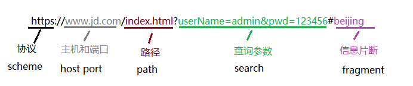
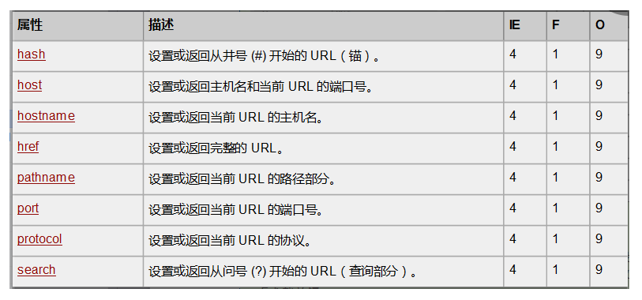

## webAPI概念

**webAPI具体含义**

- API：（Application Programming Interface,应用程序编程接口）， **工具**。
- web API：操作浏览器 和 网页的一套**==工具库== ** （ **BOM 和 DOM** ）。
<!-- more -->
## 文档树

概念：DOM，文档对象模型，又称为**文档树模型**。


>浏览器浏览器在加载页面时， 会把html文档解析成一系列的对象。再由这些对象组成 树状结构。存入内存。这些对象对外都提供了属性和方法。我们可以通过调用对象的属性和方法来操作网页。

**注意**： `树状结构上的每一个都是对象，也可叫做==节点对象==。` 

**节点对象的分类：**` ==文档对象==、==元素对象==、属性对象、文本对象 `

**小结：**

> 文档树：本质就是浏览器把**文档**、**文档中标签**、标签属性以及标签文本转换成对象，按照嵌套关系以**树状结构** 存放这一组对象，并放入内存中。

## DOM的操作

※	获取元素

※	操作元素，获取或设置元素对象的属性或调用元素对象的方法。

※	动态创建、追加、删除元素

※	事件 （注册事件、事件监听、事件对象）。

### 〇、Document对象本身

#### 什么是Document 对象？

当浏览器载入 HTML 文档, 它就会成为 **Document 对象**。

Document 对象是 HTML 文档的根节点。

Document 对象使我们可以从脚本中对 HTML 页面中的所有元素进行访问。

**提示：**Document 对象是 Window 对象的一部分，可通过 window.document 属性对其进行访问。

##### Document.集合

| 集合                                       | 描述                         |
| ---------------------------------------- | -------------------------- |
| [all[]](http://www.w3school.com.cn/jsref/coll_doc_all.asp) | 提供对文档中所有 HTML 元素的访问。       |
| [anchors[]](http://www.w3school.com.cn/jsref/coll_doc_anchors.asp) | 返回对文档中所有 Anchor 对象的引用。     |
| applets[]                                | 返回对文档中所有 Applet 对象的引用。     |
| [forms[]](http://www.w3school.com.cn/jsref/coll_doc_forms.asp) | 返回对文档中所有 Form 对象引用。        |
| [images[]](http://www.w3school.com.cn/jsref/coll_doc_images.asp) | 返回对文档中所有 Image 对象引用。       |
| [links[]](http://www.w3school.com.cn/jsref/coll_doc_links.asp) | 返回对文档中所有 Area 和 Link 对象引用。 |

###### document.all[ i ]

all[] 是一个多功能的类似数组的对象，它提供了对文档中所有 HTML 元素的访问。all[] 数组源自 IE 4 并且已经被很多其他的浏览器所采用。

all[] 包含的元素保持了最初的顺序，如果你知道它们在数组中的确切数字化位置，可以直接从数组中提取它们。然而，更为常见的是使用 all[] 数组，根据它们的 HTML 属性 name 或 id 来访问元素。如果多个元素拥有指定的 name，将得到共享同一名称的元素的一个数组。

> 提供对文档中所有 HTML 元素的访问
>
> all[] 已经被 Document 接口的标准的 **getElementById()** 方法和 **getElementsByTagName()** 方法以及 Document 对象的 **getElementsByName()** 方法所取代。尽管如此，这个 all[] 数组在已有的代码中仍然使用。 

语法：

~~~js
document.all[i]
document.all[name]
document.all.tags[tagname]
~~~

JQuery中的一个$(),可以把这些功能全部包括

##### Document 对象属性

| 属性                                       | 描述                                       |
| ---------------------------------------- | ---------------------------------------- |
| [body](http://www.runoob.com/jsref/prop-doc-body.html) | 提供对 <body> 元素的直接访问。对于定义了框架集的文档，该属性引用最外层的 <frameset>。 |
| [cookie](http://www.w3school.com.cn/jsref/prop_doc_cookie.asp) | 设置或返回与当前文档有关的所有 cookie。                  |
| [domain](http://www.w3school.com.cn/jsref/prop_doc_domain.asp) | 返回当前文档的域名。                               |
| [baseURI](http://www.runoob.com/jsref/prop-doc-baseuri.html) | 返回文档的绝对基础 URI                            |
| [referrer](http://www.w3school.com.cn/jsref/prop_doc_referrer.asp) | 返回载入当前文档的文档的 URL。                        |
| [URL](http://www.w3school.com.cn/jsref/prop_doc_url.asp) | 返回当前文档的 URL。                             |
| [doctype](http://www.runoob.com/jsref/prop-document-doctype.html) | 返回与文档相关的文档类型声明 (DTD)。                    |
| [documentURI](http://www.runoob.com/jsref/prop-document-documenturi.html) | 设置或返回文档的位置                               |
| [readyState](http://www.runoob.com/jsref/prop-doc-readystate.html) | 返回文档状态 (载入中……)                           |
| [inputEncoding](http://www.runoob.com/jsref/prop-document-inputencoding.html) | 返回用于文档的编码方式（在解析时）。                       |

###### [document.cookie](https://developer.mozilla.org/zh-CN/docs/Web/API/Document/cookie) 

**什么是cookie** 

- cookie是存储于访问者计算机中的变量 
- cookie是浏览器提供的一种机制 
- 可以由JavaScript对其进行控制(设置、读取、删除)

**cookie主要有六大属性** 

| 属性   | 含义   | 事例   |
| ---- | ---- | ---- |
| name |      |      |
|      |      |      |
|      |      |      |
|      |      |      |
|      |      |      |
|      |      |      |

**cookie的特性** 

- cookie可以实现跨页面全局变量 
- cookie可以跨越同域名下的多个网页，但不能跨越多个域名使!用 
- 同一个网站中所有页面共享一套cookie 
- 可以设置有效期限 
- 存储空间4-10KB左右
- cookie机制将信息存储于用户**硬盘**，因此**可以作为跨页面全局变量**， 这是它最大的一个优点 .

>  常用场合：（1）保存用户登录状态；（2）跟踪用户行为；（3）定制页面；（4）创建购物车 …等等

**cookie的缺点** 
（1）cookie可能被禁用； 
（2）cookie与浏览器相关，不能互相访问； 
（3）cookie可能被用户删除； 
（4）cookie安全性不够高； 
（5）cookie存储空间很小(只有4–10KB左右)

**Cookie设置** 

>  每个cookie都是一个 **名/值 对**，(key=value)格式的字符串 

例如： 

~~~js
document.cookie = "user1=YY"; 
~~~

如果要改变一个cookie的值，只需重新赋值 

例如：

~~~js
 document.cookie = "password=QQ";
~~~

如果不设置时间，浏览器关闭，cookie就会消失

设置有效期： 

~~~js
var dates=new Date(); 
dates.setDate(dates.getDate()+3); //按天数设置 

document.cookie = "user1=YY; expires="+ dates;
~~~

**删除cookie** 
cookie过期会自动消失 
要删除一个cookie，可将其有效期设为一个过去的时间 
例如： 

~~~js
var date=new Date(); 
dates.setDate(dates.getDate()-1); 

document.cookie = "user1=YY; expires=" + dates;
~~~

**读取cookie** 

~~~js
document.cookie = "user1=YY"; 
document.cookie = "user2=MM"; 

var cookies=document.cookie; 
alert(cookies); 

返回："user1=YY;user2=MM"
~~~

合写：

只能够一次获取所有的cookie值 ，用户必须自己解析这个字符串，来获取指定的cookie值 

**将cookie转换为JS对象（封装getCookie函数）**

~~~js
function getcookie () {
    var cookie = {};
    var all = document.cookie;
    if (all === '')
        return cookie;
    var list = all.split('; ');
    for (var i = 0; i < list.length; i++) {
        var item = list[i];
        var p = item.indexOf('=');
        var name = item.substring(0, p);
        name = decodeURIComponent(name);
        var value = item.substring(p + 1);
        value = decodeURIComponent(value);
        cookie[name] = value;
    }
    return cookie;
}
~~~

**设置/修改** 

~~~js
function setCookie (name, value, expires, path, domain, secure) {
    var cookie = encodeURIComponent(name) + '=' + encodeURIComponent(value);
    if (expires)
        cookie += '; expires=' + expires.toGMTString();
    if (path)
        cookie += '; path=' + path;
    if (domain)
        cookie += '; domain=' + domain;
    if (secure)
        cookie += '; secure=' + secure;
    document.cookie = cookie;
}
~~~

**删除** 

~~~~js
function removeCookie (name, path, domain) {
    document.cookie = name + '='
    + '; path=' + path
    + '; domain=' + domain
    + '; max-age=0';
}
~~~~

###### [documentURI](http://www.runoob.com/jsref/prop-document-documenturi.html) 

###### [document.addEventListener()](http://www.runoob.com/jsref/met-document-addeventlistener.html) 

###### [document.baseURI](http://www.runoob.com/jsref/prop-doc-baseuri.html) 

返回文档的绝对基础 URI 

###### document.readyState

readyState 属性返回当前文档的状态（载入中……）。

该属性返回以下值:

- uninitialized - 还未开始载入
- loading - 载入中
- interactive - 已加载，文档与用户可以开始交互
- complete - 载入完成

document.body 

document.[cookie](prop_doc_cookie.asp.htm) 

document.[domain](prop_doc_domain.asp.htm) 

document.[referrer](prop_doc_referrer.asp.htm) 

document.[title](prop_doc_title.asp.htm) 

document.[URL](prop_doc_url.asp.htm) 

### 一、获取元素

为什么要获取？

> 我们将来要操作网页，无非就是 **操作网页中的标签的内容和样式**。
>
> 若要通过js操作某一个标签，那么第一步就是先通过js **获取到标签对应的树状上的元素**。

注意：

> 浏览器在加载网页时，就已经创建好了每一个标签所对应的节点对象。
>
> 我们  **现在不需要创建，只要获取就可以。**

#### ★  通过document直接获取元素的方法

##### ☞  id 和 '标签名'---获取法

###### .getElementById()

√   **document.getElementById('标签的id值'); **

```javascript

// 根据标签的id值，获取【单个节点对象】。 返回单个节点对象
var mainNode = document.getElementById('main');
console.dir(mainNode);  // 找到返回一个节点对象，找不到返回null

注意：标签的id值，一般都是唯一的。若有重复的id值，则仅仅获取第一个。
	 id值的命名规范：由数字、字母、_、$组合，不可以数字开头。

```

###### .getElementsByTagName()

√  **document.getElementsByTagName('标签名'); **

```javascript

// 根据标签名获取【一组节点对象】。返回一个伪数组
var liNodes = document.getElementsByTagName('li');
console.dir(liNodes);  // 找到返回一个伪数组，伪数组中存放了多个节点对象。找不到返回空的伪数组

```

##### ☞  选择器---获取法

###### .querySelector()

√  **document.querySelector('选择器'); **【不考虑IE低版本，移动端，推荐使用】

~~~javascript
// 根据选择器获取【单个节点对象】。返回一个节点对象
var zzNodes = document.querySelector('ul li.active');
console.dir(zzNodes);  //找到返回一个节点对象，找不到返回null

注意：该方式有兼容性问题。在IE低版本（IE8以下有兼容性问题）
~~~

###### .querySelectorAll()

√  **document.querySelectorAll('选择器');** 【不考虑IE低版本，移动端，推荐使用】

~~~javascript
// 根据标签的name值获取【一组节点对象】。返回一个伪数组
var zzNodes = document.querySelectorAll('ul li.active');
console.log(zzNodes);  //找到返回一个伪数组，伪数组中存放了多个节点对象。找不到返回空伪数组

注意：该方式有兼容性问题。在IE低版本（IE8以下有兼容性问题）
~~~

###### .getElementsByClassName('option:checked')

√  **document.getElementsByClassName('标签的类名');**

√  **document.getElementsByClassName('标签的类名  后一个标签的类名:伪类');**

~~~javascript
// 根据标签的类名获取一组节点对象。返回一个伪数组
var boxNodes = document.getElementsByTagName('box');
console.dir(liNodes);  // 找到返回一个伪数组，伪数组中存放了多个节点对象。找不到返回空伪数组

注意：该方式有兼容性问题。在IE低版本（IE8及以下有兼容性问题）会报错
~~~

###### .getElementsByName()

√  **document.getElementsByName('标签的name值');**

~~~javascript
// 根据标签的name值获取一组节点对象。返回一个伪数组
var zzNodes = document.getElementsByName('zz');
console.dir(zzNodes);  // 找到返回一个伪数组，伪数组中存放了多个节点对象。找不到返回空伪数组

注意：该方式有兼容性问题。在IE低版本（IE10以下有兼容性问题）
~~~

#### ★  通过节点【关系】获取元素【节点】的方法

##### ☞ 获取父节点

###### .parentNode

**√  元素节点.parentNode；**

> 作用：获取一个父节点

~~~php+HTML
<div id="grandFather">
	<p id="father">
		<a href="#" id="son">超链接</a>
	</p>
</div>
<script>
	var a = document.getElementById('son');
	console.dir(a.parentNode);     // 获取a元素的父节点；即：获取p元素
	console.dir(a.parentNode.parentNode);  // 获取a元素的父节点的父节点；即：获取div元素
</script> 
~~~

##### ☞ 获取子节点

###### .children

 **√  父节点.children**  

> 作用：获取一组子元素

~~~php+HTML
例子：
<ul id="list">
	<li>我是li1</li>
	<li>我是li2</li>
	<li>我是li3</li>
	<li>我是li4</li>
	<li>我是li5</li>
</ul>
<script>	
	var ul = document.getElementById('list'); 	// 获取ul元素
	var items = ul.children;  	// 获取ul下的所有元素节点（仅仅元素节点）
	console.log(items.length);    // 结果是5
	console.log(items);   // HTMLCollection(5) [li, li, li, li, li]
</script>
~~~

###### .childNodes

**√  父节点.childNodes**

> 作用：获取一组子节点（包括文本节点和元素节点）

~~~php+HTML
<ul id="list">
	<li>我是li1</li>
	<li>我是li2</li>
	<li>我是li3</li>
	<li>我是li4</li>
	<li>我是li5</li>
</ul>
<script>	
	var ul = document.getElementById('list');   // 获取ul元素
	var items = ul.childNodes;    // 获取ul下的所有子节点（包括文本 和 元素节点）
	console.log(items.length);  // 结果是11
	console.log(items);  
	// NodeList(11) [text, li, text, li, text, li, text, li, text, li, text]
</script>
~~~

###### .firstChild

###### .firstElementChild

**√   父节点.firstChild和父节点.firstElementChild**

> 作用：获取一组子元素中的第1个子元素

~~~javascript
父节点.firstChild;    // 获取第一个子节点对象，包含空白文本节点对象
父节点.firstElementChild   // 获取第一个元素子节点对象，有兼容问题IE9以下不支持
~~~

###### .lastChild

###### .lastElementChild

**√   父节点.lastChild和父节点.lastElementChild**

> 作用：获取一组子元素中的第1个子元素

```javascript
父节点.lastChild;    // 获取最后一个子节点对象，包含空白文本节点对象
父节点.lastElementChild    // 获取最后一个元素子节点对象，有兼容问题IE9以下不支持
```

##### ☞ 获兄弟节点

###### .previousElementSibling

>  作用：获取上一个同级的元素节点，有兼容问题IE9以下不支持

~~~
元素节点.previousElementSibling;
~~~

###### .nextElementSibling

>  作用：获取下一个同级的元素节点，有兼容问题IE9以下不支持

~~~
元素节点.nextElementSibling;
~~~

### 二、操作元素

#### ★  操作元素属性【对象属性】

**介绍：元素对象属性分类**

##### ☞  非表单属性

- id   元素的ID
- title  元素的标题
- href   元素的链接
- src    元素所指向的地址
- className   元素的类名
- innerHTML   元素的所有【包括标签和文本】内容
- innerText     元素的纯文本内容
- 等等。。。。。。

> 语法：
>
> ​	》获取：元素对象.属性名
>
> ​	》设置：元素对象.属性名 = 属性值

~~~javascript
获取：
var div = document.getElementById('box');
console.log(div.title);  // 获取并输出属性【title】对应的值 
设置：
var div = document.getElementById('box'); // 获取元素
console.log(div.title);  // 获取并输出属性【title】对应的值 
div.title = 'hello';     // 设置（更改）这个【div】的【title】属性的值
console.log(div.title);  // 输出设置之后的属性【div】的【title】属性的值
/ 查看元素对象所有属性
可以通过输入：console.dir(div)   // 通过下部点击开对象，可以看到所有属性。
~~~

###### .className

###### .className.replace    待？

**元素对象.className**

> 作用：操作元素的类名。可以通过类名管理或切换元素的样式。

~~~javascript
var div = document.getElementById('box'); // 获取元素
console.log(div.className);  // 获取并输出元素的类名
div.className = 'dv1 dv2';   // 设置元素的类名
console.log(div.className);  // 获取元素的类名

var box = document.getElementById('box');
box.className = 'aa bb';//设置
box.className.replace('aa','AA');// 替换: ‘AA’替换‘aa’

/ 注意：类名可以有多个，多个类名之间用空格分隔
~~~

###### .innerHTML

**元素对象.innerHTML**

> 作用：操作元素的内容【包括内部标签和文本】

~~~javascript
var div = document.getElementById('box'); // 获取元素
// 获取元素内部的内容，若元素内部有其他标签，获取则包含内部的标签和文本
console.log(div.innerHTML);       控制台：'<h1>标题</h1>'
// 设置元素内部的内容，若设置的元素内部有其他标签，则元素内部标签会被浏览器解析
div.innerHTML = '<h>标题</h1>';   页面：只显示'标题'两个字
console.log(div.innerHTML);   

※ 注意：新添加的内容会覆盖原有的内容
~~~

###### .innerText

**元素对象.innerText**

> 作用：操作元素的内容【不包含标签，只有text文本内容】

~~~javascript
var div = document.getElementById('box');   // 获取元素
// 获取元素内部的内容，若元素内部有其他标签，获取的仅仅是文本，不包含内部标签
console.log(div.innerText);        控制台：只显示'标题'两个字
// 设置元素内部的内容，若设置的元素内部有其他标签，则元素内部标签不会被解析，标签会被转义
div.innerText = '<h1>标题</h1>';   页面：'<h1>标题</h1>'
console.log(div.innerText);  
~~~

###### textContent    

- innerText 对IE的兼容性较好 
- textContent虽然作为标准方法但是只支持IE8+以上的浏览器 
- 最新的浏览器，两个都可以使用

##### ☞  表单属性

###### .value

**元素对象.value**

> 作用：操作表单元素的值【所有表单元素都可以用】,
>
> ​	   可以获取表单中填写的内容

~~~HTML
之前：<input type="text" id="userName">
<script>
	var userName = document.getElementById('userName');  // 获取文本框元素
	console.log(userName.value);  // 获取文本框的内容  //内容： ''
	userName.value = 'admin';  	  //【设置文本框的内容】
	console.log(userName.value);  // 内容： 'admin'
</script> 

之后：<input type="text" id="userName" value="admin">
~~~

###### .checked

**元素对象.checked**

> 作用：操作表单元素 **是否**选中【针对 单选框 和 多选框 】

~~~HTML
之前：<input type="checkbox" id="ck">
<script>
	var ck = document.getElementById('ck');  // 获取多选框元素
	console.log(ck.checked);   	// 获取多选框选中状态  // 结果：false 未选中
	ck.checked = true;    // 设置多选框选中状态为 选中
	console.log(ck.checked);   	// 获取多选框的选中状态 // 结果：true  选中
</script>

之后：<input type="checkbox" id="ck" checked>
~~~

###### .disabled

**元素对象.disabled**

> 作用：操作表单元素 **是否**禁用【针对按钮，表单也可用】

~~~	html
之前：<input type="button" id="btn"value='按钮'>
<script>
	var btn = document.getElementById('btn');   // 获取按钮元素
	console.log(btn.disabled);  // 获取按钮禁用状态  //结果：false 没有禁用
	btn.disabled = true;  	// 设置按钮是否可禁用状态 禁用
	console.log(btn.disabled);  // 获取按钮禁用状态  //结果：true  禁用了
</script> 

之后：<input type="button" id="btn"value='按钮' disabled>
~~~

###### .selected

**元素对象.selected**

> 作用：操作下拉框选项**是否**选中【针对下拉框】

~~~html
<select id='userName'>
	<!-- 默认选中张三 -->
	<option value="张三">张三</option>
	<option value="李四">李四</option>
	<option value="王五">王五</option>
	<option value="赵六">赵六</option>
</select>
<script>
	var userName = document.getElementById('userName');
	var options = document.getElementsByTagName('option');
	console.log(userName.value);  // 结果：张三
	console.log(options[1].selected);  // false 李四没有被选中
	options[1].selected = true;	// 设置李四被选中
	console.log(userName.value);  // 结果：李四
	console.log(options[1].selected);  // true  李四被选中
</script>
~~~

##### ☞  行内样式属性.style【只写】

###### .style.width

###### .style.height

###### .style.backgroundColor

**元素.style.属性名 = ‘字符串’；**

~~~javascript
var box = document.getElementById('box');
box.style.width = '100px';
box.style.height = '100px';
box.style.backgroundColor = 'red';
// css→ background-color   js→ backgroundColor
~~~

改变元素样式另见目录：**.className**

**小结：元素的style属性适合操作单个样式，而元素className适合操作一组样式**

##### ☞   获得CSS样式表中属性：元素.offset系列属性，client系列属性

## ? .innerWidth  ?

**获取元素宽高**

###### .offsetWidth

###### .offsetHeight

语法：元素.offsetWidth      、    元素.offsetHeight

> 用法：获取元素的宽度 和 高度，返回数字，不含单位。
>
> 元素的宽度：width + padding(左右) + border（左右）;
>
> 元素的高度： height + padding(上下) + border(上下);

~~~php+HTML
<!DOCTYPE html>
<html>
<head lang="en">
  <meta charset="UTF-8">
  <title></title>
  <style>
    div {
      width: 100px;
      height: 100px;
      padding: 10px;
      border: 5px solid red;
      background-color: blue;
    }
  </style>
</head>
<body>
  <div></div>
  <script>
    var divNode = document.querySelector('div');
    // width(100) + padding(左10 右10) + border(左5 右5)
    console.log(divNode.offsetWidth);// 130
    // height(100) + padding(上10 下10) + border(上5 下5)
    console.log(divNode.offsetHeight);// 130
  </script>
</body>
</html>
~~~

**获取元素到的位置坐标**

###### .offsetLeft

###### .offsetTop

语法：元素.offsetLeft      、    元素.offsetTop

> 作用：获取元素的坐标，相对于其最近的定位的上级元素的坐标。否则，相对于body。

1、父元素定位

~~~php+HTML
<!DOCTYPE html>
<html>
<head lang="en">
  <meta charset="UTF-8">
  <title></title>
  <style>
    * {
      margin:0;
      padding:0;
    }
    .father {
      width: 300px;
      height: 300px;
      background-color:blue;
      margin:50px auto;
      border:1px solid blue;
      position: relative;
    }
    .son {
      width:200px;
      height: 200px;
      margin:50px auto;
      background-color: #000;
    }
  </style>
</head>
<body>
  	<!--父元素是定位的-->
    <div class="father">
      <div class="son"></div>
    </div>
    <script>
      var sonNode = document.querySelector('.son');
      console.log(sonNode.offsetLeft);// 50  参照定位的父元素
      console.log(sonNode.offsetTop); // 50  参照定位的父元素
    </script>
</body>
</html>
~~~

2、父元素未定位

~~~php+HTML
<!DOCTYPE html>
<html>
<head lang="en">
  <meta charset="UTF-8">
  <title></title>
  <style>
    * {
      margin:0;
      padding:0;
    }
    .father {
      width: 300px;
      height: 300px;
      background-color:blue;
      margin:50px auto;
      border:1px solid blue;
    }
    .son {
      width:200px;
      height: 200px;
      margin:50px auto;
      background-color: #000;
    }
  </style>
</head>
<body>
    <!-- 父元素的没有定位-->
    <div class="father">
      <div class="son"></div>
    </div>
    <script>
      var sonNode = document.querySelector('.son');
      console.log(sonNode.offsetLeft);// 406  参照body
      console.log(sonNode.offsetTop);// 101   参照body
    </script>
</body>
~~~

**获取元素的父元素**

###### .offsetParent

**元素.offsetParent**

> 作用：获取元素的最近的定位的上级元素

1、父元素定位了

~~~php+HTML
<!DOCTYPE html>
<html>
<head lang="en">
  <meta charset="UTF-8">
  <title></title>
  <style>
    * {
      margin:0;
      padding:0;
    }
    .father {
      width: 300px;
      height: 300px;
      background-color:blue;
      margin:50px auto;
      border:1px solid blue;
      position: relative;
    }
    .son {
      width:200px;
      height: 200px;
      margin:50px auto;
      background-color: #000;
    }
  </style>
</head>
<body>
    <!-- 父元素有定位-->
    <div class="father">
      <div class="son"></div>
    </div>
    <script>
      var sonNode = document.querySelector('.son');
      var parent = sonNode.offsetParent;
      console.log(parent); // 获取定位的上级元素，div.father
    </script>
</body>
</html>
~~~

2、父元素没定位

~~~php+HTML
<!DOCTYPE html>
<html>
<head lang="en">
  <meta charset="UTF-8">
  <title></title>
  <style>
    * {
      margin:0;
      padding:0;
    }
    .father {
      width: 300px;
      height: 300px;
      background-color:blue;
      margin:50px auto;
      border:1px solid blue;
    }
    .son {
      width:200px;
      height: 200px;
      margin:50px auto;
      background-color: #000;
    }
  </style>
</head>
<body>
    <!-- 父元素没有定位-->
    <div class="father">
      <div class="son"></div>
    </div>
    <script>
      var sonNode = document.querySelector('.son');
      var parent = sonNode.offsetParent;
      console.log(parent); // 因为没有最近的定位的上级元素，所以获取body
    </script>
</body>
</html>
~~~



**获取元素的大小【了解】**

###### .clientWidth

###### .clientHeight

区别： 与offset系列区别，不算边框的宽度

语法：

> **元素.clientWidth**和 **元素.clientHeight** 
>
> 获取元素的宽度 和 高度，返回数字，不含单位。
>
> 元素的宽度：width + padding(左右) ;
>
> 元素的高度： height + padding(上下) 

~~~php+HTML
<!DOCTYPE html>
<html>
<head lang="en">
  <meta charset="UTF-8">
  <title></title>
  <style>
    div {
      width: 100px;
      height: 100px;
      padding:10px;
      border:5px solid red;
      background-color: blue;
      margin: 100px auto;
    }
  </style>
</head>
<body>
  <div></div>
  <script>
    var divNode = document.querySelector('div');
    // width(100) + padding(左10 右10) 
    // 注意：不包含边框
    console.log(divNode.clientWidth);//120
    // height(100) + padding(上10 下10)
	// 注意：不包含边框
    console.log(divNode.clientHeight);//120
  </script>
</body>
</html>
~~~

**获取元素的宽高【了解】**

###### .clientLeft

###### .clientTop

语法：

> **元素.clientLeft**   和   **元素.clientTop**
>
> 作用：获取元素的坐标，获取当前节点对象的padding的外边界，距离border外边界的距离。实际上就是左边框的厚度。

~~~php+HTML
<!DOCTYPE html>
<html>
<head lang="en">
  <meta charset="UTF-8">
  <title></title>
  <style>
    div {
      width: 200px;
      height: 200px;
      padding:10px;
      border:10px solid red;
      border-top:50px solid red;
      background-color: blue;
      margin: 100px auto;
    }
  </style>
</head>
<body>
<div></div>
<script>
  var divNode = document.querySelector('div');
  console.log(divNode.clientLeft);// 10
  console.log(divNode.clientTop);// 50
</script>
</body>
</html>
~~~



##### ☞   scroll系列滚动条

######  .onscroll()事件【方法】

语法：

> 元素.onscroll = function(){}

~~~php+HTML
<body>
  <div class="father">
    <div class="son">

    </div>
  </div>
  <script>
    var fNode = document.querySelector('.father');
    fNode.onscroll = function(){
      console.log(fNode.scrollTop);
    }
  </script>
</body>
~~~


作用：一般针对内容溢出的元素使用

###### .scrollWidth

###### .scrollHieght

> **元素.scrollWidth**  和  **元素.scrollHieght**
> 获取当前节点对象的宽度和高度，返回数字，不包含单位。
>
> 宽度：width+padding（左右）+ 溢出部分
>
> 高度：height+padding（上下）+ 溢出部分

~~~php+HTML
<!DOCTYPE html>
<html>
<head lang="en">
  <meta charset="UTF-8">
  <title></title>
  <style>
    * {
      margin:0;
      padding:0;
    }
    .father {
      width:300px;
      height: 300px;
      background-color: #000;
      margin:100px auto;
      /*overflow: auto;*/
      padding: 10px;
      border:10px solid red;
    }
    .son {
      width: 400px;
      height: 100px;
      background-color: blue;
    }
  </style>
</head>
<body>
  <div class="father">
    <div class="son">

    </div>
  </div>
  <script>
    var fNode = document.querySelector('.father');
    /*
      width + padding(左右)  包含溢出部分
    */
    console.log(fNode.scrollWidth); // 410
  </script>
</body>
</html>
~~~



###### .scrollLeft

###### .scrollTop

> **元素.scrollLeft**  和  **元素.scrollTop【重点】**
> 作用：获取元素内部总被卷去的内容的横向距离  和  **纵向距离** 

用法：这两个属性不仅可以**获取**，还可以**设置**

~~~php+HTML
<!DOCTYPE html>
<html>
<head lang="en">
  <meta charset="UTF-8">
  <title></title>
  <style>
    * {
      margin:0;
      padding:0;
    }
    .father {
      width:300px;
      height: 300px;
      background-color: #000;
      margin:100px auto;
      padding: 10px;
      overflow: auto;
      border:10px solid red;
    }
    .son {
      width: 100px;
      height: 400px;
      background-color: blue;
    }
  </style>
</head>
<body>
  <div class="father">
    <div class="son">

    </div>
  </div>
  <script>
    var fNode = document.querySelector('.father');
    fNode.onscroll = function(){
      console.log(fNode.scrollTop);
    }
  </script>
</body>
</html>
~~~



##### ☞   标签自定义属性的操作

什么是自定义属性

> 针对html标签的属性可以分为两类：
>
> - **标签自带属性（语言设计者提供的属性）**
>   id、title、src、href、name、type等
> - **自定义标签属性**
>   用户根据需求，自己给标签添加的自己定义的标签属性

~~~html

--> bigImg='bigWc.jpg' 就是用户自定义的标签属性
~~~

**操作方式**

√  获取

###### .getAttribute()

~~~javascript
节点对象.getAttribute('属性名');   // 会返回标签的属性的值
例：document.getAttribute('bigImg');
~~~

√  设置

###### .setAttribute()

~~~javascript
节点对象.setAttribute('属性名','值');   // 会修改或添加标签属性
let div1 = document.getElementById("div1"); 
div1.setAttribute("align", "center");
~~~

√  删除

###### .removeAttribute()

~~~javascript
节点对象.removeAttribute('属性名');   // 会删除标签的属性
~~~

> 注意：自定义标签属性的操作只能够通过元素的getAtrribute、setAttribute、removeAttribute提供的方法操作。 不能直接通过元素点的方式直接获取或设置


#### ★  操作元素自身—动态操作元素【增删节点】

##### ☞  创建元素

###### .innerHTML

**1、元素.innerHTML = '内容';**

~~~html
<ul id="list">
	<li>我是li1</li>
	<li>我是li2</li>
</ul>
<button id="btn">创建元素</button>
<script>
	var btn = document.getElementById('btn'); 	// 获取button元素
	var ul = document.getElementById('list');	// 获取ul元素
	// 获取所有li元素，并给每一个li元素添加点击事件
	var lis = ul.children;
    / 遍历新添加的li标签，给所有的新标签再添加点击事件
	for (var i = 0; i < lis.length; i++) {
		lis[i].onclick = function () {
			alert(this.innerText); 
		};
	}
	// 给按钮注册点击事件
	btn.onclick = function () {
		/ 给ul中添加也新的li元素
		ul.innerHTML = ul.innerHTML  + '<li><a href="#">我是新的li</a></li>';
	};
</script>

※ 注：新添加的元素在动态创建它的时候，便可以给他添加点击事件
~~~

> 缺点：会覆盖部分网页元素以及事件。

> 优点：对于创建嵌套多的元素方便。

###### .createElement()

**2、document.createElement('标签名');**

> 一般与下边的.appendChild()配合使用

~~~html
<ul id="list">
	<li>我是li1</li>
	<li>我是li2</li>
</ul>
<button id="btn">创建元素</button>
<script>
	var btn = document.getElementById('btn'); 	// 获取button元素
	var ul = document.getElementById('list'); 	// 获取ul元素
	/ 获取所有li元素，并给每一个li元素添加点击事件
	var lis = ul.children;
	for (var i = 0; i < lis.length; i++) {
		lis[i].onclick = function () {
			alert(this.innerText); 
		};
	}
	// 给按钮注册点击事件
	btn.onclick = function () {
		:/ 创建一个新的li元素节点
		var li = document.createElement('li');
		/ ul.appendChild(li) 	/ 把新的li追加到ul最后面
		:/ 创建一个a元素
		var a = document.createElement('a');
		a.href = '#';
		a.innerText = '我是新来的';  // 给a设置属性 和 内容
		/ li.appendChild(a);    / 把a存入到li中
	};
</script>
~~~

> 优点：不会覆盖原有的元素的事件。

> 缺点：对于添加嵌套多的内容操作麻烦。

**创建元素性能问题**

- innerHTML 会产生字符串解析，由于字符串的不可变性，尽量避免大量的拼接，否则消耗内存，影响性能。
- document.createElement('标签')创建的性能要比innerHTML要高，但是若涉及到多层嵌套内容时，代码操作麻烦。
- 所以，一般情况下,两者配合使用较多
  - document.createElement用来创建元素
  - innerHTML可以设置元素中的内容（元素内部的标签或文本）

————————————————————————————————————————

##### ☞  追加元素

###### .appendChild()

**父节点.appendChild(新的子节点);**

> 一般与上部的.createElement()配合使用     
>
> 作用：向父节点最后追加新的节点

~~~html
<ul id="list">
	<li>我第1个li</li>
	<li>我第2个li</li>
	<li>我第3个li</li>
</ul>
<button id="btn">按钮</button>
<script>
	var ul = document.getElementById('list');	// 获取ul元素
	var btn = document.getElementById('btn');	// 获取button元素
	// 给按钮元素注册事件
	btn.onclick = function () {
		var li = document.createElement('li');	/ 创建一个新的li元素
		li.innerHTML = '我是新来的';	   // 设定新的li的元素的内容
		ul.appendChild(li);   / 把新创建的li元素追加到ul中
	}
</script>
~~~

————————————————————————————————————————

##### ☞  删除元素

###### .removeChild()

**父节点.removeChild(子节点)** 

> 作用：删除父元素中的指定的子节点

~~~html
<ul id="list">
	<li>我第1个li</li>
	<li>我第2个li</li>
	<li>我第3个li</li>
</ul>
<button id="btn">删除第二个li</button>
<script>
	var ul = document.getElementById('list');	// 获取ul元素
	var btn = document.getElementById('btn');	// 获取button元素
	// 给按钮元素注册事件
	btn.onclick = function () {
		var li2 = ul.children[1];    // 获取第二个li
	 :/ ul.removeChild(li2); 		/ 删除第二li
	}
</script>
~~~

————————————————————————————————————————

##### ☞  插入元素

###### .insertBefore()

**父节点.insertBefore(新的节点,旧的子节点)** 

###### .insertAfter() 

>  作用：将一个新的节点插入到父节点中的某个子节点的前面

~~~html
<ul id="list">
	<li>我第1个li</li>
	<li>我第2个li</li>
	<li>我第3个li</li>
</ul>
<button id="btn">按钮</button>
<script>
	var ul = document.getElementById('list');	// 获取ul元素
	var btn = document.getElementById('btn');	// 获取按钮元素
	// 给按钮元素注册事件
	btn.onclick = function () {
		var li = document.createElement('li');  / 创建一个新的li元素
		li.innerHTML = '我是新来的';	   // 设定新的li的元素的内容
		var old = ul.children[1];	// 获取第二li元素
	   / 把新创建的li元素追加到ul中第二li的前面
	  :/ ul.insertBefore(li,old);
	}
</script>
~~~

————————————————————————————————————————

##### ☞  替换元素

###### .replaceChild()

**父节点.replaceChild(新的子节点,旧的子节点)** ;

> 作用：替换子节点

~~~html
<ul id="list">
	<li>我第1个li</li>
	<li>我第2个li</li>
	<li>我第3个li</li>
</ul>
<button id="btn">替换</button>
<script>
	var ul = document.getElementById('list');	// 获取ul元素
	var btn = document.getElementById('btn');	// 获取按钮元素
	// 给按钮元素注册事件
	btn.onclick = function () {
		var li = document.createElement('li');	/ 创建一个新的li元素
		li.innerHTML = '我是新来的';	   // 设定新的li的元素的内容
		var old = ul.children[1];    // 获取第二li元素
	    // 把新创建的li元素 和 ul中第二li的前面替换
	  	ul.replaceChild(li, old);
	}
</script>
~~~

##### ☞  克隆元素

###### .clone()

**node.clone(deep)** 

参数   deep: ture |  false

| 参数     | 类型      | 描述                                       |
| ------ | ------- | ---------------------------------------- |
| *deep* | Boolean | 可选。默认是 false。设置为 true，如果您需要克隆节点及其属性，以及后代设置为 false，如果您只需要克隆节点及其后代 |

### 三、事件基础

#### ★  事件基础概念、事件对象几大相关概念

##### ☞  事件基础介绍

###### 1、 什么是事件

-  我们和网页之间的交互，可以理解为何网页之间的一些行为。
-  常见行为：有鼠标点击、鼠标的移动、鼠标的移入和移出、键盘控制等等。
-  这些行为，在我们DOM中被称之为事件。
-  总而言之， **事件就是被JavaScipt侦测到的行为。**
-  事件的目的：就是 **实现网页交互**。


###### 2、 事件三要素

- 事件源（事件目标）：触发事件的元素
- 事件类型：哪种交互方式（鼠标点击、鼠标移入、鼠标离开等）
- 事件处理程序：事件触发后的结果，也就是事件发生后要执行的程序， 用**函数**表示


###### 3、 给元素注册事件【基本】

- 语法

  **事件源.事件类型 = 事件处理程序;**

- 代码

~~~html
需求：点击按钮，弹出'hello'
<input type="button" vlaue="按钮" id="btn">
<script>
	var btn = document.getElementById('btn'); 	// 获取事件目标
	/ 给事件目标绑定点击事件
	btn.onclick = function(){
      alert('hello');
	};
</script>
~~~

###### 4、移除事件【基本】

给事件重新复制，设置事件函数为空。

~~~php+HTML
需求：点击按钮，弹出'hello'
<input type="button" vlaue="按钮" id="btn">
<script>
	var btn = document.getElementById('btn'); 	// 获取事件目标
	/ 给事件目标绑定点击事件
	btn.onclick = function(){
      alert('hello');
	};
	/ 移出事件
    btn.onclick = null;
</script>
~~~


##### ☞  事件监听

**1.1** 为什么要学习事件监听？

`事件监听可以给元素绑定多个事件处理程序。在实际开发中， 便于对事件程序的功能扩展。`

**1.2** 什么是事件监听？

`事件注册 或 移除**的第二种方式`

**1.3** 事件监听给元素注册事件【重要】

###### .addEventListener【注册】

语法：事件目标.addEventListener(事件类型,  事件处理程序,  是否捕获);

> 功能：给元素注册事件
> 参数：
> 	    事件类型 ： 字符串  	==>    注意：事件名不加 on 如 'click'；
> 	    事件处理程序：	函数；
> 	    是否捕获：可选，默认为false 。 true表示启用捕获  false表示启用冒泡

~~~php+HTML
<div id="box">我是div</div>
<button id="btn">点击改变</button>
<script>
	// 获取按钮元素节点 和 div元素节点
	var btn = document.getElementById('btn');
	var box = document.getElementById('box');
	// 给按钮注册事件
	btn.addEventListener('click', function () {
		box.style.width = '500px';
	});
	btn.addEventListener('click',function () {
		box.style.height = '500px';
		box.style.backgroundColor = 'blue';
	});
</script>
~~~

###### .removeEventListener【移出】

语法：事件目标.removeEventListener(事件类型,事件处理程序名称);

> 功能：移除元素的指定事件程序
> 参数：
> 	   事件类型：字符串                      注意：事件名不加 on 如：'click'
> 	   事件处理程序：函数                  注意：这里要把函数名传入过来

~~~php+HTML
<div id="box">我是div</div>
<button id="btn">点击改变</button>
<script>
	// 获取按钮元素节点 和 div元素节点
	var btn = document.getElementById('btn');
	var box = document.getElementById('box');
	// 定义第一个功能
	function fn1 () {
		box.style.width = '500px';
	}
	// 给按钮注册事件
	btn.addEventListener('click',fn1);
	// 定义第二个功能
	function fn2 () {
		box.style.height = '500px';
		box.style.backgroundColor = 'blue';
	}
	// 给按钮注册事件
	btn.addEventListener('click',fn2);
	// 移除按钮元素的第二个功能
	btn.removeEventListener('click', fn2);
</script>
~~~

###### ※  事件监听注册和移除的兼容性处理

**√   注册事件**

标准： 事件目标.addEventListener(事件类型,事件处理程序,是否捕获);   事件类型不加 on；

IE低版本：事件目标**.attachEvent(事件类型,事件处理程序)**;  事件类型加 on；

兼容处理：

~~~javascript
 /*
    功能：绑定事件
    参数：
      node 事件目标 节点对象
      type 事件类型 string 不加on
      handler 事件处理程序 函数
    返回值：无
  */
  function addEvent(node, type, handler){
    if (node.addEventListener) { // 检测浏览器是否支持标准方式
      // 支持
      node.addEventListener(type, handler);
    } else {
      // 不支持
      node.attachEvent('on' + type, handler);
    }
  }
~~~

**√  移除事件**

标准： 事件目标.removeEventListener(事件类型,事件处理程序的名称);   事件类型不加 on；

IE低版本：事件目标**.detachEvent(事件类型,事件处理程序)**;  事件类型加 on；

兼容处理：

~~~javascript
* 参数解释见事件监听注册兼容处理  
  function removeEvent(node, type, handlerName){
    if (node.removeEventListener) {// 检测浏览器是否支持标准方式
      //支持
      node.removeEventListener(type, handlerName);
    } else {
      // 不支持
      node.detachEvent('on' + type, handlerName);
    }
  }
~~~


##### ☞  事件流

###### 1、事件流:

指的是 **事件的=传播=过程。**

**传播过程要经历三个阶段： 事件捕获 ==> 目标元素  ==> 事件冒泡** 。

**具体过程** ：将来不论任何事件，在触发后。都会经历三个阶段，只不过，在传播的过程中，要么激活捕获阶段或者激活冒泡阶段。

.jpg)

###### 2、事件捕获

~~~php+HTML
<!doctype html>
<html lang="en">
<head>
  <meta charset="UTF-8">
  <meta name="Generator" content="EditPlus®">
  <meta name="Author" content="">
  <meta name="Keywords" content="">
  <meta name="Description" content="">
  <title>Document</title>
  <style>
    *{
      margin:0;
      padding:0;
      line-height:30px;
      text-align:center;
      color:#fff;

    }
    .box0{
      width:400px;
      height:400px;
      background-color:blue;
      padding:50px;
    }
    .box1{
      width:300px;
      height:300px;
      background-color:green;
      padding:50px;
    }
    .box2{
      width:200px;
      height:200px;
      background-color:purple;
      padding:50px;
    }
    .box3{
      width:200px;
      height:200px;
      background-color:yellow;
      color:#000;
    }
  </style>
</head>
<body>
<div class="box0">
  box0
  <div class="box1">
    box1
    <div class="box2">
      box2
      <div class="box3">box3</div>
    </div>
  </div>
</div>

<script>
    /*
      事件捕获：
        现象：从document向目标阶段传递
    */

    // 获取一组div元素
    var divs = document.getElementsByTagName('div');
    // 循环遍历给每一个div注册点击事件
    for (var i = 0; i < divs.length; i++) {
      divs[i].addEventListener('click', function () {
          alert(this.className);
      }, true); // 启用捕获阶段处理。
    }
</script>

</body>
</html>
~~~

.jpg)

###### 3、事件冒泡

~~~php+HTML
<!doctype html>
<html lang="en">
<head>
  <meta charset="UTF-8">
  <meta name="Generator" content="EditPlus®">
  <meta name="Author" content="">
  <meta name="Keywords" content="">
  <meta name="Description" content="">
  <title>Document</title>
  <style>
    *{
      margin:0;
      padding:0;
      line-height:30px;
      text-align:center;
      color:#fff;

    }
    .box0{
      width:400px;
      height:400px;
      background-color:blue;
      padding:50px;
    }
    .box1{
      width:300px;
      height:300px;
      background-color:green;
      padding:50px;
    }
    .box2{
      width:200px;
      height:200px;
      background-color:purple;
      padding:50px;
    }
    .box3{
      width:200px;
      height:200px;
      background-color:yellow;
      color:#000;
    }
  </style>
</head>
<body>
<div class="box0">
  box0
  <div class="box1">
    box1
    <div class="box2">
      box2
      <div class="box3">box3</div>
    </div>
  </div>
</div>

<script>
  /*
    事件冒泡：
      现象：从目标阶段向document传递
  */ 
  // 获取一组div元素
  var divs = document.getElementsByTagName('div');
  // 循环遍历给每一个div注册点击事件
  for (var i = 0; i < divs.length; i++) {
    divs[i].addEventListener('click', function () {
    	alert(this.className);
    },false); // 默认为false, 启用了冒泡阶段的处理
  }
</script>

</body>
</html>
~~~

.jpg)

##### ☞  事件对象

###### 1、 为什么要学习事件对象？

> 在实际应用开发中，我们经常会**通过事件对象 获取当前事件相关的信息**（比如：键盘按下时到底按下了哪个键？鼠标点击或移动时当前鼠标的位置？等等...

###### 2、 什么是事件对象？

> 事件对象，是一个小的**工具库**，工具库中存放了和当前事件相关的各种信息和功能。

###### 3、 如何获取事件对象？

> 标准方式： 事件处理程序函数的第一个参数 e，可以同过这个e获得事件对象的各种属性和方法。
>
> 注：可以不是单词e，任何字幕都可以，只要是在第一个参数上，第一个位置是even

~~~javascript
事件目标.事件类型 = function (e) {
  // 事件处理程序（函数），函数的第一个形参就是我们将来要使用的 【事件对象】
};
~~~

###### 4、获取事件对象的兼容性处理

>  标准方式： 事件处理程序函数的第一个参数 e

>  IE低版本方式：window.event

>  兼容处理：

~~~javascript
document.onclick = function (e) {
	// 事件对象的兼容处理
	var _event = e || window.event;     
};
~~~

##### ☞  事件委托

###### 1、什么是事件委托

事件委托，也叫事件代理。指的是子孙元素的事件绑定，完全交给其上级父元素或祖先元素定。

###### 2、为什么学习事件委托

在web前端开发中，并不是程序注册事件越多越好， **事件注册越多，就越消耗程序的性能**。所以，在事件注册较多的情况下， **为了提高程序的性能，应当适当减少事件的绑定**。

​传统的事件处理中，需要为每个元素注册事件。事件委托则是一种简单有效的技巧，通过它可以把**事件注册到一个父级或父级以上的元素上**，从而**避免把事件注册到多个子级元素上**。

###### 3、事件委托的原理 【重点】

事件委托的原理用到的就是  **目标元素** 和  **事件冒泡**，**把事件注册到父元素或父级以上的元素上**，等待 **子元素事件冒泡**，并且在父元素或父级以上的元素注册的事件中能够 **通过事件对象.target判断是哪个子元素**，从而做相应处理。（因为事件冒泡的存在，所以我们可以通过target属性获取到最先触发的元素）
​	① 给目标元素的父元素或父级以上的元素注册事件 

​	② 在父元素或父级以上元素注册的事件中通过 **事件对象.target**判断是哪个子元素

​	③ 根据判断做出处理。

###### 4、事件委托的作用【重点】

- 提高程序性能
- 可以代理新动态添加的元素的事件

###### 5、事件委托代码

###### .nodeName  元素的属性

###### .tagName 元素属性

>  一般为大写的标签名

```php+HTML
<!DOCTYPE html>
<html>
<head lang="en">
  <meta charset="UTF-8">
  <title></title>
  <style>
    p {
      background-color: blue;;
    }
  </style>
</head>
<body>
  <div id="box">
    <h2>标题</h2>
    <p>段落1</p>
    <p>段落2</p>
    <h2>标题</h2>
    <p>段落3</p>
    <h2>标题</h2>
  </div>
  <script>
  	// 获取div元素
    var divNode = document.getElementById('box');
    divNode.onclick = function(e){
      // 获取最先触发的元素节点 .target 见事件对象公共属性
      var node = e.target;
      // 节点对象.tagName  获取节点对象对应的标签名 返回的是大写
      if(node.tagName.toLowerCase()=='p'){
        alert(node.innerHTML);
      }
      / 常用  节点对象.nodeName , 直接获取大写的标签名，以确定是点击到该标签上的事件
      if(node.nodeName == 'H2'){
        alert(node.innerHTML);
      }
    }
  </script>
</body>
</html>
```


#### ★  事件对象方法属性，鼠标、键盘方法属性【应用】

##### ☞  事件对象的公共属性和方法

> 公共：不论是什么类型的事件（比如键盘、鼠标、手指触摸等等），他们的事件对象都有的**属性** 和 **方法**。

**公共方法**

###### 事件对象.type

> 作用：获取当前的事件名。

~~~javascript
document.onclick = function (e) {
    // 查看当前的事件类型
    console.log(_e.type);  // click
}
~~~


###### 事件对象.target

> 作用：获取事件目标里最先触发事件的元素

> 备注：在实际处理程序中事件对象的target和this的区别
>
> - this指的是事件源
> - target指的是最先触发的元素，不一定是事件源

~~~html
<!DOCTYPE html>
<html lang="en">
    <head>
        <meta charset="utf-8">
        <style>
			div {
				width: 300px;
				height: 300px;
				background-color: green;
			}
        </style>
    </head>
    <body>
    	<div></div>
    	<script>
    		document.onclick = function (e) {
    			console.log(e.target);
    		};
    	</script>
    </body>
</html>
~~~


**公共方法**

###### 事件对象.preventDefault();

> 作用：阻止事件默认行为的执行。
>
> 例如：a标签的默认跳转属性，等等

~~~php+HTML
<a id="link" href="https://www.baidu.com">点击</a>
<script>
	var link = document.getElementById('link');
	link.onclick = function (e) {
		alert('执行了');
		// 阻止默认行为
		e.preventDefault(); // 可以用return false 代替
	};
</script>
※ 与return false的区别：
	return false 可以阻止简单方法注册的事件，但是无法阻止事件监听事件的默认执行；
	.preventDefault() 可以阻止所有的事件默认执行；
	return 函数执行到return的位置不在向下执行，直接跳出函数。
~~~


###### 事件对象.stopPropagation();

> 作用：停止冒泡

~~~php+HTML
</head>
<body>
<div class="box0">
  box0
  <div class="box1">
    box1
    <div class="box2">
      box2
      <div class="box3">box3</div>
    </div>
  </div>
</div>

<script>
  /*
    事件冒泡：
      条件：嵌套关系
      现象：从最先触发的目标→向上级传播
    事件冒泡：
      缺点：影响原有的逻辑
      解决：停止冒泡
  */
  var divs = document.getElementsByTagName('div');
  for (var i = 0; i < divs.length; i++) {
    divs[i].onclick = function(e){   
      alert(this.className);
      // 阻止冒泡
      e.stopPropagation();
    }
  }
</script>
~~~

##### 

#####  ☞  鼠标事件对象属性

说明：可以理解为鼠标事件对象里边的一些属性。

方法：**一般是以document.作为事件源**，如果用获取的元素对象作为事件源，那么数值和document并没有区别，可能还会出现bug问题。除过offsetX和offsetY，这两个属性是表示鼠标距离当前元素边框的距离。	

###### 事件对象.clientX 

######  事件对象.clientY

> 作用：鼠标在**浏览器可视区域**中的坐标，
>
> 当浏览器出现滚动条的时候，数值将发生变化，不提倡使用，用pageX和pageY更好

~~~php+HTML
  <script>
    document.onclick = function (e) {
      // 获取鼠标在浏览器可视区域中的坐标
      alert('x:' + e.clientX + ',y:' + e.clientY);
    }
  </script>
~~~

###### 事件对象.offsetX  

###### 事件对象.offsetY

> 作用：获取鼠标在**指定的元素的区域**中的坐标

~~~php+HTML
<body>
  <div>我第div</div>
  <script>
    var divNode = document.querySelector('div');
    divNode.onclick = function(e){
      // 获取鼠标在div中的坐标
      alert('X:' + e.offsetX + ',Y:' + e.offsetY);
    }
  </script>
</body>
~~~

###### 事件对象.pageX  

###### 事件对象.pageY

> 作用：获取鼠标**在整个文档区域**中的坐标

~~~php+HTML
  <script>
    document.onclick = function(e){
      // 获取鼠标在整个文档区域中的坐标
      alert('x:' + e.pageX + ',y:' + e.pageY);
    }
  </script>
~~~



————————————————————————————————————————

##### ☞  鼠标事件方法

说明：这些方法是可以说是属于鼠标事件对象的一些方法



更多方法查阅：DOM Event事件

###### .onclick 点击事件

> 当鼠标点击事件源时发生的事件
>
> 可设置给大部分非输入框元素

~~~html
<input type="button" vlaue="按钮" id="btn">
<script>
	var btn = document.getElementById('btn'); 	// 获取事件目标
	/ 点击事件
   :/ btn.onclick = function(){
      alert('hello');
	};
</script>
~~~


###### .oninput 输入框事件

>  oninput事件，用户输入时的一个行为会被检测
>
>   一般设置给文本框或文本域

~~~php+HTML
<input type="text">
<script>
  var input =document.querySelector('input');  // 获取文本框
  / 输入框事件
 :/ input.oninput = function() {
    console.log(this.value);    // this → 输入框
  };
</script>
~~~

###### .onfocus 元素获得焦点

###### .onblur  元素失去焦点

常用语表单元素中的输入框

~~~php+HTML
输入框案例：
<body>
	<p>
		<lable>账号：</lable>
		<input type="text">
		<span class="tan"></span>
	</p>
	<p>
		<lable>密码：</lable>
		<input type="password">
		<span class="tan"></span>
	</p>
	</div>
	<script>
		var oIpt = document.querySelectorAll('input');
		var oSpan = document.querySelectorAll('span');
		var oLab = document.querySelectorAll('lable');
		oIpt[0].onblur = function(a) {
			var val = this.value;
			if(val == '') {
				oSpan[0].innerText = oLab[0].innerText + '不能为空';
			} else {
				oSpan[0].innerText = '';
			}
		}
		oIpt[0].onfocus = function() {
			oSpan[0].innerText = '';
		}		
		oIpt[1].onblur = function(a) {
			var val = this.value;
			if(val == '') {
				oSpan[1].innerText = oLab[1].innerText + '不能为空';
			} else {
				oSpan[1].innerText = '';
			}
		}
		oIpt[1].onfocus = function() {
			oSpan[1].innerText = '';
		}		
	</script>
</body>
~~~


###### .onchange域的内容被改变

支持该事件的 HTML 标签：

> ```html
> <input type="text">, <select>, <textarea>
> ```

支持该事件的JavaScript对象：

> ~~~javascript
> fileUpload, select, text, textarea
> ~~~

~~~php+HTML
下拉菜单案例：
<style>
	div {
		background-color: black;
		color: yellow;
		font-size: 20px;
		line-height: 80px;
	}
</style>
</head>
<body>
	<select name="" id="sel">
		<option value="">请选择套餐</option>
		<option value="1">套餐1</option>
		<option value="2">套餐2</option>
		<option value="3">套餐3</option>
	</select>
	<div id="setmeal"></div>
	<script>		
		var oSel = document.querySelector('#sel');
		var oSetmeal = document.querySelector('#setmeal');
		oSel.onchange = function() {
			var vu = this.value;
			switch(vu) {
				case '1':
				oSetmeal.innerText = '炸酱面';
				break;
				case '2':
				oSetmeal.innerText = '汉堡1个';
				break;
				case '3':
				oSetmeal.innerText = '黄焖鸡';
				break;
				default:
				oSetmeal.innerText = '';
			}
		}
	</script>
</body>
~~~

以下四个属性

相同点：都是鼠标进入或离开事件，功能一致。

###### .onmouseenter 鼠标滑入

###### .onmouseleave 鼠标滑出

> 不冒泡

###### .onmouseover鼠标滑入

###### .onmouseout 鼠标滑出

> 会冒泡

> 鼠标滑出，滑入事件源发生的事件

~~~php+HTML
侧边栏Tab切换简单案例
<body>
 	<div class="box">
 		<div id="left">
 			<ul>
 				<li>这是第1个li元素</li>
 				<li>这是第2个li元素</li>
 				<li>这是第3个li元素</li>
 				<li>这是第4个li元素</li>
 				<li>这是第5个li元素</li>
 				<li>这是第6个li元素</li>
 				<li>这是第7个li元素</li>
 				<li>这是第8个li元素</li>
 			</ul>	
 		</div>
 		<div id='right'>
 		</div>
 	</div>
	<script>
        // 获取元素
		var oLis = document.querySelectorAll('#left li');
		var oDiv = document.querySelector('#right');
	    // 循环遍历给一组li添加鼠标 滑入，滑出 事件
		for(var i = 0; i < oLis.length; i++) {
            // 鼠标滑入
	        /  oLis[i].onmouseenter = function() {
				for(var j = 0; j < oLis.length; j ++) {
					oLis[j].style.backgroundColor = '#eee';
				}
				oDiv.className = '#right active';
				this.style.backgroundColor = '#ddd';
				oDiv.innerText = this.innerText;
			}
		   // 鼠标滑出
		    / oLis[i].onmouseleave = function() {
				oDiv.className = '';
			}
		}
	</script>
</body>
~~~

###### .onmousemove 鼠标移动

> 作用：鼠标在元素上移动时，会不断的检测

###### .onmosuedown 鼠标按下

> 作用：鼠标按键按下时

###### .onmosueup 鼠标抬起

> 作用：鼠标按键松开时

~~~php+HTML
滑块拖动案例：
<body>
    <div>这是内容</div>
    <script>
        var oDiv = document.querySelector('div');
           document.onmousedown = function() {
               document.onmousemove = function(e) {
                var x = e.clientX - 50;
                var y = e.clientY - 50;
                oDiv.style.left = x + 'px';
                oDiv.style.top = y + 'px';
               }
            }
        oDiv.onmouseup = function() {
           document.onmousemove = null;
        }
    </script>
</body>
~~~


##### ☞  键盘事件对象方法

说明：事件源均默认为document.

###### .onkeydown

> 作用：键盘按下时发生的事件，一般事件源默认为document对象
>
> 用法：document.onkeydown

~~~javascript
  document.onkeydown = function (e) {
    alert(e.keyCode); // 返回ascii码表对应的十进制的数字
  }
~~~

###### .onkeyup

> 作用：键盘抬起时发生的事件，一般事件源默认为document对象
>
> 用法：document.onkeyup

~~~javascript
  document.onkeyup = function (e) {
    alert(e.keyCode); // 返回ascii码表对应的十进制的数字
  }
~~~

##### ☞  键盘事件对象属性

###### 事件对象.keyCode

> 作用：返回被敲击的键生成的 **Unicode 字符码**(ascii码)

~~~javascript
 document.onkeydown = function (e) {
    alert(e.keyCode); // 返回ascii码表对应的十进制的数字
  }
~~~

###### 事件对象.altKey

###### 事件对象.ctrlKey

###### 事件对象.shiftKey

> 作用：检测是否按下键盘上的   **对应的键**。 按下均返回 true，一般用来检测用户动作。

~~~javascript
document.onkeydown = function (e) {
    alert(e.altKey);  // 按下alt键，返回true
  }
document.onkeydown = function (e) {
    alert(e.ctrlKey);  // 按下Ctrl键，返回true
  }  
document.onkeydown = function (e) {
    alert(e.shiftKey);  // 按下shift键，返回true
  }
~~~

## BOM的操作

### BOM介绍

BOM：（**B**rowser **O**bject **M**odel） **浏览器对象模型**。

提供了操作浏览器的工具库（浏览器中的文档，地址栏，刷新，历史记录，浏览器的信息等等）。

√  document[DOM]   操作网页的html和css

√  lication   操作浏览器的地址栏

√  history   操作浏览器的历史记录

√  navigator   获取浏览器的信息

**√  顶级对象window   全局对象**



### window顶级对象

- window对象被称为 **顶级对象**（ **全局对象**），在程序中所有的 **全局变量**或者**全局函数**都会被当作window对象中的属性或方法。
- 书写时, **window对象可以省略**

~~~javascript
// 全局变量
var userName = '张三';   
function test(){   // 全局函数
  alert('hello');
}
  console.log(window.userName); // '张三';
  console.log(userName); // '张三';   window对象可以省略

  window.test();  // 'hello';
  test(); // 'hello';  window对象可以省略
~~~

#### window对象中的对话框方法

##### alert();

##### prompt();

##### confirm(); 

~~~javascript
alert(1);  // window.alert(1);
confirm('你确定要删除吗？');  // window.confirm('你确定要删除吗？');
prompt('请输入你的年龄'); // window.prompt('请输入你的年龄');
~~~

#### window对象中的定时器方法

**定时器：自动执行一次某个函数**

##### setTimeout(callback, time);

> **作用**：超时调用，**仅执行一次** 。定时炸弹
>
> **参数**：
>
> - callback，函数，表示超时时要执行的程序。
> - time，数字，表示毫秒数

返回值：返回一个数字，标识这一个定时器。一般是1,2,3。。。代表第几个定时器

代码：

~~~javascript
// 三秒后爆炸
setTimeout(function () {
	alert('爆炸了！');
}, 3000);
// 问题：定时器后面的代码，是在爆炸后执行？还是爆炸前执行？为什么？
console.log('执行了');
~~~

**清除setTimeout定时器**

##### clearTimeout(定时器返回值);

代码：

~~~javascript
<button id="stop">清除定时器（拆弹）</button>
<script>
	// 创建一个定时器，并用变量接收定时器返回的标识。
	var flag = setTimeout(function () {
		alert('爆炸');
	}, 3000);
	// 获取按钮元素
	var stop = document.getElementById('stop');
	// 给按钮元素注册点击事件
	stop.onclick = function () {
		// 清除定时器
		clearInterval(flag);
	};
~~~

**定时器：反复执行某个函数**

##### **setInterval(callback, time);**

**注意：**定时器执行的顺序是，先在BOM中定义一个定时器但是不执行，即便设置的是0秒，等页面中所有代码加载完成后才会执行。

不会阻塞其他代码的执行。

超过制定事件就会执行。

> **作用**：超时调用，重复执行（每间隔一段时间执行一次）。 定时闹钟
>
> **参数**：
>
> - callback，函数，表示超时时要执行的程序。
> - time，数字，表示毫秒数

**返回值**：返回一个数字，标识这一个定时器。

代码：

~~~javascript
setInterval(function () {
	console.log('懒虫起床');
}, 3000);
~~~

**清除setInterval定时器**

##### clearInterval(定时器返回值);

代码：

~~~javascript
<button id="stop">清除定时器（摔闹钟）</button>
<script>
	// 创建一个定时器，并用变量接收定时器返回的标识。
	var flag = setInterval(function () {
		console.log('懒虫起床');
	}, 1000);
	// 获取按钮元素
	var stop = document.getElementById('stop');
	// 给按钮元素注册点击事件
	stop.onclick = function () {
		// 清除定时器
		clearInterval(flag);
	};
</script>
~~~

#### **window对象中onload事件和onunload事件**

##### window.onload事件

可以理解为优先加载页面中的没有包含在onload中的代码，执行完之后再执行。

也就是最后执行此函数中的代码。

> 作用：页面加载（页面元素，图片，媒体资源，外联等）完后要执行的代码。

~~~javascript
window.onload = function() {
	console.log('页面加载完了');
}
~~~

##### window.onunload事件

> 作用：页面卸载完后（刷新），要执行的代码。

~~~javascript
window.onunload = function() {
	console.log('页面卸载了');
}
~~~

##### window.ready事件

> ready表示文档结构已经加载完成（不包含图片等非文字媒体文件），只是在所有的DOM加载完毕后就会触	    发，在jQuery中可利用多个jQuery.Ready( )方法，他们会按次序依次执行。

~~~js
window.ready = function() {
   	console.log('DOM文件加载完了');
}
~~~

##### window.onresize 窗口改变

> onresize 事件会在窗口或框架被调整大小时发生。 

~~~js
<body onresize="alert('You have changed the size of the window')">
</body>
检测浏览器窗口大小
<script type="text/javascript">
    window.onload=function(){
        changeDivHeight();
    }
    //当浏览器窗口大小改变时，设置显示内容的高度
    window.onresize=function(){
        changeDivHeight();
    }
    function changeDivHeight(){				
        var h = document.documentElement.clientHeight;//获取页面可见高度
        document.getElementById("div_ov_y").style.height=h-140+"px";
    }
</script>
~~~

**所以ready在onload前加载**


### location对象

#### 1、location对象介绍

location对象可以用来**操作地址栏中的地址 **

#### 2、URL介绍

- URL统一资源定位符 (Uniform Resource Locator, URL)，指的就是**网址** 
- URL的组成： **scheme://host:port/path?query#fragment**

~~~javascript
scheme:通信协议
	常用的http,https,ftp,maito等
	
host:主机
	服务器(计算机)域名系统 (DNS) 主机名或 IP 地址。
	
port:端口号
	整数，可选，省略时使用方案的默认端口，如http的默认端口为80。
	
path:路径
	由零或多个'/'符号隔开的字符串，一般用来表示主机上的一个目录或文件地址。
	
query:查询
	可选，用于给动态网页传递参数，可有多个参数，用'&'符号隔开，每个参数的名和值用'='符号隔开。例如：name=zs
	
fragment:信息片断
	字符串，锚点.
~~~



#### 3、 location对象中的属性



> ```javascript
> // 地址：https://www.jd.com/index.html?userName=admin&pwd=123456#beijing
> console.log(location.hash);  // #beijing
> console.log(location.host);  // www.jd.com
> console.log(location.hostname);  // www.jd.com
> console.log(location.href);  // https://www.jd.com/index.html?userName=admin&pwd=123456#beijing
> console.log(location.hostname);  // /index.html
> console.log(location.port);  // '' 默认是80
> console.log(location.protocol);  // https
> console.log(location.search); // ?userName=admin&pwd=123456
> ```

#### 4、location对象中的方法

###### location.reload();

~~~javascript
<!--刷新当前页面-->
<button onclick="location.reload()">刷新</button>
~~~


### history对象

#### history对象介绍

> 用来**操作历史记录**

#### history对象中常用的方法

##### history.back();

~~~html
<!--加载上一个历史记录-->
<button onclick="history.back()">上一个页面</button>
~~~

##### history.forward();

~~~html
<!--加载下一个历史记录-->
<button onclick="history.forward()">下一个页面</button>
~~~

##### history.go(num);

~~~html
<!--加载上一个历史记录-->
<button onclick="history.go(-1)">上一个页面</button>
<!--加载下一个历史记录-->
<button onclick="history.go(1)">下一个页面</button>
~~~


### Navigator对象

- navigator对象介绍

  > 用来获取当前浏览器的信息（所在的系统、浏览器的版本）

- navigator对象中常见的属性

  > - navigator.userAgent
  >
  >   ```javascript
  >   通过userAgent可以判断用户浏览器的类型
  >   ```
  >
  > - navigator.platform
  >
  >   ```javascript
  >   通过platform可以判断浏览器所在的系统平台类型.
  >   ```

## H5扩展

### 1、DOM扩展

#### 获取元素

1. `document.getElementsByClassName ('class')` 通过类名获取元素，以伪数组形式存在。
2. `document.querySelector('selector')` 通过 CSS 选择器获取元素，符合匹配条件的第1个元素。
3. `document.querySelectorAll('selector')` 通过 CSS 选择器获取元素，以伪数组形式存在。

#### 类名操作

##### .classList

1. `Node.classList.add('class')` 添加class
2. `Node.classList.remove('class')` 移除class
3. `Node.classList.toggle('class')` 切换class，有则移除，无则添加
4. `Node.classList.contains('class')` 检测是否存在class

**Node在这里指一个有效的DOM节点。**

```js
<script>
        // 获取所有 li 并添加点击事件
        var lis = document.querySelectorAll('ul li');
        for(var i=0; i<lis.length; i++) {
        lis[i].addEventListener('click', function () {
        // 在 HTML5 中可以通过 classList 实现对类名的操作
            // a) 添加一个类名
            this.classList.add('active');
            // b) 删除一个类名
            this.classList.remove('active');
            // c) 切换类名
            this.classList.toggle('active');
            // d) 检测类名是否存在
            alert(this.classList.contains('active'));
        })
    }
</script>
```


#### 自定义属性

##### data-*=""

##### dataset.attr

在HTML5中我们可以自定义属性，其格式如下 `data-*=""`，例如 `data-info="自定义属性"`，通过`Node.dataset['info'] `我们便可以获取到自定义的属性值。

`Node.dataset` 是以对象形式存在的，当我们为同一个 DOM 节点指定了多个自定义属性时，`Node.dataset` 则存储了所有的自定义属性的值。

```js
<body>
	
	<input type="text">
	<script>
		// HTML5中要求开发者在定义属性时，需要以 data- 开头
		// 并且提供了获取这些自定义属性的方法，通过 dataset 实现
		var img = document.querySelector('img');

		// 获取自定义属性
		console.log(img.dataset);
		console.log(img.dataset.abc);    // 获取自定义abc属性值
		console.log(img.dataset.info);	 // 获取自定义info属性值
		console.log(img.dataset.myName); // 此处获取必须用驼峰命名法

		// 设置自定义属性
		img.dataset.abc = 'xxxx';
		img.dataset.id = 10;
		img.dataset.myAge = 18;
	</script>
</body>
```

### 2、新增API

#### 全屏

##### .requestFullScreen()

##### .cancelFullScreen()

##### .fullScreen

HTML5规范允许用户自定义网页上任一元素全屏显示。

1. `Node.requestFullScreen()` 开启全屏显示

2. `Node.cancelFullScreen()` 关闭全屏显示    

   由于其兼容性原因，不同浏览器需要添加前缀如：

   webkit内核浏览器：`webkitRequestFullScreen`、`webkitCancelFullScreen`。

   Gecko内核浏览器：`mozRequestFullScreen`、`mozCancelFullScreen`。

3. `document.fullScreen` 检测当前是否处于全屏

   不同浏览器需要添加前缀

   `document.webkitIsFullScreen`、`document.mozFullScreen`

   ```js
   <div class="box">
       <button class="request">全屏</button>
   	<button class="cancle">取消全屏</button>
   </div>
   <script>
       // 在 HTML5中可以通过 javascript 实现网页元素的全屏显示
       // requestFullScreen()

       var box = document.querySelector('.box');

       // 获取按钮
       var btn1 = document.querySelector('.request');
       btn1.addEventListener('click', function () {
           box.webkitRequestFullScreen();
       });

       var btn2 = document.querySelector('.cancle');
       btn2.addEventListener('click', function () {
       // box.webkitCancelFullScreen();
       // 取消全屏只能通过 document 来实现

       // 检测是否全屏
       alert(document.webkitIsFullScreen);
       if(document.webkitIsFullScreen) {
           document.webkitCancelFullScreen();
       }	
   });
   </script>
   ```


#### 文件读取

##### FileReader

通过 FileReader 我们可以读取本地存储的文件。

1. 通过 `<input type="file">` 选择一个文件。
2. 实例化 FileReader

```html
<!DOCTYPE html>
<html lang="en">
<head>
	<meta charset="UTF-8">
	<title>文件读取</title>
</head>
<body>
	<input type="file" class="file">
	
	<script>

		var file = document.querySelector('.file');
		file.onchange = function () {
			// 获取用户选择的文件（图片）
			var file = this.files[0];

			// 通过FileReader将用户的文件读取成某种数据格式
             // 通过调用 reader 的方法，实现具体的读取操作
			// 读取过程是异步的
			var reader = new FileReader();
			reader.readAsDataURL(file);
			reader.onload = function () {
				// 通过 result 属性可以获取读取的结果
				console.log(this.result);
				document.querySelector('img').src = this.result;
			}
		}
	</script>
</body>
</html>
```

#### 地址定位

##### navigator.geolocation

> 在 HTML 规范中，增加了获取用户地理信息的 API，这样使得我们可以基于用户位置开发互联网应用，即基于位置服务 (Location Base Service)

1、获取当前地理信息

###### .getCurrentPosition

###### .watchPosition

###### **navigator.geolocation.getCurrentPosition(successCallback, errorCallback)** 

2、持续获取地理信息

**navigator. geolocation.watchPosition(successCallback, errorCallback)**

当成功获取地理信息后，会调用 `succssCallback`，并返回一个包含位置信息的对象 position。

###### position.coords.**latitude** 纬度

###### position.coords.**longitude** 经度

###### position.coords.**accuracy**  精度

###### position.coords.**altitude**  海拔高度

当获取地理信息失败后，会调用 `errorCallback`，并返回错误信息error。

```html
<!DOCTYPE html>
<html lang="en">
<head>
	<meta charset="UTF-8">
	<title>Geolocation</title>
</head>
<body>
	<script>
		
		// 需要通过服务器的方式来使用geolocation
		navigator.geolocation.getCurrentPosition(function (position) {
			// 获取成功后，会调用第1个函数
			var latitude = position.coords.latitude; // 纬度
			var longitude = position.coords.longitude; // 经度
		}, function (err) {
			// 获取失败后，会调用第2个函数
			console.log(err);
		});

		// 持续执回调，有一个前提（当位置发生改变后，才会执行）
		navigator.geolocation.watchPosition(function (position) {
			console.log(position);
		}, function (err) {
			console.log(err);
		}, {timeout: 1000, maximumAge: 0});
		
	</script>
</body>
</html>
```

#### Web存储

##### window.sessionStorage

##### window.localStorage

> 随着互联网的快速发展，基于网页的应用越来越普遍，同时也变的越来越复杂，为了满足各种各样的需求，会经常性在本地存储大量的数据，HTML5 规范提出了相关解决方案。

###### setItem(key, value)

设置存储内容

###### getItem(key)

读取存储内容

###### removeItem(key)

删除键值为key的存储内容

###### clear()

清空所有存储内容

window.sessionStorage

1. 生命周期为关闭浏览器窗口
2. 在同**一个窗口**(页面)下数据可以共享
3. 大小约 **5M**
4. 只能存储字符串，对象类型通过 **JSON.stringify()** 编码后存储

```js
<body>
	<input type="text">
	<button class="set">设置</button>
	<button class="get">获取</button>
	<button class="remove">删除</button>
	<button class="clear">清空</button>
	<script>
		// 在 HTML5中可以实现数据的持久化
		// 通过两个对象分别是 sessionStorage 和 localStorage
		PHP中的数据json格式转换
		// json_encoded(); => JSON
		// json_decoded(); => 对象或数组

		// 存一个数据
		sessionStorage.setItem('name', JSON.stringify({nane: '小明'}));

		var input = document.querySelector('input');
		var set = document.querySelector('.set');

		set.addEventListener('click', function () {
			// 设置一个数据
			sessionStorage.setItem('val', input.value);
		})

		var get = document.querySelector('.get');
		get.addEventListener('click', function () {
			// 读取一个数据
			console.log(sessionStorage.getItem('name'));
		})

		var remove = document.querySelector('.remove');
		remove.addEventListener('click', function () {
			// 删除一个数据
			sessionStorage.removeItem('val');
		})

		var clear = document.querySelector('.clear');
		clear.addEventListener('click', function () {
			// 清除一个数据
			sessionStorage.clear();
		})
	</script>
</body>
```

window.localStorage

1. 永久生效，除非手动删除（服务器方式访问然后清除缓存）
2. 可以**多窗口**（页面）共享
3. 大小约 **20M**
4. 只能存储字符串，对象类型通过 JSON.stringify() 编码后存储

```js
<body>
	<input type="text">
	<button class="set">设置</button>
	<button class="get">获取</button>
	<button class="remove">删除</button>
	<button class="clear">清空</button>
	<script>
		// 在 HTML5中可以实现数据的持久化
		// 通过两个对象分别是 sessionStorage 和 localStorage

		// 存一个数据
		localStorage.setItem('name', JSON.stringify({nane: '小明'}));

		var input = document.querySelector('input');
		var set = document.querySelector('.set');

		set.addEventListener('click', function () {
			// 设置一个数据
			localStorage.setItem('val', input.value);
		})

		var get = document.querySelector('.get');
		get.addEventListener('click', function () {
			// 读取一个数据
			console.log(localStorage.getItem('name'));
		})

		var remove = document.querySelector('.remove');
		remove.addEventListener('click', function () {
			// 删除一个数据
			localStorage.removeItem('val');
		})

		var clear = document.querySelector('.clear');
		clear.addEventListener('click', function () {
			// 读取一个数据
			localStorage.clear();
		})
	</script>
</body>
```

案例：提交表单内容

表格页面

从本地存储location获取数据，通过template模板引擎将数据追加到表格中

```html
<body>
	<table>
		<thead>
			<tr>
				<th>姓名</th>
				<th>年龄</th>
				<th>性别</th>
				<th>邮箱</th>
				<th>电话</th>
				<th>添加日期</th>
				<th>操作</th>
			</tr>
		</thead>
		<tbody>
			<tr>
				<td>小明</td>
				<td>18</td>
				<td>男</td>
				<td>wer@qq.com</td>
				<td>187823232</td>
				<td>2018-12-03</td>
				<td><a href="javascript:;">编辑</a> / <a href="javascript:;">删除</a></td>
			</tr>
		</tbody>
	</table>
	<a href="add.html" class="add">添加</a>
	<script src="./template-web.js"></script>
	<script type="text/template" id="tpl">
		{{each list value}}
			<tr>
				<td>{{value.name}}</td>
				<td>{{value.age}}</td>
				<td>{{value.gender}}</td>
				<td>{{value.email}}</td>
				<td>{{value.tel}}</td>
				<td>{{value.date}}</td>
				<td><a href="javascript:;">编辑</a> / <a href="javascript:;">删除</a></td>
			</tr>
		{{/each}}
	</script>
	<script type="text/javascript">
		var jstr = localStorage.getItem('key');
		var data = JSON.parse(jstr);
		var json = {"list": data};
		var str = document.querySelector('tbody').innerHTML + template('tpl', json);
		document.querySelector('tbody').innerHTML = str;
	</script>
</body>
```

add页面

```js
<body>
	<form action="">
		<ul>
			<li>姓名: <input type="text" class="name"></li>
			<li>年龄: <input type="number" class="age"></li>
			<li>性别: <input type="text" class="gender"></li>
			<li>入学时间: <input type="date" class="start"></li>
			<li>毕业时间: <input type="date" class="end"></li>
			<li><input type="submit" value="保存"></li>
		</ul>
	</form>
	<script>
		// 当用户填写完数据后，提交表单时，获取填写的内容
		// 将内容存入 localStorage 或 sessionStorage
		var form = document.querySelector('form');
		var users = [];
		表单提交按钮，其实调用的就是onsubmit事件
		form.addEventListener('submit', function (ev) {

			// 获取表单内容
			// FormData 实际是将表单数据转成 二进制
			var name = document.querySelector('.name').value;
			var age = document.querySelector('.age').value;
			var gender = document.querySelector('.gender').value;
			var start = document.querySelector('.start').value;
			var end = document.querySelector('.end').value;
			
			// [{name: '小明', age: 16, ...},{name: '小明', age: 16, ...},]

			// 为了避免数据被覆盖，需要先将原先存的数据取出
			// 在此基础上添加，然后再去对原来数据覆盖
			users = localStorage.getItem('users') || '[]';
			// 将存入 localStorage 中的 json 解析成数组（方便操作）
			users = JSON.parse(users);

			// 处理数据
			users.push({
				name: name,
				age: age,
				gender: gender,
				start: start,
				end: end
			});

			// 将数据转成 json 后存入
			localStorage.setItem('users', JSON.stringify(users));
			// return false;
			// 阻止表单默认提交
			ev.preventDefault();
		})
	</script>
</body>
```

### 扩展：

#### 1、数组和伪数组的区别

- 相同点：
  - 集合中数据都是有序（都有索引）
  - 都有length属性

- 不同点：
  - 伪数组无法使用数组中的方法。

  给伪数组添加索引的方法：

  ~~~php+HTML
  <ul>
   	<li>这是第1个li元素</li>
   	<li>这是第2个li元素</li>
   	<li>这是第3个li元素</li>
   	<li>这是第4个li元素</li>
   	<li>这是第5个li元素</li>
  </ul>
  var oLis = document.querySelectorAll('li');
  	for(var i = 0; i < oLis.length; i++) {
  		oLis[i].index = i;  // 通过遍历一组获得的伪数组，给数组加上索引属性index
  	}
  ~~~

