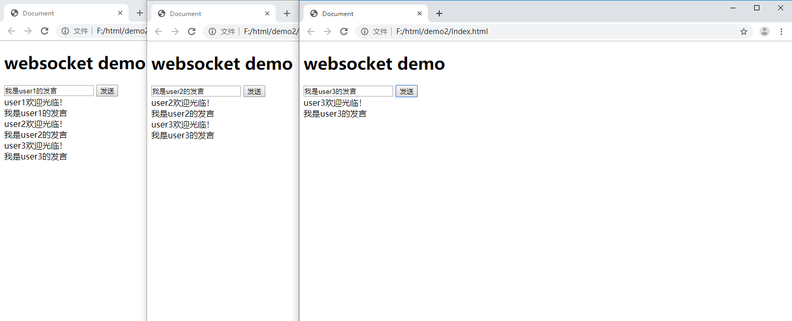
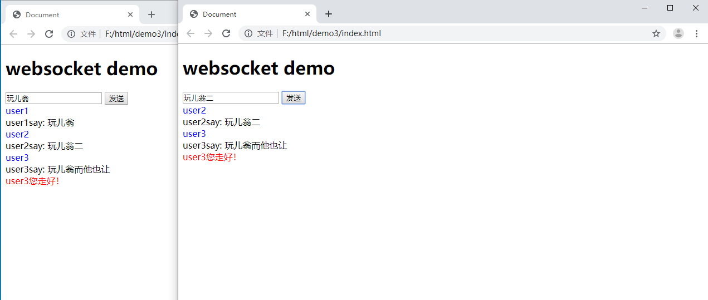

[+ WebSocket在线测试网站](http://www.websocket-test.com/)

[+ 相关博客文章](https://blog.csdn.net/benben_2015/article/details/79294547)

<!-- more -->
#### 1、官方基础案例
~~~html
<!DOCTYPE html>
<html lang="en">
<head>
  <meta charset="UTF-8">
  <meta name="viewport" content="width=device-width, initial-scale=1.0">
  <meta http-equiv="X-UA-Compatible" content="ie=edge">
  <title>Document</title>
</head>
<body>
  <h1>websocket demo</h1>
  <input id="inp" type="text">
  <button id="btn">发送</button>
  

  
</body>
</html>
~~~
2、基于`nodejs-websocket`案例

1. npm 安装 `npm install nodejs-websocket`
2. 参考npm网站代码案例
3. 新建本地服务器端（例如：webserver.js）讲案例代码粘入
4. 修改客户端（index.html）webSocket的端口号为服务器端口(本地：‘ws://localhost:8008/’)
5. cmd窗口运行`node webserver.js`
6. index.html即可以进行交互了

实例

index.html

~~~html
<!DOCTYPE html>
<html lang="en">
<head>
  <meta charset="UTF-8">
  <meta name="viewport" content="width=device-width, initial-scale=1.0">
  <meta http-equiv="X-UA-Compatible" content="ie=edge">
  <title>Document</title>
</head>
<body>
  <h1>websocket demo</h1>
  <input id="inp" type="text">
  <button id="btn">发送</button>
  

  
</body>
</html>
~~~

webserver.js

~~~js
var ws = require("nodejs-websocket")
var PORT = '8008'
// Scream server example: "hi" -> "HI!!!"
var server = ws.createServer(function (conn) {
    console.log("New connection")
    conn.on("text", function (str) {
        console.log("Received "+str)
        conn.sendText(str.toUpperCase()+"!!!")
    })
    conn.on("close", function (code, reason) {
        console.log("Connection closed")
    })
    conn.on("error", function (code, reason) {
        console.log("异常关闭")
    });
}).listen(PORT)

console.log('websocket server listen port ' + PORT)
~~~

#### 2、模拟多用户聊天

+ 主要模拟多人网页登录发送**实时聊天**信息
+ 模拟实时请求

基础代码：

index.html【客户端】

~~~HTML
<!DOCTYPE html>
<html lang="en">
<head>
  <meta charset="UTF-8">
  <meta name="viewport" content="width=device-width, initial-scale=1.0">
  <meta http-equiv="X-UA-Compatible" content="ie=edge">
  <title>Document</title>
</head>
<body>
  <h1>websocket demo</h1>
  <input id="inp" type="text">
  <button id="btn">发送</button>
  

  
</body>
</html>
~~~

webserver.js【服务器端】

~~~js
var ws = require("nodejs-websocket")
var PORT = '8008'
var count = 0
// 每个窗口打开（即一个用户进入调用仅一次createServer函数，且仅新建一个WebSocket对象）
// 只要浏览器窗口不关闭，此通信对象将一直保持通信，这也是WebSocket的本质事实通讯特点
var server = ws.createServer(function (conn) {
    count ++
    conn.nikeName = 'user' + count
    broadcast(conn.nikeName + '欢迎光临！')
    // 发送消息即会调用一次请求'text'
    conn.on("text", function (str) {
        broadcast(str)
    })
    // 只有关闭浏览器窗口时，断开服务，调用一次
    conn.on("close", function (code, reason) {
        console.log("Connection closed")
        broadcast(conn.nikeName + '您走好！')
    })
    conn.on("error", function (code, reason) {
        console.log("异常关闭")
    });
}).listen(PORT)
console.log('websocket server listen port ' + PORT)
// 此函数，起到广播发送的作用，轮询所有新接进的用户连接，进行发送信息
function broadcast(str) {
    console.log(server.connections);
    server.connections.forEach(connection => {
        connection.sendText(str)
    })
}
~~~


#### 3、简单两天代码优化

+ 主要优化：将登录状态和聊天状态，离开状态区分开
+ 通过返回一个**json对象字符串进行返回更多数据**

优化代码：

index.html【客户端】

~~~html
<!DOCTYPE html>
<html lang="en">
<head>
  <meta charset="UTF-8">
  <meta name="viewport" content="width=device-width, initial-scale=1.0">
  <meta http-equiv="X-UA-Compatible" content="ie=edge">
  <title>Document</title>
</head>
<body>
  <h1>websocket demo</h1>
  <input id="inp" type="text">
  <button id="btn">发送</button>
  

  
</body>
</html>
~~~

webserver.js【服务器端】

~~~js
var ws = require("nodejs-websocket")
var PORT = '8008'
var count = 0
// 每个窗口打开（即一个用户进入调用仅一次createServer函数，且仅新建一个WebSocket对象）
// 只要浏览器窗口不关闭，此通信对象将一直保持通信，这也是WebSocket的本质事实通讯特点
var server = ws.createServer(function (conn) {
    count ++
    conn.nikeName = 'user' + count
    // 可以通过改变数据结构，从而返回一个对象【携带更多数据】
    let data = {
        userName: conn.nikeName,
        type: 'login'
    }
    // 数据传输类型必须是String类型
    broadcast(JSON.stringify(data))
    conn.on("text", function (str) {
        // 可以通过改变数据结构，从而返回一个对象【携带更多数据】
        let msgData = {
            msg: conn.nikeName + 'say: ' + str,
            type: 'msgText'
        }
        broadcast(JSON.stringify(msgData))
    })
    conn.on("close", function (code, reason) {
        console.log("Connection closed")
        // 可以通过改变数据结构，从而返回一个对象【携带更多数据】
        let msgData = {
            msg: conn.nikeName + '您走好！',
            type: 'logout'
        }
        broadcast(JSON.stringify(msgData))
    })
    conn.on("error", function (code, reason) {
        console.log("异常关闭")
    });
}).listen(PORT)
console.log('websocket server listen port ' + PORT)
// 此函数，起到广播发送的作用，轮询所有新接进的用户连接，进行发送信息
function broadcast(str) {
    console.log(server.connections);
    server.connections.forEach(connection => {
        connection.sendText(str)
    })
}
~~~


