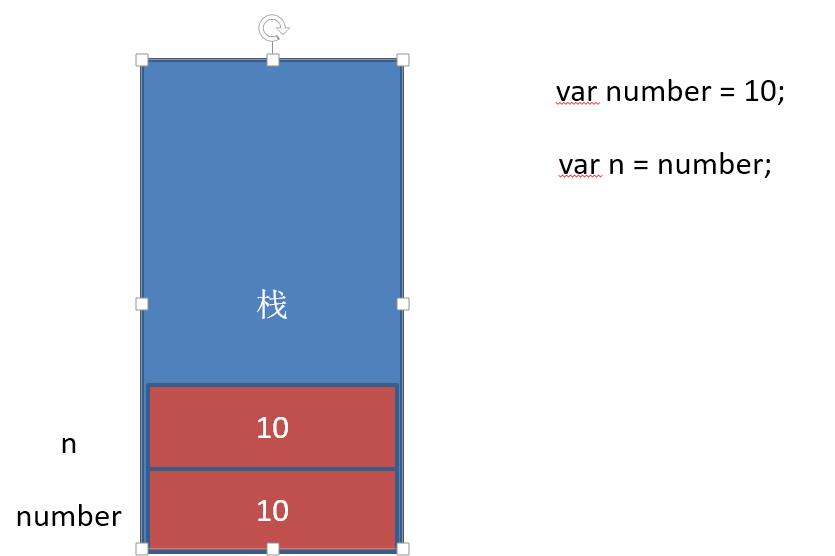

### javascript的组成

~~~javascript
ECMAScript    js编程语言标准
DOM           文档对象模型   
BOM           浏览器对象模型
javascript 是个弱类型语言，因为var再声明变量时并没有确定变量的类型。
~~~
<!-- more -->
### javascript的三个基础输出语句

###### 1、console.log()

~~~
浏览器控制台输出语句，输出结果；
~~~

###### 2、alert()

~~~
浏览器弹出框，弹出结果；
~~~

###### 3、prompt()方法函数

~~~javascript
浏览器弹出输入框
	prompt('一句话的威力'，'这是输入框里提示的话')
//案例1  可以结合下边 do ..... while()使用
/ 这个方法代表的是一个值,和其他方法区别是---获取输入结果，一般出现在代码块开头。
~~~

###### 4、document.write ('')

~~~~javascript
语法：
	document.write ('<h1 style="color:red;">wejowjweofjw</h1>');

此方法的秒用：
在不确定每一行有几个td单元的时候，可以用来打印表格，比如99乘法表；
	document.write('<table>');	
		var num = '';
		for ( var j = 1; j < 10; j++ ) {
			document.write('<tr>');
			for ( var i = 1; i <= j ; i++ ) {
				num = i + 'x' + j + '=' + j * i;
				num += document.write('<td>' + num + '</td>');
			}			
			// num += '\n';
			document.write('</tr>');	
		}
		console.log( num );
	document.write('</table>');

★ document.write与innerHTML的区别
	<script type="text/javascript">
		document.write('<div>');
		document.write('这里是div1的内容；');	
		document.write('</div>');
	// document.write可以将标签拆分来写，innerHTML不行
		var div = document.querySelector('#line')
		div.innerHTML = '<div>这里是div2的内容</div>';
	</script>
主要区别：document.write是直接将内容写入页面的内容流，会导致页面全部重绘，innerHTML将内容写入某个DOM节点，不会导致页面全部重绘，只会将节点内的内容改变。
~~~~

###### 5、confirm('')

~~~javascript
语法：
	confirm('这是一个可以取消的弹窗');
~~~


### js基础知识

1、字面量		2、数据类型		3、变量  	4、三个js基础方法	

#### 一、字面量

~~~js
推荐使用单引号''
alert（"123"）;
alert（"abc"）;
alert（"fanzhan"）;
alert（"发展"）;
直接用alert弹出的字符串
~~~

#### 二、数据类型

1、string 字符串类型		2、number数字类型		3、boolean布尔类型

4、undefined未定义                       5、null空

##### (1)、string字符串类型

~~~js
1、就是由字符组成的一行文字，字符串都是用双引号或者单引号引起来的，推荐使用单引号''.
2、字符串的转义【输出特殊符号】：
		\n: 换行
		\t: 缩进【制表符】
		\b: 空格
		\r: 回车
		\\: 斜杠
		\': 显示单引号
		\": 显示双引号
3、特殊
~~~

##### (2)、number数字类型

~~~javascript
1、整数，小数，负值，等数字组成的数值。
2、表现形式：123，-2323，23.2324
	十进制：
		var num = 9;
		浏览器进行计算的时候八进制和十六进制的数值最终都会转换为十进制的数值
	十六进制：【0x开头的为十六进制的数值】
    	var num = 0xA;
		十六进制序列范围：0~9之后A~F
3、浮点数
	a、浮点数的精度问题
    	var n = 5e-324;  //科学计数法  5乘以10的-324次方
	浮点数值的最高精度是17位小数，但在进行算数计算时器精确度远远不如整数
    	var result = 0.1 + 0.2;  //结果不是0.3，而是：0.3000000000000004
	* 不要判断两个浮点数是否相等
4、数值范围
	1、最小值：Number.MIN_VALUE，这个值为：5e-324
	2、最大值：Number.MXN_VALUE，这个值为：1.7976931348623157e+308
	3、无穷大：Infinity
 	4、无穷小：-Infinity
~~~

##### (3)、boolean布尔类型

~~~javascript
1、boolean字面量：true和false，区分大小写；
2、计算机内部存储：true为1， false为0；
取值：
	true:  对
	false:  错
实例：
	var a=true;
	console.log(a);			//输出结果为：true
	console.log(typeof a);  //输出结果为：boolean
	var b=false;
	console.log(b);			//输出结果为：false
	console.log(typeof b);  //输出结果为：boolean

	//boolean 的表达方式有很多种
	var c=1>3;
	console.log(c);			//输出结果为：false
	console.log(typeof c);  //输出结果为：boolean
	var d= a==b;
	console.log(d);			//输出结果为：false
	console.log(typeof d);  //输出结果为：boolean
~~~

##### (4)、undefined 未定义

`undefined表示一个声明了没有赋值的变量，变量只声明的时候默认是undefined`

~~~javascript
一般来说是一个变量声明了，但是没有赋值
	var a=1;
	var b;
	alert(a+b);  //结果：NaN
	alert("b的值是"+b); //结果：b的值是undefined
~~~

##### (5)、null

`null表示一个空，变量的值如果为null,必须手动为变量赋值。`

##### "+"加号在数据类型间的作用

~~~javascript

1、两个字符串加号连接，“+”作用是/*连接两个字符串*/
		alert("我在人民广场"+"吃炸鸡");
		弹出：“我在人民广场吃炸鸡”
        
2、两个数字加号连接，“+”作用是/*加法运算符的作用*/
		alert(100+100);
		弹出：200
        
3、加号连接的两个直接量中有一个是字符串，那么“+”的作用是/*连接*/
		alert("我在人民广场"+100);
		弹出：我在人民广场100
            
~~~

#### 三、变量

##### 1、简单说：变量是存储数据的一个容易。

~~~javascript
	var a="123";
~~~

##### 2、变量的使用

~~~javascript
1、生成变量
	var a; //声明
	a="123"; //赋值
	console.log(a);

//连写
	var a="123";
	console.log(a);

//"="运算符的作用
	var a=123 + 456;
	console.log(a);	//结果：579，"="的作用是将等号右侧的结果赋值给左侧的变·	量

~~~

##### 3、命名规则

~~~javascript
1、变量名只能由英文字母，数字，下划线以及$符号组成，并且数字不能在名称开头。（如果名称带有下划线，那么后面就算直接跟数字也是可以的）
	var abc;
	var abc123;
	var _123;
	var _abc;
	var _$123;
	var _@123; //不可以
	var 123; //不可以
2、变量的命名不能使用JavaScript中的关键字和保留字。
	关键字：已经被JavaScript内部使用过的。
    保留字：还没有被JavaScript内部使用。但是可能有一天会被使用的。
    
    a、js中的关键字：
    	break  case  catch	continue  default  delete  with
        do 	else  finally  for	function  if  in  instanceof  new
        return  switch  this  throw  try  typeof  var  void  while
    b、js中的保留字：
        abstract  Boolean  byte  char  class  const  debugger  double
        enum  export  extends  final  float  goto  implements  import
        int  interface  long  native  package  private  protected 
        public  short  static  super  synchronized  throws  transient 
        volatile
            
    throw: 函数内抛出错误，之后代码不再执行
~~~

##### 4、变量类型

~~~javascript
	var a;
	alert(typeof(a)); /*输出变量类型*/
	也可以写成： typeof a;
~~~

##### 5、变量之间的赋值和输出

~~~javascript
1、实例：
    var a=123;
    var b=345;
    a=b; //这里把b的值赋值给a
    var c=a+b; //345+345
    console.log(c); //结果：690
2、实例：
	var a=1;
	var b=2;
	var c=3;
	a=a+b;
	b=b+a;
	c=c+b;
	console.log(a);  //结果：3
	console.log(b);	 //结果：5
	ocnsole.log(c);  //结果：8
~~~


#### 四、三个js基础方法

##### (1)、typeof判断基础数据类型

typeof() 是一个一元运算，放在一个运算数之前，运算数可以是任意类型。 

它返回值是一个字符串，该字符串说明运算数的类型。

typeof一般只能返回如下几个结果：number,boolean,string,function,object,undefined。 

我们可以使用typeof来获取一个变量是否存在，

如：

```js
if (typeof a != "undefined") {
	alert("ok")
}
```

而不要去使用if(a)因为如果a不存在（未声明）则会出错，对于Array,Null，DOM对象等特 殊对象使用typeof一律返回object，这正是typeof的局限性。 

~~~javascript
alert(typeof("abc")); /*输出string字符串类型*/
alert(typeof(123)); /*输出number数字类型*/
alert(typeof(a)); /*输出变量类型*/
~~~

##### (2)、a.length查看数据长度

~~~javascript
var a = "我在人民广场吃炸鸡！"
console.log(a.length);
~~~

##### (3)、NaN和判断isNaN

~~~javascript
1、整数，小数，负值，等数字组成的数值。
2、表现形式：123，-2323，23.2324。
3、NaN：not a number
	作用：a、用来表示数值的一种不正常的状态。
   		 b、一般情况下会在计算出现错误的时候出现。
   		 c、判断当前的数据是否是NaN的关键字：
         	isNaN：是一个非数字
              如果结果是非数字：结果是ture
              如果结果是数字：结果是false
              var a=456;
              var b=123;
              console.log(isNaN(a-b)); //输出结果：false
              var c="abc";
              console.log(isNaN(c)); //输出结果：true
~~~

##### 实例声明多个变量

~~~js
    var num1, num2, num3;   //同时声明多个变量写法
    num1 = 1;
    num2 = 2;
    num3 = 3;
    conlose.log(num1, num2, num3);  //同时输出打印多个变量写法

案例：
	var num1 = 6;
	var num2 = 5;

	//使用第三个中间值来交换两个变量的数值。
	var tym = num1;
		num2 = tym;
		num1 = num2;

	//不适用第三个中间值来交换两个变量的数值
	num1 = num1 + num2;  //num1 = 5 + 6 = 11;
	num2 = num1 - num2;  //num2 = 11 - 5 = 6;
	num1 = num1 - num2;  //num1 = 11 - 6 = 5;

~~~

#### 五、转换变量类型的方法

1、转换为String字符串类型				2、转换为number数值类型				

##### 1、转换为String字符串类型

###### (1)、toString()方法

~~~javascript
	var num = 18;
	var isRight = true;
	console.log(typeof num.toString());  //结果：string
	console.log(typeof isRight.toSring());  //结果：string

	//错误的方式 null和undefined 没有toString()方法
	var a = null;
	console.log(a.toString());  //会出现报错问题
~~~

###### (2)、String()函数

~~~javascript
	var num = 18;
	var isRight = true;
	console.log(String(num));
	console.log(String(isRight));
	
	var a = null;
	console.log(typeof String(a));  //结果：string
~~~

###### (3)、字符串拼接

~~~javascript
	var num = 18;
	var isRight = true;
	console.log(typeof (num + ''));  //结果：string
	console.log(typeof (isRight + ''));  //结果：string
~~~

##### 2、转换为number数值类型

###### (1)、Number()方法

~~~javascript
	var str = 'abc';
	var isRight = true;
	console.log(Number(str));	//结果：NaN
	console.log(Number(isRight));  //结果：1
	
	console.log(Number('123'));  //结果：数值123

//Number()把字符串转换成数值类型的时候，如果字符串中有一个字符不是数字，返回NaN。
	console.log(Number('123abc'));  //结果：NaN
~~~

###### (2)、parseInt()方法    //int 整数

~~~javascript
//parseInt()会把浮点类数值转换为整数数值，去掉小数点后数字	
	var str = '123.678'; 
	var isRight = false;
	console.log(parseInt(str));  //结果：数值123

//parseInt()无法把布尔类型转换成数值类型，返回NaN
	console.log(parseInt(isRight));  //结果：NaN

	var s1 = 'abc';
	var s2 = '123abc';
	console.log(parseInt(s1));  //结果：NaN

//parseInt()在转换字符串的时候，如果遇到数字就会转换数字，如果遇到非数字就会返回。
	console.log(parseInt(s2));  //结果：数值123
	
	var s3 = 'abc123';	
//如果字符串中第一个字符是非数字，此时返回NaN。
	console.log(parseInt(s3));
~~~

###### (3)、parseFloat()    //Float 浮点数

~~~javascript
//parseFloat()会把有小数点的数字字符串转换为浮点类的数值	
	var str = '123.67';
	var isRight = true;
	console.log(parseFloat(str));  //结果：浮点数 123.67
	console.log(parseInt(str));	 //结果：整数 123 

//parseFloat()无法转换布尔类型，返回 NaN
	console.log(parseFloat(isRight));  //结果：NaN

//parseFloat()遇到字符串中的数字就会转换，遇到非数字就会返回
	var str = '123.12abc';
	console.log(parseFloat(str));	
	var str = '123abc';
	console.log(parseFloat(str));
~~~

###### (4)、取正或者取负   //  +  -

~~~javascript
//取正负的纯数字字符串都会转化为数值类型
	var str = '123';
	console.log(-str);  // 结果：数值-123

//如果字符串中有非数字则不能转化，返回NaN
	var str = '123abc';
	console.log(+str);  // 结果：NaN

//布尔boolean值可以通过取正负，转换为数值类型
	var isOK = true;
	console.log(+isOK);  // 结果：1

减－：//1、如果一边是数值类型 一边是字符串，会先把字符串转换为数值类型，再进行数值的减法运算，如果字符串【非字符串】转换成数值失败，则返回NaN。
	 //2、如果两边都是字符串类型的数值，则会得到数值类型的结果。
加 +：//如果有一边是数值类型 一边是字符串，会先把数值类型转换为字符串，然后进行字符串拼接
	var str = '123';
	var num = '123';
	console.log(str - num); // 结果：数值123
	console.log(str - 0);  // 结果：数值123
	console.log(str + 0);  // 结果：字符串1230
~~~

###### (5)、转换为布尔Boolean()方法   //布尔

~~~javascript
//Boolean()方法会把-----非空字符串  非0数字  true 任何对象转换为true
	var num = 123;
	console.log(Boolean(num));  // 结果： true
//Boolean()方法会把-----空字符串  0  false  null  undefined转换为false
	var num = '';
	console.log(Boolean(num));

//隐式类型转换
	var num;
	if(num) {
    	console.log('hello');  // 结果：hello
	}
~~~

#### 六、运算符

1、算数运算符              1、逻辑运算符           	2、关系运算符

##### 1、算数运算符

~~~javascript
+ 运算
	总结：
       1. 如果是数值类型的变量相加，结果就是一个数值类型的结果
       2. 如果是一个字符串类型的变量相加，最后的结果就是字符串（加号起到的作用就是拼接字符串的功能）
    	
 -运算
	 总结：
     	1. 如果是数值类型的变量相减，结果就是一个数值类型的结果
        2. 如果是数字的字符串相减，得到的结果也是一个数值类型结果（发生了隐式类型转化）
            var n1 = '123';
            var n2 = '123';
    	3. 如果是非数字的字符串相减，得到的结果是NaN
 *运算
	
	
 /运算
	   1.如果是数值类型的变量相除，结果就是一个数值类型的结果
       2. 如果是数字的字符串相除，得到的结果也是一个数值类型结果（发生了隐式类型转化）
       3. 如果是非数字的字符串相除，得到的结果是NaN
       4. 如果除数是0 ，得到的结果是 Infinity （无穷大的值）
	 
 %取余（获取余数） 
~~~


##### 2、逻辑运算符

~~~javascript
逻辑运算符
	与 &&     //只有两个操作数同时为true，结果才为true；
	或 ||	//只有两个操作数同时为false，结果才为false；
	非 ！	    //取饭   一元运算符
    
	var a = true;
	var b = false;
	console.log(a && b);  // 结果：false
	console.log(a || b);  // 结果：true
	console.log(!a);      // 结果：false
~~~

##### 3、关系运算符

~~~javascript
关系运算符：  >    >=   <    <=
相等运算符：  ==   ！=    ===  ！==  //双等为模糊相等，可以是'123'=123,三等是绝对相等，两端必须是同意类型
赋值运算符： =  
~~~

##### 4、各个运算符优先级从高到底

~~~javascript
优先级从高到底
	1、() 优先级最高
	2、一元运算符： ++  ——  ！
	3、算数运算符： 先*  /  %     后 +  —
	4、关系运算符： >   >=   <    <=
	5、相等运算符： ==   ！=   ===   ！==
	6、逻辑运算符： 先 &&   后 ||
	7、赋值运算符： =
~~~


#### 七、流程控制

**表达式：**	
	一个表达式可以产生一个值，有可能是运算、函数调用、有可能是字面量，表达式可以放在任何需要值的地方。
**语句：**
	语句可以理解为一个行为，循环语句和判断语句就是典型的语句。一个程序由很多个语句组成，一般情况下；分割一个一个的语句。

1、顺序结构      			2、分支结构				3、循环结构

##### 1、顺序结构

~~~javascript
//从上到下执行的代码就是顺序结构
~~~

##### 2、分支结构

~~~javascript
//根据不同的情况，执行对应代码
~~~



###### 1、if语句

~~~javascript
语法结构

1、  if (//条件表达式) {
  		执行语句;
   	}
    
2、  if (//条件表达式) {
        成立执行语句;
    } else {
        否则执行语句;
    }
    
3、  if (//条件1) {
        成立执行语句;
    } else if (//条件2){
        否则执行语句;
    } else if (//条件3){
        否则执行语句;
    } else if (//条件4){
        最后默认执行语句;
}

~~~

###### if案例

~~~javascript
// 计算是否年满18周岁
	var age = 19;
	if ( age >= 18 ) {
		console.log('是成年人');
	} else {
		console.log('不是成年人');
	}
~~~

###### 2、三元运算符【if语句的简写方法】

~~~javascript
表达式1 ？ 表达式2 : 表达式3;
是对if……else语句的一种简化写法
	var age = 17;
	age >= 18 ? console.log('是成年人') : console.log('不是成年人') ;
~~~

###### 3、switch语句

~~~javascript
 语法结构

	switch (expression) {
      case 常量1:
        语句;
        break;
      case 常量2:
        语句;
        break;
      case 常量3:
        语句;
        break;
      …
      case 常量n:
        语句;
        break;
      default:
        语句;
        break;
    }
 //switch语句通常是判定固定条件下的值是多少；
 //break结束跳出，如果case条件结尾没有，那么就会出现语句穿透效果，直接执行下一  	  步；  
 //case条件最终结尾需要加上default进行结束。
 //switch 语句在比较值时使用的是全等操作符, 因此不会发生类型转换
  （例如，字符串'10' 不等于数值 10）
~~~

###### switch案例

~~~javascript
1、输出星期几	
	var week = 1;
	switch(week) {
		case 1:
			console.log ('星期一');
			break;
		case 2:
			console.log ('星期二');
			break;
		case 3:
			console.log ('星期三');
			break;
		case 4:
			console.log ('星期四');
			break;
		case 5:
			console.log ('星期五');
			break;			
		case 6:
			console.log ('星期六');
			break;	
		case 7:
			console.log ('星期七');
			break;
		 default:
			console.log ('您输入的天数不在星期之内');
			break;
	}

2、素质教育（把分数变成ABCDE）千万不要写100个case9哟
	var num = 100;
//可以换种思维把百位数换为十位数，用parseInt()方法取整数部分
	var src = parseInt( num / 10 );
	switch(src) {
		case 10: 
		case 9: 
			console.log ('A');
			break;
		case 8: 
			console.log ('B');
			break;
		case 7: 
			console.log ('C');
			break;
		case 6: 
			console.log ('D');
			break;
		default:
			console.log ('不及格');
			break;		
	}
~~~

##### 3、循环结构

在javascript中，循环语句有三种：while、do..while、for循环。



###### 1、while 循环结构

~~~javascript
// 当循环条件为true时，执行循环体，
// 当循环条件为false时，结束循环。
    while (循环条件) {
      循环体
    }

/ 死循环----避免出现死循环
	var i = 1;
	/ i++或循环语句结尾，否则当循环条件永远是true的时候，我们叫做死循环。
	while ( i <= 100 ) {
    	console.log(i);
       	i++; //自增
	}
~~~

while结构图



###### while案例

~~~javascript
 1、计算1~100之内可以整除2的数字的和            
    var i = 1;            
    var even = 0;        	
    while ( i <= 100 ) {               
        if (i % 2 === 0) {                        
            even = even + i;                
        }                 
        i++;            
    }        
	console.log(even); 
2、计算1-100之间所有数的和    
    // 初始化变量            
    var i = 1;            
    var sum = 0;
    // 判断条件         
    while (i <= 100) {              
        // 循环体              
        sum += i;              
        // 自增             
        i++;    
    }    
    console.log(sum);
~~~

###### 2、do ...... while()语句

do..while循环和while循环非常像，二者经常可以相互替代，但是do..while的特点是不管条件成不成立，都会执行一次。

~~~javascript
基本语法：
	do {
  		// 循环体;
	} while (循环条件);
代码结构：
    // 初始化变量
    var i = 1;
    var sum = 0;
    do {
      sum += i;//循环体
      i++;//自增
    } while (i <= 100);//循环条件
~~~

do.....while结构图

​


###### do ...... while案例

~~~~javascript
1、计算1~100之内可以整除2的数字的和 
	var i = 1;
	var even = 0;
	do {
		if (i % 2 === 0) {
		 	even = even + i;
		 } 
		 i++;		 	
	}while( i <=100 );
	console.log(even);
2、计算1-100之间所有数的和 
    var i = 1;
    var sum = 0;
    do {
      sum += i;//循环体
      i++;//自增
    } while (i <= 100);//循环条件
3、使用do-while循环：输出询问“我爱你，嫁给我吧？”，选择 “你喜欢我吗？(y/n)”
   如果输入为y则打印”我们形影不离“，若输入为n,则继续询问 
	var i = '';
		do {
			i = prompt('你喜欢我吗? yes/no');
		}while(i !== 'yes'); // 这里大部分为反义不满足需要结果的意思
~~~~

###### 3、for 语句

while和do...while一般用来解决无法确认次数的循环。

for循环一般在循环次数确定的时候比较方便

~~~javascript
for循环语法：
// for循环的表达式之间用的是';'号分隔的 ,千万不要写成','
for (初始化表达式1; 判断表达式2; 自增表达式3) {
  // 循环体4
}
//执行顺序
1. 初始化表达式
2. 判断表达式
3. 自增表达式
4、循环体
执行顺序：1243  ----  243   -----243(直到循环条件变成false)
~~~

for循环结构图



###### for循环案例

~~~javascript
//99乘法表的变化
		var str="";
	     for (var i=1; i<10; i++){
	        for(var j=1; j<i ;j++ ){
	           str+=i + '*' + j + '=' + i*j;
	        }
	        str=str+'\n';
	    } 
	    console.log(str);

		var str="";
      	 for (var i=1; i<10; i++){
          	for(var j=i; j<10; j++ ){
              	str+=i + '*' + j + '=' + i*j;
          	}
          	str=str+'\n';
      	 } 
     	 console.log(str);

//倒三角制作
		var str = '';
		for (var j = 1; j < 10; j++) {
			for ( var i = j; i < 10; i++ ) {
				str += i + '*' + j + '=' + i*j;	
			}
			str += '\n';
		}
		console.log(str)

//三角金字塔第一种

		var  str = '';
		for (var i = 0; i < 9; i++) {
			内部控制有几列，做两个循环，一个是空格的，一个是*的；
			for (var k = 0; k < 9-i; k++) {
				str += ' ';
			}
			控制星星在第几行有几列
			for (var j = 0; j <= i; j++) {				
				str += ' *';
			}

			str += '\n';
		}
		console.log(str);

//三角金字塔第二种

		var str = '';
		for (var i = 0; i < 10; i++) {
			
			for (var k = 0; k < 9-i; k++) {
		 		str += ' ';
			}
			2*i是下边行数成单数递增
			for (var j = 0; j <= 2*i; j++) {
				str += '*';
			}
			str += '\n';
		}
		console.log(str);
~~~

#### 八、数组

##### 1、创建数组

###### 1、字面量创建数组

~~~javascript
   var   自定义数组名称  = new Array();
// 创建数组并赋值
	
~~~

###### 2、构造函数创建数组

~~~javascript
  var  自定义数组名称 = [] ;
// 创建数组并赋值
~~~

##### 2、为什么要学习数组

> 之前学习的数据类型，只能存储一个值(比如：Number/String。我们想存储班级中所有学生的姓名，此时该如何存储？

###### 数组的概念

> 所谓数组，就是将多个元素（通常是同一类型）按一定顺序排列放到一个集合中，那么这个集合我们就称之为数组。

###### 数组的定义

> 数组是一个有序的列表，可以在数组中存放任意的数据，并且数组的长度可以动态的调整。

通过数组字面量创建数组

```javascript
// 创建一个空数组
var arr1 = []; 
// 创建一个包含3个数值的数组，多个数组项以逗号隔开
var arr2 = [1, 3, 4]; 
// 创建一个包含2个字符串的数组
var arr3 = ['a', 'c']; 

// 可以通过数组的length属性获取数组的长度
console.log(arr3.length);
// 可以设置length属性改变数组中元素的个数
arr3.length = 0;
```

###### 获取数组元素

数组的取值

```javascript
// 格式：数组名[下标]	下标又称索引
// 功能：获取数组对应下标的那个值，如果下标不存在，则返回undefined。
var arr = ['red', 'green', 'blue'];
arr[0];	// red
arr[2]; // blue
arr[3]; // 这个数组的最大下标为2,因此返回undefined
```

###### 遍历数组

> 遍历：遍及所有，对数组的每一个元素都访问一次就叫遍历。

数组遍历的基本语法：

```javascript
for(var i = 0; i < arr.length; i++) {
	// 数组遍历的固定结构
}
```

###### 数组中新增元素

数组的赋值

```javascript
// 格式：数组名[下标/索引] = 值;
// 如果下标有对应的值，会把原来的值覆盖，如果下标不存在，会给数组新增一个元素。
var arr = ["red", "green", "blue"];
// 把red替换成了yellow
arr[0] = "yellow";
// 给数组新增加了一个pink的值
arr[3] = "pink";
```

###### 案例

```
求一组数中的所有数的和和平均值
求一组数中的最大值和最小值，以及所在位置
将字符串数组用|或其他符号分割
要求将数组中的0项去掉，将不为0的值存入一个新的数组，生成新的数组
翻转数组
冒泡排序，从小到大
```

#### 九、函数

##### 为什么要有函数

> 如果要在多个地方求1-100之间所有数的和，应该怎么做？

##### 什么是函数

> 把一段相对独立的具有特定功能的代码块封装起来，形成一个独立实体，就是函数，起个名字（函数名），在后续开发中可以反复调用
>
> 函数的作用就是封装一段代码，将来可以重复使用

##### 函数的定义

- 函数声明

```javascript
function 函数名(){
  // 函数体
}
```

- 函数表达式

```javascript
var fn = function() {
  // 函数体
}
```

- 特点：

  函数声明的时候，函数体并不会执行，只要当函数被调用的时候才会执行。
  函数一般都用来干一件事情，需用使用动词+名词，表示做一件事情 `tellStory` `sayHello`等

##### 函数的调用

- 调用函数的语法：

```javascript
// 调用函数
函数名();
// 将函数赋值给一个变量
var 变量 = 函数名;
// 获取函数的结果
var 变量 = 函数名();  // 函数有return 结果，就赋值给变量；无return 结果，就是undefined 
```

- 特点：

  函数体只有在调用的时候才会执行，调用需要()进行调用。
  可以调用多次(重复使用)

代码示例：

```javascript
// 声明函数
function sayHi() {
  console.log("吃了没？");
}
// 调用函数
sayHi();

// 求1-100之间所有数的和
function getSum() {
  var sum = 0;
  for (var  i = 0; i < 100; i++) {
    sum += i;
  }
  console.log(sum);
}
// 调用
getSum();
```

##### 函数的参数

- 为什么要有参数

```javascript
function getSum() {
  var sum = 0;
  for (var i = 1; i <= 100; i++) {
    sum += i;
  }
  console.log();
}

// 虽然上面代码可以重复调用，但是只能计算1-100之间的值
// 如果想要计算n-m之间所有数的和，应该怎么办呢？
```

- 语法：

```javascript
// 函数内部是一个封闭的环境，可以通过参数的方式，把外部的值传递给函数内部
// 带参数的函数声明
function 函数名(形参1, 形参2, 形参...){
  // 函数体
}

// 带参数的函数调用
函数名(实参1, 实参2, 实参3);
```

- 形参和实参

  > 1. 形式参数：在声明一个函数的时候，为了函数的功能更加灵活，有些值是固定不了的，对于这些固定不了的值。我们可以给函数设置参数。这个参数没有具体的值，仅仅起到一个占位置的作用，我们通常称之为形式参数，也叫形参。
  > 2. 实际参数：如果函数在声明时，设置了形参，那么在函数调用的时候就需要传入对应的参数，我们把传入的参数叫做实际参数，也叫实参。

```javascript
var x = 5, y = 6;
fn(x,y); 
function fn(a, b) {
  console.log(a + b);
}
//x,y实参，有具体的值。函数执行的时候会把x,y复制一份给函数内部的a和b，函数内部的值是复制的新值，无法修改外部的x,y
```

##### 案例

- 求1-n之间所有数的和
- 求n-m之间所有数额和
- 圆的面积
- 求2个数中的最大值
- 求3个数中的最大值
- 判断一个数是否是素数

##### 函数的返回值

> 当函数执行完的时候，并不是所有时候都要把结果打印。我们期望函数给我一些反馈（比如计算的结果返回进行后续的运算），这个时候可以让函数返回一些东西。也就是返回值。函数通过return返回一个返回值

返回值语法：

```javascript
//声明一个带返回值的函数
function 函数名(形参1, 形参2, 形参...){
  //函数体
  return 返回值;
}

//可以通过变量来接收这个返回值
var 变量 = 函数名(实参1, 实参2, 实参3);
```

函数的调用结果就是返回值，因此我们可以直接对函数调用结果进行操作。

返回值详解：
    如果函数没有显示的使用 return语句 ，那么函数有默认的返回值：undefined
    如果函数使用 return语句，那么跟再return后面的值，就成了函数的返回值
    如果函数使用 return语句，但是return后面没有任何值，那么函数的返回值也是：undefined
    函数使用return语句后，这个函数会在执行完 return 语句之后停止并立即退出，也就是说return后面的所有其他代码都不会再执行。
    

```
推荐的做法是要么让函数始终都返回一个值，要么永远都不要返回值。

```

##### 案例

- 求阶乘
- 求1!+2!+3!+....+n!
- 求一组数中的最大值
- 求一组数中的最小值

##### arguments的使用

> JavaScript中，arguments对象是比较特别的一个对象，实际上是当前函数的一个内置属性。也就是说所有函数都内置了一个arguments对象，arguments对象中存储了传递的所有的实参。arguments是一个伪数组，因此及可以进行遍历

- 案例

```javascript
求任意个数的最大值
求任意个数的和
```

##### 案例

```javascript
求斐波那契数列Fibonacci中的第n个数是多少？      1 1 2 3 5 8 13 21...
翻转数组，返回一个新数组
对数组排序，从小到大
输入一个年份，判断是否是闰年[闰年：能被4整数并且不能被100整数，或者能被400整数]
输入某年某月某日，判断这一天是这一年的第几天？
```

#### 十、函数其它

##### 匿名函数

> 匿名函数：没有名字的函数

匿名函数如何使用：

```
将匿名函数赋值给一个变量，这样就可以通过变量进行调用
匿名函数自调用

```

关于自执行函数（匿名函数自调用）的作用：防止全局变量污染。

##### 自调用函数

> 匿名函数不能通过直接调用来执行，因此可以通过匿名函数的自调用的方式来执行

```javascript
(function () {
  alert(123);
})();
```

##### 函数是一种数据类型

```javascript
function fn() {}
console.log(typeof fn);
```

- 函数作为参数

因为函数也是一种类型，可以把函数作为两一个函数的参数，在两一个函数中调用

- 函数做为返回值

因为函数是一种类型，所以可以把函数可以作为返回值从函数内部返回，这种用法在后面很常见。

```javascript
function fn(b) {
  var a = 10;
  return function () {
    alert(a+b);
  }
}
fn(15)();
```

##### 代码规范

```
1.命名规范	
2.变量规范   
	var name = 'zs';	
3.注释规范
	// 这里是注释
4.空格规范
5.换行规范
	var arr = [1, 2, 3, 4];
	if (a > b) {
      
	}
	for(var i = 0; i < 10; i++) {
      
	}
	function fn() {
      
	}

```

##### 作用域

作用域：变量可以起作用的范围

###### 全局变量和局部变量

- 全局变量

  在任何地方都可以访问到的变量就是全局变量，对应全局作用域

- 局部变量

  只在固定的代码片段内可访问到的变量，最常见的例如函数内部。对应局部作用域(函数作用域)

```
不使用var声明的变量是全局变量，不推荐使用。
变量退出作用域之后会销毁，全局变量关闭网页或浏览器才会销毁

```

###### 块级作用域

任何一对花括号（｛和｝）中的语句集都属于一个块，在这之中定义的所有变量在代码块外都是不可见的，我们称之为块级作用域。
**在es5之前没有块级作用域的的概念,只有函数作用域**，现阶段可以认为JavaScript没有块级作用域

###### 词法作用域

变量的作用域是在定义时决定而不是执行时决定，也就是说词法作用域取决于源码，通过静态分析就能确定，因此词法作用域也叫做静态作用域。

**在 js 中词法作用域规则:**

- 函数允许访问函数外的数据.
- 整个代码结构中只有函数可以限定作用域.
- 作用域规则首先使用提升规则分析
- 如果当前作用规则中有名字了, 就不考虑外面的名字

```javascript
var num = 123;
function foo() {
  console.log( num );
}
foo();

if ( false ) {
    var num = 123;
}
console.log( num ); // undefiend
```

###### 作用域链

```
只有函数可以制造作用域结构， 那么只要是代码，就至少有一个作用域, 即全局作用域。凡是代码中有函数，那么这个函数就构成另一个作用域。如果函数中还有函数，那么在这个作用域中就又可以诞生一个作用域。

将这样的所有的作用域列出来，可以有一个结构: 函数内指向函数外的链式结构。就称作作用域链。

```

```javascript
// 案例1：
function f1() {
    function f2() {
    }
}

var num = 456;
function f3() {
    function f4() {    
    }
}
```



```javascript
// 案例2
function f1() {
    var num = 123;
    function f2() {
        console.log( num );
    }
    f2();
}
var num = 456;
f1();
```



##### 预解析

> JavaScript代码的执行是由浏览器中的JavaScript解析器来执行的。JavaScript解析器执行JavaScript代码的时候，分为两个过程：预解析过程和代码执行过程

预解析过程：

1. 把变量的声明提升到当前作用域的最前面，只会提升声明，不会提升赋值。
2. 把函数的声明提升到当前作用域的最前面，只会提升声明，不会提升调用。
3. 先提升var，在提升function


JavaScript的执行过程

```javascript
var a = 25;
function abc (){
  alert(a);//undefined
  var a = 10;
}
abc();
// 如果变量和函数同名的话，函数优先
console.log(a);
function a() {
  console.log('aaaaa');
}
var a = 1;
console.log(a);
```


##### 全局解析规则

###### 函数内部解析规则

###### 变量提升

- 变量提升

  定义变量的时候，变量的声明会被提升到作用域的最上面，变量的赋值不会提升。

- 函数提升

  JavaScript解析器首先会把当前作用域的函数声明提前到整个作用域的最前面

```javascript
// 1、-----------------------------------
var num = 10;
fun();
function fun() {
  console.log(num);
  var num = 20;
}
//2、-----------------------------------
var a = 18;
f1();
function f1() {
  var b = 9;
  console.log(a);
  console.log(b);
  var a = '123';
}
// 3、-----------------------------------
f1();
console.log(c);
console.log(b);
console.log(a);
function f1() {
  var a = b = c = 9;
  console.log(a);
  console.log(b);
  console.log(c);
}
```

#### 十一、对象

##### 为什么要有对象

```javascript
function printPerson(name, age, sex....) {
}
// 函数的参数如果特别多的话，可以使用对象简化
function printPerson(person) {
  console.log(person.name);
  ……
}
```

##### 什么是对象

```
现实生活中：万物皆对象，对象是一个具体的事物，一个具体的事物就会有行为和特征。
举例： 一部车，一个手机
车是一类事物，门口停的那辆车才是对象
	特征：红色、四个轮子
	行为：驾驶、刹车

```

##### JavaScript中的对象

```
JavaScript中的对象其实就是生活中对象的一个抽象
JavaScript的对象是无序属性的集合。
	其属性可以包含基本值、对象或函数。对象就是一组没有顺序的值。我们可以把JavaScript中的对象想象成键值对，其中值可以是数据和函数。
对象的行为和特征
	特征---属性
	行为---方法

```

- 事物的特征在对象中用属性来表示。
- 事物的行为在对象中用方法来表示。

##### 对象字面量

> 字面量：11 'abc'  true  [] {}等

```javascript
var o = {
  name: 'zs,
  age: 18,
  sex: true,
  sayHi: function () {
    console.log(this.name);
  }
};
```

思考：

```javascript
如何把学生对象、老师对象、英雄对象改写成字面量的方式
```

##### 对象创建方式

- 对象字面量

```javascript
var o = {
  name: 'zs',
  age: 18,
  sex: true,
  sayHi: function () {
    console.log(this.name);
  }
};   
```

- new Object()创建对象

```javascript
var person = new Object();
  person.name = 'lisi';
  person.age = 35;
  person.job = 'actor';
  person.sayHi = function(){
  console.log('Hello,everyBody');
}
```

- 工厂函数创建对象

```javascript
function createPerson(name, age, job) {
  var person = new Object();
  person.name = name;
  person.age = age;
  person.job = job;
  person.sayHi = function(){
    console.log('Hello,everyBody');
  }
  return person;
}
var p1 = createPerson('张三', 22, 'actor');
```

- 自定义构造函数

```javascript
function Person(name,age,job){
  this.name = name;
  this.age = age;
  this.job = job;
  this.sayHi = function(){  // 这里的方法必须加this，不加this实例对象无法调用
  	console.log('Hello,everyBody');
  }
}
var p1 = new Person('张三', 22, 'actor');
```

##### 属性和方法

```
如果一个变量属于一个对象所有，那么该变量就可以称之为该对象的一个属性，属性一般是名词，用来描述事物的特征
如果一个函数属于一个对象所有，那么该函数就可以称之为该对象的一个方法，方法是动词，描述事物的行为和功能

```

##### new关键字

> 构造函数 ，是一种特殊的函数。主要用来在创建对象时初始化对象， 即为对象成员变量赋初始值，总与new运算符一起使用在创建对象的语句中。

1. 构造函数用于创建一类对象，首字母要大写。
2. 构造函数要和new一起使用才有意义。

new在执行时会做四件事情

```
new会在内存中创建一个新的空对象
new 会让this指向这个新的对象
执行构造函数  目的：给这个新对象加属性和方法
new会返回这个新对象

```

##### this详解

```javascript
JavaScript中的this指向问题，有时候会让人难以捉摸，随着学习的深入，我们可以逐渐了解
现在我们需要掌握函数内部的this几个特点
	1. 函数在定义的时候this是不确定的，只有在调用的时候才可以确定
	2. 一般函数直接执行，内部this指向全局window
	3. 函数作为一个对象的方法，被该对象所调用，那么this指向的是该对象
	4. 构造函数中的this其实是一个隐式对象，类似一个初始化的模型，所有方法和属性都挂载到了这个隐式对象身上，后续通过new关键字来调用，从而实现实例化
	5. 构造函数中的方法中的this指向的就是：new之后的那个对象，也即是谁调用了这个构造中的方法，this就指向谁。
	例：
	function Student(name,age,job){
  		this.name = name;  // 这里的this指向的是p1
  		this.age = age;
  		this.job = job;
  		this.sayHi = function(){
  			console.log(this.name);  // 这里this指向的是p1
  		}
	}
var p1 = new Person('张三', 22, 'actor');
```

#### 十二、对象的使用

##### 遍历对象的属性

> 通过for..in语法可以遍历一个对象

```javascript
var obj = {};
for (var i = 0; i < 10; i++) {
  obj[i] = i * 2;
}
for(var key in obj) {
  console.log(key + "==" + obj[key]);
}
```

##### 删除对象的属性

```javascript
function fun() { 
  this.name = 'mm';
}
var obj = new fun(); 
console.log(obj.name); // mm 
delete obj.name;
console.log(obj.name); // undefined
```

##### 简单类型和复杂类型的区别

> 基本类型又叫做值类型，复杂类型又叫做引用类型
>
> 值类型：简单数据类型，基本数据类型，在存储时，变量中存储的是值本身，因此叫做值类型。
>
> 引用类型：复杂数据类型，在存储是，变量中存储的仅仅是地址（引用），因此叫做引用数据类型。

- 堆和栈

  ```
  堆栈空间分配区别：
  　　1、栈（操作系统）：由操作系统自动分配释放 ，存放函数的参数值，局部变量的值等。其操作方式类似于数据结构中的栈；
  　　2、堆（操作系统）： 存储复杂类型(对象)，一般由程序员分配释放， 若程序员不释放，由垃圾回收机制回收，分配方式倒是类似于链表。
  
  ```

- 注意：JavaScript中没有堆和栈的概念，此处我们用堆和栈来讲解，目的方便理解和方便以后的学习。


###### 基本类型在内存中的存储



###### 复杂类型在内存中的存储



###### 基本类型作为函数的参数



###### 复杂类型作为函数的参数



```javascript
// 下面代码输出的结果
function Person(name,age,salary) {
  this.name = name;
  this.age = age;
  this.salary = salary;
}
function f1(person) {
  person.name = "ls";
  person = new Person("aa",18,10);
}

var p = new Person("zs",18,1000);
console.log(p.name);
f1(p);
console.log(p.name);
```

思考：

```javascript
//1. 
var num1 = 10;
var num2 = num1;
num1 = 20;
console.log(num1);
console.log(num2);

//2. 
var num = 50;
function f1(num) {
    num = 60;
    console.log(num);
}
f1(num);
console.log(num);

//3. 
var num1 = 55;
var num2 = 66;
function f1(num, num1) {
  num = 100;
  num1 = 100;
  num2 = 100;
  console.log(num);
  console.log(num1);
  console.log(num2);
}

f1(num1, num2);
console.log(num1);
console.log(num2);
console.log(num);
```

#### 十三、内置对象

JavaScript中的对象分为3种：内置对象、浏览器对象、自定义对象

JavaScript 提供多个内置对象：Math/Array/Number/String/Boolean...

对象只是带有**属性**和**方法**的特殊数据类型。

学习一个内置对象的使用，只要学会其常用的成员的使用（通过查文档学习）

可以通过MDN/W3C来查询

内置对象的方法很多，我们只需要知道内置对象提供的常用方法，使用的时候查询文档。

##### MDN

Mozilla 开发者网络（MDN）提供有关开放网络技术（Open Web）的信息，包括 HTML、CSS 和万维网及 HTML5 应用的 API。

- [MDN](https://developer.mozilla.org/zh-CN/)
- 通过查询MDN学习Math对象的random()方法的使用

##### 如何学习一个方法？

1. 方法的功能
2. 参数的意义和**类型**
3. 返回值意义和**类型**
4. demo进行测试

##### Math对象

Math对象不是构造函数，它具有数学常数和函数的属性和方法，都是以静态成员的方式提供

跟数学相关的运算来找Math中的成员（求绝对值，取整）

[Math](https://developer.mozilla.org/zh-CN/docs/Web/JavaScript/Reference/Global_Objects/Math)

演示：Math.PI、Math.random()、Math.floor()/Math.ceil()、Math.round()、Math.abs()	、Math.max()

```javascript
Math.PI						// 圆周率
Math.random()				// 生成随机数
Math.floor()/Math.ceil()	 // 向下取整/向上取整
Math.round()				// 取整，四舍五入
Math.abs()					// 绝对值
Math.max()/Math.min()		 // 求最大和最小值

Math.sin()/Math.cos()		 // 正弦/余弦
Math.power()/Math.sqrt()	 // 求指数次幂/求平方根
Math.pow(x, y)               //  求x的y次方
```

###### 案例

- 求10-20之间的随机数
- 随机生成颜色RGB
- 模拟实现max()/min()

##### Date对象

创建 `Date` 实例用来处理日期和时间。Date 对象基于1970年1月1日（世界标准时间）起的毫秒数。

```javascript
// 获取当前时间，UTC世界时间，距1970年1月1日（世界标准时间）起的毫秒数
var now = new Date();
console.log(now.valueOf());	// 获取距1970年1月1日（世界标准时间）起的毫秒数

Date构造函数的参数
1. 毫秒数 1498099000356		new Date(1498099000356)
2. 日期格式字符串  '2015-5-1'	 new Date('2015-5-1')
3. 年、月、日……				  new Date(2015, 4, 1)   // 月份从0开始
```

- 获取日期的毫秒形式

```javascript
var now = new Date();
// valueOf用于获取对象的原始值
console.log(date.valueOf())	

// HTML5中提供的方法，有兼容性问题
var now = Date.now();	

// 不支持HTML5的浏览器，可以用下面这种方式
var now = + new Date();			// 调用 Date对象的valueOf() 
```

- 日期格式化方法

```javascript
toString()		// 转换成字符串
valueOf()		// 获取毫秒值
// 下面格式化日期的方法，在不同浏览器可能表现不一致，一般不用
toDateString()
toTimeString()
toLocaleDateString()
toLocaleTimeString()
```

- 获取日期指定部分

```javascript
getTime()  	  // 返回毫秒数和valueOf()结果一样，valueOf()内部调用的getTime()
getMilliseconds() 
getSeconds()  // 返回0-59
getMinutes()  // 返回0-59
getHours()    // 返回0-23
getDay()      // 返回星期几 0周日   6周6
getDate()     // 返回当前月的第几天
getMonth()    // 返回月份，***从0开始***
getFullYear() //返回4位的年份  如 2016
```

###### 案例

- 写一个函数，格式化日期对象，返回yyyy-MM-dd HH:mm:ss的形式

```javascript
function formatDate(d) {
  //如果date不是日期对象，返回
  if (!date instanceof Date) {
    return;
  }
  var year = d.getFullYear(),
      month = d.getMonth() + 1, 
      date = d.getDate(), 
      hour = d.getHours(), 
      minute = d.getMinutes(), 
      second = d.getSeconds();
  month = month < 10 ? '0' + month : month;
  date = date < 10 ? '0' + date : date;
  hour = hour < 10 ? '0' + hour : hour;
  minute = minute < 10 ? '0' + minute:minute;
  second = second < 10 ? '0' + second:second;
  return year + '-' + month + '-' + date + ' ' + hour + ':' + minute + ':' + second;
}
```

- 计算时间差，返回相差的天/时/分/秒

```javascript
function getInterval(start, end) {
  var day, hour, minute, second, interval;
  interval = end - start;
  interval /= 1000;
  day = Math.round(interval / 60 /60 / 24);
  hour = Math.round(interval / 60 /60 % 24);
  minute = Math.round(interval / 60 % 60);
  second = Math.round(interval % 60);
  return {
    day: day,
    hour: hour,
    minute: minute,
    second: second
  }
}
```

##### Array对象

- 创建数组对象的两种方式
  - 字面量方式
  - new Array()

```javascript
// 1. 使用构造函数创建数组对象
// 创建了一个空数组
var arr = new Array();
// 创建了一个数组，里面存放了3个字符串
var arr = new Array('zs', 'ls', 'ww');
// 创建了一个数组，里面存放了4个数字
var arr = new Array(1, 2, 3, 4);

// 2. 使用字面量创建数组对象
var arr = [1, 2, 3];

// 获取数组中元素的个数
console.log(arr.length);
```

- 检测一个对象是否是数组

  - instanceof
  - Array.isArray()     HTML5中提供的方法，有兼容性问题

  函数的参数，如果要求是一个数组的话，可以用这种方式来进行判断

- toString() / valueOf()

  - toString()	 把数组转换成字符串，逗号分隔每一项
  - valueOf()         返回数组对象本身

  ~~~js
  var ary = [1, 2, 3, 4];
  返回的是一个数组中值的字符串
  console.log(typeof ary.toString());  // 结果：string
  console.log(ary.valueOf());  // 结果：Array(4)
  ~~~

- 数组常用方法

  演示：push()、shift()、unshift()、reverse()、sort()、splice()、indexOf()

```javascript
1、栈操作(先进后出)
push()		// 向数组的最后添加一项或者几项，是数组变长，其有一个返回值表示数组的当前长度
pop() 		//取出数组中的最后一项，修改length属性
2、队列操作(先进先出)
push()
shift()		//取出数组中的第一个元素，修改length属性
unshift() 	//在数组最前面插入项，返回数组的长度
3、排序方法
reverse()	//翻转数组
sort(); 	//即使是数组sort也是根据字符，从小到大排序
// 带参数的sort是如何实现的？
4、操作方法
concat()  	//把参数拼接到当前数组
slice() 	//从当前数组中截取一个新的数组，不影响原来的数组，参数start从0开始,end从1开始
splice()	//删除或替换当前数组的某些项目，参数start, deleteCount, options(要替换的项目)
5、位置方法
indexOf()、lastIndexOf()   //如果没找到返回-1
6、迭代方法 不会修改原数组(可选)
every()、
filter(function(item,index, ary) {})  //返回一个新数组,可以获取筛选结果【只能筛选不能计算】
map(function(item,index,ary) {})  //遍历数组,返回一个新数组
forEach(function(item,index, ary) {}) //遍历数组,没有返回值
some()
7、方法将数组的所有元素连接到一个字符串中。
join()
```

###### .splice() 

splice() 方法向/从数组中添加/删除项目，然后返回被删除的项目。

注意：该方法会改变原始数组。

语法：

```css
arrayObject.splice(index,howmany,item1,.....,itemX) 
/*	
	index: 必须填，规定向数组删除/添加一项的位置索引，如果为负值“-”，表示从数组尾部开始
	howmany：必须填，要删除的项目数量。如果设置为 0，则不会删除项目。
	item：可以不填，填写需要添加的单元。
*/
例子一： 创建一个新数组，并向其添加一个元素
var arr = ['George','John','Thomas','James','Adrew','Martin'];
arr.splice(2, 0 , '张三')；
console.log(arr); /* 'George','John','张三','Thomas','James','Adrew','Martin' */
例子二： 删除位于 index 2 的元素，并添加一个新元素来替代被删除的元素
var arr = ['George','John','Thomas','James','Adrew','Martin'];
arr.splice(2, 1 , '张三')；
console.log(arr); /* 'George','John','张三','James','Adrew','Martin' */
例子三： 删除从 index 2 ("Thomas") 开始的三个元素，并添加一个新元素 ('张三') 来替代被删除的元素
var arr = ['George','John','Thomas','James','Adrew','Martin'];
arr.splice(2, 3 , '张三')；
console.log(arr); /* 'George','John','张三','Martin' */
```

遍历数组

###### forEach(fn)

遍历输出数组的每一项，**无返回值**

~~~js
var arr =  [1500,1200,2000,2100,1800];
arr.forEach(function (item , index) {
    console.log(item) // 依次输出5次：1500,1200,2000,2100,1800
    console.log(index) // 依次输出下标：0,1,2,3,4
});
~~~
###### filter(fn)

遍历数组，返回符合条件的新数组，**只能筛选**，否则不会返回数组

###### map(fn)

遍历数组，返回计算之后的新数组

~~~js
var arr = [2, 3, 4];
# filter方法输出仍是原数组
var arr1 = arr.map((item) => {
	return item * 2;
})
# map方法则可以返回新的数组
var arr1 = arr.map((item) => {
	return item * 2;
})
console.log(arr1);
~~~

清空数组

```javascript
// 方式1 推荐 
arr = [];
// 方式2 
arr.length = 0;
// 方式3
arr.splice(0, arr.length);
```

###### 案例

- 将一个字符串数组输出为|分割的形式，比如“刘备|张飞|关羽”。使用两种方式实现

```javascript
function myJoin(array, seperator) {
  seperator = seperator || ',';
  array = array || [];
  if (array.length == 0){
    return '';
  }
  var str = array[0];
  for (var i = 1; i < array.length; i++) {
    str += seperator + array[i];
  }
  return str;
}
var array = [6, 3, 5, 6, 7, 8, 0];
console.log(myJoin(array, '-'));

console.log(array.join('-'))
```

- 将一个字符串数组的元素的顺序进行反转。["a", "b", "c", "d"] -> [ "d","c","b","a"]。使用两种种方式实现。提示：第i个和第length-i-1个进行交换

```javascript
function myReverse(arr) {
  if (!arr || arr.length == 0) {
    return [];
  }
  for (var i = 0; i < arr.length / 2; i++) {
    var tmp = arr[i];
    arr[i] = arr[this.length - i - 1];
    arr[arr.length - i - 1] = tmp;
  }
  return arr;
}

var array = ['a', 'b', 'c'];
console.log(myReverse(array));

console.log(array.reverse());
```

- 工资的数组[1500, 1200, 2000, 2100, 1800],把工资超过2000的删除

```javascript
// 方式1
var array =  [1500,1200,2000,2100,1800];
var tmpArray = [];
for (var i = 0; i < array.length; i++) {
  if(array[i] < 2000) {
    tmpArray.push(array[i]);
  }
}
console.log(tmpArray);
// 方式2
var array =  [1500, 1200, 2000, 2100, 1800];
array = array.filter(function (item, index) {
  if (item < 2000) {
    return true;
  }
  return false;
});
console.log(array);
```

- ["c", "a", "z", "a", "x", "a"]找到数组中每一个a出现的位置

```javascript
var array =  ['c', 'a', 'z', 'a', 'x', 'a'];
do {
  var index = array.indexOf('a',index + 1);
  if (index != -1){
    console.log(index);
  }
} while (index > 0);
```

- 编写一个方法去掉一个数组的重复元素

```javascript
var array =  ['c', 'a', 'z', 'a', 'x', 'a'];
function clear() {
  var o = {};
  for (var i = 0; i < array.length; i++) {
    var item = array[i];
    if (o[item]) {
      o[item]++;
    }else{
      o[item] = 1;
    }
  }
  var tmpArray = [];
  for(var key in o) {
    if (o[key] == 1) {
      tmpArray.push(key);
    }else{
      if(tmpArray.indexOf(key) == -1){
        tmpArray.push(key);
      }
    }
  }
  returm tmpArray;
}

console.log(clear(array));
```


##### 基本包装类型

为了方便操作基本数据类型，JavaScript还提供了三个特殊的引用类型：String/Number/Boolean

```javascript
// 下面代码的问题？
// s1是基本类型，基本类型是没有方法的
var s1 = 'zhangsan';
var s2 = s1.substring(5);

// 当调用s1.substring(5)的时候，先把s1包装成String类型的临时对象，再调用substring方法，最后销毁临时对象, 相当于：
var s1 = new String('zhangsan');
var s2 = s1.substring(5);
s1 = null;
```

```javascript
// 创建基本包装类型的对象
var num = 18;  			    //数值，基本类型
var num = Number('18'); 	//类型转换
var num = new Number(18); 	//基本包装类型，对象
// Number和Boolean基本包装类型基本不用，使用的话可能会引起歧义。例如：
var b1 = new Boolean(false);
var b2 = b1 && true;		// 结果是什么
```

##### String对象

- 字符串的不可变

```javascript
var str = 'abc';
str = 'hello';
// 当重新给str赋值的时候，常量'abc'不会被修改，依然在内存中
// 重新给字符串赋值，会重新在内存中开辟空间，这个特点就是字符串的不可变
// 由于字符串的不可变，在大量拼接字符串的时候会有效率问题
```

- 创建字符串对象

	 new String(s); 	参数 *s* 是要存储在 String 对象中或转换成原始字符串的值。 

```javascript
var str = new String('Hello World');

// 获取字符串中字符的个数
console.log(str.length);
```

- 字符串对象的常用方法

  字符串所有的方法，都不会修改字符串本身(字符串是不可变的)，操作完成会返回一个新的字符串

```javascript
1、字符方法
charAt()    	//获取指定位置处字符
charCodeAt()  	//获取指定位置处字符的ASCII码
str[0]   		//HTML5，IE8+支持 和charAt()等效

2、字符串操作方法
concat()  //拼接字符串，等效于“+”，“+”更常用
.slice(start,end) //从start位置开始，截取到end位置，end取不到，接受负值从尾部算起
	  console.log(str.slice(-3, 4)) 错
    console.log(str.slice(-3, -8)) 错
    console.log(str.slice(-8,-4)); 对   结果：lo w
.substring(start,stop)  //从start位置开始，截取到end位置，end取不到，不可接触负值
	  console.log(str.substring(3,7))   结果：lo w
.substr(start,length)  //从start位置开始，截取length个字符
    console.log(str.substr(3,7))   结果：lo wor
* 这几种方法都不会影响原字符串的内容，会返回一个新的字符串

3、位置方法
indexOf() //返回指定内容在元字符串中的位置
lastIndexOf() //从后往前找，只找第一个匹配的

4、去除空白   
trim()  //只能去除字符串前后的空白
例子：
var str = "年份: 2018年"; 
// str = str.match(/\s(\S*)/)[1];正则获取2018年
str = str.split(":")[1].trim();
alert(str); //结果2018年

5、大小写转换方法
to(Locale)UpperCase() 	//转换大写
to(Locale)LowerCase() 	//转换小写	
与 toLowerCase() 不同的是，toLocaleLowerCase() 方法按照本地方式把字符串转换为小写。只有几种语言（如土耳其语）具有地方特有的大小写映射，所有该方法的返回值通常与 toLowerCase() 一样。
var str="Hello World!"
document.write(str.toLocaleLowerCase())

6、其它
search()
replace()
    var str="cat,bat,sat,fat"; 
    var res=str.replace("at","one"); //第一个参数是字符串，所以只会替换第一个子字符串 
    console.log(res); //cone,bat,sat,fat 
    var res1=str.replace(/at/g,"one"); //第一个参数是正则表达式，所以会替换所有的子字符串 
    console.log(res1); //cone,bone,sone,fone 

split()  // 把字符串分割为字符串数组。
	/* 
    split方法是基于指定的字符，将字符串分割成字符串数组 
    当指定的字符为空字符串时，将会分隔整个字符串 
  */
    var str="red,blue,green,yellow"; 
    console.log(str.split(","));  //["red", "blue", "green", "yellow"] 
    console.log(str.split(",",2));  //["red", "blue"]  第二个参数用来限制数组大小 
    console.log(str.split(/[^\,]+/));  // ["", ",", ",", ",", ""] 
    第一项和最后一项为空字符串是因为正则表达式指定的分隔符出现在了子字符串的开头，即"red"和"yellow" 
    [^...] 不在方括号内的任意字符  只要不是逗号都是分隔符 

fromCharCode()
// String.fromCharCode(101, 102, 103);	 //把ASCII码转换成字符串
 /* 
   fromCharCode方法是接收一或多个字符编码，然后将其转换为字符串 
   fromCharCode方法是String构造函数的一个静态方法 
 */
		console.log(String.fromCharCode(104,101,108,108,111));  //hello 
```

注：这些字符串方法都**不会更改原有字符串**，只会返回出符合条件的字符串。

##### 案例

- 截取字符串"我爱中华人民共和国"，中的"中华"

```javascript
var s = "我爱中华人民共和国";
s = s.substr(2,2);
console.log(s);
```

- "abcoefoxyozzopp"查找字符串中所有o出现的位置

```javascript
var s = 'abcoefoxyozzopp';
var array = [];
do {
  var index = s.indexOf('o', index + 1);
  if (index != -1) {
    array.push(index);
  }
} while (index > -1);
console.log(array);
```

- 把字符串中所有的o替换成!

```javascript
var s = 'abcoefoxyozzopp';
do {
  s = s.replace('o', '！');
} while (s.indexOf('o') > -1);
console.log(s);

console.log(s.replace(/o/ig, '！'));
```

- 字符串：“this-is-study-onlin”转换为驼峰命名

~~~js
var foo = 'this-is-study-onlin';

var arr = foo.split('-');
var arr2 = [];
arr.forEach(function(item) {
  var a = item.charAt(0);
  var b = a.toUpperCase();
  item = item.replace(a, b);
  arr2.push(item);
})
// foo = arr2.join('-');
// console.log(foo);
foo1 = arr2.join('');
console.log(foo1);

正则匹配一个get方法传递的地址？之后的网址
var searchUrl = location.search.slice(1);
var exp = /url=(.+)/;
var baseUrl = exp.exec(searchUrl);
~~~

- 判断一个字符串中出现次数最多的字符，统计这个次数

```javascript
var s = 'abcoefoxyozzopp';
var o = {};

for (var i = 0; i < s.length; i++) {
  var item = s.charAt(i);
  if (o[item]) {
    o[item] ++;
  }else{
    o[item] = 1;
  }
}

var max = 0;
var char ;
for(var key in o) {
  if (max < o[key]) {
    max = o[key];
    char = key;
  }
}

console.log(max);
console.log(char);
```


##### 作业

```
给定一个字符串如：“abaasdffggghhjjkkgfddsssss3444343”问题如下： 
1、 字符串的长度 
2、 取出指定位置的字符，如：0,3,5,9等 
3、 查找指定字符是否在以上字符串中存在，如：i，c ，b等 
4、 替换指定的字符，如：g替换为22,ss替换为b等操作方法 
5、 截取指定开始位置到结束位置的字符串，如：取得1-5的字符串
6、 找出以上字符串中出现次数最多的字符和出现的次数 
7、 遍历字符串，并将遍历出的字符两头添加符号“@”输出至当前的文档页面。 

```

### ES6

#### 1.1. [ES6](http://es6.ruanyifeng.com)介绍

ES6 既是一个历史名词，也是一个泛指，含义是 5.1 版以后的 JavaScript 的下一代标准，涵盖了 ES2015、ES2016、ES2017 等等，而 ES2015 则是正式名称，特指该年发布的正式版本的语言标准。一般是指 ES2015 标准，但有时也是泛指“下一代 JavaScript 语言”。 

#### 1.2. 基础语法

##### 1.2.1. 变量声明 const、let

`var` 

- 作用:声明变量
- 变量提升
- 全局作用域和函数级作用域
- 可以重复命名
- 无块级作用域

`let` 

- 作用:声明变量
- **块级作用域**{}
- 必须先声明后使用
- 在同一个块内不允许重复命名
- 没有变量提升

`const`

- 作用:声明**常量**
- **块级作用域**
- **声明的同时必须赋值** !!!!
- 声明的常量不能被重新赋值
- 必须先声明后使用
- 在同一个块内不允许重复命名


##### 1.2.2 解构赋值

> 解构: 从数组和对象中提取值，把值赋值给新变量

###### 数组解构赋值

1. 有顺序问题
2. 可以指定默认值
3. 被赋值的变量和数组中的元素个数可以不相等

~~~js
原理：
var arr = [1, 2, 3];
for (var index = 0; index < arr.length; index++) {
    const element = arr[index];
    console.log(element);  // 结果： 1, 2, 3
}

1、结构赋值写法：
var [a, b, c] = arr;
console.log(a, b, c);  // 相同结果：1, 2, 3

2、结构赋值按顺序执行：
var [a, b] = arr;  //  console.log(a, b) ------  结果：1, 2
var [a, , c] = arr;  //  console.log(a, c) ------  结果：1, 3
var [a, b, c, d] = arr;  //  console.log(a, b, c, d) ------  结果：1 2 3 undefined
var [a, b, c, d = 20] = arr;  //  console.log(a, c) ------  结果：1 2 3 20

3、应用两个变量换值
var a = 10;
var b = 20;
var [a, b] = [b, a];
console.log(a, b);  // console.log(20, 10)
~~~


##### 对象解构赋值

1. 无顺序问题
2. 可以指定默认值
3. 被赋值的变量和对象中的key-value个数可以不相等
4. **有两种写法**

- 被赋值的变量名和对象中的key名一致
- 可以给被赋值的变量**起别名**, {key名:别名}={key:value}

```js
var per = {
  name: '小四',
  age: 19
}

写法1：
var {name, age} = per;
var {age, name} = per;
console.log(name, age); 
结果均为：
'小四' 19

写法2：
var pernew = {
    name: '小四',
    age: 19
}
var {
    age: newage,
    name: newname
} = pernew;
console.log(newname, newage);

练习:
// 多重解构赋值必须写明包含关系
const node = {
  loc: {
    start: {
      line: 1,
      column: 5
    }
  }
};

错误示范： // let { line, column } = node;    结果：undefine undefine

正确示范：
let { loc: { start: { line, column }} } = node;
输出： 1, 5
let { loc, loc: { start }, loc: { start: { line }} } = node;
输出： console.log(loc, star, line)
  loc  //  loc: {start: {line: 1,column: 5}}
  star  //  start: {line: 1,column: 5}
  line  //  1
```


###### 1.2.3 模板字符串

```js
// 采用模板字符串的做法
// `${变量}`

var str2 = `
你好,我叫${person.name},
我今年${person.age}岁了,
我是${person.gender}生
`;
console.log(str2);
// 使用场景:如果需要拼接字符串或者换行了,那就用模板字符串
// 'abc';
// `abc`;
```

###### 1.2.4 函数扩展!!(重要)

1. 函数参数的默认值

   - 函数参数不能同名
   - 参数默认值不是传值,而是惰性求值
   - 函数参数默认是声明的,不能在函数体中再次声明

2. 函数参数默认值与解构赋值结合

3. rest参数

   ```js
   // 写法:在函数参数位置 写: ...参数名
   
   // 注意: 与rest参数搭配使用的形参abc是一个数组
   
   // 作用: 将多余的参数放在数组中
   
   // 好处:如果使用了rest参数,那么就不需要使用arguments对象
   
   // 场景:利用rest参数就可以向函数传任意数量的参数啦!
   
   // 小细节: ...values后面不能再写其他参数!->rest参数要写在参数列表的末尾!
   ```

4. 箭头函数

   - ES6允许使用箭头 => 去定义函数

   - 基本用法

     ```js
     // 箭头函数基本用法
     // 之前的写法
     var f = function(a) {
         return a;
     };
     // 现在的写法
     // fNew是函数名
     // =>前面的a是形参名
     // => 后面的a是函数体
     var fNew = a => a;
     // console.log((fNew(10)));
     
     // 考虑函数参数和函数体的不同写法,箭头函数的写法就有了不同的组合
     // 1. 函数只有一个参数时,函数体只有一代码并且没有返回值时
     var fn1 = x => console.log(x);
     // fn1(20);
     // 2. 函数没有参数时,函数体只有一句代码并且有返回值
     var fn2 = () => { return 10; };
     // console.log(fn2());
     // 3. 函数有多个参数时,函数体只有一句代码并且有返回值
     var fn3 = (x, y) => { return x + y; };
     // console.log(fn3(10, 20));
     // 4. 函数体有多行代码时,函数只有一个参数时
     var fn4 = x => {
         var y = 10;
         return y + x;
     };
     console.log(fn4(20));
     
     // 注意:
     // 1. 参数只有一个时 ()省略不写
     // 2. 没有参数时 ()不能省略
     // 3. 多个参数时, ()不能省略
     // 4. 函数体只有一句代码时并且有返回时 {}不能省略
     // 5. 函数体有多行代码时,{}不能省略, 多行代码写在{}里面啊
     // 6. 函数体只有一句代码时,并且没返回值,{}可以省略
     // 建议: 所有的匿名函数 改成箭头函数的写法
     ```

#### 1.3 箭头函数使用注意及this问题

```js
var per = {
    name: "TOM",
    sayHi: function() {
        console.log(this.name);
        // 1. 
        // setTimeout(function() {
        //     console.log(this.name);
        // }, 1000);
        // 2.
        // var _this = this;
        // setTimeout(function() {
        //     console.log(_this.name);
        // }, 1000);
        // 3.
        // setTimeout(function() {
        //     console.log(this.name);
        // }.bind(this), 1000);
        // 4.
        // setTimeout(() => {
        //     console.log(this.name);
        // }, 1000);
    }
}

per.sayHi();
```

> 注意事项:

1. 箭头函数中的this自动绑定外部环境的this
2. 箭头函数中没有自己的this
3. 箭头函数不能用于构造函数
4. 箭头函数中的没有arguments对象,可以用剩余参数...rest代替
5. 箭头函数通常用于匿名函数

#### 1.4.函数新特性

1. 函数参数可以指定默认值

```js
function fn1(x = 10) {
    return x;
}
console.log(fn1());
```

2. 函数参数可以和数组解构赋值连用

```js
function fn2([x, y]) {
    return x + y;
}
var arr = [1, 2];
const [x, y] = arr;
```

3. 函数参数 剩余参数  ...参数名

```js
function fn3(x, ...rest) {
    console.log(x, rest);
}
fn3(1, 2, 3, 5);
--------------------------
结果：
  1
  [2, 3, 5]
```

> ...rest剩余参数必须写在参数列表末尾

#### 1.5 ES6 字符串的新增API

###### .startsWith()

判断"abc"是否以形参的字符串开头 返回boolern

~~~js
var res1 = "abc".startsWith("");
console.log(res1);
~~~

###### .endsWith()

判断"abc"是否以形参的字符串结尾 返回boolern

~~~js
var res1 = "abc".endsWith("bc");
console.log(res1);
~~~

###### .includes()

判断 "abc"中是否包含形参字符串

~~~js
var res1 = "abc".includes("bc");
console.log(res1);
~~~

