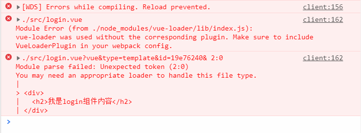

webpack基本配置笔记

webpack安装的两种方式
<!-- more -->


#### 基本打包

从main.js打包到bundle.js





### webpack.config.js配置文件

#### 入口和出口文件

entry和output设置打包的入口文件和出口文件



#### webpack-dev-server

下载包：

cmd 运行`npm i webpack-dev-server -D`下载包到**本地开发项目**，不要全局安装



配置包：

配置项 => 自动打开浏览器`--open`，默认打开本地端口`--port 3000`，默认打开根路径`--contentBase src`，热更新`--hot`。



第二种配置方法（不推荐）



#### bable-loader两套解析包

1. 在webpack中,默认只能处理-部分ES6 的新语法,一些更高级的Es6语法或者ES7语法,  webpack是处理不了的;这时候,就需要借助于第三方的loader ;来帮助webpack处理这些高级的语法，当第三方loader把高级语法转为低级的语法之后,会把结果交给webpack 去打包到bundle.js中

   通过Babel , 可以帮我们将高级的语法转换为低级的语法

   在webpack 中,可以运行如下两套命令;安装两套包,去安装Babel 相关的loader功能:

```cmd
1.1 第一套包: npm i babel-core babel-loader babel-plugin-transform-runtime -D
1.2 第二套包: npm i babel-preset-env babel-preset-stage-0 -D
```
2. 打开webpack 的配置文件,在module节点下的rules 数组中,添加-个新的匹配规则 :

- 2.1 { test:/\.js$/, use: 'babel-loader', exclude : /node_ modules/ }
- 2.2注意:在配置babel的loade规则的时候，必须把node modules 目录,通过exclude选项排除掉:原因有俩  
- 2.2.1. 如果不排除node modules，则Babel会把node modules 中所有的第三方JS文件，茫都打包编译,这样,会非常消耗CPU ,同时,打包速度非常慢;        
- 2.2.2 哪怕，最终, Babel 把所有node_ modules 中的Js转换完毕了，但是,项目也无法正常运行!

3. 在项目的根目录中,新建-个叫做babelrc 的Babel配置文件， 这个配置文件,属于JSON格式，所以，在写. babelrc配置的时候,必须符合JSON语法规范:不能写注释 ,字符串必须用双引号 

- 3.1 在. babelrc 写如下的配置大家可以把 preset翻译成[语法]的意思 

   

~~~js
{         
	"presets": ["env", "stage-0"] ,      // 上边第二套包的语法包  
	"plugins": [" transform-runtime"]  // 上边第一套包的插件
} 
~~~

#### vue-loader

用来解析.vue文件的包



安装两个包

~~~nginx
npm i vue-loader vue-template-compiler -D
~~~

出现错误，扔提示需要安装解析包的问题



[解决办法链接：](https://www.imooc.com/qadetail/251484?t=406319)

webpack和vue-loader版本上的问题.

主要原因：版本导致的问题

方法一：

更换loader的版本：npm i vue-loader@14.2.2 ；

更换webpack的版本：npm i webpack@3.5.5 

方法二：

~~~js
// webpack.config.js
const { VueLoaderPlugin } = require('vue-loader')

module.exports = {
// ...
plugins: [
	new VueLoaderPlugin()
]
}
~~~

#### export default、export

ES6语法用来暴露模块


