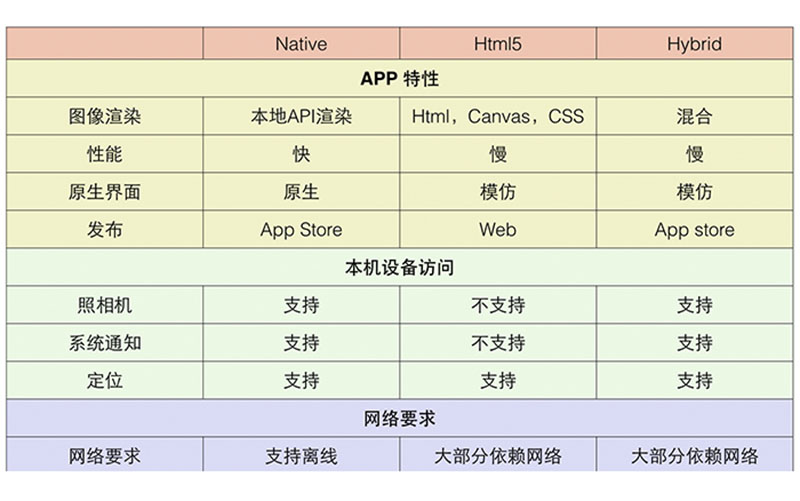
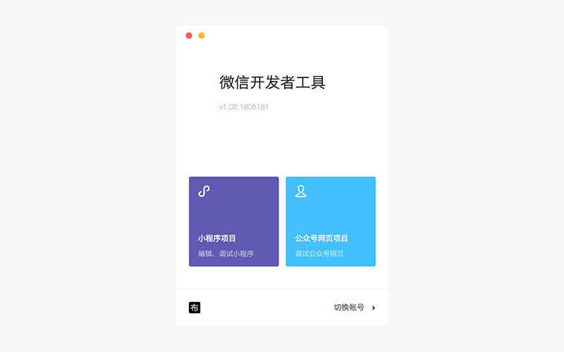
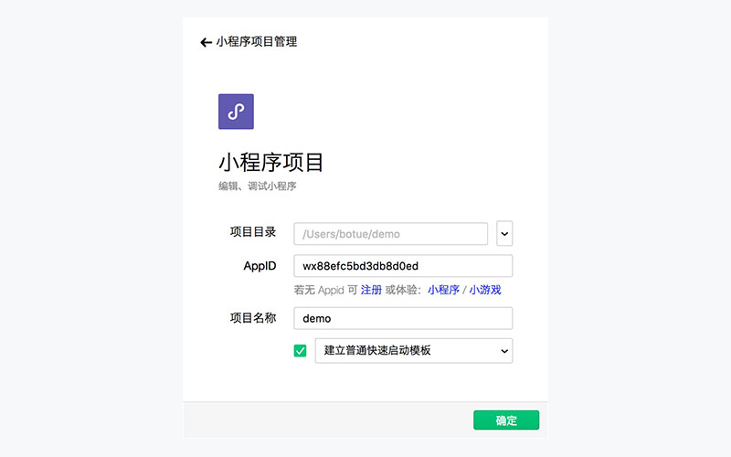
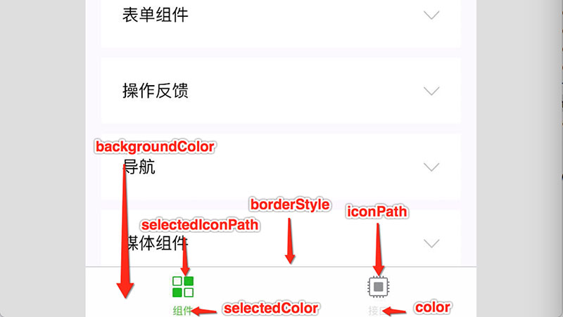
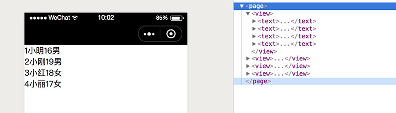

## 背景介绍

> 微信是一个生态圈，包括即时通信、移动支付、社交媒体、游戏娱乐等多个领域，彼此之间紧密联系、互为支撑形成了一个强大的微信帝国。日常交流中所提到的微信更多是指的**即时通信**和**移动支付**，而我们即将学习的**微信小程序属于社交媒体的组成部分**。

*注：除了有微信小程序外，支付宝也如法炮制了小程序，文中提到的小程序如无特别说明，特指微信小程序。*
<!-- more -->


人们越来越多的将时间花费在了移动设备上，移动互联势不可挡。



伴随而来的移动开发技术层出不穷：

- H5（Web App）

  即运行于移动设备浏览器的**网页**，使用html5、css3等技术实现，可以跨平台。

- 原生应用（Native App）

  即所谓的 Android 和 IOS 开发，可以直接与底层操作系统通信，可扩展性非常强，不可跨平台。

- 混合应用（Hybrid App）

  混合了Web App 和 Native App开发技术，一般展示类内容使用 Web App技术，交互性较强的使用 Native App技术，可以跨平台。



然而不同的开发技术间各有优势，下图列举了各开发技术间的差异：



小程序是一种新型的轻量的开发技术，"微信之父" 张晓龙是这样定义小程序的：





## 开发环境

### 1. [账号申请](https://mp.weixin.qq.com/cgi-bin/registermidpage?action=index&lang=zh_CN)

1. 选择注册账号类型



1. 账号信息



1. 邮箱激活



1. 信息登记



### 2. 绑定开发者

1. [登录小程序](https://mp.weixin.qq.com/)



1. 管理员授权



1. 添加成员



### 3. 获取AppID



### 4. 开发工具

1. [下载](https://developers.weixin.qq.com/miniprogram/dev/devtools/download.html)



1. 扫码登录



1. 小程序



1. 创建小程序



1. 开发界面



### 5. 开发文档

俗话说的好：好记性不如烂笔头，小程序开发过程中参考[官方文档](https://developers.weixin.qq.com/miniprogram/dev/index.html?t=2018413)是最佳实践！


## 快速体验

### 创建小程序

1. 创建一个目录，例如 demo
2. 打开开发工具
3. 选择第1步创建的目录



1. 填定AppID、名称，并选择**建立普通快速启动模板**



### 预览小程序

使用绑定的开发者微信用户扫描二维码，便可以在微信中打开小程序了



### 编辑小程序

微信官方的开发工具自带了编辑器功能，可以对小程序代码进行编辑，如下图





使用官方开发工具编辑小程序并不是唯一方式，开发者也可以根据自已喜好自由选择任意编辑工具，如 sublime_text、WebStorm、VS Code等。

## 结构分析

### 1. 目录

> 小程序包含一个描述整体程序的 app 和多个描述各自页面的 page。

- 主体 app

一个小程序主体部分由三个文件组成，必须放在项目的根目录，如下：

| 文件类型 | 必填 | 描述           |
| -------- | ---- | -------------- |
| app.js   | 是   | 小程序入口     |
| app.json | 是   | 小程序全局配置 |
| app.wxss | 否   | 小程序全局样式 |

- 页面 page

一个小程序页面由四个文件组成，分别是：

| 文件后缀 | 必填 | 描述         |
| -------- | ---- | ------------ |
| .js      | 是   | 页面逻辑     |
| .wxml    | 是   | 页面布局结构 |
| .wxss    | 否   | 局部布局样式 |
| .json    | 否   | 局部配置     |

**wxml** 指的是 **W**ei **X**in **M**arkup **L**anguage，微信团队以 XML 为基础，而定义的一套用以实现小程序页面布局的标记语言，与HTML非常类似。

**wxss** 指的是 **W**ei **X**in **S**tyle **S**heet，微信团队定义的一套用以实现小程序布局样式的层叠样式表，与CSS非常接近。

以下是小程序的基本目录结构，也可以根据需要任意添加其它目录，如资源目录 assets、第三方库vendors、扩展目录 extends等。

```
├── app.js ...................................................... 小程序入口文件
├── app.json .................................................... 小程序全局配置
├── app.wxss .................................................... 小程序全局样式
├── pages ....................................................... 所有页面目录
│   ├── index ................................................... index页面目录
│   │   ├── index.js ............................................ index页面业务逻辑
│   │   ├── index.wxml .......................................... index页面布局结构
│   │   └── index.wxss .......................................... index页面布局样式
│   └── logs .................................................... logs页目录
│       ├── logs.js ............................................. logs页面业务逻辑
│       ├── logs.json ........................................... logs页面配置文件
│       ├── logs.wxml ........................................... logs页面布局结构
│       └── logs.wxss ........................................... logs页面布局样式
├── project.config.json ......................................... 开发工具配置文件
└── utils ....................................................... 公共逻辑
    └── util.js ................................................. 实用工具
```

### 2. 配置

熟悉了小程序的基础知识后，接下来我们一起动手开发一个真正的小程序，首先从配置小程开始。

按着上一章节步骤创建一个小程序，不勾选**建立普通快速启动模板**



#### 全局配置

> 通过 app.json 文件对小程序进行全局配置，如页面文件的路径、窗口表现、设置网络超时时间、设置多 tab 等。

**app.json 配置清单**

| 属性           | 类型         | 必填 | 描述                 |
| -------------- | ------------ | ---- | -------------------- |
| pages          | String Array | 是   | 设置页面路径         |
| window         | Object       | 否   | 设置默认窗口表现     |
| tabBar         | Object       | 否   | 设置底部 tab 表现    |
| networkTimeout | Object       | 否   | 设置网络超时时间     |
| debug          | Boolean      | 否   | 设置是否开启调试模式 |

创建 app.json 文件

app.json 示例

```json
{
  "pages":[
    "pages/index/index",
    "pages/detail/index"
  ],
  "window":{
    "backgroundTextStyle":"light",
    "navigationBarBackgroundColor": "#fff",
    "navigationBarTitleText": "WeChat",
    "navigationBarTextStyle":"black"
  }
}
```

1. **pages**

数组类型，数组中每一项都是字符串，来指定小程序由哪些页面组成。每一项代表对应页面的【路径+文件名】信息，数组的第一项代表小程序的初始页面。小程序中新增/减少页面，都需要对 pages 数组进行修改。文件名不需要写文件后缀，因为框架会自动去寻找路径下 .json ,  .js,  .wxml ,  .wxss 四个文件进行整合。

```
// 创建目录及文件
// 习惯性的将页面统一放到名叫 pages 的目录中，不是强制要求，可以起任意名称的目录
pages
├── detail
│   ├── index.js
│   └── index.wxml
└── index
    ├── index.js
    └── index.wxml
```

编辑 app.json，添加字段 pages

```json
{
  "pages": [
    "pages/index/index",
    "pages/detail/detail"
  ]
}
```

1. **window**

对象类型，用于设置小程序的状态栏、导航条、标题、窗口背景色。

| 属性                         | 类型     | 默认值  | 描述                               | 兼容 |
| ---------------------------- | -------- | ------- | ---------------------------------- | ---- |
| navigationBarBackgroundColor | HexColor | #000000 | 导航栏背景颜色，如"#000000"        | -    |
| navigationBarTextStyle       | String   | white   | 导航栏标题颜色，仅支持 black/white |      |
| navigationBarTitleText       | String   |         | 导航栏标题文字内容                 |      |
| backgroundColor              | HexColor | #ffffff | 窗口的背景色                       |      |

查看window[更多配置](https://developers.weixin.qq.com/miniprogram/dev/framework/config.html#window)属性



编辑 app.json，添加字段 windows

```json
{
  "window": {
     "navigationBarBackgroundColor": "#262626",
     "navigationBarTitleText": "FC游乐园",
     "navigationBarTextStyle": "white",
     "backgroundColor": "#F0F0F0"
  }
}
```

效果如下图所示：



1. **tabBar**

对象类型，配置项指定 tab 栏的表现，以及 tab 切换时显示的对应页面。

| 属性            | 类型     | 必填 | 默认值 | 描述                                    |
| --------------- | -------- | ---- | ------ | --------------------------------------- |
| color           | HexColor | 是   |        | tab 上的文字默认颜色                    |
| selectedColor   | HexColor | 是   |        | tab 上的文字选中时的颜色                |
| backgroundColor | HexColor | 是   |        | tab 的背景色                            |
| borderStyle     | String   | 否   | black  | tabbar上边框的颜色， 仅支持 black/white |
| list            | Array    | 是   |        | tab 的列表，最少2个、最多5个            |
| position        | String   | 否   | bottom | 可选值 bottom、top                      |

1. 当设置 position 为 top 时，将不会显示 icon
2. tabBar 中的 list 是一个数组，**只能配置最少2个、最多5个 tab**，tab 按数组的顺序排序。

其中 list 接受一个数组，数组中的每个项都是一个对象，其属性值如下：

| 属性             | 类型   | 必填 | 描述                                                         |
| ---------------- | ------ | ---- | ------------------------------------------------------------ |
| pagePath         | String | 是   | 页面路径，必须在 pages 中先定义                              |
| text             | String | 是   | tab 上按钮文字                                               |
| iconPath         | String | 否   | 图片路径，icon 大小限制为40kb，建议尺寸为 81px * 81px，当 postion 为 top 时，此参数无效，不支持网络图片 |
| selectedIconPath | String | 否   | 选中时的图片路径，icon 大小限制为40kb，建议尺寸为 81px * 81px ，当 postion 为 top 时，此参数无效 |





```diff
// 到目前完整的目录结构
FC
├── app.js
├── app.json
├── icons
│   ├── cards-active.png
│   ├── cards-default.png
│   ├── face-active.png
│   ├── face-default.png
│   ├── home-active.png
│   └── home-default.png
├── pages
│   ├── cards
│   │   ├── index.js
│   │   └── index.wxml
│   ├── center
│   │   ├── index.js
│   │   └── index.wxml
│   ├── detail
│   │   ├── index.js
│   │   └── index.wxml
│   └── index
│       ├── index.js
│       └── index.wxml
└── project.config.json
```

编辑 app.json，添加 tabBar 字段

```json
  "tabBar": {
    "color": "#D78B09",
    "selectedColor": "#FFF",
    "backgroundColor": "#FECA49",
    "borderStyle": "white",
    "list": [
      {
        "text": "首页",
        "pagePath": "pages/index/index",
        "iconPath": "icons/home-default.png",
        "selectedIconPath": "icons/home-active.png"
      },
      {
        "text": "卡券",
        "pagePath": "pages/cards/index",
        "iconPath": "icons/cards-default.png",
        "selectedIconPath": "icons/cards-active.png"
      },
      {
        "text": "我的",
        "pagePath": "pages/center/index",
        "iconPath": "icons/face-default.png",
        "selectedIconPath": "icons/face-active.png"
      }
    ]
  }
```

效果如下图如所示：





#### 页面配置

> 每个页面可以有不同的表现，通过 pages 目录下的 .json 文件，如 logs.json ，实现页面的局部配置。但是只能设置 app.json 中的 window 配置项的内容，页面中配置项会覆盖 app.json 的 window 中相同的配置项。

| 属性                         | 类型     | 默认值 | 描述                               |
| ---------------------------- | -------- | ------ | ---------------------------------- |
| navigationBarBackgroundColor | HexColor | #000   | 导航栏背景颜色                     |
| navigationBarTextStyle       | String   | white  | 导航栏标题颜色，仅支持 black/white |
| navigationBarTitleText       | String   |        | 导航栏标题文字内容                 |
| backgroundColor              | HexColor | #fff   | 窗口的背景色                       |

```
// 在 pages/center 目录下创建 index.json
FC/pages/center
├── index.js
├── index.json
└── index.wxml
```

如下所示，编辑 index.json

```json
{
  "navigationBarBackgroundColor": "#ffffff",
  "navigationBarTextStyle": "white",
  "navigationBarTitleText": "我的"
}
```

效果如下图所示：





### 3. 布局

> 小程序与Web类似，也分为结构、表现、行为三部分，小程序使用标记语言 WXML 定义结构、使用 WXSS 定义表现、使用 JavaScript 定义行为。

小程序的每一个页面都是由 .wxml、.wxss、.js 三部分构成，**并且要求文件名一致**，通常为了**管理方便**，会将小程序的每个页面单独归到同一个目录下，所有的页面又都归到了 pages 目录下。

```
FC/pages ............................................................... 所有页面目录
├── cards .............................................................. card 页面
│   ├── index.js
│   └── index.wxml
├── center ............................................................. center 页面
│   ├── index.js
│   ├── index.json
│   └── index.wxml
├── detail ............................................................. detail 页面
│   ├── index.js
│   └── index.wxml
└── index .............................................................. index 页面
    ├── index.js ....................................................... 行为
    ├── index.wxss ..................................................... 表现
    └── index.wxml ..................................................... 结构
```

> **wxml** 指的是 **W**ei **X**in **M**arkup **L**anguage，微信团队以 XML 为基础，而定义的一套用以实现小程序页面布局的标记语言，与HTML非常类似。
>
> wxml有一套自已的标签（组件）如 form、input、textarea、button、audio、video、view、text等，其含义与html的标签也是一样的，其中 view、text 可分别与 html 中的 div、text 对应。

```html
<form action="">
    <view class="items">
        <view>
            <label for="">姓名:</label>
            <input type="text" placeholder="请填写您的真实姓名" />
        </view>
        <view>
            <label for="">手机:</label>
            <input type="text" placeholder="请填写您的手机号" />
        </view>
        <view>
            <label for="">身份:</label>
            <input type="text" placeholder="请选择您与宝宝的关系身份" />
        </view>
        <view>
            <label for="">验证码:</label>
            <input type="text" placeholder="六位数字验证码" />
            <button class="verify" size="mini">获取验证码</button>
        </view>
    </view>
    <button class="submit">绑定并登录</button>
</form>
```


> **wxss** 指的是 **W**ei **X**in **S**tyle **S**heet，微信团队定义的一套用以实现小程序布局样式的层叠样式表，与CSS非常接近。
>
> wxss 与css 非常类似，可以理解成是 css 的一个子集，也包括选择器、属性、值部分，同样具有层叠的特征。

```css
page {
    background: #F0F0F0;
}

.items {
    padding-left: 15px;
    background: #FFF;
}

.items view {
    display: flex;
    padding: 10px 15px 10px 0;
    color: #3C3C3C;
    font-size: 14px;
    border-bottom: 1px solid #F0F0F0;
}

.items view:last-child {
    border-bottom: 0 none;
}

.items label {
    width: 60px;
}

input {
    flex: 1;
    text-align: right;
    color: #C9C9C9;
    font-size: 14px;
}

button::after {
    border: none;
}

form .submit {
    margin: 20px;
    color: #FFF;
    background-color: #FECA49;
}

form .verify {
    padding: 3px 15px;
    margin-left: 8px;
    color: #FFF;
    background-color: #45B8FF;
    font-size: 12px;
    border-radius: 36px;
    transform: translate(0, -5px);
}
```

效果如下图所示：

 



# 二、开发文档

- 掌握小程序常用组件的使用
- 能够使用 wxss 布局小程序界面
- 掌握小程序的数据绑定
- 能够处理列表数据
- 能够根据条件对数据实现控制
- 掌握小程序事件监听方法
- 理解小程序事件冒泡现象


## 布局

创建一个小程序项目演示UI组件及样式。



### 适配

> 众所周之移动设备种类较多，如操作系统有 Android、IOS、Windows Phone等，屏幕尺寸有 4寸、4.7寸、5.5寸等，甚至屏幕像素密码也存在差异，开发者不得不针对不同的操作系统和不同的屏幕尺寸进行处理。
>
> 开发小程序不用担心操作系统的差异，小程序运行在微信中，微信有 Android版本 和 IOS版本，天然可以实现跨平台（操作系统）运行。
>
> 为了保证小程序能够在任何尺寸的屏幕上都能正常显示，开发人员需要进行适配置处理，为此微信团队在底层做了专门处理，提供了一个**新的尺寸单位 rpx** **，rpx是一个相对长度单位，会根据屏幕尺寸自动调整**（有点类似百分比的意思）。

**rpx（responsive pixel）可以根据屏幕宽度进行自适应。规定所有屏幕宽为750rpx。**

rpx 与 px 的换算关系：

| 设备           | 屏幕尺寸 | rpx换算px (屏幕宽度/750) | px换算rpx (750/屏幕宽度) |
| -------------- | -------- | ------------------------ | ------------------------ |
| iPhone5        | 320px    | 1rpx = 0.42px            | 1px = 2.34rpx            |
| 小米MIX 2S     | 360px    | 1rpx = 0.48px            | 1px = 2.083rpx           |
| iPhone6        | 375px    | 1rpx = 0.5px             | 1px = 2rpx               |
| iPhone6 Plus   | 414px    | 1rpx = 0.552px           | 1px = 1.81rpx            |
| HUAWEI Mate 10 | 480px    | 1rpx = 0.64px            | 1px = 1.562rpx           |

上述表格展示了 rpx 与 px 的换算关系，但是是由微信小程序在执行过程中自动换算的，我们只需要了解换算关系就可以了。

**一句话：开发小程序时所有屏幕宽度都是 750rpx。**

注：开发微信小程序时设计师可以用 750px 作为视觉稿的标准，这样可以一定程序上避免换算带来的误差。

### 样式

```
└── FC
    ├── app.js
    ├── app.json
    ├── app.wxss
    ├── pages
    │   └── style ................................................. 演示 wxss 的使用
    │       ├── common.wxss
    │       ├── index.js
    │       ├── index.wxml
    │       └── index.wxss
    └── project.config.json
```

> 小程序会自动根据 wxml 文件名，自动将 wxss 进行加载，例如 当加载 pages/style/index.wxml 时，会自动将 pages/style/index.wxss 加载。

- 样式导入

  使用 @import 语句可以导入外联样式表， @import 后跟需要导入的外联样式表的相对路径，用 ; 表示语句结束。

   ```css
  /** common.wxss **/
  page {
  	background: #F0F0F0;
  }
   ```

  ```css
  /** index.wxss **/
  @import "common.wxss";
  page {
  	background: #F2F2F2;
  }
  ```

- 内联样式

  - 通过 style 属性直接定义样式。

  ```html
  <!-- index.wxml -->
  <view style="color: red">学习开发小程序</view>
  ```

- 外部样式

  - 通过 class 属性指定样式规则，属性值为类选择器名称，可以同时指定多个样式规则，中间以空格进行分隔。

  ```css
  /** index.wxss **/
  .demo {
      width: 3750rpx;
      height: 100rpx;
      background: pink;
  }
  ```

  ```html
  <!-- index.wxml -->
  
  <!-- demo 类选择器 -->
  <view class="demo">学习小程序</view>
  ```

  - 通过 id 属性指定样式规则，属性值为 id 选择器名称。

  ```css
  /** index.wxss **/
  .demo {
      width: 375rpx;
      height: 100rpx;
      background: pink;
  }
  
  #test {
      text-align: center;
      line-height: 100rpx;
      font-size: 40rpx;
  }
  ```

  ```html
  <!-- index.wxml -->
  
  <!-- test id选择器 -->
  <view class="demo" id="test">学习小程序</view>
  ```

- 选择器

  | 选择器 | 示例 | 描述 |
  | ------ | ---- | ---- |
  |        |      |      |
  |        |      |      |
  |        |      |      |
  |        |      |      |
  |        |      |      |
  |        |      |      |

  	实际上小程序还支持更多的css的选择器，后续应用中逐步介绍。

### 组件

> 小程序里的组件其实指的是 wxml 的标签，如 input、form、view等。
>
> 创建 demo 目录，演示各组件的使用

```diff
└── FC
    ├── app.js
    ├── app.json
    ├── app.wxss
    ├── pages
+   │   ├── demo ............................................... 演示各组件的使用
    │   └── style
    │       ├── common.wxss
    │       ├── index.js
    │       ├── index.wxml
    │       └── index.wxss
    └── project.config.json
```

1. **image 相当于 html 中的 img 标签，用来加载图片。**

   创建 image.js 和 image.wxml，将提前准备好的 static 粘进来

   ```diff
   └── FC
       ├── app.js
       ├── app.json
       ├── app.wxss
       ├── pages
       │   ├── demo
   +   │   │   ├── image.js
   +   │   │   └── image.wxml .................................... 演示 image 组件
       │   └── style
       │       ├── common.wxss
       │       ├── index.js
       │       ├── index.wxml
       │       └── index.wxss
       ├── project.config.json
   +   └── static
   +       ├── images
   +       │   ├── blank.png
   +       │   ├── icon.png
   +       │   ├── ......
   +       │   └── ......
   +       └── uploads
   +           ├── content_1.png
   +           ├── slide_3.jpg
   +           ├── slide_4.jpg
   +           ├── ......
   +           └── ......
   ```

   image 组件的使用

   ```html
   <!-- image.wxml -->
   
   <!-- 通过 src 属性加载图片 -->
   <!-- 通过 mode 属性调整 图片的的显示方式 (裁切/缩放) -->
   <!-- image 组件默认宽度为300px，默认高度为225px -->
   <image src="../../static/uploads/item_1.png" mode="aspectFit"></image>
   ```

   关于 [mode 有效值](https://developers.weixin.qq.com/miniprogram/dev/component/image.html)

2. **text  相当于 html 中的 span，用来定义文本**

   ```diff
   └── FC
       ├── app.js
       ├── app.json
       ├── app.wxss
       ├── pages
       │   ├── demo
       │   │   ├── image.js
       │   │   ├── image.wxml
   +   │   │   ├── text.js
   +   │   │   └── text.wxml .................................... 演示 image 组件
       │   └── style
       │       ├── common.wxss
       │       ├── index.js
       │       ├── index.wxml
       │       └── index.wxss
       ├── project.config.json
       └── static
           ├── images
           └── uploads
   ```

   text 组件的使用

   ```html
   <!-- text.wxml -->
   <text>世上本无事，庸人自扰之</text>
   ```

3. **view 相当于 html 中的 div，一般做为容器出现。**

   ```diff
   └── FC
       ├── app.js
       ├── app.json
       ├── app.wxss
       ├── pages
       │   ├── demo
       │   │   ├── image.js
       │   │   ├── image.wxml
       │   │   ├── text.js
       │   │   ├── text.wxml
   +   │   │   ├── view.js
   +   │   │   └── view.wxml .................................... 演示 view 组件
       │   └── style
       ├── project.config.json
       └── static
           ├── images
           └── uploads
   ```

   view 组件的使用

   ```html
   <!-- view.wxml -->
   
   <!-- 模仿 PC网页 布局结构 -->
   <view class="wrapper">
       <!-- 头部 -->
       <view class="header"></view>
       <!-- 主体 -->
       <view class="body">
           <!-- 侧边栏 -->
       	<view class="aside"></view>
           <!-- 内容 -->
           <view class="content"></view>
       </view>
       <!-- 底部 -->
       <view class="footer"></view>
   </view>
   ```

4. **牛刀小试**

    到目前为止我们学习了 image、text、image 三个组件，下面使用这三个组件布局一个页面。

    创建 index 目录及 index.wxml、index.wxss、index.js 三个文件。

    ```diff
    └── FC
        ├── app.js
        ├── app.json
        ├── app.wxss
        ├── pages
        │   ├── demo
        │   │   ├── image.js
        │   │   ├── image.wxml
        │   │   ├── text.js
        │   │   ├── text.wxml
        │   │   ├── view.js
        │   │   └── view.wxml
    +   │   ├── index
    +   │   │   ├── index.js
    +   │   │   ├── index.wxml
    +   │   │   └── index.wxss
        │   └── style
        ├── project.config.json
        └── static
            ├── images
            └── uploads
    ```

    效果如下图所示:

    

5. **swiper 滑块组件，可以用来实现类似轮播图布局效果。**

    ```diff
    └── FC
        ├── app.js
        ├── app.json
        ├── app.wxss
        ├── pages
        │   ├── demo
        │   │   ├── image.js
        │   │   ├── image.wxml
    +   │   │   ├── swiper.js
    +   │   │   ├── swiper.wxml .................................. 演示 swiper 组件
    +   │   │   ├── swiper.wxss
        │   │   ├── text.js
        │   │   ├── text.wxml
        │   │   ├── view.js
        │   │   └── view.wxml
        │   ├── index
        │   └── style
        ├── project.config.json
        └── static
            ├── images
            └── uploads
    ```

    swiper 使用如下

    ```html
    <!-- swiper.wxml -->
    <swiper>
        <swiper-item>1</swiper-item>
        <swiper-item>2</swiper-item>
        <swiper-item>3</swiper-item>
    </swiper>
    ```

    ```css
    /* swiper.wxss */
    swiper-item {
        background: pink;
        text-align: center;
        line-height: 300rpx;
        font-size: 80rpx;
    }
    ```

6. 继续完善 index 页面，添加轮播图

    

**通过学习 view、image、text、swiper 对组件有了基本了解，小程序还有[其它组件](https://developers.weixin.qq.com/miniprogram/dev/component/)，后续学习中在对应的应用场景再进行学习。也可以扫码查看可微信团队官方演示**



6. **真机访问**

   写到这里相信不少同学已经尝试扫码进行真机调试了，然而会遇到一个错误警告！！！

   

   原因在于小程序总大小（包括图片、字体等静态资源）不能超过 2MB。

   这个问题也很好解决，可以将图片、字体等静态资源放到服务器（公司会购买）上，然后通网络地址进行访问，也可以使用当下比较流行的图床服务。

   下面介绍一个新浪图床（免费）的使用：

   - 奇才
   - 苦
   - 苦

   然后将代码中图片路径换成网络地址，如下所示

   ```html
   <!-- 原来路径 -->
   <image src="../../static/uploads/item_1.png" mode="aspectFit"></image>
   
   <!-- 新图片路径 -->
   <image src="http://fc.botue.com/uploads/item_1.png" class="thumb" mode="aspectFit"/>
   ```


### 弹性盒子





## 数据

> 通过前面学习，掌握了小程序页面的布局，然而小程序页面中显示的内容都是静态（写列）的，真正线上运行的小程序内容都应该是动态的，接下来我们学习如何在小程序中处理页面数据。

### 数据绑定

> 小程序内容数据是由 JavaScript 控制提供的。
>
> 我们知道每个页面都是由 .wxml、.wxss、.js、.json 构成，其中 wxml 定义结构，wxss 定义表现、json 进行配置，.js 则专门处理逻辑。
>
> 当加载页面时，同名的 js 文件会自动加载并执行，如加载 pages/demo/data.wxml 时，pages/demo/data.js 会自动被加载执行。

**所谓数据绑定是指数据与页面中组件的关联关系。使用 Mustache 语法（双大括号）将数据变量包起来**。

创建 data.js、data.wxml、data.wxss 三个文件

```diff
└── FC
    ├── app.js
    ├── app.json
    ├── app.wxss
    ├── pages
    │   ├── demo
+   │   │   ├── data.js ........................................... 数据逻辑
+   │   │   ├── data.wxml ......................................... 演示数据处理
+   │   │   ├── data.wxss
    │   │   ├── image.js
    │   │   ├── image.wxml
    │   │   ├── ......
    │   │   ├── view.js
    │   │   └── view.wxml
    │   ├── index
    │   └── style
    ├── project.config.json
    └── static
        ├── images
        └── uploads
```

#### 简单数据(data)

```javascript
// pages/demo/data.js

// Page 是全局提供的，用来创建一个页面实例
Page({
    // 通过 data 属性，初始化页面中用到的数据
    data: {
        // 字符串类型
        message: 'hello world!'
    }
});   
```
##### data中的数据获取

###### Page.prototype.setData(Object data, Function callback)

`setData` 函数用于将数据从逻辑层发送到视图层（异步），同时改变对应的 `this.data` 的值（同步）。

#### 参数说明

| 字段     | 类型     | 必填 | 描述                                      | 最低版本                                                     |
| -------- | -------- | ---- | ----------------------------------------- | ------------------------------------------------------------ |
| data     | Object   | 是   | 这次要改变的数据                          |                                                              |
| callback | Function | 否   | setData引起的界面更新渲染完毕后的回调函数 | [1.5.0](https://developers.weixin.qq.com/miniprogram/dev/framework/compatibility.html) |

`Object` 以 `key: value` 的形式表示，将 `this.data` 中的 `key` 对应的值改变成 `value`。

**其中 key 可以以数据路径的形式给出，支持改变数组中的某一项或对象的某个属性，如 array[2].message，a.b.c.d，并且不需要在 this.data 中预先定义。**

**注意：**

1. **直接修改 this.data 而不调用 this.setData 是无法改变页面的状态的，还会造成数据不一致**。
2. 仅支持设置可 JSON 化的数据。
3. 单次设置的数据不能超过1024kB，请尽量避免一次设置过多的数据。
4. 请不要把 data 中任何一项的 value 设为 `undefined` ，否则这一项将不被设置并可能遗留一些潜在问题。

```jsx
<!--index.wxml-->
<view>{{text}}</view>
<button bindtap="changeText">Change normal data</button>
<view>{{num}}</view>
<button bindtap="changeNum">Change normal num</button>
<view>{{array[0].text}}</view>
<button bindtap="changeItemInArray">Change Array data</button>
<view>{{object.text}}</view>
<button bindtap="changeItemInObject">Change Object data</button>
<view>{{newField.text}}</view>
<button bindtap="addNewField">Add new data</button>
// index.js
Page({
  data: {
    text: 'init data',
    num: 0,
    array: [{text: 'init data'}],
    object: {
      text: 'init data'
    }
  },
  changeText() {
    // this.data.text = 'changed data' // 不要直接修改 this.data
    // 应该使用 setData
    this.setData({
      text: 'changed data'
    })
  },
  changeNum() {
    // 或者，可以修改 this.data 之后马上用 setData 设置一下修改了的字段
    this.data.num = 1
    this.setData({
      num: this.data.num
    })
  },
  changeItemInArray() {
    // 对于对象或数组字段，可以直接修改一个其下的子字段，这样做通常比修改整个对象或数组更好
    this.setData({
      'array[0].text': 'changed data'
    })
  },
  changeItemInObject() {
    this.setData({
      'object.text': 'changed data'
    })
  },
  addNewField() {
    this.setData({
      'newField.text': 'new data'
    })
  }
})
```

wxml文件中的获取

```html
<!-- pages/demo/data.wxml -->
<text class="msg">{{message}}</text>
```

```css
/* pages/demo/data.wxss */
page {
    height: 100%;
    display: flex;
}

.msg {
    display: block;
    margin: auto;
    font-size: 60rpx;
    font-weight: bold;
}
```



1. **复杂数据**

   ```javascript
   // pages/demo/data.js
   Page({
       // 通过 data 属性，初始化页面中用到的数据
       data: {
           user: {
               name: '小明',
               age: 16
           },
           courses: ['wxml', 'wxss', 'javascript']
       }
   });
   ```

   ```html
   <!-- pages/demo/data.wxml -->
   <text>我叫{{user.name}}，我今年{{user.age}}岁了，我在学习{{courses[0]}}课程。</text>
   ```

2. **运算**

   ```javascript
   // pages/demo/data.js
   Page({
       // 通过 data 属性，初始化页面中用到的数据
       data: {
           a: 10,
           b: 5
       }
   });
   ```

   ```html
   <!-- pages/demo/data.wxml -->
   <text>{{a}} + {{b}} = {{a + b}}</text>
   ```

3. **组合**

   视情况介绍

### 列表数据

> 将数组数据遍历绑定到组件中。通过 wx:for 属性实现。

1. **基本用法**

   ```javascript
   // pages/demo/data.js
   Page({
       // 通过 data 属性，初始化页面中用到的数据
       data: {
           users: [
               {name: '小明', age: 16, gender: '男'},
               {name: '小刚', age: 19, gender: '男'},
               {name: '小红', age: 18, gender: '女'},
               {name: '小丽', age: 17, gender: '女'}
           ]
       }
   });
   ```

   ```html
   <!-- pages/demo/data.wxml -->
   <view wx:for="{{users}}">
       <text>{{index+1}}</text>
       <text>{{item.name}}</text>
       <text>{{item.age}}</text>
       <text>{{item.gender}}</text>
   </view>
   ```

   **wx:for 属性将当前组件按着数组的长度动态创建，并且通过 index 变量可以访问到数组的索引值，通过item变量可以访问到单元值。**

   



2. **指定索引值变量、单元值变量**

   > 通过 wx:for 对数组数据进行遍历时，可以分别指定访问数组索引值变量和单元值的变量。
   >
   > wx:for-index 指定索引值变量，wx:for-item 批定单元值变量。
   >
   > wx:for 支持嵌套

   ```javascript
   // pages/demo/data.js
   Page({
       // 通过 data 属性，初始化页面中用到的数据
       data: {
           brands: [
               {
                   name: '耐克',
                   origin: '美国',
                   category: ['男装', '女装', '鞋', '体育用品']
               },
               {
                   name: 'SK-II',
                   origin: '韩国',
                   category: ['防晒霜','面膜', '洗护']
               }
           ]
       }
   });
   ```

   ```html
   <!-- pages/demo/data.wxml -->
   <view wx:for="{{brands}}" wx:for-index="k" wx:for-item="v">
       <view>
           <text>{{k+1}} </text>
           <text> {{v.name}} </text>
           <text> {{v.origin}}</text>
       </view>
       <view>
           <text wx:for="{{v.category}}">{{item}}</text>
       </view>
   </view>
   ```

   执行结果

   



3. **block**

   > 通过 block 可以将多个组件元素“包”到一起进行渲染，block 只是提供一种结构，并不会被渲染到页面中。一般这样做的目的是可以精简组件结构。

   ```html
   <!-- pages/demo/data.wxml -->
   <block wx:for="{{users}}">
       <text>{{item.name}}</text>
       <text>{{item.age}}</text>
   </block>
   ```

   ```javascript
   // pages/demo/data.js
   Page({
       // 通过 data 属性，初始化页面中用到的数据
       data: {
           users: [
               {name: '小明', age: 18},
               {name: '小红', age: 16}
           ]
       }
   });
   ```

4. **wx:key**

   视情况

### 条件数据

> 根据条件控制是否渲染某个（些）组件，通过 wx:if 属性实现。

1. **基本用法**

   ```html
   <!-- pages/demo/data.wxml -->
   <view wx:if="{{true}}">
       <text>锄禾日当午</text>
   </view>
   ```

2. **多分支**

   ```html
   <!-- pages/demo/data.wxml -->
   <view wx:for="{{users}}">
       <text>{{index+1}} </text>
       <text> {{item.name}}</text>
       <text> {{item.age}} </text>
       <text wx:if="{{item.age <= 14}}"> 儿童</text>
       <text wx:elif="{{item.age <= 18}}"> 未成年</text>
       <text wx:else> 成年人</text>
   </view>
   ```

   ```javascript
   // pages/demo/data.js
   Page({
       // 通过 data 属性，初始化页面中用到的数据
       data: {
           users: [
               {name: '小明', age: 18},
               {name: '小红', age: 13},
               {name: '小丽', age: 19}
           ]
       }
   });
   ```

   

3. **block**

   > 将满足同一条件的组件“包”起来，同时控制是否渲染。

   ```html
   <!-- pages/demo/data.wxml -->
   <view>
       <text>序号 </text>
       <text> 姓名 </text>
       <text> 年龄 </text>
       <text> 成年 </text>
       <text> 批准</text>
   </view>
   <view wx:for="{{users}}">
       <text>{{index+1}} </text>
       <text> {{item.name}}</text>
       <text> {{item.age}} </text>
       <block wx:if="{{item.age>18}}">
           <text>是</text>
           <text>是</text>
       </block>
       <block wx:else>
           <text>否</text>
           <text>否</text>
       </block>
   </view>
   ```

   ```javascript
   // pages/demo/data.js
   Page({
       // 通过 data 属性，初始化页面中用到的数据
       data: {
           users: [
               {name: '小明', age: 18},
               {name: '小红', age: 16},
               {name: '小丽', age: 19}
           ]
       }
   });
   ```

   



### 共同属性

所有wxml 标签都支持的属性称之为共同属性，如表2-1所示。

表2-1 共同属性

| **属性名**   | **类型**     | **描述**       | **注解**                                 |
| ------------ | ------------ | -------------- | ---------------------------------------- |
| id           | String       | 组件的唯一标识 | 整个页面唯一                             |
| class        | String       | 组件的样式类   | 在对应的 WXSS 中定义的样式类             |
| style        | String       | 组件的内联样式 | 可以动态设置的内联样式                   |
| hidden       | Boolean      | 组件是否显示   | 所有组件默认显示                         |
| data-*       | Any          | 自定义属性     | 组件上触发的事件时，会发送给事件处理函数 |
| bind*/catch* | EventHandler | 组件的事件     |                                          |

## 事件

> 小程序中的事件同 DOM 中的事件含义一样，只是语法及及其执行细节上有些差异。

### 页面 Page

#### Page(Object) 构造器

`Page(Object)` 函数用来注册一个页面。接受一个 `Object` 类型参数，其指定页面的初始数据、生命周期回调、事件处理函数等。

**Object 参数说明：**

| 属性                                                         | 类型     | 描述                                                         |
| ------------------------------------------------------------ | -------- | ------------------------------------------------------------ |
| [data](https://developers.weixin.qq.com/miniprogram/dev/framework/app-service/page.html#data) | Object   | 页面的初始数据                                               |
| [onLoad](https://developers.weixin.qq.com/miniprogram/dev/framework/app-service/page.html#onloadobject-query) | Function | 生命周期回调—监听页面加载                                    |
| [onShow](https://developers.weixin.qq.com/miniprogram/dev/framework/app-service/page.html#onshow) | Function | 生命周期回调—监听页面显示                                    |
| [onReady](https://developers.weixin.qq.com/miniprogram/dev/framework/app-service/page.html#onready) | Function | 生命周期回调—监听页面初次渲染完成                            |
| [onHide](https://developers.weixin.qq.com/miniprogram/dev/framework/app-service/page.html#onhide) | Function | 生命周期回调—监听页面隐藏                                    |
| [onUnload](https://developers.weixin.qq.com/miniprogram/dev/framework/app-service/page.html#onunload) | Function | 生命周期回调—监听页面卸载                                    |
| [onPullDownRefresh](https://developers.weixin.qq.com/miniprogram/dev/framework/app-service/page.html#onpulldownrefresh) | Function | 监听用户下拉动作                                             |
| [onReachBottom](https://developers.weixin.qq.com/miniprogram/dev/framework/app-service/page.html#onreachbottom) | Function | 页面上拉触底事件的处理函数                                   |
| [onShareAppMessage](https://developers.weixin.qq.com/miniprogram/dev/framework/app-service/page.html#onshareappmessageobject) | Function | 用户点击右上角转发                                           |
| [onPageScroll](https://developers.weixin.qq.com/miniprogram/dev/framework/app-service/page.html#onpagescrollobject) | Function | 页面滚动触发事件的处理函数                                   |
| [onResize](https://developers.weixin.qq.com/miniprogram/dev/framework/app-service/page.html#onresize) | Function | 页面尺寸改变时触发，详见 [响应显示区域变化](https://developers.weixin.qq.com/miniprogram/dev/framework/view/resizable.html#%E5%9C%A8%E6%89%8B%E6%9C%BA%E4%B8%8A%E5%90%AF%E7%94%A8%E5%B1%8F%E5%B9%95%E6%97%8B%E8%BD%AC%E6%94%AF%E6%8C%81) |
| [onTabItemTap](https://developers.weixin.qq.com/miniprogram/dev/framework/app-service/page.html#ontabitemtapobject) | Function | 当前是 tab 页时，点击 tab 时触发                             |
| 其他                                                         | Any      | 开发者可以添加任意的函数或数据到 `Object` 参数中，在页面的函数中用 `this` 可以访问 |

**示例代码：**

```
// index.js
Page({
  data: {
    text: 'This is page data.'
  },
  onLoad(options) {
    // Do some initialize when page load.
  },
  onReady() {
    // Do something when page ready.
  },
  onShow() {
    // Do something when page show.
  },
  onHide() {
    // Do something when page hide.
  },
  onUnload() {
    // Do something when page close.
  },
  onPullDownRefresh() {
    // Do something when pull down.
  },
  onReachBottom() {
    // Do something when page reach bottom.
  },
  onShareAppMessage() {
    // return custom share data when user share.
  },
  onPageScroll() {
    // Do something when page scroll
  },
  onResize() {
    // Do something when page resize
  },
  onTabItemTap(item) {
    console.log(item.index)
    console.log(item.pagePath)
    console.log(item.text)
  },
  // Event handler.
  viewTap() {
    this.setData({
      text: 'Set some data for updating view.'
    }, function () {
      // this is setData callback
    })
  },
  customData: {
    hi: 'MINA'
  }
})
```

除了 `Page` ，作为高级用法，页面可以像自定义组件一样使用 `Component` 来创建，这样就可以使用自定义组件的特性，如 `behaviors` 等。具体细节请阅读 [`Component` 构造器](https://developers.weixin.qq.com/miniprogram/dev/framework/custom-component/component.html) 章节。

##### data

`data` 是页面第一次渲染使用的**初始数据**。

页面加载时，`data` 将会以`JSON`字符串的形式由逻辑层传至渲染层，因此`data`中的数据必须是可以转成`JSON`的类型：字符串，数字，布尔值，对象，数组。

渲染层可以通过 [WXML](https://developers.weixin.qq.com/miniprogram/dev/framework/view/wxml/index.html) 对数据进行绑定。

**示例代码：**

[在开发者工具中预览效果](https://developers.weixin.qq.com/s/2PeBsKmn6EZ9)

```
<view>{{text}}</view>
<view>{{array[0].msg}}</view>
```

```
Page({
  data: {
    text: 'init data',
    array: [{msg: '1'}, {msg: '2'}]
  }
})
```

#### 生命周期回调函数

生命周期的触发以及页面的路由方式[详见](https://developers.weixin.qq.com/miniprogram/dev/framework/app-service/route.html)

##### onLoad(Object query)

页面加载时触发。一个页面只会调用一次，可以在 onLoad 的参数中获取打开当前页面**路径中的参数**。

**参数说明**

| 名称  | 类型   | 说明                     |
| ----- | ------ | ------------------------ |
| query | Object | 打开当前页面路径中的参数 |

~~~jsx
a.wxml页面
通过路径传递参数：id
<navigator url="./detail?mid={{item.id}}" wx:for="{{hots.pageData}}" wx:key="id">

b.js页面
通过onload事件获取参数
onLoad: function (options) {
	console.log(options); // 参数即为a页面的数据： {mid: "1235560"}
},
~~~

##### onShow()

页面显示/切入前台时触发。

##### onReady()

页面初次渲染完成时触发。一个页面只会调用一次，代表页面已经准备妥当，可以和视图层进行交互。

注意：对界面内容进行设置的 API 如[`wx.setNavigationBarTitle`](https://developers.weixin.qq.com/miniprogram/dev/api/wx.setNavigationBarTitle.html)，请在`onReady`之后进行。详见[生命周期](https://developers.weixin.qq.com/miniprogram/dev/framework/app-service/page.html#%E7%94%9F%E5%91%BD%E5%91%A8%E6%9C%9F)

##### onHide()

页面隐藏/切入后台时触发。 如 `navigateTo` 或底部 `tab` 切换到其他页面，小程序切入后台等。

##### onUnload()

页面卸载时触发。如`redirectTo`或`navigateBack`到其他页面时。

#### 页面事件处理函数

##### onPullDownRefresh()

监听用户下拉刷新事件。

- 需要在`app.json`的[`window`](https://developers.weixin.qq.com/miniprogram/dev/framework/config.html#window)选项中或[页面配置](https://developers.weixin.qq.com/miniprogram/dev/framework/config.html#%E9%A1%B5%E9%9D%A2%E9%85%8D%E7%BD%AE)中开启`enablePullDownRefresh`。
- 可以通过[`wx.startPullDownRefresh`](https://developers.weixin.qq.com/miniprogram/dev/api/wx.startPullDownRefresh.html)触发下拉刷新，调用后触发下拉刷新动画，效果与用户手动下拉刷新一致。
- 当处理完数据刷新后，[`wx.stopPullDownRefresh`](https://developers.weixin.qq.com/miniprogram/dev/api/wx.stopPullDownRefresh.html)可以停止当前页面的下拉刷新。

##### onReachBottom()

监听用户上拉触底事件。

- 可以在`app.json`的[`window`](https://developers.weixin.qq.com/miniprogram/dev/framework/config.html#window)选项中或[页面配置](https://developers.weixin.qq.com/miniprogram/dev/framework/config.html#%E9%A1%B5%E9%9D%A2%E9%85%8D%E7%BD%AE)中设置触发距离`onReachBottomDistance`。
- 在触发距离内滑动期间，本事件只会被触发一次。

##### onPageScroll(Object)

监听用户滑动页面事件。

**Object 参数说明：**

| 属性      | 类型   | 说明                                 |
| --------- | ------ | ------------------------------------ |
| scrollTop | Number | 页面在垂直方向已滚动的距离（单位px） |

**注意：请只在需要的时候才在 page 中定义此方法，不要定义空方法。以减少不必要的事件派发对渲染层-逻辑层通信的影响。** **注意：请避免在 onPageScroll 中过于频繁的执行 setData 等引起逻辑层-渲染层通信的操作。尤其是每次传输大量数据，会影响通信耗时。**

##### onShareAppMessage(Object)

监听用户点击页面内转发按钮（[``](https://developers.weixin.qq.com/miniprogram/dev/component/button.html) 组件 `open-type="share"`）或右上角菜单“转发”按钮的行为，并自定义转发内容。

**注意：只有定义了此事件处理函数，右上角菜单才会显示“转发”按钮**

**Object 参数说明：**

| 参数       | 类型   | 说明                                                         | 最低版本                                                     |
| ---------- | ------ | ------------------------------------------------------------ | ------------------------------------------------------------ |
| from       | String | 转发事件来源。 `button`：页面内转发按钮； `menu`：右上角转发菜单 | [1.2.4](https://developers.weixin.qq.com/miniprogram/dev/framework/compatibility.html) |
| target     | Object | 如果 `from` 值是 `button`，则 `target` 是触发这次转发事件的 `button`，否则为 `undefined` | [1.2.4](https://developers.weixin.qq.com/miniprogram/dev/framework/compatibility.html) |
| webViewUrl | String | 页面中包含[``](https://developers.weixin.qq.com/miniprogram/dev/component/web-view.html)组件时，返回当前[``](https://developers.weixin.qq.com/miniprogram/dev/component/web-view.html)的url | [1.6.4](https://developers.weixin.qq.com/miniprogram/dev/framework/compatibility.html) |

此事件需要 return 一个 Object，用于自定义转发内容，返回内容如下：

**自定义转发内容**

| 字段     | 说明                                                         | 默认值                                    | 最低版本                                                     |
| -------- | ------------------------------------------------------------ | ----------------------------------------- | ------------------------------------------------------------ |
| title    | 转发标题                                                     | 当前小程序名称                            |                                                              |
| path     | 转发路径                                                     | 当前页面 path ，必须是以 / 开头的完整路径 |                                                              |
| imageUrl | 自定义图片路径，可以是本地文件路径、代码包文件路径或者网络图片路径。支持PNG及JPG。显示图片长宽比是 5:4。 | 使用默认截图                              | [1.5.0](https://developers.weixin.qq.com/miniprogram/dev/framework/compatibility.html) |

**示例代码**

[在开发者工具中预览效果](https://developers.weixin.qq.com/s/mffqUKmr6fZU)

```
Page({
  onShareAppMessage(res) {
    if (res.from === 'button') {
      // 来自页面内转发按钮
      console.log(res.target)
    }
    return {
      title: '自定义转发标题',
      path: '/page/user?id=123'
    }
  }
})
```

##### onResize(object)

> 基础库 2.4.0 开始支持，低版本需做[兼容处理](https://developers.weixin.qq.com/miniprogram/dev/framework/compatibility.html)。

小程序屏幕旋转时触发。详见 [响应显示区域变化](https://developers.weixin.qq.com/miniprogram/dev/framework/view/resizable.html#%E5%9C%A8%E6%89%8B%E6%9C%BA%E4%B8%8A%E5%90%AF%E7%94%A8%E5%B1%8F%E5%B9%95%E6%97%8B%E8%BD%AC%E6%94%AF%E6%8C%81)

##### onTabItemTap(Object)

> 基础库 1.9.0 开始支持，低版本需做[兼容处理](https://developers.weixin.qq.com/miniprogram/dev/framework/compatibility.html)。

点击 tab 时触发

**Object 参数说明：**

| 参数     | 类型   | 说明                         | 最低版本                                                     |
| -------- | ------ | ---------------------------- | ------------------------------------------------------------ |
| index    | String | 被点击tabItem的序号，从0开始 | [1.9.0](https://developers.weixin.qq.com/miniprogram/dev/framework/compatibility.html) |
| pagePath | String | 被点击tabItem的页面路径      | [1.9.0](https://developers.weixin.qq.com/miniprogram/dev/framework/compatibility.html) |
| text     | String | 被点击tabItem的按钮文字      | [1.9.0](https://developers.weixin.qq.com/miniprogram/dev/framework/compatibility.html) |

**示例代码：**

```
Page({
  onTabItemTap(item) {
    console.log(item.index)
    console.log(item.pagePath)
    console.log(item.text)
  }
})
```

#### 组件事件处理函数

`Page` 中还可以定义组件事件处理函数。在渲染层的组件中加入[事件绑定](https://developers.weixin.qq.com/miniprogram/dev/framework/view/wxml/event.html)，当事件被触发时，就会执行 Page 中定义的事件处理函数。

**示例代码：**

[在开发者工具中预览效果](https://developers.weixin.qq.com/s/vUf6fKmX64Zn)

```
<view bindtap="viewTap">click me</view>
```

```
Page({
  viewTap() {
    console.log('view tap')
  }
})
```

##### Page.route

> 基础库 1.2.0 开始支持，低版本需做[兼容处理](https://developers.weixin.qq.com/miniprogram/dev/framework/compatibility.html)。

到当前页面的路径，类型为`String`。

```
Page({
  onShow() {
    console.log(this.route)
  }
})
```

##### Page.prototype.setData(Object data, Function callback)

`setData` 函数用于将数据从逻辑层发送到视图层（异步），同时改变对应的 `this.data` 的值（同步）。

##### 参数说明

| 字段     | 类型     | 必填 | 描述                                      | 最低版本                                                     |
| -------- | -------- | ---- | ----------------------------------------- | ------------------------------------------------------------ |
| data     | Object   | 是   | 这次要改变的数据                          |                                                              |
| callback | Function | 否   | setData引起的界面更新渲染完毕后的回调函数 | [1.5.0](https://developers.weixin.qq.com/miniprogram/dev/framework/compatibility.html) |

`Object` 以 `key: value` 的形式表示，将 `this.data` 中的 `key` 对应的值改变成 `value`。

**其中 key 可以以数据路径的形式给出，支持改变数组中的某一项或对象的某个属性，如 array[2].message，a.b.c.d，并且不需要在 this.data 中预先定义。**

**注意：**

1. **直接修改 this.data 而不调用 this.setData 是无法改变页面的状态的，还会造成数据不一致**。
2. 仅支持设置可 JSON 化的数据。
3. 单次设置的数据不能超过1024kB，请尽量避免一次设置过多的数据。
4. 请不要把 data 中任何一项的 value 设为 `undefined` ，否则这一项将不被设置并可能遗留一些潜在问题。

**示例代码：**

```
<!--index.wxml-->
<view>{{text}}</view>
<button bindtap="changeText">Change normal data</button>
<view>{{num}}</view>
<button bindtap="changeNum">Change normal num</button>
<view>{{array[0].text}}</view>
<button bindtap="changeItemInArray">Change Array data</button>
<view>{{object.text}}</view>
<button bindtap="changeItemInObject">Change Object data</button>
<view>{{newField.text}}</view>
<button bindtap="addNewField">Add new data</button>
// index.js
Page({
  data: {
    text: 'init data',
    num: 0,
    array: [{text: 'init data'}],
    object: {
      text: 'init data'
    }
  },
  changeText() {
    // this.data.text = 'changed data' // 不要直接修改 this.data
    // 应该使用 setData
    this.setData({
      text: 'changed data'
    })
  },
  changeNum() {
    // 或者，可以修改 this.data 之后马上用 setData 设置一下修改了的字段
    this.data.num = 1
    this.setData({
      num: this.data.num
    })
  },
  changeItemInArray() {
    // 对于对象或数组字段，可以直接修改一个其下的子字段，这样做通常比修改整个对象或数组更好
    this.setData({
      'array[0].text': 'changed data'
    })
  },
  changeItemInObject() {
    this.setData({
      'object.text': 'changed data'
    })
  },
  addNewField() {
    this.setData({
      'newField.text': 'new data'
    })
  }
})
```

### 事件监听

小程中通过属性为组件添加事件的监听。例如 tap 事件（相当于 html 中的 click事件）

**语法格式： bind:事件名称="回调函数"**

```html
<!-- pages/demo/data.wxml -->
<!-- 为button组件绑定了 tap 事件，当用户点击了，会执行 sayHi 函数 -->
<button type="primary" bind:tap="sayHi">点我试试</button>
```

```javascript
// pages/demo/data.js
Page({
    // 事件回调函数
    sayHi: function () {
        console.log('Hi~')
    }
});
```

监听表单的 blur、 focus事件：

```javascript
// pages/demo/data.js
Page({
    // 事件回调函数
    sayHi: function () {
        console.log('Hi~');
    },
    sayBye: function () {
        console.log('Bye~');
    }
});
```

```html
<!-- pages/demo/data.wxml -->
<view> 
    <label for="">姓名: </label>
    <input type="text" bind:focus="sayHi" bind:blur="sayBye" />
</view>
<view> 
    <label for="">密码: </label>
    <input type="text"/>
</view>
```

**以前在学习 DOM 时见到的事件，绝大多数在小程序中都是被支持的。**

### 事件冒泡

> 小程序事件处理机制与DOM类似，**冒泡现象依然存在**，但并非所有事件都会冒泡。

```html
<!-- pages/demo/data.wxml -->
<view class="parent" bind:tap="foo">
    <view class="child" bind:tap="bar"></view>
</view>
```

```javascript
// pages/demo/data.js
Page({
    // 事件回调函数
    foo: function () {
        console.log('parent');
    },
    bar: function () {
        console.log('child');
    }
});
```

如下图所示，当点击 .child 盒子时，同时触发了 .child 和 .parent 的 tap事件

### 事件对象

> 同 DOM 一样，当某个事件被触发时，通过一个对象可以获得被触发事件的相关信息，例如 事件类型、触发元素等。
>
> 事件对象，通过回调函数的第一个参数来接收，习惯命名为 ev。

```javascript
// pages/demo/data.js
Page({
    // 事件回调函数
    sayHi: function (ev) {
        console.log(ev);
    }
});
```

```html
<!-- pages/demo/data.wxml -->
<button type="primary" bind:tap="sayHi">点我试试</button>
```





## 生命周期

**以下内容你不需要立马完全弄明白，不过以后它会有帮助。**

下图说明了 Page 实例的生命周期。



# 三、开发实战

- 能够使用wxml、wxss实现界面布局
- 熟练掌握小程序组件的使用
- 熟练掌握弹性盒子的使用
- 掌握小程序事件的处理
- 掌握小程序数据绑定的使用

## 创建项目



创建文件

```
MaoYan
├── app.js ............................................ 小程序入口
├── app.json .......................................... 全局配置
├── app.wxss .......................................... 全局样式
├── assets ............................................ 静态资源
│   └── icons ......................................... Tab 图标
│       ├── cinema.png
│       ├── cinema_selected.png
│       ├── movie.png
│       ├── movie_selected.png
│       ├── user.png
│       └── user_selected.png
├── pages ............................................. UI界面
│   ├── center
│   │   ├── index.js
│   │   └── index.wxml
│   ├── cinema
│   │   ├── index.js
│   │   └── index.wxml
│   └── movie
│       ├── index.js
│       └── index.wxml
├── project.config.json ............................... 工具配置
├── utils ............................................. 公共函数
└── vendor ............................................ 第三方扩展
```

## 配置

> 根据 UI 图对小程序页面及窗口进行配置



- 配置页面

```json
{
    "pages": [
        "pages/movie/index",
        "pages/cinema/index",
        "pages/center/index"
    ]
}
```

- 配置窗口

```json
{
    "pages": [
        "pages/movie/index",
        "pages/movie/detail",
        "pages/movie/video",
        "pages/cinema/index",
        "pages/center/index"
    ],
    "window": {
        "navigationBarBackgroundColor": "#e54847",
        "navigationBarTitleText": "猫眼电影",
        "backgroundColor": "#F6F6F6"
    }
}
```

- 配置底部tab

```json
{
    "pages": [
        "pages/movie/index",
        "pages/movie/detail",
        "pages/movie/video",
        "pages/cinema/index",
        "pages/center/index"
    ],
    "window": {
        "navigationBarBackgroundColor": "#e54847",
        "navigationBarTitleText": "猫眼电影",
        "backgroundColor": "#F6F6F6"
    },
    "tabBar": {
        "backgroundColor": "#FFF",
        "selectedColor": "#f03d37",
        "color": "#696969",
        "list": [
            {
                "text": "电影",
                "pagePath": "pages/movie/index",
                "iconPath": "assets/icons/movie.png",
                "selectedIconPath": "assets/icons/movie_selected.png"

            },
            {
                "text": "影院",
                "pagePath": "pages/cinema/index",
                "iconPath": "assets/icons/cinema.png",
                "selectedIconPath": "assets/icons/cinema_selected.png"
            },
            {
                "text": "我的",
                "pagePath": "pages/center/index",
                "iconPath": "assets/icons/user.png",
                "selectedIconPath": "assets/icons/user_selected.png"
            }
        ]
    }
}
```

## 电影

> 利用 wxml、wxss完成界面布局，并配合 javascript 实现基本界面交互。

### 首页 



- 头部

```html
<!-- pages/movie/index.wxml -->
<!-- 头部 -->
<view class="header">
    <!-- 位置 -->
    <navigator hover-class="none" class="location">北京</navigator>
    <!-- 切换 -->
    <view class="tabs">
        <text class="current">热映</text>
        <text>待映</text>
    </view>
    <!-- 搜索 -->
    <navigator hover-class="none" class="search"></navigator>
</view>
```

```css
/** pages/movie/index.wxss **/
.header {
    background-color: #FFF;
}

.header .location {
    width: 120rpx;
    text-align: center;
}

.header .location::after {
    content: '';
    display: inline-block;
    border-width: 8rpx;
    border-style: solid;
    border-color: #666 transparent transparent transparent;

    position: relative;
    top: 4rpx;
    left: 8rpx;
}
......
```

- 电影列表

```html
<!-- pages/movie/index.wxml -->

<!-- 电影列表 热映 -->
<view class="items hots" hidden="{{tabIndex != 'hots'}}">
    <navigator url="./detail">
        <view class="item">
            <!-- 播放按钮 -->
            <text class="play"></text>
            <image src="http://maoyan.botue.com/movie-1.jpg"></image>
            <!-- 信息 -->
            <view class="meta">
                <text class="name">侏罗纪世界2</text>
                <text class="type">动作,冒险,科幻</text>
                <text class="actor">主演: 克里斯·帕拉特,布莱丝·达拉斯·霍华德,泰德·拉文</text>
                <text class="count">今天205家影院放映4445场</text>
            </view>
            <!-- 状态 -->
            <view class="status">
                <view class="extra">
                    8.5<text>分</text>
                </view>
                <text class="btn">购票</text>
            </view>
        </view>
    </navigator>
    ......
</view>
```

```css
/** pages/movie/index.wxss **/

.items {
    background-color: #FFF;
}

.plan {
    border-top: 1rpx solid #E6E6E6;
}

.items image {
    width: 128rpx;
    height: 180rpx;
}

.item {
    display: flex;
    padding: 24rpx 0;
    margin-left: 30rpx;
    border-bottom: 1rpx solid #E6E6E6;
    position: relative;
}

.item .play {
    left: 39rpx;
    top: 50%;

    margin-top: -25rpx;
}
......
```

- tab切换及下拉刷新

```javascript
// pages/movie/index/index.js
Page({
    data: {
        tabIndex: 'hots'
    },
    switch: function (ev) {
		// 
        this.setData({
            tabIndex: ev.target.dataset.tabIndex
        });
    },
    onPullDownRefresh: function () {
        // 模拟延时
        setTimeout(function () {
            wx.stopPullDownRefresh();
        }, 1000);
    }
});
```

```html
<!-- pages/movie/index/index.wxml -->

......
<!-- 切换 -->
<view class="tabs">
    <text bind:tap="switch" data-tab-index="hots" class="{{tabIndex == 'hots' ? 'current' : ''}}">热映</text>
    <text bind:tap="switch" data-tab-index="plan" class="{{(tabIndex == 'plan') ? 'current' : ''}}">待映</text>
</view>
......
```


# 四、小程序API和公众号

- 能够调用小程序的界面交互
- 能够使用小程序API发起网络请求并获得数据
- 能够通过公众平台管理公众号
- 掌握公众号开发的基本配置
- 能够使用JSSDK对微信进行调用
- 掌握WeUI的使用


## 小程序API

> API（**A**pplication **P**rogramming **I**nterface）是一些预先定义的函数，将小程序的某些特性开放给开发人员，如网络请求、地理定位、硬件访问等。开发者无需要关心其内部实现。

创建一个项目练习使用小程序提供的API。





#### 界面交互

为了提升用户体验，小程序提供了友善的、风格统一的信息反馈机制。

例如，用户点击了某个按钮，用户会立即得到一个信息反馈，用来告知点击产生的结果。

1. **Toast**

   ```html
   <!-- pages/feedback/index.wxml -->
   <view class="feedback">
       <button bind:tap="toast">Toast</button>
   </view>
   ```

   ```javascript
   // pages/feedback/index.js
   Page({
       toast: function() {
           wx.showToast({
               title: '成功',
               icon: 'success',
           });
       }
   });
   ```

   

2. **Loading**

   ```html
   <!-- pages/feedback/index.wxml -->
   <view class="feedback">
       <button bind:tap="toast">Toast</button>
       <buttn bind:tap="loading">Loading</buttn>
   </view>
   ```

   ```javascript
   // pages/feedback/index.js
   Page({
       toast: function() {
           wx.showToast({
               title: '成功',
               icon: 'success',
           });
       },
       loading: function() {
           wx.showLoading({
               title: '正在加载...'
           });
       }
   });
   ```

   

3. **Modal**

   ```html
   <!-- pages/feedback/index.wxml -->
   <view class="feedback">
       <button bind:tap="toast">Toast</button>
       <button bind:tap="loading">Loading</button>
       <button bind:tap="modal">Modal</button>
   </view>
   ```

   ```javascript
   // pages/feedback/index.js
   Page({
       toast: function() {
           wx.showToast({
               title: '成功',
               icon: 'success',
           });
       },
       loading: function() {
           wx.showLoading({
               title: '正在加载...'
           });
       },
       modal: function() {
           wx.showModal({
               title: '确定要删除吗？',
               content: '删除后不可恢复'
           });
       }
   });
   ```

   

4. **ActionSheet**

   ```html
   <!-- pages/feedback/index.wxml -->
   <view class="feedback">
       <button bind:tap="toast">Toast</button>
       <button bind:tap="loading">Loading</button>
   </view>
   
   <view class="feedback">
       <button bind:tap="modal">Modal</button>
       <button bind:tap="sheet">ActionSheet</button>
   </view>
   ```

   ```javascript
   // pages/feedback/index.js
   Page({
       toast: function() {
           wx.showToast({
               title: '成功',
               icon: 'success',
           });
       },
       loading: function() {
           wx.showLoading({
               title: '正在加载...'
           });
       },
       modal: function() {
           wx.showModal({
               title: '确定要删除吗？',
               content: '删除后不可恢复'
           });
       },
       sheet: function() {
           wx.showActionSheet({
               itemList: ['拍照', '从手机相册选择']
           });
       }
   });
   ```

   

5. **补充1**

6. **补充2**

7. **......**


#### 网络请求

> 还记得 Ajax 吗？小程序也具备同 Ajax 相同的网络请求的能力。

1. 基本使用

   使用 Express 框架启动一个服务器。

   ```javascript
   // Server/app.js
   const express = require('express');
   
   const app = express();
   
   app.listen(3000);
   
   app.get('/', (req, res) => {
       res.send('<h1>hello minprogram</h1>');
   });
   ```

   ```bash
   $ cd Server
   $ node app.js
   ```

   ```javascript
   // pages/network/index.js
   Page({
       sayHi: function() {
           // 发起请求
           wx.request({
              url: 'http://localhost:3000/' 
           });
       }
   });
   ```

   ```html
   <!-- pages/network/index.wxml -->
   <view class="btn">
       <button bind:tap="sayHi">打个招呼</button>
   </view>
   ```

   出于安全考虑，小程序强制要求使用HTTPS协议。下图报错是因为请求地址不是 https 协议。

   

   配置开发工具不进行请求协义的验证（只针对开发测试阶段生效）。

   

   

   最终执行结果：

   

   

   **其它可配置的参数**

   | 参数     | 类型                        | 必填 | 默认值 | 描述                            |
   | -------- | --------------------------- | ---- | ------ | ------------------------------- |
   | url      | String                      | 是   |        | 接口地址                        |
   | data     | Object、String、ArrayBuffer | 否   |        | 请求参数                        |
   | header   | Object                      | 否   |        | 设置请求头                      |
   | method   | String                      | 否   | GET    | 设置请求方式                    |
   | dataType | String                      | 否   | json   | 是否对响应数据调用 JSON.parse() |
   | success  | Function                    | 否   |        | 响应成功的回调函数              |
   | fail     | Function                    | 否   |        | 响应失败的回调函数              |
   | complete | Function                    | 否   |        | 响应完成的回调函数              |


1. **数据渲染**

   将网络请求来的数据展示到组件中。

   ```javascript
   // Server/app.js
   const express = require('express');
   
   const url = require('url');
   
   const app = express();
   
   app.listen(3000);
   
   app.get('/', (req, res) => {
       // res.send('<h1>hello minprogram</h1>');
       
       // 接收请求数据
       let {query} = url.parse(req.url, true);
   
       // 响应 json 数据格式
       res.json(query);
   });
   ```

   ```javascript
   // pages/network/index.js
   Page({
       sayHi: function () {
           wx.request({
               url: 'http://localhost:3000/',
               data: {
                   name: '小明',
                   age: 16
               },
               success: (info) => {
                   // console.log(info);
   
                   // 设置 message
                   this.setData({
                       message: '你好 ' + info.data.name + '同学'
                   });
               }
           });
       }
   });
   ```

   ```html
   <!-- pages/network/index.wxml -->
   <view class="msg">{{message}}</view>
   
   <view class="btn">
       <button bind:tap="sayHi">打个招呼</button>
   </view>
   ```

2. **实战**

   请求猫眼数据接口。

#### 地理定位

> LBS（**L**ocation **B**ased **S**ervice）基于位置的服务，是指通过电信移动运营商的无线电通讯网络或外部定位方式，获取移动终端用户的位置信息，为用户提供相应服务的一种增值业务。如滴滴打车、美团外卖，地图等，主要是基于用户位置提供服务。
>
> 小程序为开发开放了获取用户位置的接口。

1. 基本使用

```javascript
// pages/location/index.js
Page({
    onLoad: function() {
        // 获取经纬度
        wx.getLocation({
            success: (info) => {
                // latitude 纬度
                // longitude 经度
                let {longitude, latitude} = info;
                console.log(longitude, latitude);
            }
        });
    }
});
```

为了保护用户隐私，需要经过用户允许才能获取用户的位置信息，如下图：





显示地图

```javascript
// pages/location/index.js
Page({
    onLoad: function() {
        // 获取经纬度
        wx.getLocation({
            success: (info) => {
                // latitude 纬度
                // longitude 经度
                let {longitude, latitude} = info;
                // 设置数据
                this.setData({
                    longitude: longitude,
                    latitude: latitude
                });
            }
        });
    }
});
```

```html
<!-- pages/location/index.wxml -->
<map longitude="{{longitude}}" latitude="{{latitude}}"></map>
```

```css
/* pages/location/index.wxss */
page {
    height: 100%;
}

map {
    width: 100%;
    height: 100%;
}
```

执行结果，如下图所示：



1. 实战

   应用到猫眼电影

#### 其它

##### 数据缓存

##### 设备信息


## 公众平台

> 微信公众平台，简称公众号。微信推出的自媒体平台，提供一对多的媒体性活动，如消息推送、品牌传播、分享等，已经形成了一种主流的营销方式。
>
> [订阅号与服务号的区别](http://kf.qq.com/faq/120911VrYVrA130805byM32u.html)



#### 1. [申请账号](https://mp.weixin.qq.com/cgi-bin/registermidpage?action=index&lang=zh_CN)



不同类型账号功能介绍，如下图：



根据需要选择合适的账号类型，按着注程引导完成注册。

**注：个人只能申请注册订阅号**


#### 2. 账号管理

> 微信公众平台官方提供的后台对公众号进行管理。

##### 粉丝管理

1. **打标签、黑名单**





1. **发送消息**





##### 自动回复

1. 关注时回复

   当公众号被关注时，自动回复一条消息，消息可以是文字、图片、语音、视频等类型。

   

   

   效果如下图所示：

   

2. 关键词回复

   管理者预先设置好关键词，当粉丝发送消息时，自动根据关键词对消息内容进行匹配，匹配成后自动回复批定内容，消息可以是图文消息、文字、图片、语音、视频。

   

   效果如下图所示：

   

3. 收到消息回复

   粉丝发送任意一条消息时，系统自动回复一条消息，消息可以是文字、图片、语音、视频等类型。

   

   效果如下图所示：

   

##### 自定义菜单

设置公众号底部菜单，当粉丝点击这些菜单时可以回复一条消息、跳转到某个网页、打开某个小程序等。最多设置3个一级菜单、每个一级菜单最多设置5个二级菜单。





##### 关联小程序

> 为公众号关联小程序，增加了访问小程序的入口，通过小程序也可丰富公众号的内容。

查看公众号主页，如下图所示：





#### 3. 开发配置

- 成为开发者

  

- 启用密码

  

- 授权

  

- 保存 AppSecret

  **注：妥善保管 AppSecret，如果忘记了需要进行重置。**

  

- 完成

  

经过上述操作后获得 AppID、AppSecret这个开发必不可少的信息。

#### 4. 接口权限

> 微信以接口的形式将众多功能开放出来，供具有开发能力的公司结合自身业务进行定制开发，然而这其中有一些接口如微信支付、微信分享，需要服务号或着认证后才可以被调用。

如下图所示：



#### 5. 测试账号

> 微信官方为每个公众号开放了一个测试账号，可以获得大部分的接口权限，一般只用于开发测试阶段。

登录公众号后，选择开发者工具



再选择公众平台测试账号



获得供开发测试的 appID、appsecret，如图所示：



查看粉丝列表



接口权限列表



#### 6. JSSDK

> 在微信中浏览器 H5 页面时，可以调用微信扩展的功能，如自定义分享、微信支付、摇一摇、扫码、语音识别等高级特性。

登录公众号后，选择开发者工具，然后再选择开发者文档，如下图所示：



##### 绑定域名

为了提高接口调用的安全性，微信官方需要对企业域名进行验证，

登录公众号后，选择公从号设置



**每个公从号最多可以设置3个域名，且必须通过ICP备案的验证。只能通过设置好的域名才能访问JSSDK的接口。**

开发阶段一般使用测试账号，测试账号也需要配置安全域名，但是步骤比简单：



##### 验证配置

> 配置了安全域名后，还必须按着微信官方的验证规则进行验证，要实现这个步骤需要进行编码操作，关于实现逻辑可以参考微信官方的[示例](https://mp.weixin.qq.com/wiki?t=assets/res_main&id=mp1421141115#-6-demo-)。
>
> [下载示例](http://demo.open.weixin.qq.com/jssdk/sample.zip)

官方提供了 java、php、node、python的示例

```
sample
├── java .................................................. java 示例
│   └── sign.java
├── node .................................................. node 示例
│   ├── check_sign.js
│   ├── node_modules
│   │   └── jssha
│   │       ├── CHANGELOG
│   │       ├── LICENSE
│   │       ├── README.md
│   │       ├── bower.json
│   │       ├── package.json
│   │       └── src
│   │           └── sha.js
│   ├── package.json
│   └── sign.js
├── php .................................................. php 示例
│   ├── access_token.php
│   ├── jsapi_ticket.php
│   ├── jssdk.php
│   └── sample.php
├── python ............................................... python 示例
│   └── sign.py
└── readme.txt
```

以我们熟悉的 node 为例:

```bash
$ cd Server;
$ npm install wechat-jssdk --save
```

```javascript
// Server/app.js
const Wechat = require('wechat-jssdk');
const wx = new Wechat({
    appId: 'Your appid',
    appSecret: 'Your appsecret'
});

app.get('/weixin', (req, res) => {
    wx.jssdk.getSignature('Your url').then(signatureData => {
        console.log(signatureData);
    });
});
```

```json
{
    "appId": "wx7cfd1bd1af42d511",
    "timestamp": "1528286021",
    "nonceStr": "8emetkwjlhh",
    "signature": "ff6a515c33b44c02b021dd7cf4b8cdd7badbe2b1",
    "url": "/"
}
```

##### 调用接口

```html
<!-- view/jssdk/index.html -->
<!DOCTYPE html>
<html lang="en">
<head>
    <meta charset="UTF-8">
    <title>JSSDK使用</title>
</head>
<body>
    <button class="btn1">分享到朋友圈</button>
    <button class="btn2">分享给朋友</button>
    
    <script src="/libs/jquery.min.js"></script>
    <!-- 引入 jssdk -->
    <script src="http://res.wx.qq.com/open/js/jweixin-1.2.0.js"></script>
    <script>
        // 注入配置信息
        wx.config({
            debug: true, 
            appId: '{{appId}}',
            timestamp: '{{timestamp}}',
            nonceStr: '{{nonceStr}}',
            signature: '{{signature}}',
            jsApiList: [
                'onMenuShareTimeline',
                'onMenuShareAppMessage'
            ]
        });
        
        // 调用接口
        wx.ready(function () {
            
            // 分享到朋友圈
            $('.btn1').click(function () {
                wx.onMenuShareTimeline({
                    title: '', // 分享标题
                    link: '', // 分享链接，该链接域名或路径必须与当前页面对应的公众号JS安全域名一致
                    imgUrl: '', // 分享图标
                    success: function () {
                    // 用户点击了分享后执行的回调函数
                }
            });
            
            // 分享给朋友
            $('.btn2').click(function () {
                wx.onMenuShareAppMessage({
                    title: '', // 分享标题
                    desc: '', // 分享描述
                    link: '', // 分享链接，该链接域名或路径必须与当前页面对应的公众号JS安全域名一致
                    imgUrl: '', // 分享图标
                    type: '', // 分享类型,music、video或link，不填默认为link
                    dataUrl: '', // 如果type是music或video，则要提供数据链接，默认为空
                    success: function () {
                    	// 用户点击了分享后执行的回调函数
                    }
                });
            });
        });
    </script>
</body>
</html>
```

##### 其它接口


#### 7. WeUI

> [WeUI](https://weui.io/) 是一套同微信原生视觉体验一致的基础样式库，由微信官方设计团队为微信内网页和微信小程序量身设计，令用户的使用感知更加统一。
>
> 其本质就是微信官方事先写好CSS，开发时直接将其引入页面即可。

在微信网页或小程序中使用 WeUI，有如下优势：

1. 同微信客户端一致的视觉效果，令所有微信用户都能更容易地使用你的网站或小程序
2. 便捷获取快速使用，降低开发和设计成本
3. 微信设计团队精心打造，清晰明确，简洁大方

[使用文档](https://github.com/Tencent/weui/wiki)


