# 移动Web

> 随着互联网技术的发展，终端设备呈现多样化状态，网页运行环境不再局限于PC设备，移动设备用户数量快速增长，为此需要有针对性开发可以运行在移动设备的网页。

## 基础知识

### 屏幕

> 移动设备与PC设备最大的差异在于屏幕，这主要体现在**屏幕尺寸**和**屏幕分辨率**两个方面。

通常我们所指的屏幕尺寸，实际上指的是屏幕对角线的长度（一般用英寸来度量）如下图所示：

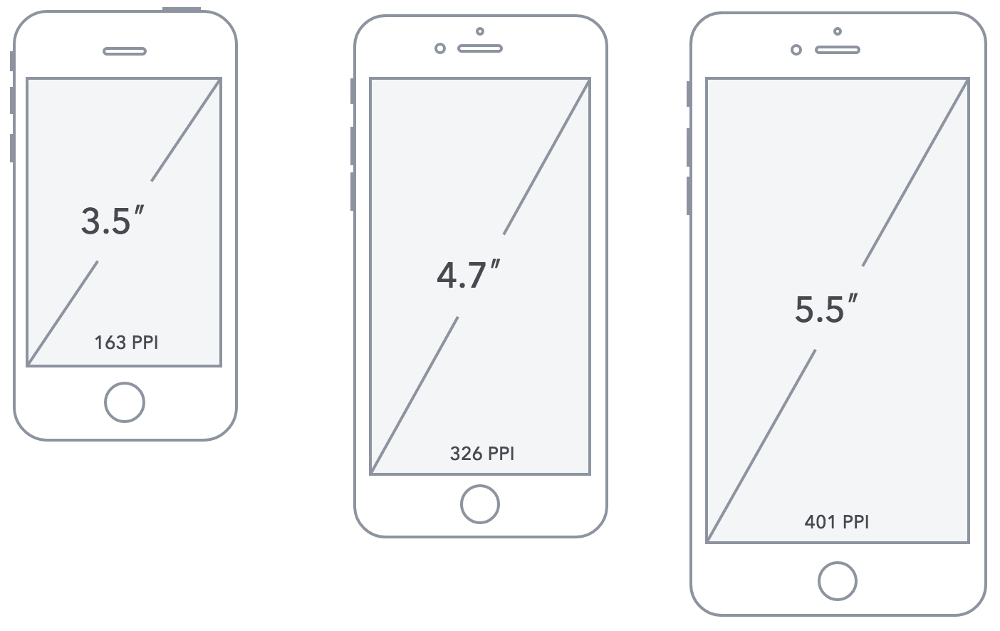

而分辨率则一般用像素来度量，表示屏幕水平和垂直方向的像素数，例如1920*1080指的是屏幕垂直方向和水平方向分别有1920和1080个像素点而构成，如下图所示：

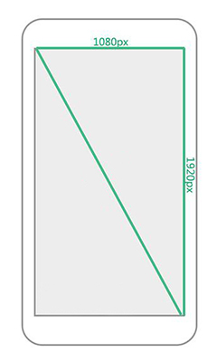

### 长度单位

在Web开发中可以使用px（像素）、em、pt（点）、in（英寸）、cm（厘米）做为长度单位，我们最常用px（像素）做为长度单位。

我们可以将上述的几种长度单位划分成相对长度单位和绝对长度单位。

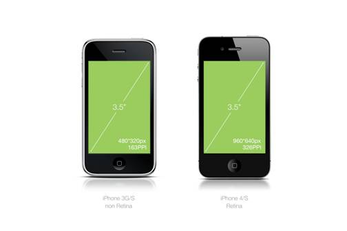

如上图所示，iPhone3G/S 和 iPhone4/S 的屏幕尺寸都为 3.5 英寸（in）但是屏幕分辨率却分别为 480x320px、960x480px，由此我们可以得出英寸是一个绝对长度单位，而像素是一个相对长度单位。

### 设备独立像素

随着技术发展，设备不断更新，出现了不同 PPI 的屏幕共存的状态（如iPhone3G/S为163PPI，iPhone4/S为326PPI），像素不再是统一的度量单位，这会造成同样尺寸的图像在不同 PPI 设备上的显示大小不一样。

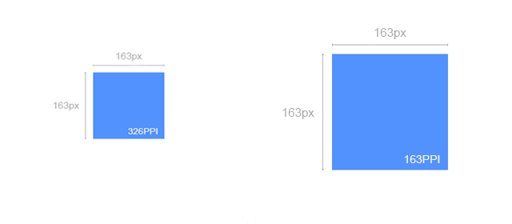

如下图，假设你设计了一个 163x163 的蓝色方块，在 PPI 为 163 的屏幕上，那这个方块看起来正好就是 1x1 寸大小，在PPI为 326 的屏幕上，这个方块看起来就只有 0.5x0.5 寸大小了。
	
做为用户是不会关心这些细节的，他们只是希望在不同 PPI 的设备上看到的图像内容差不多大小，所以这时我们需要一个新的单位，这个新的单位能够保证图像内容在不同的 PPI 设备看上去大小应该差不多，这就是独立像素，在 IOS 设备上叫 pt (Point)，Android 设备上叫 dip (Device independent Pixel) 或 dp。
	

举例说明就是 iPhone 3G（PPI为163）1dp = 1px，iPhone 4（PPI为326）1dp = 2px

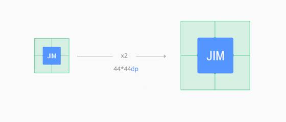

我们也不难发现，如果想要 iPhone 3G/S 和 iPhone 4/S 图像内容显示一致，可以把 iPhone 4/S 的尺寸放大一倍（它们是一个2倍(@2x)的关系），即在 iPhone3G/S 的上尺寸为 44x44px，在 iPhone4/S 上为 88x88px，我们要想实现这样的结果可以设置 44x44dp，这时在 iPhone3G/S 上代表 44x44px，在 iPhone4/S 上代表 88x88px，最终用可以看到的图像差不多大小。
	
通过上面例子我们不难发现 dp 同 px 是有一个对应（比例）关系的，这个对应（比例）关系是操作系统确定并处理，目的是确保不同 PPI 屏幕所能显示的图像大小是一致的，通过 window.devicePixelRatio 可以获得该比例值。
	

	下图展示了iPhone不同型号间dp和px的比例关系

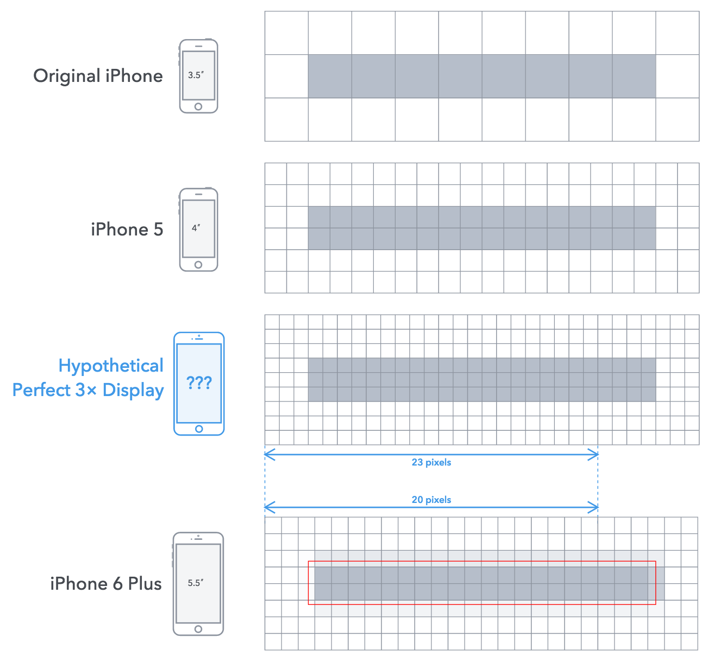

从上图我们得知 dp（或pt）和 px 并不总是绝对的倍数关系（并不总能保证能够整除），而是window.devicePixelRatio ~= 物理像素/独立像素，然而这其中的细节我们不必关心，因为操作系统会自动帮我们处理好（保证 1dp 在不同的设备上看上去大小差不多）。

### 像素

- 物理像素指的是屏幕渲染图像的最小单位，属于屏幕的物理属性，不可人为进行改变，其值大小决定了屏幕渲染图像的品质，我们以上所讨论的都指的是物理像素。

```javascript
// 获取屏幕的物理像素尺寸
window.screen.width;
window.screen.height;
// 部分移动设备下获取会有错误，与移动开发无关，只需要了解
```
- CSS 像素指的是通过 CSS 进行网页布局时用到的单位，其默认值(PC端)是和物理像素保持一致的（1个单位的CSS 像素等于 1 个单位的物理像素），但是我们可通缩放来改变其大小。

  我们通过调整浏览器的缩放比例可以直观的理解 CSS 像素与物理像素之前的对应关系，如下图所示：
    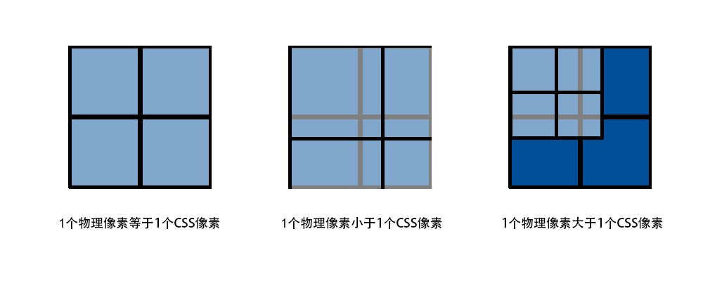
	我们需要理解的是物理像素和 CSS 像素的一个关系，1个物理像素并不总是等于一个 CSS 像素，通过调整浏览器缩放比例，可以有以上 3 种情况。

## 远程调试

### 模拟调试

> 现代主流浏览器均支持移动开发模拟调试，通常按F12可以调起，其使用也比较简单，可以帮我们方便快捷定位问题。

### 真机调试

> 模拟调试可以满足大部分的开发调试任务，但是由于移动设备种类繁多，环境也十分复杂，模拟调试容易出现差错，所以真机调试变的非常必要。

有两种方法可以实现真机调试：

- 将做好的网页上传至服务器或者本地搭建服务器，然后移动设备通过网络来访问。

- 借助第三方的调试工具，如weinre、debuggap、ghostlab等。

**注：真机调试必须保证移动设备同服务器间的网络是相通的**

## 视口

> 视口是用来约束网站中最顶级块元素<html>的，即它决定了<html>的大小。

### **※ 关于三个viewport的理论** 

#### layout viewport

ppk大神把浏览器默认的viewport叫做 **layout viewport**【布局视口】

这个layout viewport的宽度可以通过 **document.documentElement.clientWidth** 来获取。 

#### **visual viewport** 

 然而，**layout viewport**【可视区视口】 的宽度是大于浏览器可视区域的宽度的，所以我们还需要一个viewport来代表 浏览器可视区域的大小，ppk大神把这个viewport叫做 **visual viewport**。visual viewport的宽度可以通过window.innerWidth 来获取，但在Android 2, Oprea mini 和 UC 8中无法正确获取。

#### ideal viewport

但浏览器觉得还不够，因为现在越来越多的网站都会为移动设备进行单独的设计，所以必须还要有一个能完美适配移动设备的viewport。所谓的完美适配指的是，首先不需要用户缩放和横向滚动条就能正常的查看网站的所有内容；

第二，显示的文字的大小是合适，比如一段14px大小的文字，不会因为在一个高密度像素的屏幕里显示得太小而无法看清，理想的情况是这段14px的文字无论是在何种密度屏幕，何种分辨率下，显示出来的大小都是差不多的。

当然，不只是文字，其他元素像图片什么的也是这个道理。ppk大神把这个viewport叫做 **ideal viewport**，也就是第三个viewport——移动设备的理想viewport。


ideal viewport并没有一个固定的尺寸，不同的设备拥有有不同的ideal viewport。所有的iphone的ideal viewport宽度都是320px，无论它的屏幕宽度是320还是640，也就是说，在iphone中，css中的320px就代表iphone屏幕的宽度。 


### PC设备

在PC设备上视口的大小取决于浏览器窗口的大小，以CSS像素做为度量单位。

通过以往 CSS 的知识，我们都能理解<html>的大小是会影响到我们的网页布局的，而 viewport 又决定了<html>的大小，所以 viewport 间接的决定并影响了我们网页的布局。

```javascript
// 获取视口的大小
document.documentElement.clientWidth;
document.documentElement.clientHeight;
```

### 移动设备

移动设备屏幕普遍都是比较小的，但是大部分的网站又都是为 PC 设备来设计的，要想让移动设备也可以正常显示网页，移动设备不得不做一些处理，通过上面的例子我们可以知道只要 viewport 足够大，就能保证原本为PC设备设计的网页也能在移动设备上正常显示，移动设备厂商也的确是这样来处理的。

在移动设备上 viewport 不再受限于浏览器的窗口，而是允许开发人员自由设置 viewport 的大小，通常浏览 器会设置一个默认大小的 viewport，为了能够正常显示那些专为 PC 设计的网页，一般这个值的大小会大于屏幕的尺寸。

如下图为常见默认 viewport 大小（仅供参考）

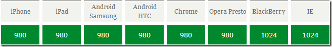

从图中统计我们得知不同的移动厂商分别设置了一个默认的 viewport 的值，这个值保证大部分网页可以正常在移动设备下浏览。

### 移动浏览器

移动端开发主要是针对 IOS 和 Android 两个操作系统平台的，除此之外还有Windows
Phone。

移动端主要可以分成三大类，系统自带浏览器、应用内置浏览器（webview）、第三方浏览器。

- 系统浏览器：指跟随移动设备操作系统一起安装的浏览器。
- 应用内置浏览器：通常在移动设备上都会安装一些 APP 例如 QQ、微信、微博、淘宝等，这些 APP 里往往会内置一个浏览器，我们称这个浏览器为应用内置浏览器（也叫WebView），这个内置的浏览器一般功能比较简单，并且客户端开发人员可以更改这个浏览器的某些设置，在我们理实的开发里这个浏览器很重要。
- 第三方浏览器：指安装在手机的浏览器如 FireFox、Chrome、360等等。

**注：在 IOS 和 Android 操作系统上自带浏览器、应用内置浏览器都是基于 Webkit 内核的。**

## 屏幕适配

> 移动页面最理想的状态是，避免滚动条且不被默认缩放处理，我们可以通过设置<meta name="viewport" content="">来进行控制，并改变浏览器默认的视口的宽度。

### viewport详解

viewport 是由苹果公司为了解决移动设备浏览器渲染页面而提出的解决方案，后来被其它移动设备厂商采纳，其使用参数如下：

```html
<!DOCTYPE html>
<html lang="en">
<head>
	<meta charset="UTF-8">
    <!-- 设置视口大小 -->
    <meta name="viewport" content="width=device-width, initial-scale=1">
	<title>Document</title>
</head>
<body>
    <!--
		通过设置属性content=""实现，中间以逗号分隔
    	width 设置layout viewport 宽度，其取值可为数值或者device-width。
    	height 设置layout viewport 高度，其取值可为数值或者device-height
        initital-scale设置页面的初始缩放值，为一个数字，可以带小数。
    	maximum-scale允许用户的最大缩放值，为一个数字，可以带小数。
    	minimum-scale允许用户的最小缩放值，为一个数字，可以带小数。
    	注：device-width 和 device-height就是ideal viewport的宽高。
    -->
</body>
</html>
```

### 控制缩放

- 设置 `<meta name="viewport" content="initial-scale=1">` 这时我们发现网页没有被浏览器设置缩放。

- 设置 `<meta name="viewport" content="width=device-width">` 这时我们发现网页也没有被浏览器设设置缩放。

当我们设置 width=device-width，也达到了 initial-scale=1 的效果，得知其实 initial-scale = 视口 / 屏幕宽度。

两种方式都可以控制缩放，开发中一般同时设置 width=device-width 和 initial-scale=1.0（为了解决一些兼容问题）参见[移动前端开发之viewport深入理解](http://www.cnblogs.com/2050/p/3877280.html)，即**<meta name="viewport" content="width=device-width,**
**initial-scale=1.0">**

### 避免滚动

滚动条是视口相对于屏幕宽度的，设置视口小于或等于屏幕宽度，即 `<meta name="viewport" content="width=device-width">` ，可以避免滚动。

当设置了视口宽度等于屏幕宽度后，还要保证页面内所有子元素宽度都不能超过屏幕，否则仍然会出现横向滚动条。

## 适配方案

> 移动开发的核心是屏幕适配，然而并示有专门的规范进行约束，一般是对现有持术进行归纳而总结出适配方案，掌握了以上的技术细节后我们可以总结出以下几种适配方案

- 固定宽度

1. 设置 `<meta name="viewport" content="width=device-width, initial-scale=1">`

2. 设置内容区域大小为320px

3. 设置内容区域水平居中显示

关于[手机尺寸](http://www.viewportsizes.com/)

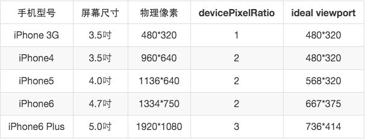

通过汇总对比我们知道移动设备的屏幕尺寸虽然庞杂，但有几个主要尺寸，分别为320px、360px，这三个尺寸占了绝大部分，并且以320px最多，所以我们移动网页如果设计成320px宽，则可以保证在绝大多数设备里正常显示，**此方案已经很少采用了**。

- 百分比

1. 设置`<meta name="viewport" content="width=device-width, initial-scale=1">`

2. 设置页面宽度为百分比

我们需要重新认识CSS里百分比的使用，见代码示例4-9.html

```html
<!DOCTYPE html>
<html lang="en">
<head>
	<meta charset="UTF-8">
	<title>百分比单位</title>
    <style>
        .box {
            width: 300px;
            height: 200px;
            background-color: pink;
        }
        
        .inner {
            /* 参照父元素的宽度 */
            width: 50%;
            /* 参照父元素的高度 */
            height: 50%;
            /* 参照父元素的宽度 */
            padding-left: 10%;
            /* 参照父元素的宽度 */
            padding-top: 10%;
            /* 参照父元素的宽度 */
            margin-left: 10%;
            /* 参照父元素的宽度 */
            margin-top: 10%;
           /* 不支持百分比 */ 
            border: 10% solid red;
        }
    </style>
</head>
<body>
    <div class="box">
        <div class="inner"></div>
    </div>
</body>
</html>
```
**我们发现这种方案最容易理解，但是在设置元素高度时有非常大的局限性**。

### rem

1. 设置 `<meta name="viewport" content="width=device-width, initial-scale=1">`

2. 设置页面元素宽度单位为rem 或 em

   em 相对长度单位，其参照当前元素字号大小，如果当前元素未设置字号则会继承其**祖先元素**字号大小。

   rem 相对长度单位，其参照**根元素(html)**字号大小。

注：此方案比较灵活，我们的案例将采用这种方案

~~~css
em:
<style>
    .box {
        width: 20em;
        height: 20em;
        background-color: pink;
        /*font-size: 18px;*/
        /*font-size: 20px;*/
        font-size: 17px;

        /*1em = 16px*/
        /*1em = 18px*/
        /*1em = 20px*/

        /*em 相对于当前元素的字号，em 在应用中不够灵活！！*/
    }
</style>

<style>
    html {
        font-size: 21px;
    }
    .box {
        width: 10rem;
        height: 10rem;
        background-color: pink;
        font-size: 18px;
        /*1rem = 16px;*/
        /*rem 与当前元素字号无关！！！*/
        /*rem 中的字母 r 代表 root 含义，即根元素*/
        /*rem 参照的是 html 的字号大小！！！！*/
    }
</style>
<body>
<!-- rem 与 px 一样是 css 中的一个长度单位 -->
<div class="box"></div>
</body>
~~~


### window.devicePixelRatio

window.devicePixelRatio窗口初始化缩放比例

1. 设置网页宽度等于设备物理像素

2. 设置初始化缩放比例（值为1 / window.devicePixelRatio）

**淘宝针对iPhone设备采用的这种方案**

~~~js
<script>
	// 弹出窗口初始缩放比例
    alert(devicePixelRatio);

    pc设备下 1pt/dp(独立像素) = 1px(物理像素)   // 弹出devicePixelRatio是1
    iPhone5/6/7/8 1pt/dp(独立像素) = 2px(物理像素)   // 弹出devicePixelRatio是2
    iPhone6/7/8plus/x 1pt/dp(独立像素) = 3px(物理像素)   // 弹出devicePixelRatio是3

    如果你是一个 android 程序员 在编写代码使用 dp
    如果你是一个 ios 程序员 在编写代码使用 pt
    如果你是一个 前程 序员 在编写代码使用 px(css长度单位)

    1px(css) = 1px(物理)
    1px(css) = 2px(物理)
    1px(css) = 3px(物理)
    
</script>
~~~

### ※ 适应不同设备尺寸方法解析

设置网页不同设备下的根元素字体大小

> 制作手机端或响应式布局我们一般用这样的方法：**rem表示的是html的根文字大小**，同样也是css的长度单位，那么我们就可以用rem来表示页面元素的尺寸，在不同的设备下我们通过css样式@media媒体查询来设置相应的字号，从而动态的改变1rem的的值，最终达到适应不同设备的目的。

方法推导分析：

1、设：我们将不同文件和不同设备都等分为20份（这个值可以任意设置）；

2、设图片M=Xpx的尺寸在UI源文件中的尺寸占比为x/20份；那么它在任何设备视口下的尺寸占比都应当为x/20。

3、假设一个设备的浏览器视口为320px物理像素，那么它的1/20份为16px=**rem**;  那么M在此设备实际尺寸为：

​	x/20 * rem = x/20 * 16 =  Zpx;

4、假设这个UI源文件尺寸为640px，那么它的1/20就是32px=**Y**； 那么M在此文件中的实际尺寸为：

​	x/20 * Y = x/20 * 32 = Xpx；

​	由3、4步骤==>就有以下关系：X / 32 = Z / rem = x/20；

5、所以图片M在这个设备中的实际尺寸就应该是**（X / 32）rem = Z**；即用rem表示为  **X / 32rem**；

**注：rem 参照的是 html 的字号大小！！！！所以我们只需要设置不同尺寸设备下的font-size就可以了。**

css、less方法：

```less
@media (width: 320px) {
    html {
        font-size: 16px;
    }
}

@media (width: 360px) {
    html {
        font-size: 18px;
    }
}

@media (width: 375px) {
    html {
        font-size: 18.75px;
    }
}

@media (width: 411px) {
    html {
        font-size: 20.55px;
    }
}

@media (width: 414px) {
    html {
        font-size: 20.7px;
    }
}
// 此步骤为优化，当设备浏览器视口大于640的时候
@media (min-width: 640px) {
    html {
        font-size: 32px;
    }
}
```

js方法：

```js
<script>
    // 通过 js 也可以根据 屏幕宽度 设置 html 的字号
    // 获取 html 根元素
    var doc = document.documentElement;

    // 获取 html 的宽度
    var width = doc.clientWidth;

    // 计算字号
    var fontSize = width / 20;

    // 设置字号
    doc.style.fontSize = fontSize + 'px';
</script>
```

## 媒体查询

> 设备终端的多样化，直接导致了网页的运行环境变的越来越复杂，为了能够保证我们的网页可以适应多个终端，不得不专门为某些特定的设备设计不同的展示风格，通过媒体查询可以检测当前网页运行在什么终端，可以有机会实现网页适应不同终端的展示风格。

### 媒体类型

将不同的终端设备划分成不同的类型，称为媒体类型。

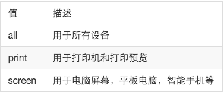

### 媒体特性

每种媒体类型都具体各自不同的特性，根据不同媒体类型的媒体特性设置不同的展示风格。

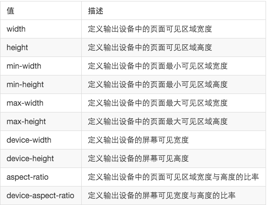

### 关键字

关键字将媒体类型或多个媒体特性连接到一起做为媒体查询的条件。

- and 可以将多个媒体特性连接到一起，相当于“且”的意思。
- not 排除某个媒体类型，相当于“非”的意思，可以省略。
- only指定某个特定的媒体类型，可以省略。

### 引入方式

1. link 标签引入

```
<link href="./5-1.css" media="only screen and (max-width: 320px)">
```

2. css 方式

```css
@media only screen and (max-width: 640px) {
    html {
        background-color: pink;
    }
    /* 其它任意样式表 */
}
```

### 常用特性

1. width / height完全等于视口

2. max-width / max-height 小于等于layout viewport

3. min-width / min-height 大于等于layout viewport

4. device-width / device-height 完全等于ideal viewport

5. orientation: portrait | landscape 肖像/全景模式

[decice-width深入理解](http://www.cnblogs.com/2050/p/3877280.html)

## CSS预处理器

> CSS 预处理器是一种语言，用来为 CSS 增加一些编程的的特性，无需考虑浏览器的兼容性问题，并且你可以在 CSS 中使用变量、简单的程序逻辑、函数等等在编程语言中的一些基本技巧，可以让你的 CSS 更简洁，适应性更强，代码更直观等诸多好处。
>
> 常见的 CSS 预处理器有：LESS、SASS、Stylus等。

### Less

Less 是一门 CSS 预处理语言，它扩展了 CSS 语言，增加了变量、Mixin、函数等特性，使 CSS 更易维护和扩展。


#### 安装

1. 安装Nodejs环境 Node Package Manager (验证 node -v  npm -v)

2. 打开控制台（cmd），执行npm install -g less (验证 lessc -v)

3. 命令行编译 lessc path/xxx.less path/xxx.css

#### 编译

浏览器只能识别 CSS，LESS只是用来提升CSS可维护性的一个工具，所最终需要将 LESS 编译成 CSS，然而通过命令行编译效率比较低下，一般都会借助于编辑器来完成编译。

以 sublime_text 为例，sublime_text默认并不支持LESS的编译操作，需要安装插件实现

1. 执行npm install -g less-plugin-clean-css（使用sublime_text才用）

2. ctrl+shit+p打开命令面板

3. 输入install package 然后回车

4. 安装 LESS、lessc、Less2Css三个插件

5. alt+s 快捷键即可实现编译

以 VsCode 为例

1. 安装插件 Beautify css/sass/scss/less
2. npm install gulp -g
3. npm install gulp gulp-less
4. 配置 vscode，Run Tasks > Configure Tasks > Create tasks.json file from templates > Other

```json
// Less configuration
{
    // See https://go.microsoft.com/fwlink/?LinkId=733558
    // for the documentation about the tasks.json format
    "version": "2.0.0",
    "tasks": [
        {
            "label": "Less Compile",
            "type": "shell",
            "command": "lessc styles.less styles.css",
            "group": "build"
        }
    ]
}
```

5. 创建 gulpfile.js

```javascript
// Less configuration
var gulp = require('gulp');
var less = require('gulp-less');

gulp.task('less', function() {
    gulp.src('./!(node_modules|dist)/*.less')
        .pipe(less())
        .pipe(gulp.dest(function (f) {
        	return f.base;
        }))
});

gulp.task('default', ['less'], function() {
    gulp.watch('./!(node_modules|dist)/*.less', ['less']);
})
```

6. ctrl+shit+b

#### 语法

1. 变量，@变量名: 值，定义完成后可以重复使用

```less
// 定义变量 @color
@color: red;
// 引用变量 @color
.nav {
    color: @color;
}
// 引用变量 @color
.header {
    background-color: @color;
}
less也可以像js其他程序语言一样进行算数运算
// less文件
@width: 100rem;
.navs {
    width: @width / 10;
}
// css文件
.navs {
  width: 10rem;
}
```

2. 集合，将一系列 CSS 封装起来

```less
// 集合
.box-sizing {
    -webkit-box-sizing: border-box;
    -moz-box-sizing: border-box;
    -o-box-sizing: border-box;
    -ms-box-sizing: border-box;
    box-sizing: border-box;
}

.border-radius(@radius) {
    -webkit-border-radius: @radius;
    -moz-box-sizing: @radius;
    -o-box-sizing: @radius;
    -ms-box-sizing: @radius;
    border-radius: @radius;
}

.nav {
    width: 200px;
    height: 120px;
    padding: 24px;
    // 调用集合
    .box-sizing;
    .border-radius(4px);
}
```

3. 嵌套，高效组织 css 的层次关系

```less
less文件代码：
header {
	width: 980px;
	height: 40px;
	.nav {
		width: 100%;
		height: 100%;
		background-color: pink;
		a {
			color: blue;
		}
	}
	a {
		line-height: 40px;
		text-decoration: none;
		color: red;
	}
}
预处理之后的css代码：
header {
  width: 980px;
  height: 40px;
}
header .nav {
  width: 100%;
  height: 100%;
  background-color: pink;
}
header .nav a {
  color: blue;
}
header a {
  line-height: 40px;
  text-decoration: none;
  color: red;
}
```

**less 完全兼容 css，即在 less 中书写的 css 语法都可以被使用。**

#### 浏览器

了解了LESS基本语法后，可以用LESS写编写CSS代码了，但是需要实时的将LESS编译成CSS浏览器才能识别，利用编辑器能够编译，但是效率相对较低。
我们可以引入一个less.js文件，实现实时的解析，而不必每次修改都要编译，最后完成所有开发任务后，再通过编辑器编译成css文件。

1. [下载](https://raw.github.com/less/less.js/v2.5.3/dist/less.min.js)然后引入less.js

2. 引入xx.less文件，如：`<link rel="stylesheet/less" type="text/css" href="styles.less" />`

**注意：rel属性必须指定成stylesheet/less，并且styles.less要先于less.js引入，必须以服务器方式访问**


## 触屏事件

sketch相当于网页版的ps前端UI图制作工具

### css默认触屏

消除默认背景高亮

tap-highlight-color: rgba(0, 0, 0, 0);

安卓系统兼容写法：-webkit-tap-highlight-color: rgba(0, 0, 0, 0);

### 事件类型

移动设备上无法使用鼠标，当手指触碰屏幕时会触发 click、mousedown、mouseup 事件，同时还有一些新的事件：

1. touchstart 手指触摸屏幕时触发
2. touchmove 手指在屏幕上移动时触发
3. touchend 手指离开屏幕时触发

### TouchEvent

1. touches 位于屏幕上的所有手指的列表
2. targetTouches 位于该元素上的所有手指的列表
3. changedTouches， touchstart时包含刚与触摸屏接触的触点，touchend时包含离开触摸屏的触点

~~~js
<style type="text/css">
    .box {
        width: 200px;
        height: 200px;
        background-color: #000;
    }
</style>

<div class="box"></div>

<script type="text/javascript">
    var box = document.querySelector('.box');
    var dom = document.documentElement;
    // box.addEventListener('touchstart', function(e) {
    // 	console.log('手指触屏');
    // 	console.log(e.touches);
    // 	console.log(e.targetTouches);
    // })
    dom.addEventListener('touchstart', function(e) {
        console.log('手指触屏');
        console.log(e.touches);
        console.log(e.targetTouches);
        console.log(e.changedTouches);
    })
    // $('.box').on('touchstart', function() {
    // 	console.log('手指触摸到屏幕');
    // })
    // 
    $('.box').on('touchmove', function() {
        console.log('手指移动');
    })

    // $('.box').on('touchend', function(ev) {
    // 	console.log('手指离开');
    // 	console.log(ev.changedTouches);
    // })
	/ 这里不知道为什么用jQuery无法获得ev.changedTouches。
    dom.addEventListener('touchend', function(e){
        console.log(e.changedTouches);
    })
</script>
~~~

### Touch

1. clientX/Y 手指相对于layout viewport的水平/垂直像素距离

2. pageX/Y 手指相对于layout viewport的水平/垂直像素距离（含滚动）

3. screenX/Y 手指相对于layout viewport的水平/垂直像素距离（含滚动）

4. target 手指最初与屏幕接触时的元素

当设置 `<meta name="viewport" content="width=device-width, initial-scale=1">`，这时这三对坐标值是完全一样的。

### click延时

早期移动设备浏览器网页时内容非常小，为了增强用户体验，苹果公司专门为移动设备设计了双击放大的功能，确保用户可以非常方便的放大网页内容，但是当用户单击一个按钮时，移动设备会延时（约300ms）执行，判断用单是否要双击。由于延时的存在导致用户体下降，为了尽快响应用户点击，一般使用触屏事件来解决。

### 手势封装

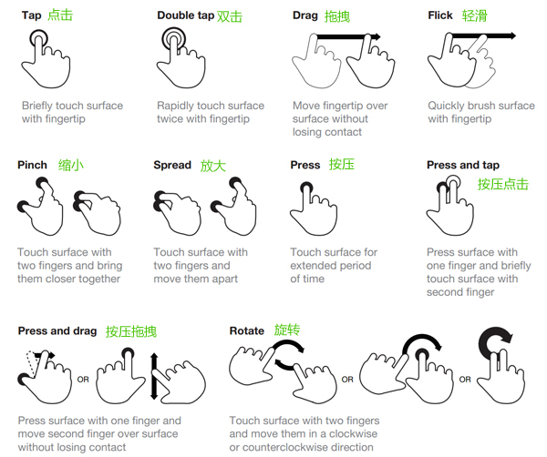

1. tap检测接触和离开屏幕的距离来实现

~~~js
<script>
    var box = document.querySelector('.box');
    // tap 手势有一个特征： 当手指触碰屏幕时的坐标
    // 和离开屏幕时的坐标接近。

    var startX, startY, endX, endY;
    box.addEventListener('touchstart', function (ev) {
        // 只允许一根手指
        if(ev.touches.length > 1) return;

        // 获取手指坐标
        startX = ev.touches[0].clientX;
        startY = ev.touches[0].clientY;
    })

    box.addEventListener('touchend', function (ev) {
        // ev.changedTouches 当前离开的那根手指信息
        // 获取手指坐标
        endX = ev.changedTouches[0].clientX;
        endY = ev.changedTouches[0].clientY;

        // console.log(endX, startX);
        // console.log(endY, startY);

        if(Math.abs(endX - startX) < 6 && Math.abs(endY - startY) < 6) {
            console.log('tap!!!');
        }
    })
</script>
~~~

2. drag跟踪手指移动位置，进而设置元素定位坐标
3. swipe 判断手指滑动的方向

~~~js
<script>
    // 只要手指在屏幕上移动了，就必须要能够得之用户手指的方向

    var startX, startY, endX, endY, absX, absY;
    document.addEventListener('touchstart', function (ev) {
        if(ev.touches.lenght > 1) return;

        // 获取坐标
        startX = ev.touches[0].clientX;
        startY = ev.touches[0].clientY;
    })

    document.addEventListener('touchend', function (ev) {
        // 获取坐标
        endX = ev.changedTouches[0].clientX;
        endY = ev.changedTouches[0].clientY;

        // 在水平上移动的距离
        absX = Math.abs(endX - startX);
        // 在垂直上称动的距离
        absY = Math.abs(endY - startY);

        var direction = absX > absY
        ? endX > startX ? 'right' : 'left'
        : endY > startY ? 'down' : 'up'

        console.log(direction)
    })
</script>
~~~

**注：利用触屏事件简易封装手势，主要用途是熟悉触屏事件的使用。**

## 移动端类库

> 在移动 web 中，更注重提升用户体验，通过 javascript 配合 css3 最大程度上模拟原生应用的体验。

实际开发中可用类库（插件）非常多，课堂中只是列举一些常见的类库，以了解为主

### zepto.js

zepto.js 可以认为是 jQuery 的迷你版，专门针对移动端进行了优化处理。zeptojs 为我们封装了常的触屏事件，需要 touch 模块支持，默认没有构建此模，我们可以自定义构建。

1. 安装 Nodejs 环境

2. 下载 [zepto.js](https://github.com/madrobby/zepto)

3. 解压缩

4. cmd 命令行进入解压缩后的目录

5. 执行 npm install 命令

6. 编辑make文件

7. 然后执行命令 npm run-script dist

8. 查看目录 dist 即构建好的 zepto.js

### iScroll

模拟原生滚动，使页面滚动更流畅。

```html
<!DOCTYPE html>
<html lang="en">
<head>
	<meta charset="UTF-8">
	<title>Document</title>
	<style>
		#wrapper {
			width: 200px;
			height: 400px;
			border: 1px solid #CCC;
			overflow: hidden;
			position: relative;
		}
	</style>
</head>
<body>
	<div id="wrapper">
	    <div class="">
	    	<p>fdsafdsfasdfds</p>
	    	<p>fdsafdsfasdfds</p>
	    	<p>fdsafdsfasdfds</p>
            ....
	    </div>
	</div>
	<script src="./iscroll.js"></script>
	<script>
		// 在使用 iscroll 时要求 html 满足一定的结构

		// 实例化 iScroll 传入一个 DOM 选择器
		var myScroll = new IScroll('#wrapper', {
			scrollbars: true,
			// 
			// 
			// 
		});
	</script>
</body>
</html>
```

swipe

移动端轮播图插件

```html
<!DOCTYPE html>
<html lang="en">
<head>
	<meta charset="UTF-8">
	<title>swipe</title>
	<style>
		.swipe {
		  overflow: hidden;
		  visibility: hidden;
		  position: relative;
		}
		.swipe-wrap {
		  overflow: hidden;
		  position: relative;
		}
		.swipe-wrap > li {
		  float:left;
		  width:100%;
		  position: relative;
		}
		
		ul {
			list-style: none;
			padding: 0;
		}

		li {
			height: 300px;
		}

		li:first-child {
			background-color: pink;
		}

		li:nth-child(2) {
			background-color: yellow;
		}

		li:nth-child(3) {
			background-color: blue;
		}

		li:last-child {
			background-color: red;
		}
	</style>
</head>
<body>
	<div class="slide swipe" id="slider">
		<ul class="swipe-wrap">
			<li>
				<a href="">
					
				</a>
			</li>
			<li>
				<a href="">
					
				</a>
			</li>
			<li>
				<a href="">
					
				</a>
			</li>
			<li>
				<a href="">
					
				</a>
			</li>
		</ul>
	</div>
	<script src="./swipe.js"></script>
	<script>
		Swipe(document.getElementById('slider'), {
			auto: 1000
		});
	</script>
</body>
</html>
```

swiper

移动端滑块插件

```html
<!DOCTYPE html>
<html lang="en">
<head>
	<meta charset="UTF-8">
	<title>swiper</title>
	<link rel="stylesheet" href="./css/swiper.min.css">
	<style>
		.swiper-slide:first-child {
			height: 300px;
			background-color: pink;
		}
		.swiper-slide:nth-child(2) {
			height: 300px;
			background-color: red;
		}
		.swiper-slide:last-child {
			height: 300px;
			background-color: blue;
		}
	</style>
</head>
<body>
	<div class="swiper-container">
		<div class="swiper-wrapper">
			<div class="swiper-slide">slider1</div>
			<div class="swiper-slide">slider2</div>
			<div class="swiper-slide">slider3</div>
		</div>
	</div>
	<script src="./js/swiper.min.js"></script>
	<script>
		var mySwiper = new Swiper('.swiper-container', {
			autoplay: true, //可选选项，自动滑动
		})
	</script>
</body>
</html>
```


fastclick

加速移动web中 click 的响应，解决 touch 事件的点透现象。

在移动设备上为了提升 click 的响应速度，我们选择了使用 zepto 事件封装的 tap 来进行模拟，但是这会带来一个副作用，这个副作用就是“点透”。

从上可以看出 zepto.js有不完善的地方，并且我们有时也希望我们的移动版页面在PC端上也可用，但是PC端是不支持 touch 事件的，这时我们面临的问题是即提升click在移动设备上的响应速度，又不能使用 zepto.js 的 tap 事件，这时 fastclick 可以解决这个问题。

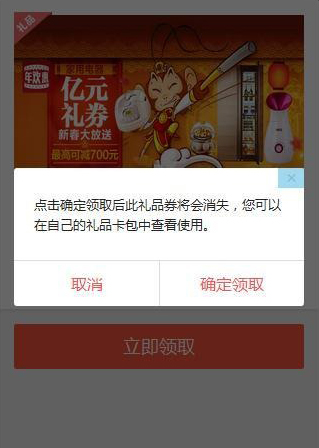

## 网页布局

### 布局方式

1. 固定宽度布局：为网页设置一个固定的宽度，通常以 px 做为长度单位，常见于 PC 端网页。

2. 流式布局：为网页设置一个相对的宽度，通常以百分比做为长度单位。

3. 栅格化布局：将网页宽度人为的划分成均等的长度，然后排版布局时则以这些均等的长度做为度量单位，通常利用百分比做为长度单位来划分成均等的长度。

4. 响应式布局：通过检测设备信息，决定网页布局方式，即用户如果采用不同的设备访问同一个网页，有可能会看到不一样的内容，一般情况下是检测设备屏幕的宽度来实现。

### 响应式布局

Responsive design，意在实现不同屏幕分辨率的终端上浏览网页的不同展示方式。通过响应式设计能使网站在手机和平板电脑上有更好的浏览阅读体验。

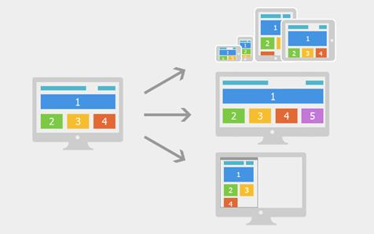

如上图所示，屏幕尺寸不一样展示给用户的网页内容也不一样，我们利用媒体查询可以检测到屏幕的尺寸（主要检测宽度），并设置不同的CSS样式，就可以实现响应式的布局。

我们利用响应式布局可以满足不同尺寸的终端设备非常完美的展现网页内容，使得用户体验得到了很大的提升，但是为了实现这一目的我们不得不利用媒体查询写很多冗余的代码，使整体网页的体积变大，应用在移动设备上就会带来严重的性能问题。响应式布局常用于企业的官网、博客、新闻资讯类型网站，这些网站以浏览内容为主，没有复杂的交互。

一般我们会对常见的设备尺寸进行划分后，再分别确定为不同的尺寸的设备设计专门的布局方式，如下图所示pin

**常用响应式屏幕尺寸**

| 类型       | 布局宽度       | 媒体查询                    |
| ---------- | -------------- | --------------------------- |
| 大屏幕     | 大于等于1200px | @media (min-width:1200px){} |
| 默认       | 大于等于980px  | @media (min-width:980px){}  |
| 平板       | 大于等于768px  | @media (min-width:768px){}  |
| 手机到平板 | 小于等于767px  | @media (max-width:767px){}  |
| 手机       | 小于等于480px  | @media (max-width:480px){}  |

以上是我们对常见的尺寸进行分类后的结果，下面与之对应的媒体查询条件。

~~~css
大屏幕
@media (min-width: 1200px) { ... },

平板电脑和小屏电脑之间的分辨率
@media (min-width: 760px) and (max-width: 979px) { ... }

横向放置的手机和竖向放置的平板之间的分辨率
@media (max-width: 767px) { ... }

横向放置的手机及分辨率更小的设备
@media (max-width: 480px) { ... }
~~~

## UI框架

> 随着Web应用变的越来越复杂，在大量的开发过程中我们发现有许多功能模块非常相似，比如轮播图、分页、选项卡、导航栏等，开发中往往会把这些具有通用性的功能模块进行一系列封装，使之成为一个个组件应用到项目中，可以极大的节约开发成本，将这些通用的组件缩合到一起就形成了前端框架。

### Bootstrap

简洁、直观、强悍的前端开发框架，让web开发更迅速、简单。

来自 Twitter，粉丝众多，是目前最受欢迎的前端框架。

#### **文件引入方法**


~~~php+HTML
<!-- 新 Bootstrap 核心 CSS 文件 -->
<link rel="stylesheet" href="//cdn.bootcss.com/bootstrap/3.3.5/css/bootstrap.min.css">

<!-- 可选的Bootstrap主题文件（一般不用引入） -->
<link rel="stylesheet" href="//cdn.bootcss.com/bootstrap/3.3.5/css/bootstrap-theme.min.css">

<!-- jQuery文件。务必在bootstrap.min.js 之前引入 -->
<script src="//cdn.bootcss.com/jquery/1.11.3/jquery.min.js"></script>

<!-- 最新的 Bootstrap 核心 JavaScript 文件 -->
<script src="//cdn.bootcss.com/bootstrap/3.3.5/js/bootstrap.min.js"></script>
~~~

#### 兼容ie

~~~html
<head>
    <meta charset="utf-8">
    <!-- 强制ie浏览器使用最新模式渲染页面 -->
    <meta http-equiv="X-UA-Compatible" content="IE=edge">
    <meta name="viewport" content="width=device-width, initial-scale=1">
    <title>Bootstrap 101 Template</title>

    <!-- Bootstrap -->
    <link href="./assets/bootstrap/css/bootstrap.min.css" rel="stylesheet">

    <!--[if lt IE 9]>
      <script src="/html5shiv.min.js"></script>  兼容ie9之前的版本
      <script src="respond.min.js"></script>
    <![endif]-->
 </head>
~~~

### Amaze UI

Amaze ~ 妹子UI，国人开发，后起之秀！

### Framework7

Framework7 是一个开源免费的框架可以用来开发混合移动应用（原生和HTML混合）或者开发 iOS & Android 风格的WEB APP。

**以上是较流行的 UI 框架，其官网都有非常完善的文档。**

## 什么是npm？Bower又是啥？

我们在开发时，会用到很多别人写的JavaScript代码。如果我们要使用别人写的某个包，每次都根据名称搜索一下官方网站，下载代码，解压，再使用，非常繁琐。 
于是一个集中管理的工具应运而生：大家都把自己开发的模块打包后放到一个包管理器上，如果要使用，直接通过包管理器安装就可以直接用，不用管代码存在哪，应该从哪下载。

因此使用包管理器主要基于以下几个原因：

方便的寻找和下载你需要的依赖库，并将它们整合到项目中，例如jQuery, Angular等。
方便的下载指定版本的依赖库（免除去网络上搜索和下载）
便于你使用简单的方法获取你想要的依赖库
NPM
概念
npm有两层含义。一层含义是Node的开放式模块登记和管理系统，网址为npmjs.org。另一层含义是Node默认的模块管理器，是一个命令行下的软件，用来安装和管理Node模块。

npm不需要单独安装。在安装Node的时候，会连带一起安装npm。但是，Node附带的npm可能不是最新版本，最好用下面的命令，更新到最新版本。

~~~nginx
npm install npm@latest -g  # 下载最新的npm @ 版本号
~~~

运行下面的命令，查看各种信息。

~~~nginx
# 查看 npm 命令列表
$ npm help

# 查看各个命令的简单用法
$ npm -l

# 查看 npm 的版本
$ npm -v

# 查看 npm 的配置
$ npm config list -l
~~~

npm是一个让JavaScript程序员分享和复用代码的工具。有了它，JS程序员能高效地管理和发布自己要分享的代码。

### package.json

~~~nginx
# 第一次使用npm安装包
npm init;
~~~

通过上面这条命令初始化，目录中会多了一个名为package.json的文件。 
package.json用于说明NPM的配置信息。

package.json里面有两个对象是用来指定依赖的：

- “dependencies”:这个对象下面列出生产环境下的依赖
- “devDependencies”:这个对象下面列出开发环境的依赖

### npm install

Node模块采用npm install命令安装。

每个模块可以**全局安装**，也可以**本地安装**。

- 全局安装：指的是将一个模块安装到系统目录中，各个项目都可以调用。 

  一般来说，全局安装只适用于工具模块，比如eslint和gulp。

- 本地安装：指的是将一个模块下载到当前项目的node_modules子目录，然后**只有在项目目录之中**，才能调用这个模块。

~~~nginx
# 本地安装
$ npm install <package name>

# 全局安装
$ sudo npm install -global <package name>
$ sudo npm install -g <package name>
~~~

npm install也支持直接输入Github代码库地址。

在安装之前，npm install会先检查，node_modules目录中是否已经存在指定模块，如果存在就不再重新安装了，即使远成仓库已经有了一个新版本也是如此。

如果希望一个模块不管是否安装过，npm都要强制安装，可以使用-f或–force参数：

~~~nginx
npm install <packageName> --force
~~~

install命令可以使用不同参数，指定所安装的模块属于哪一种性质的依赖关系，即出现在packages.json文件的哪一项中。

- 往package.json里面添加生产环境的依赖，被添加到dependencies：

~~~nginx
npm install <package_name> --save
~~~

- 添加开发环境的依赖，被添加到devDependencies：

~~~nginx
 npm install <package_name> --save-dev
~~~

如果当前环境下有package.json，直接运行下面的命令：

~~~nginx
npm install
~~~

npm install默认会安装dependencies字段和devDependencies字段中的所有模块。

### npm update

如果想更新已安装模块，就要用到`npm undate`命令。

~~~nginx
# 升级当前项目的指定模块
$ npm update [package name]

# 升级全局安装的模块
$ npm update -global [package name]
~~~

它会先到远程仓库查询最新版本，然后查询本地版本。如果本地版本不存在，或者远程版本较新，就会安装。

使用-S或–save参数，可以在安装的时候更新package.json里面模块的版本号。

### npm info

npm info命令可以查看每个模块的具体信息。比如，查看underscore模块的信息。

~~~
npm info underscore
~~~

### npm search

npm search命令用于搜索npm仓库，它后面可以跟字符串，也可以跟正则表达式。

~~~nginx
npm search <搜索词>
~~~

### npm list

npm list命令以树型结构列出当前项目安装的所有模块，以及它们依赖的模块。

~~~nginx
npm list
~~~

加上global参数，会列出全局安装的模块。

~~~nginx
npm list -global
~~~

npm list命令也可以列出单个模块。

~~~
npm list underscore
~~~

### npm仓库

`npm update`命令怎么知道每个模块的最新版本呢？

npm 模块仓库提供了一个查询服务，叫做 registry 。 
以 npmjs.org 为例，它的查询服务网址是 https://registry.npmjs.org/ 。 
这个网址后面跟上模块名，就会得到一个 JSON 对象，里面是该模块所有版本的信息。 
比如，访问 https://registry.npmjs.org/react，就会看到 react 模块所有版本的信息。 
它跟下面命令的效果是一样的。

~~~nginx
npm view react

# npm view 的别名
npm info react
npm show react
npm v react
~~~

registry 网址的模块名后面，还可以跟上版本号或者标签，用来查询某个具体版本的信息。比如， 访问 https://registry.npmjs.org/react/v0.14.6 ，就可以看到 React 的 0.14.6 版。

返回的 JSON 对象里面，有一个dist.tarball属性，是该版本压缩包的网址。

要卸载安装过的包，用以下指令即可：

~~~nginx
dist: {
  shasum: '2a57c2cf8747b483759ad8de0fa47fb0c5cf5c6a',
  tarball: 'http://registry.npmjs.org/react/-/react-0.14.6.tgz' 
},
~~~

到这个网址下载压缩包，在本地解压，就得到了模块的源码。`npm install`和`npm update`命令，都是通过这种方式安装模块的。

### 卸载包

~~~nginx
npm uninstall --save jquery
~~~

## Bower

### 概念

Bower是一个客户端技术的软件包管理器，它可用于搜索、安装和卸载如JavaScript、HTML、CSS之类的网络资源。 
其他还有一些建立在Bower基础之上的开发工具，如YeoMan和Grunt。

### 前提准备

为了安装bower，你首先需要安装如下文件：

- Node：下载最新版本的node.js
- NPM：NPM是node程序包管理器。它是捆绑在nodejs的安装程序上的，所以一旦你已经安装了node，NPM也就安装好了。
- Git：你需要从git仓库获取一些代码包。

### 安装Bower

一旦你已经安装了上面所说的所有必要文件，键入以下命令安装Bower：

~~~nginx
npm install -g bower
~~~

这行命令是Bower的全局安装，-g 操作表示全局。

### 包的安装

Bower是一个软件包管理器，所以你可以在应用程序中用它来安装新的软件包。 
举例来看一下来如何使用Bower安装JQuery，在你想要安装该包的地方创建一个新的文件夹，键入如下命令：

~~~nginx
bower install jquery
~~~

上述命令完成以后，你会在你刚才创建的目录下看到一个`bower_components`的文件夹，其中有一个jquery目录。 
这样就可以在工程中使用jQuery了：

~~~js
<script type="text/javascript" src="bower_components/jquery/jquery.min.js"></script>
~~~

### 包的列表

如果你想找出所有安装在应用程序中的包，可以使用list命令：

~~~nginx
bower list
~~~

### 包的搜索

假如你想在你的应用程序中使用twitter的bootstrap框架，但你不确定包的名字，这时你可以使用search 命令：

~~~nginx
bower search bootstrap
~~~

### 包的信息

如果你想看到关于特定的包的信息，可以使用info 命令来查看该包的所有信息：

~~~nginx
bower info bootstrap
~~~

### 包的卸载

卸载包可以使用uninstall 命令：

~~~nginx
bower uninstall jquery
~~~

### bower.json文件的使用

bower.json文件的使用可以让包的安装更容易，你可以在应用程序的根目录下创建一个名为“bower.json”的文件，并定义它的依赖关系。 
使用bower init 命令来创建bower.json文件：

~~~json
{
  "name": "blog",
  "version": "0.0.1",
  "authors": [
    "Shekhar Gulati <shekhargulati84@gmail.com>"
  ],
  "license": "MIT",
  "ignore": [
    "**/.*",
    "node_modules",
    "bower_components",
    "test",
    "tests"
  ],
  "dependencies": {
    "jquery": "~2.0.3",
    "bootstrap": "~3.0.0"
  }
}
~~~

dependencies中说明了安装的模块及其版本。

**总结**

npm和bower太像了，就像一对孪生兄弟…… 
npm的文件是package.json，包安装的目录是node_modules。 
bower的文件是bower.json，包安装的目录是bower_components。

使用命令也基本一致……
